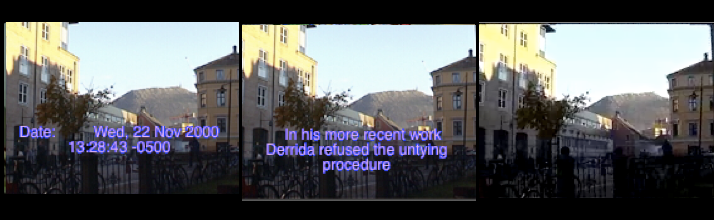
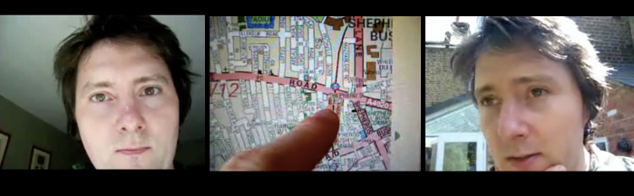

---
Pr-id: MoneyLab
P-id: INC Reader
A-id: 10
Type: article
Book-type: anthology
Anthology item: article
Item-id: unique no.
Article-title: title of the article
Article-status: accepted
Author: name(s) of author(s)
Author-email:   corresponding address
Author-bio:  about the author
Abstract:   short description of the article (100 words)
Keywords:   50 keywords for search and indexing
Rights: CC BY-NC 4.0
...

# 2. The Early History of Videoblogging

Video on the web has had a number of false starts with a variety of
companies attempting to be the first to solve the delivery of online
video. However, the technical issues were difficult, not only in terms
of raw download bandwidth, which was miniscule in comparison with today,
but also in terms of the lack of a universal video standard that could
be used on the internet. The previous standards developed with physical
products in mind, such as DVDs, were unsuitable, being large in size and
not easily reconstituted for packet switching delivery. MPEG1 and MPEG2,
for example, required the entire file to be downloaded before playback
could start, and even then the file sizes tended to be gigantic. Whilst
standards bodies sought to develop more suitable protocols, companies
such as Apple began experimenting with a number of new formats, and the
underground pirate-film networks began to gravitate towards the DivX
format. But even on the ‘player’ side, users would often find that their
existing software could not cope with an esoteric video codec (Code
Decode video plugin) or even a strange set of video format requirements
– size, scan, colours and interlace were just a few of the multiple
settings on early video coding software.[^03chapter2_1]

For example, on January 2nd 2000, Adam Kontras, a radio host travelling
to Los Angeles from his hometown Columbus, Ohio, posted what is now
widely considered to have been the first video-in-a-blog to his website.
Kontras was on a mission to break into Hollywood, and for the following
years chronicled his attempts to break into show business. The first
video, however, was just 11 seconds of compressed footage (he had
compressed it down to a remarkable 222 KB) of Kontras smuggling his cat
J-Dog into a hotel (0:11min, 160x112). The video featured Kontras and
his fiancée Jessica carrying their cat through a hotel lobby. Kontras
continued to post these little videos almost every day throughout the
year 2000. Kontras’ site (accessed today through the Internet Wayback
machine), was a personal website with text and links, and thus not what
I define or the videobloggers themselves define, as a ‘videoblog’,
however, it was possibly the first known instance of someone linking to
a video file from their website. Whether many people were actually able
to view it at the time, is more difficult to ascertain. Certainly,
viewing audiences would have been relatively small.

Another example was on the 27th of November 2000, when Adrian Miles
posted his first video on his blog. Miles was an academic based at RMIT
University in Melbourne, Australia, where his research interests
included hypertext, networked interactive video, and interactive
documentary. In the winter of 2000 he was granted a fellowship in Norway
and left the warm beaches of Australia for the wet and windy streets of
Bergen. Miles had long been interested in the intersection of video and
the digital and on this uncharacteristically sunny Wednesday morning in
Bergen, he decided to give it a try himself. Miles’ video (QuickTime,
2:10, 194x144, figure 1) was accompanied by a short text, which can be
seen as Miles’ first attempt to articulate his thoughts on videoblogs,
or *vogs*, as he called them, writing ‘welcome. This is a video blog.
Don’t know if there are lots around, or what they should be called. But
if its ok to call a web log a blog then this can be a vog’. Miles’ work
is interesting because as well as being a practitioner, he was one of
the first people to start theorising online video as part of his
practice. A few days later, on December 6th 2000, Miles posted his first
iteration of what was to be known as the ‘Vogma manifesto’. In it, Miles
called for a set of principles (nine to be exact) for posting video to
the internet. Over the years, Miles expanded on his manifesto, turning
it into a full article, which has been widely cited.[^03chapter2_2] The initial
video, however, would have had a limited audience, but the bringing
together of a project (‘Vogma’), hypertext and video as an online
cultural challenge was inspiring to a number of people who were also
developing an interest in online video.

Figure 1: *Welcome* (Miles, 2000) [^03chapter2_3]

Miles set out a simple set of rules for videoblogs. Coming out of a
hypertext tradition and with years of practical experience with film and
video, in *The* *Vogma Manifesto*, Miles wrote that a ‘vog’;

> respects bandwidth \
> is not streaming video (this is not the reinvention of television) \
> uses performative video and/or audio \
> is personal uses available technology experiments with writerly video
> and audio \
> lies between writing and the televisual explores the proximate
> distance of words and moving media \
> is Dziga Vertov with a mac and a modem.[^03chapter2_4]

Miles’ definition is useful for a number of reasons. Firstly, it was one
of the first attempts at theorising online video, written at a time when
posting a video on the internet was incredibly difficult, hence the
first rule; respecting bandwidth. It is also interesting in that it
distances online video from the televisual through the rejection of
streaming technologies. Thus, Miles’ definition has already defined the
online video as a discrete, limited format, one which has a clearly
defined beginning, middle and end, and stands alone in a potential sea
of other online videos. It also sets the videoblog apart from live
streaming technologies that were to flood the internet a few years
later, Justin.tv being a notable example. Miles also defined the online
video as ‘personal’, a definition that may have excluded a number of
practitioners who considered themselves ‘videobloggers’ but who did not
make inherently personal content (see for instance *Galacticast*, *Epic
Fu* and *Chasing Windmills* – these shows were videoblogs but not
‘personal’). Lastly, Miles’ definition nods to the filmmaker Dziga
Vertov in an attempt to provide historical antecedents for online video.

In between these early experiments, most people accepted that the
combination of low bandwidth and dispersed video standards meant that
online video would have to mature sufficiently before becoming useful.
Despite these early instances of video-in-a-blog, the practice of
videoblogging as we think of it today didn’t really begin until 2004. In
a seven second long videoblog posted to his site on the first of January
2004, Steve Garfield declared 2004 ‘the year of the videoblog’.[^03chapter2_5]
Garfield, a video producer and editor, had started blogging in 2000, and
being convinced the internet had more to offer, he had started tinkering
with video in 2002. From his home in Boston, Massachusetts, he was
determined to make videoblogging the next new big thing. This was also
the year Jay Dedman and Peter van Dijck got together to start the
Videoblogging Yahoo Group, an email list that would act as the central
hub for videoblogging activity and community, from its inception till
the community more or less disbanded in 2009. Dedman and van Dijck met
in 2002. Van Dijck, originally from Belgium, had relocated to New York
for work and had a small place in Harlem. He and Dedman got on well, and
would spend a lot of time walking around the parks of New York
discussing the future of robots. They were both technically literate.
Van Dijck moved to Hoboken soon afterwards, but the two stayed in touch.
A couple of years later, on one of their walks, they started talking
about video. Dedman, a video-editor, was working for the Manhattan
Neighbourhood Network (MNN) at the time, and was getting frustrated with
the community television model. They used to hang out, bounce ideas off
each other and put the world to rights. After a long walk in Central
Park one evening, they hit upon the idea of posting video to the
internet. They both got very excited. Soon after, in May 2004, they
discovered Steve Garfield’s videoblog and figured the best way to get
people to work together was to create a space they could meet. Distance
was an issue though, so the space would have to be virtual. On the
evening of May 31st they created the videoblogging mailing list.

The email list was an interesting choice. Not only did it connect people
who lived in geographically disparate places and bring them to a shared
space online in which they could communicate, it also gave them the
opportunity to reach all the members by sending just one email. Slowly,
the users began to treat the email list as a form of membership list.
This emphasised a sense of inclusion and shared ownership of the
videoblogging project. As more people joined, older members would greet
new members, and the group would mostly self-regulate in terms of
community behaviour and expectations. The email list also had an
automatic archiving function which was important in that it gave the
fledgling community a sense of how it was growing and developing shared
traditions and norms.

Peter Van Dijck posted the first message to the Yahoo videoblogging
email list (hereafter referred to as ‘the email list’) on June 1st 2004.
His main focus was providing technical support, but Dedman insisted that
they needed a community of users. This idea of building a ‘community’
around a new technical medium product or technology was not new, of
course. However, rather than being generated by a large corporation
seeking to sell a product, such as Apple who actively used
community-building early in their history, these individuals were first
and foremost excited by the potential of new forms of expression on the
internet. To Dedman, it wasn’t enough to discuss this amazing new
ability to put video on the web, they needed to bring more people into
the conversation. The pair were quickly joined by others, including
Garfield, Adrian Miles, Anders Haugstrup Pedersen, an MA student based
in Copenhagen, and Mica Scalin, an artist who saw online video as
allowing the medium of web content to ‘truly come into its own and begin
establishing its unique language’. It attracted her, she said, ‘because
of this unique combination of traits in a visual medium. What is
most interesting to me is that it provides a way to tell a story that
could eliminate worn-out narrative forms.’[^03chapter2_6]

The first flurry of messages on the email list was mostly technical, but
there were also discussions, and theorisations about the medium and its
potential. For the first 4 months there were less than 50 members on the
list, with an average of 300 messages sent each month. In December 2004
this jumped to over 1000 messages, which led the way into one of the
most active years in the history of the community.[^03chapter2_7] On July 9th 2005,
Adam Quirk, initiated and hosted the first ever Vloggercue (videoblogger
BBQ) on his roof-top in Hoboken, New York. Adam had started
videoblogging in 2004 when there were only a handful of people on the
videoblogging list. An introvert, Adam had found it difficult to get to
know people after he’d moved to the city with just his girlfriend and
his cat, and videoblogging afforded him the chance to ‘have
conversations with these other people online and experience some kind of
socializing without having to resort to going to bars and meeting
strangers face to face’. Vloggercue 2004 was attended by a small group
of videobloggers, among them Jay Dedman, Steve Garfield, Bre Pettis (who
started the website *We are the Media* and would go on to found
MakerBot), the founders of Blip.tv, Ryanne Hodson (co-founder of
*Freevlog*), Josh Leo (one of the youngest videobloggers at the time,
and later host of the web show *Daily Kawaii*) and Chris Weagel (who
found success with the daily – and slightly absurd – videoblog
production company *Human Dog*). This was the first time many of the
videobloggers had met in person.[^03chapter2_8] Also present was Joshua Kinberg,
who would go on to make FireAnt, and Ryanne Hodson, co-creator of
freevlog.org, both of which I explore more fully later. The event was a
huge success, both in terms of getting together to discuss technical
issues with videoblogging, but also in terms of forging bonds between
the members of the group. The night even inspired some romance, with
Hodson and Dedman soon after becoming a couple.

Despite the increasingly activity on the email list and occasional
events within the community, videoblogging remained a niche activity,
limited to a small group of people who mainly hung out online and
thrived on the process of sharing their experiences and learning from
each other. This all changed on the 21st July 2005 when Rupert Howe – a
website designer and amateur film maker living and working in London, UK
– posted a short video, *Should I Stay or Should I Go* (figure 2) on his
blog, *Fat Girl In Ohio*. Despite never formally studying film (he read
classics at Oxford and hated it), Howe’s great passion had always been
the cinema, so it made sense for him to name his blog after the famous
quote by filmmaker Francis Ford Coppola, who once said that his

> Great hope is that now that \[we have\] these little 8mm video
> recorder people who normally wouldn’t make movies are going to be
> making them. And, you know, suddenly one day some little fat girl in
> Ohio is going to be the new Mozart, and you know, and make a beautiful
> film with her father’s little camera-corder and for once this whole
> professionalism about movies will be destroyed forever and it will
> become an art form.[^03chapter2_9]

*Fat Girl In Ohio* was Howe’s second videoblog.[^03chapter2_10] In the spring of
2005 he had been working for his father, but he was bored and spent his
days making short videos which he posted to a blog, and messing around
on the internet. Without a distribution network, Howe had been emailing
the videos to his friends and his blog had little or no traffic. Again,
this was all about to change.

Although individuals had created personal webpages (home pages) for
years, Pyra Lab’s launch of Blogger in 1999 contributed to changing how
people interacted on the internet. Blogger was a publishing platform
that allowed individuals without any previous skill to run their own
blogs easily and free of charge. The term weblog was coined by John
Barger in December 1997 whereas the more popular term ‘blog’ was coined
by Peter Merholz in April/May 1999. The terms were used to signify a
personal homepage that was distinctly different from a personal home
page. Instead of a static web page with text, links and images, blogs
are ‘web-based journals in which entries are displayed in reverse
chronological sequence’.[^03chapter2_11] As early adopter and early weblogger
Rebecca Blood points out, there have been personal websites that have
subsequently been identified as ‘blogs’ since 1998. Initially, there
were very few of these weblogs, which meant that – similarly to the
early videoblogging community – the bloggers were all reading each
others posts. With the launch of Blogger and what she calls the
‘post-Blogger explosion’ the nature of blogs changed. Whereas the early
community of bloggers had been concerned with the ‘web at large’, the
new bloggers treated their sites more like a diary and these blogs,
which were often updated several times during the day, were ‘a record of
the blogger’s thoughts: something noticed on the way to work, notes
about the weekend, a quick reflection on some subject or another.’[^03chapter2_12]

Similarly, danah boyd traces the development of the early blogging
platforms, including Typepad, Diaryland and Live Journal as well as the
evolution of the definition of blogging. Whereas most early theorisation
of blogs attempted to define it as a genre of writing, boyd finds it
more helpful to ‘reframe blogs as a culture-driven medium upon which the
practice of blogging can occur’. She argues that within the context of
communication, ‘a medium is the channel through which people can
communicate or extend their expressions to others’ in a similar way that
paper is the medium of writing. Drawing on McLuhan, boyd contends that a
medium allows people to express themselves and asserts that ‘blogs are
precisely this; they allow people to extend themselves into a networked
digital environment that is often thought to be disembodying. The blog
becomes both the digital body as well as the medium through which
bloggers express themselves.’[^03chapter2_13] This is a useful way of thinking
about blogs and is relevant for the way in which videoblogging later
developed. Through blogs, wikis and message boards, the idea was that
previously passive readers became active writers and producers of
knowledge. Through aggregation and syndication, the individual user
could create her own media stream.

Figure 2: *Should I Stay or Should I Go* (Howe, 2005)

In his video *Should I Stay or Should I Go*, Howe moves around in his
London home, talking, more or less coherently, directly into his
handheld camera, a Kodak dx7440, about his reactions to a terrorist
attack. Rupert told me he was recommended that particular camera by
Andreas Haugstrup Pedersen, another videoblogger on the email list,
because he ‘liked the colour in his videos.’ This is interesting in
relation to an already evident aesthetic consideration of videoblogging
practice. At one point, the camera cuts to a map, trailing Howe’s finger
to show how close he lives to the location of the attacks. The cuts are
fast, and longer sequences have been trimmed to make the video snappier
and flow better. After a sharply edited section in which he discusses
his feelings about the attacks, Howe moves into the garden. Flooded in
natural sunlight (he was shooting on this small, handheld camera, with
no additional ‘production values’ such as lighting, sound or crew), he
makes a short, but bold statement about how he will not leave London –
instead he will take his sister and nephew to the park and spend a
normal afternoon with them. As he puts it, ‘I guess… we’re not afraid’.
*Should I Stay or Should I Go*, (QuickTime, 2:47, 320 × 240) was shot,
edited and produced in Howe’s home in Shepherds Bush in 2005, and showed
him talking directly to the camera about his reactions. The video
footage had been shot on the day of the explosions.[^03chapter2_14]

Like Kontras, Miles and Garfield before him, Howe posted his video on
his small, relatively unknown videoblog, but the video was picked up and
featured on the online edition of the *New York Times*. Howe was not a
journalist, nor a filmmaker, nor a public person. He was an amateur
video-maker with a camera and an internet connection, talking about an
event that was lacking a personal video side to the story. This was a
format that was new and fresh and seemed to speak from the heart –
giving it a personal, on-the-spot situational quality, which was
magnified by the technical limitations of the medium of video. Howe was
one of the first to experience the world of new and old media feeding
off each other in challenging ways.

I highlight *Should I Stay or Should I Go* for three reasons. The first
is personal. Although it was by no means the first video posted online,
the video marked my own discovery of the use of video, as opposed to
text, within the blog format. Despite having read (and written) blogs
for a while, I had never before seen anyone use video to communicate
through their website, and my reaction to Howe’s video was a mix of
fascination and excitement. The intimacy channelled through the video
(mostly close-ups of Howe’s face, with his home always in the
background) seemed different to me to the mainly text-based blogs I was
used to reading. I was inspired to watch other videos on his blog, and
later, to follow the links in his sidebar to other videoblogs. From
there, I discovered an entire community of videobloggers, and I was
fascinated by the many videos, genres and topics covered, from the
political to the personal, videos about families, children and cats,
videos captured whilst the videoblogger was at work, walking down the
street, or just rolling out of bed. It seemed to me to raise a number of
interesting questions in terms of artistic expression, identity and
community. On one level, therefore, *Should I Stay or Should I Go,*
marks one of my personal starting points for not only videoblogging and
the community of users, but also my interest in the practice and –
eventually – this book.

Secondly, the story arc of Howe’s videoblog (initially small in scope
and entirely personal, followed by massive attention from mainstream
media, and eventual disappearance) is an example of the instabilities of
videoblogging as media-form, especially in its early days. In this case,
the cause was partially economic. Howe had to take the video offline
because he could no longer afford to keep it online. This instability,
in Howe’s case, wasn’t altogether positive, however. As a result of the
feature in the *New York Times* the traffic to his site grew
exponentially, eventually resulting in him having to take his entire
website down. This is because bandwidth has a political economy that has
been hidden by the rise of YouTube. Essentially, the website owner pays
for bandwidth and when that usage is exceeded the website is
disconnected.[^03chapter2_15] His mention in the *New York Times* meant hundreds of
thousands (or even millions) of visitors from across the world visited
his site, and watched his videos. Before the days of free online video
hosting, Howe was paying for his own traffic, and suddenly found himself
in a situation where he owed his Internet Service Provider (ISP) large
sums of money. As he told me, ‘The rate was something like £10 per
additional 1GB, and the files would have been around 5-6mb per minute
(at 750mbps) and around 3 mins - so say 18mb each. That means I would
have maxed out my allowance with 555 views. And then had to pay £18 for
every 1,000 views after that. So 10,000 would have been £180 and so on
with no realistic proposition of getting anything back from advertising
or \[merchandise\]. That was much more than I had to spend.’ I should
also add that the bandwidth costs weren’t Howe’s only reason for
removing his blog. As he explained to me after he ‘got profiled in the
*New York Times*, and I got a lot of hits, \[I\] got afraid of being
found out by people I worked with. So I took my site down.  I really
really really regret this. I got freaked out by it and walked
away.’[^03chapter2_16]

My third reason for mentioning *Should I Stay or Should I Go* is that it
can be seen as an example of the practices that emerged in the early
2000s that contributed to the increased number of users with little or
no previous technical knowledge who entered and started participating in
a global media landscape.[^03chapter2_17] And it is an early example of how this
could be achieved through the medium of film. *Should I Stay or Should I
Go* thus represents a meeting point between citizen media (Howe was
engaging in debate with other citizens about terrorism), citizen
journalism (Howe was reporting on where the attacks took place, what
some of the early news and reactions were), personal media (Howe was
talking from a subjective position, about the concerns of his own family
and doing so from within his own home. Howe also used his own private
equipment and initially shared his video mainly to a small community of
friends, i.e. other videobloggers) and user-generated content (Howe’s
video was featured on the New York Times website alongside works by
their own journalists).

Howe felt he was left with no option but to remove the entire site.
However, videoblogs were unstable in other ways too. There was, for
instance, no standard format that was used by all videobloggers. Whereas
some preferred to encode their videos using Apple’s QuickTime, others
relied on Windows’ media player or one of many Flash players available
across the internet. Sites such as YouTube, Blip.tv, Vimeo and others
all had different players, which would display videos in slightly
different ways. For example, some players, like the Blip-embedded
plug-in, allowed the viewer to navigate within the video being shown (by
pausing, fast forwarding or stopping) but also browse through the entire
archive of videos by the artist they were watching. In contrast, at the
time, if a videoblogger used YouTube, the viewer could only access other
videos at the end of the current one. Digital formats (or codecs) could
easily change and/or became obsolete, sites were moved and links broken,
and some formats (such as Flash) might play nicely on the web, but not
on mobile devices (such as the video compatible iPod, and, later, the
iPhone).[^03chapter2_18] Technologically, therefore, videoblogs were susceptible to
vanishing due to their instabilities and shifting versioning of the
underlying technical a priori.

From a social or cultural point of view, and particularly within the
community of these early videobloggers, there were intense debates about
what videoblogging *was*. Some contributors refused to define it, while
others insisted on making strong links with, for instance, televisual
techniques and aesthetics, blogging, or amateur film. Some videobloggers
also wrote or created manifestos for videoblogging, causing large
disagreements and debates. For instance, the video manifesto *Vlog
Anarchy* by Michael Verdi, Haugstrup and Shoot’s *The* *Lumiere
Manifesto* and Adrian Miles’ already referred to *Vogma Manifesto*; the
latter two both reminiscent of the Dogma 95 manifesto written by
filmmakers Lars von Trier and Thomas Vinterberg back in 1995, with
strict principles of digital ‘austerity’. These debates from both within
the community and in the more general arena, were coupled with the
question of what videoblogging was *for*.

Some people, like the creators of *Galacticast* (galacticast.com), *Epic
FU* (epicfu.com) and *Ryan Is Hungry* (ryanishungry.com) would later
attempt to monetise their videoblogging activities, relying on
advertising, sponsorships and corporate investment to generate income.
There was also awareness within the community of the inherent problems
with attempting to make money, as Howe commented on the email list. ‘I
would never pay \$3 for a video to my phone,’ he asserted, ‘But then I
watch all these people’s videos for free on my iPod every day.’ Most
practitioners treated their videoblog as a personal diary, a visual
archive of their lives, and argued that they would never dream of trying
to make money from videos they saw as highly personal. After a
particularly unpleasant exchange between a new member and the ‘core’
community around the buying and selling of domain names, Steve Watkins,
an active member who would often write long considered replies to
issues, stated bluntly that ‘business and money often get a bit of a
rough ride here, as they do elsewhere on the net. Some people have
ideals about the net and what is happening with vlogging which doesn’t
really have much to do with profiteering.’[^03chapter2_19]

So, for example, Jen Gouvea, who lived in San Francisco with her
boyfriend Kent Bye, ran a website exploring the ‘internal and external
approaches to social change and how the two are reciprocal.’ The pair
had started videoblogging as a way to communicate, they made videos
about ‘spiritual activism’ and used their online presence to promote
spirituality and well-being. Gouvea had no previous camera experience,
so she kept her videos simple with few edits. Having grown up without a
lot of technology in her life and considering herself a ‘bit of an
introvert’, Gouvea never posted videos about her everyday life, yet told
me her videos were ‘sometimes almost too personal, to a point where it
might only make sense to me and a few select initiated’. Some tried to
find ways to use their videoblogging skills to generate income in
tangential ways. For instance, another videoblogger, Adam Quirk, told me
‘I don't think videoblogging itself will ever pay the bills, but I think
I can find ways to make money through other projects related to it, such
as creating video ads for other companies, or selling products through
our video blog’. These different approaches to videoblogging as a
practice, as a medium, as a distribution network and through various
moments of contestation and debate, were reflected in the debates over
lack of a coherent and stable definition of videoblogs, especially in
its early days.

As mentioned in the last chapter, in September 2005, Tim O’Reilly,
entrepreneur and publisher, announced the contours of what he called the
‘Design Patterns and Business Models for the Next Generation of
Software’, thus launching what became known as Web 2.0. In computing, a
2.0 upgrade (from a 1.x version of a program) indicates significant
changes and improvements. Likewise, Web 2.0 indicates a significant
upgrade, or shift in the how the web works. Examples of Web 2.0
technologies include the move from static to dynamic webpages, the
increase in user-generated content and the growth of social networks.
Andrew Keen argued that Web 2.0 is ‘Socrates’s nightmare: technology
that arms every citizen with the means to be an opinionated artist or
writer’.[^03chapter2_20] Keen despaired at the ‘cult of the amateur’, a culture
that merges the ideology of the 1960s counterculture with the techno
fetishism of Silicon Valley to produce ‘an ideology \[that\] worships
the creative amateur: the self-taught filmmaker, the dorm-room musician,
the unpublished writer. It suggests that everyone – even the most poorly
educated and inarticulate amongst us – can and should use digital media
to express and realize themselves.’[^03chapter2_21]

Within the contours of this book, however, Web 2.0 was an important
concept for three reasons. Firstly, the discourses and ‘hype’
surrounding the term were very important to the videoblogging community,
and its sense of emerging identity and practice. The promise of dynamism
and widened participation was important to the videoblogging project.
The growth of YouTube meant more people started to understand and
appreciate the work the videobloggers had been championing. Secondly,
the technical advantages that the Web 2.0 technologies offered (such as
seamless RSS syndication for instance) had an effect on the development
of the videoblogging platform. Thirdly, Web 2.0 ironically heralded the
beginning of the end for the videoblogging community. As the big Web 2.0
companies, such as YouTube, started to attract users, and Twitter and
Facebook became the key social networks for communication, video and
photo-sharing on the web, the videoblogging community began to
breakdown. So, Web 2.0 is important as a symptom for understanding the
problems videoblogging was facing at the time, whilst simultaneously
signalling the beginning of its transformation from craft practice to
being co-opted into industrialised global media systems.

As mentioned in the last chapter, in February 2005, Chad Hurley, Steve
Chen and Jawed Karim founded YouTube.com, at that point a rather small
Web 2.0 platform, allowing anyone with a video camera, computer, a
mobile device and internet access to watch and publish video content
online. The contribution of YouTube was to simplify the technical
process of videoblogging, leading to a transformation of online video
culture. This was a shift from the idea of the website as a personal
storage facility for video content to a platform for public
self-expression. It was also the beginning of a shift to a new political
economy for video online, although few at the time realised this.

We might think of the mass-media distribution model of the twentieth
century as a ‘one-way, hub-and-spoke structure, with unidirectional
links to its ends, running from the centre to the periphery’.[^03chapter2_22] These
structures facilitated the control of a small number of big media
corporations, whether private (commercial) or public (national), over
the media landscape. In contrast, the underlying internet protocols have
affordances towards networked and decentralised ways of transferring
information. Early commentators on the internet lauded it as an
alternative distribution model, without the gatekeepers of ‘big media’,
allowing anyone with access to it, the possibility of becoming an active
member of the public sphere. However, as the debates around net
neutrality show us, although the ‘old’ gatekeepers of the media are
losing some of their power, there are new gatekeepers emerging that
control both access to, and interactions within the web itself, be it
Google, Amazon, Apple or Facebook.

Until YouTube was sold to Google in October 2006, one of the fiercest
competitors in the video platform market was Google’s own Google
Video.[^03chapter2_23] The purchase of YouTube by Google is significant as it was a
deliberate attempt to bet on video as a key cultural force online.
Google’s acquisition was not just about ‘bringing innovative technology
into the home, as its own GoogleVideo was already running on superior
software; it was about bringing in communities of users’.[^03chapter2_24] YouTube
had the largest number of users of any Web 2.0 platform at this time,
and securing access to this user-group was clearly one of Google’s aims
with the acquisition. This strategy was similar to Facebook’s later
purchase of Instagram in April 2012 and News Corp’s less fortunate
purchase of MySpace in 2005.

Signifying this shift towards user-generated content in 2006, Time
Magazine designated person of the year as ‘you’ – the everyday person
uploading, sharing and disseminating content across the internet. In the
issue, ‘the editors paid tribute to the millions of anonymous web users
who dedicate their creative energy to a booming web culture’[^03chapter2_25]. In
contrast to Thomas Carlyle who argued that ‘the history of the world is
but the biography of great men’, Time highlighted that alongside stories
of war and conflict (in Iraq, Israel and Lebanon), 2006 offered an
alternative story, one in which participatory culture and the global
media landscape began to merge.

The shift from the individual, personal website as the main source for
video content, to platform-based sharable media, was a perfect fit for
the ideas about a user-led revolution that characterizes rhetoric around
Web 2.0. As the Time article argued, 2006 was

> A story about community and collaboration on a scale never seen
> before. It’s about the cosmic compendium of knowledge Wikipedia and
> the million-channel people’s network YouTube and the online metropolis
> MySpace. It’s about the many wresting power from the few and helping
> one another for nothing and how that will not only change the world,
> but also change the way the world changes.[^03chapter2_26]

It is an interesting footnote to these larger media tectonic shifts
that, at a more prosaic level, by December 2006 the videoblogging email
list membership had risen to 1000 members.

As YouTube began to fight a number of copyright claims from the large
media conglomerates because of users uploading clips from movies and
television, videoblogging also began to encounter legal issues. If there
was a breach of copyright law, a video hosting site (such as YouTube or
Vimeo) must remove a video immediately to avoid itself becoming
embroiled in a copyright claim. There were debates around issues of
copyright, with writers such as Lessig arguing that the US copyright
laws had begun to place substantial limits on creativity.[^03chapter2_27] These
factors were in danger of encouraging a ‘precautionary’ environment in
relation to online video in particular. If users began to be worried
about possible expensive legal issues from uploading a video with a
snippet of background music or video, this would have chilled the growth
of video usage in social media. The worry was not just that casual users
might be caught up in dragnet copyright suits – but also political
movements, activists and others might have copyright used to silence
them. Indeed, new and innovative music, artists and video
experimentation might also be inhibited. The use of the notion of a
‘safe harbour’ was crucial to these developments, but a side effect was
that media sharing sites became (over)zealous in the removal of any
content that could be considered to be copyright infringing.[^03chapter2_28]

These ideas and others were picked up and developed in 2007, when Geert
Lovink and the Institute for Network Cultures in Amsterdam organised the
first *Video Vortex* conference. The conference, which ran seven
workshops over five years and produced two books, attempted to
contextualise the developments in the emerging field of video-based
media on the internet and critically engage with questions surrounding
‘art online, visual art, innovative art, participatory culture, social
networking, political economy, collaboration and new production models,
censorship…YouTube, collective memory, cinematic and online aesthetics’.
Over the years, some videobloggers were invited to the *Video Vortext*
conferences, including Andreas H. Pedersen and Brittany Shoot (who wrote
*The Lumiere Manifesto*),[^03chapter2_29] Michael Verdi, Adrian Miles and Jay
Dedman. Within the videoblogging community, these invites were seen as
indications that videoblogging was being recognised within academia and
a further legitimation of their practices.

It is important to keep in mind that the internet today is very
different from the internet in 2004. Although many of the issues that
were raised and discussed in 2004 remain relevant today, the way in
which they were debated and the concerns they prompted were experienced
in a different milieu. This historical dimension is crucial for
understanding media as I believe a comparative approach can be very
powerful in relation to understanding the kind of media disjunction that
videoblogging signified. Consequently, at this point I want to take a
historical detour to think about previous iterations of film and video
technology, and also how artists, filmmakers and theorists thought about
these changes. The aim is to broaden the connections and to start to
make links to the continuities and often explicit references
videobloggers made to this previous history.

For example, we might recall that in 1929, Dziga Vertov released *Man
with a Movie Camera* which, in his words, was ‘an experiment in the
cinematic communication of visible events without the aid of
intertitles, without the aid of a scenario, without the aid of theatre’.
The film followed Soviet citizens as they went about their everyday
lives, working, playing, and interacting. Yet the movie was not shot as
a narrative story, rather, Vertov shot the movie over four years, and
the footage was later edited together from what we might now call a vast
database.[^03chapter2_30] The film is lauded for its experimentation with a range
of different cinematic techniques, yet it’s greatest contribution is
perhaps its message that the camera can travel anywhere, and capture
anything from any angle, position or placement. Vertov’s influence on
later film and video movements stems from his concept of the camera as
an eye (the *kino-eye*);

> An enhanced eye, beyond human perception, that catches life unawares,
> understood as “that which the eye does not see,” as the microscope and
> telescope of time, as the negative of time, as the possibility of
> seeing without limits and distances, as the remote control of movie
> cameras, as tele-eye, as X-ray, as “life caught unawares”. Kino-eye as
> the possibility of making the invisible visible.[^03chapter2_31]

The kino-eye, however, is not transparent, in that it also foregrounds
its own construction as formal intervention, as mediation, and hence
adds artistic value to whatever is being created. As Dawson argues,
Vertov proclaimed ‘primacy of the camera itself (the ‘kino-eye’) over
the human eye \[…\] He clearly saw it as some kind of innocent machine
that could record without bias or superfluous aesthetic considerations
(as would, say, its human operator) the world as it really was’.[^03chapter2_32]

Vertov’s influence on film has been widely discussed and remarked upon,
but interestingly his work also consciously or unconsciously inspired
the practice of videoblogging. Videobloggers followed one or more of
Vertov’s elements in their work. Whether they explored everyday life,
interactions with other videobloggers, stories with clear conventional
narratives or more experimental videos, they told me their cameras –
like the kino-eye – acted as an extension of their own eyes looking out
on the world, catching life candidly and often blind to traditional
cinematic conventions. Like Vertov, the videobloggers didn’t try to hide
the camera, technology and tools they used as part of their practice.
Instead, by making these elements part of the aesthetic itself, they
added a specific Vertovian vernacular aesthetic to their work that has
subsequently become recognisable.

It would be fair to say that the history of moving images presents a
series of cyclical phenomena, or repeating commonplaces[^03chapter2_33] – which,
when placed side by side, might induce in the media historian a sense of
*déjà vu*. Erkki Huhtamo uses as an example the similar reactions from
the audience watching Étienne Gaspard Robertson’s *Fantasmagorie* shows
in Paris towards the end of the 18th century, and the first presentation
of the *Cinématographe* by the Lumiére brothers, famously showing a
train arriving at a train station (*L'Arrivée d'un train à La Ciotat*,
1895). Huhtamo also draws similarities to a more recent display of such
immersive performances, the ‘stereoscopic movie spectacle *Captain EO*,
the ‘onslaughting’ aspect of which has been enhanced – in addition to
the customary 3-D effects – by laser beams, which are released as if
from the screen world to the audience space’. What connects these
seemingly different experiences, is what Huhtamo calls *topoi*, what he
refers to as commonplace formulas that act as ‘building blocks of
cultural tradition’.[^03chapter2_34]

I think it is helpful to use these ideas to consider the way that
‘topics of media culture… are recurring, cyclical phenomena and
discourses that circulate’. This allows one to think of moments in media
history as ‘motifs that are recurring – whether as more general cultural
phenomena… or in more tactical use’. I also want to link to Zielinski’s
work and the notion of an archaeology of videoblogging that ‘does not
follow a divine plan’ but instead acknowledges ‘an interest in and a
need for new ways of understanding media cultures outside the
mainstream’.[^03chapter2_35] In other words, I am interested in tracing the
development of certain *motifs* that can be seen as recurring in the
history of film, video and digital media. These often fall into the
following forms; (i) *significant technological advances*, in this case
small, handheld cameras, making portability and mobility not only
possible, but desired; (ii) *the relationship between technical change
and aesthetic change*, for instance the employment/development of
certain narrative techniques, such as talking directly to the camera, as
opposed to the more traditional voice-of-god-style of narrative; (iii)
*community*, the coming together of individuals to form communities of
practice, experimentation and technical expertise. Indeed, the
videobloggers might have seen themselves as pioneers in a new visual
medium, but these motifs appear in many previous instantiations of
amateur video production, both past and present, and by reflecting on
the similarities and differences we can learn a lot about the
motivations, trajectories and inspirations for the subsequent
development of videoblogging. Nonetheless, it is helpful to follow the
call to start in the middle ‘from the entanglement of past and present’
and explore ‘the part-futures and future-pasts, as well as parallel
side-lines of media archaeology.’[^03chapter2_36] This should not distract from
seeing what is distinctive in particular historical constellations
around media-forms. That is, that although there may be similarities and
continuities, there are also discontinuities and disjunctions.

To illustrate the way in which videoblogging sought continuities as well
as contrasts with previous media forms, take the example of a discussion
on the videoblogging email list in November 2009. Here, Rupert Howe made
a point that a video he had watched that morning ‘however pretentious
you may think this sounds… really \[is\] carrying forward and
reinventing the tradition of observational documentary filmmaking that
can be traced back through Direct Cinema, Cinema Verité and Kino Pravda
all the way to the Lumiére brothers’ first films’. This was not the only
comment of its kind to be made on the email list. The other members
often brought up cinematic styles or theories – drawing comparisons with
videoblogging or recognising the debt their practice owed to video and
film pioneers of the past. For instance, as commented by Adrian Miles on
the email list in February 2005, there were clear attempts made to
position videoblogging in a wider history of film and cinema. As he
argued;

> There’s Astruc’s famous camera stylo… Chris Marker’s experiments with
> video (he has whole series of two and three minute works that to a
> contemporary eye are vogs), and of course Vertov’s numerous manifestos
> and dreams in the 1920s where he explicitly called for filmmakers to
> be distributed everywhere contributing from everywhere and the work
> being collated and shown nationally. What he was describing of course
> we would recognise as CNN.[^03chapter2_37]

In many ways, then, there was certainly a knowledge of early forms of
cinema amongst the videobloggers, and some of the early videoblogger
practices could be mapped onto Vertov’s checklist, including ‘rapid
means of transport, highly sensitive film stock, light handheld film
cameras, equally light lighting equipment and a crew of super-swift
cinema reporters’.[^03chapter2_38]

I believe it is crucial to position videoblogging within the context of
this history of early cinema. As others argued, ‘most so-called new
media have been imagined from a cinematic metaphor’.[^03chapter2_39] Indeed, cinema
itself exists in what Rodowick calls an ‘expanded field’ – which means
that entertainment was not necessarily cinema’s intended function,
rather, ‘there have been very distinct uses of the cinematograph and the
moving image, as well as of the recording and reproducing technologies
associated with them, other than in the entertainment industries’.
Elsaesser gives the example of cinema’s medical and scientific use,
military and surveillance use, censoring, monitoring as well as ‘the
sensory-motor coordination of the human body in classical cinema.’[^03chapter2_40]
Renov further reflects on cinema’s ‘potential for the observation and
investigation of people and of social/historical phenomena’.[^03chapter2_41] Tom
Gunning argues along similar lines, pointing out that a ‘full
understanding of film’s relation to technology demands more than a
longer span of diachronic history’ and that, instead, the history of
film needs to be read alongside a ‘wider system of interlocking
technologies which compose the terrain of modern experience’.[^03chapter2_42] These
observations apply equally to the development of videoblogging, which
has become more important as a cultural practice in recent years.

Here it is worth mentioning Steve Neale’s approach to cinema, which is
important for the way he bridges two separate schools of thought in
cinema history; the first in which film technology is treated as ‘a
self-contained sphere with a self-contained history’, a chronological
account in which ‘each new feature or process either displaces those
already in existence or else simply adds to them, increasing the stock
of technical resources available’; the second being completely engrossed
with the concept of realism and the indexical which ‘works from the
premise that the sounds and images comprising films are linked
ontologically to the objects that the microphone and camera record’.
Neale draws on the theories of Bazin and Kracauer, which explore a
contradictory and troubled relationship with technology. Here, the
advances in technology allow for more realistic cinema, yet this
increased use of technology leads to it’s complete disappearance, with
representation and technology being repressed, along with the film
industry itself. Neale develops a ‘counter-approach’ by locating
technological innovation within aesthetic, ideological and economic,
scientific and technical contexts, all of which exist within the broad
umbrella of the film industry.[^03chapter2_43]

Of course, the invention of the movie camera and the subsequent
development of film have had far reaching effects on what we now call
the cultural industries, but also on the growth and reach of amateur
cultural production. In this context, the movie camera and – later – the
video camera allowed ordinary people the opportunity to create moving
images, whether within the context of the home, or in a wider societal
context. As mentioned above, Vertov’s ‘checklist’ for *Man With A Movie
Camera* has inspired many subsequent manifestos for filmmaking and
film-makers. Vertov’s distinctive kind of self-reflective cinema, in
which the viewer identifies themselves with the filmmaking process,
doesn’t reappear until the end of the 1950s, most notably in the work of
filmmakers like Chris Marker or Jean-Luc Godard, described the 1972
translation of Vertov’s writings as the ‘cinematic equivalent of
Chairman Mao’s ‘Little Red Book.’[^03chapter2_44] Vertov’s influence can also be
seen reflected in the *Dogme manifesto* (written by Lars von Trier and
Thomas Vinterberg in 1995) and the ‘10 Golden Rules of Lomography’,
which encourages a similar method for capturing photography, based on 10
‘anti-rules’, ‘clearly intended to offer resistance to the ways in which
the rules of “professional photography” repress “ordinary” creativity
and continually redraw the boundaries between amateur and
professional’.[^03chapter2_45] Vertov continues to inspire film and photography
movements in the digital age.[^03chapter2_46] Here though, I want to draw attention
to its use as an inspiration directly for videoblogging, particularly,
Adrian Miles’ *Vogma Manifesto*, a list of ‘commandments’ for early
videoblogs, and Pedersen and Shoot’s *Lumiere Manifesto*. The
videobloggers drew on this cinematic history and made a point of
connecting lineage to it. Miles even went as far as proclaiming that
videoblogging, or vogs as he called them, were ‘Dziga Vertov with a mac
and a modem.’[^03chapter2_47]

Where Vertov concentrated on the visual power of cinema, with the camera
as an enhanced eye through which the world could be captured, the French
critic and film director Alexandre Astruc conceived of the camera in a
more literary tradition, as a pen, which he called the *caméra-styló*,
another cinematic metaphor frequently referred to on the videoblogging
email list. Miles, for instance, remarked that ‘a camera in your phone
is pretty much Astruc’s Camera Stylo isn’t it?’ For Astruc, the camera
follows the tradition of the literary, where ‘the idea of the camera as
a tool to write with – indeed twice over, first when you shoot and then
when you write the film on the timeline’ is in focus.[^03chapter2_48] He argued
that cinema developed a language, much like the essay or novel had done
previously. As Astruc argued, ‘new age of the cinema \[is\] the age of
caméra-styló (camera-pen)… the cinema will gradually break free from the
tyranny of what is visual, from the image for its own sake, from the
immediate and concrete demands of the narrative, to become a means of
writing just as flexible and subtle as written language.[^03chapter2_49]

Astruc imagined that the breakthrough for film and cinema as an art form
would not come through the entertainment industry, where it had been
treated as a mere ‘fairground attraction’, but as ‘a fundamental tool
for human communication’. Astruc further argued that ‘with the
development of 16mm and television, the day is not far off when everyone
will possess a projector, will go to the local bookstore and hire films
written on any subject, of any form, from literary criticism and novels
to mathematics, history, and general science.’[^03chapter2_50] Although there is no
denying how important Astruc’s remark became to the pioneers of the
French new wave cinema of the late 1950s and 60s, his thoughts just as
well apply to video and the rise of videoblogs.[^03chapter2_51]

Although Atruc was correct when he suggested that these developments
within film and television would revolutionise media, it is also the
case that with film, cultural production was itself democratised in new
and unforeseen ways. For example, in the 1930s, as part of the
consciousness-raising propaganda machine in socialist Soviet Union,
Alexandre Medvedkin travelled across the Soviet Union on a *kino-poezd*,
or ciné-train, consisting of ‘three train carriages transformed into a
film-production studio complete with projection room and living
quarters’.[^03chapter2_52] Medvedkin’s ciné-train is interesting here because of
the production processes that were used.[^03chapter2_53] Medvedkin and his team
would stay in one place for a few days, make a film and screen it in
that same location. This meant that the feedback loop from conception to
completion was very tight and that the intended audience were also the
subjects of the films. The group’s motto was ‘film today and show it
tomorrow,’ an idea that is echoed in later film and video work. This
fast production-line system of capturing, producing and displaying film
was revolutionary, and, years later would inspire French film maker
Chris Marker to experiment with a similar process, when he worked with
the factory workers in Besançon. The ultimate aim of Medvedkin and his
contemporaries was to ‘hold up a transformative and coercive mirror to
the people, to show them the facts of their daily existence, which, once
reflected back to them, would provoke them to take their lives into
their own hands and *change*’.[^03chapter2_54] In other words, to break false
consciousness by making people aware of their own subjective position in
a larger objective movement of history. That is, to help people become
aware of their own place within society, culture and politics, and hence
become reflexive and critical actors.

This ‘film today – show tomorrow’ approach to film making can be seen
reflected in videoblogging work from everyday life, to conventions and
conferences. For instance, at Vloggercon 2005 – the first videoblogging
conference to move beyond the videobloggers own homes and incorporate
representatives from various start-ups and community groups – the
organisers would film panels all day and spend the nights editing and
uploading video so that those unable to attend would be able to take
part in the conversations as soon as possible. The fast turn-around of
videoblogging – most people I talked to would publish their videos
within a week of shooting – echoes Medvedkin’s attempt to close the loop
between filming and viewing, and is something that digital filming and
editing made easier.

We might also consider another history of amateur/documentary film
making known as ‘Militant Film’, or ‘experiments in *autogestion*’,[^03chapter2_55]
in which a group of workers at Rhodiaceta textile factory in Besançon,
known as *Groupe Medvedkine*, ‘emerged from a sustained *recontre* with
the French film maker Chris Marker’.[^03chapter2_56] Marker spent a period of time
in the factory, interviewing and filming the workers (not always with
the permission of the factory owners) and produced a film, *A bientot
j’espere* (*Be seeing you*, 1968), which explored life in the factory,
with focus on the factory occupation in 1967, following one worker in
particular, a young militant, Georges Maurivard. The aim, in Marker’s
own words, was ‘to give the power of speech to people who don’t have it,
and, when it’s possible, to help them find their own means of
expression’.[^03chapter2_57] What was important about this example is that although
the workers demanded better working conditions and increased pay, the
originality of the Rhodiaceta strike, and what places it as one of the
main influences of the protest movement that engulfed Europe in the
spring of 1968, was the workers’ demand for access to culture. Marker’s
work thus emerges out of a particular social and political context.
Videoblogging was equally emergent at a time of relative political and
cultural change, for example the 7/7 terrorist attack in London.[^03chapter2_58]
Personal video accounts of citizen engagement with political issues,
with video broadcast and shared on social media, contributed to debates
in the mainstream media, academia and beyond and led ultimately to a
growing recognition of the importance of vernacular video.

In 1968, when screening *A bientot j’espere*, Marker was strongly
criticized by a large proportion of the workers for romanticising their
struggle, exploiting the workers and misrepresenting the women in the
film; making them appear merely as wives, ‘rather than as workers and
militants in their own right’.[^03chapter2_59] In response, Marker supplied those
of the workers who were interested with filming and editing equipment,
as well as training in film production, and helped setting up a second,
parallel film company, which became the Besançon Medvedkin Group.
Intended to be more open and collaborative than Marker’s own work, ‘this
militant cinema would follow a collective and non-hierarchical model of
production, seeking to abolish the separating between expert and
amateur, between producer and consumer’. There were also parallels
between the Medvedkin group and the contemporary work of another French
film maker, Jean-Luc Goddard, who established the *Groupe Dziga Vertov*
‘with its parallel but ultimately irreconcilable claims for
self-reflexivity, collectivity, and class consciousness’.[^03chapter2_60] Indeed,
these fed into videoblogging in addition to Vertov’s notion of the
*kino-eye* and Astruc’s concept of the *camera-stylo* and have proven
hugely influential on both theories and practices of digital film and
videoblogging itself.

There were also videobloggers who used their practice as a way to both
engage with political issues, and indeed take political action. In
particular, the videoblogger Josh Wolf, who was arrested, and later
sentenced to prison, for refusing to testify before a U.S. grand jury.
When arrested, Wolf also failed to hand over unpublished video footage
he shot during a raucous clash on the streets between San Francisco
police officers and anti-G8 protesters in July 2005. The incident was
interesting because it challenged the relationship between the
videobloggers and the media. Like many a videoblogger at the time, Wolf
employed a discourse that was often scornful of corporate-controlled
media. He was freed on April 3rd 2007, after seven and a half months in
prison, when his lawyers reached a compromise with the federal
prosecutors. He eventually handed over the tapes, but was excused from
identifying any of the individuals that featured on the video. He
famously appeared on *The Colbert Report* on June 12^th^ 2007 where he
discussed with Stephen Colbert whether or not bloggers should be
considered journalists, arguing that bloggers’ practices and subject
matter meant that they should be considered journalists even if they
lack official recognition.

I now want to zoom in on another important background for thinking about
videoblogging, namely the creation of home-movies. This is a practice
that can be traced back to the end of the 1890s. As an aesthetic, it
highlighted domesticity situated within particular cultural contexts,
allowing people to curate mediated versions of their own lives that
encouraged new ways of seeing the present and shaping their collective
memory. Through this form, people ‘negotiated their relationship with
their surroundings and sense of self’.[^03chapter2_61] The practice developed in a
period in which ‘amateur film was defined in economic and technological
terms rather than within social, aesthetic, or political
relations’.[^03chapter2_62] Zimmermann provides perhaps the most extensive overview
of amateur film in her exploration of the development and
conceptualisation of home movies from the early days of cinema (from
1897 onwards) until the late twentieth century. Her work shows how the
early developments of film cameras, film stock and projection equipment
had great influence on artists, entrepreneurs, workers and
hobbyists.[^03chapter2_63] What her account shows is that, given access to
equipment and technical knowledge of filmmaking, individuals were
allowed to play and experiment with the making of films, exemplified by
Stan Brakhage’s experimentation with splitting the lens and
non-camera-based film making. In a limited sense, then, home filmmaking
was potentially ‘democratised’ from the very beginning.[^03chapter2_64] However, it
actually remained a mostly private practice, especially in terms of
projection and viewership, for reasons of distribution and medium
affordances.[^03chapter2_65]

Zimmermann argues that amateur film from the 1950s can be seen in
parallel with the social, political and economic conditions in post-war
America. Zimmermann traces the development of what has been known as a
‘Do-It-Yourself’ (DIY) ideology - where the ‘domestication of amateur
filmmaking as a leisure-time commodity erased any of its social,
political, or economic possibilities’.[^03chapter2_66] It is interesting that
Zimmermann also makes links between gender, patriarchy and power,
although these issues are not at the centre of her study. Instead, she
traces the material conditions for amateur filmmaking,[^03chapter2_67] the
standardization of the 8mm equipment (over 16mm, first made commercially
available in 1923[^03chapter2_68] which became standard for semi- and professional
film making) and the development of what she calls ‘aesthetic control’
whereby many stylistic traits from Hollywood were incorporated into
amateur filmmaking in the domestic sphere. Among the avant-garde, on the
other hand, filmmakers were encouraged to break with aesthetic
conventions and ‘exploit their minimal budgets through exploration,
experimentation, and risk taking’.[^03chapter2_69] Here, we see a divergence
between amateur-domestic filmmaking, on the one hand, and avant-garde
experimentation on the other. This desire to break with conventions, and
push the aesthetic boundaries of the medium can be seen echoed in the
discourses of the videoblogging community. It is interesting to note
that those identifying as personal or everyday life videobloggers were
more likely to adopt more ‘traditional’ narrative structures.[^03chapter2_70]

According to Zimmermann, the rise in amateur filmmaking was assisted by
a number of factors, including increased free time for the middle
classes, a general increase in knowledge about technical equipment and
filming technique. This was due partially to publications such as
*Amateur Movie Maker* and *America Cinematographer*, which encouraged
‘technique and technical mastery as the first phase on the road to
achieving cinematic “perfection”’.[^03chapter2_71] However, despite being
constructed discursively as a private hobby, amateur film contributed to
the democratisation of media production, and digital affordances may in
the future ‘liberate it as a more accessible and meaningful form of
personal expression and social and political intervention’.[^03chapter2_72]

The political potential of moving images was brought one step closer to
fruition with the invention of video. Whereas Marker, and Medvedkin,
Vertov and Astruc had worked hard to utilise film in their art for
political critique and change, the emergence of video gave rise to a new
set of practices made possible by the more flexible medium of videotape.
Ina Blom persuasively argues that video ‘propels artists to take media
power in their own hands, using televisual techniques for the
non-instrumentalist purposes of art’.[^03chapter2_73] From the start, video was
always conceptualized as a personal, intimate medium. From the first
versions of the Portapaks to the miniature digital camcorders of the
late 1990s and early 2000s, video has always been ‘low to the ground and
potentially private, and intimate in use.’[^03chapter2_74] Indeed, in the 1960’s
Sony introduced the new category of the ‘industrial standard’
video-recorders and as Garcia explains, ‘these machines were the first
relatively affordable and easy to use video standard. What had been
until then the exclusive domain of the TV industry suddenly became more
widely available’.[^03chapter2_75] It is interesting how, throughout history, we
see a return to the same discourse regarding the potential for ‘ordinary
people’ to take control of their own media production and consumption.
One of the early movements to articulate these ideas was the Guerrilla
television movement.

In the 1971 Guerrilla Television manifesto, Michael Shamberg outlined a
technological radicalism attacking commercial television, arguing that
it was ‘a conditioning agent rather than a source of enlightenment’ for
the masses.[^03chapter2_76] Video was seen as a decentralising force that had the
potential to bring forth a ‘Whitmanesque democracy of ideas, opinions,
and cultural expressions’. Integral to this was the idea that this new
form of video would be made by and for ordinary people. The ideas behind
Guerrilla television were articulated in Shamberg’s work, as well as in
the magazine *Radical Software* (published by the collective Raindance,
made up of, among others, Shamberg, Frank Gillette, Paul Ryan and Ira
Schneider). Shamberg was strongly influenced by Marshall McLuhan[^03chapter2_77]
and argued that the significance of the medium of video was ‘much
greater than that of a mere improvement of an old medium, that videotape
could be a powerful cultural tool’.[^03chapter2_78] He provides a theoretical
context for Guerrilla television, and this is also where his influences
are most strongly seen; arguing that ‘Americans are information
junkies’. He was influenced by the cybernetics of Norbert Weiner and
Buckminster Fuller, with his theoretical exploration resting on four
elements; ‘a philosophy of media ecology, a critique of ‘Media-America’
and broadcasting, a belief in video as a remedy to this system, and a
tentative understanding of how computers might influence the future of
video.’[^03chapter2_79] Central to the movement was Shamberg’s belief that
‘guerrilla television gets cameras to the people to let them do it
themselves’, heralding a new age of media production by the people, for
the people.

Shamberg saw enormous potential for citizen journalism in the work of
the video-makers at the time, and it is tempting to draw parallels
between video collectives such as TVTV and Videofreex on the one hand,
and the early videoblogging community on the other. Shamberg wanted to
disrupt the media ecology of ‘Media America’, to empower individuals to
actively take part in their own media environment, because, following
McLuhan, he believed that ‘media and man evolve together’, and that
video represented the most important cultural technology of our time, as
it ‘frees film to become an art form’.[^03chapter2_80] Interestingly, in the early
days of the videoblogging community, individual members would often
volunteer at their local Apple store, teaching people simple video
editing techniques and how to start a videoblog. For example, Susan
Pitman, a single mother of two who videoblogged about her kids and went
under the moniker ‘kitykity’, told me she had given her first video
presentation at an Apple store in December 2005. The response from the
store indicated that there was a real interest in videoblogs and editing
skills, with Pitman telling me, ‘before I ever gave the presentation,
the lead instructor at the store told me that he wanted me to present
once a month, and to pick dates for the next couple months.’

Ryanne Hodson also volunteered teaching videoblogging at her local Apple
store, and Steve Garfield even set up the collective Boston Media
Makers, a small but regular media training workshop in Boston that still
continues to run. This volunteerism – and the enthusiasm and excitement
about videoblogging it reflected – was common in the early days of
videoblogging. It was also a reflection of how different and specialized
the practice was. We sometimes forget that most internet users had never
posted - or even watched – a video online at this point. This can be
seen reflected in a comment on the videoblog email list by Clint Sharp
who argued that;

> We’re doing something different that’s going to change things. I have
> no visions of being on a sitcom. I do have visions of someday
> professionally creating niche content or in some way doing video,
> audio and text related to technology. I do have visions of people
> being able to find content of interest to them that Television
> wouldn’t produce because 99% of people aren’t interested in it…
> There’s nothing wrong with the old media system… it’s just that we’re
> doing something different. Old Media has served us well for 50 years,
> but we’re changing things.[^03chapter2_81]

As with earlier forms of amateur and semi-professional media production,
the Guerrilla television movement would not have been possible had it
not been for the changes in the technologies available to them. The new
video equipment was compact, lightweight and affordable, and the
hand-held video recorders and accessories allowed individuals to record
and edit film and video on the go. This technological basis made for an
aesthetic that is reflected in the content of the films/videos,
featuring interviews, close-ups, point of view shots and ‘smaller’
visual vistas than those utilised in cinematic productions. These
portable technologies contributed to the emerging *style* of these kinds
of films and videos, a style that initially disrupted the viewers’ ideas
of what film and television should be like, and which, eventually,
formed part of what has subsequently become known as the DIY aesthetic.
Today, this way of seeing has been adopted into mainstream film and
broadcast television programs, such as *The Office, The Blair Witch
Project*, *Grizzly Man* and others.[^03chapter2_82]

The style and content of Guerrilla television was largely determined by
the technology available to the video makers at the time. Lack of access
to expensive cameras and editing technologies, national distribution
channels and access to a wider audience, meant guerrilla television had
to make do with limited technologies. Chapman argues that ‘the
development of a totally new style of media production surrounding
half-inch video-tape was due both to the experimental inclinations of
the early adopters and to the unique cultural and technical features of
the new portable equipment’.[^03chapter2_83]

Guerrilla television style was informed by the understanding that
corporate television was structured as an opposition between ‘people
with transmitters’, and the people with receivers.[^03chapter2_84] The form and
content of Guerrilla television, which was largely documentary, was
dictated by the technological limitation the video makers were working
within, as much as any political or philosophical conviction these
‘video freaks’ might have shared. Ironically, Boyle argues that the
beginning of the end for TVTV, for a while the most media-friendly and
controversial group of Guerrilla television, came with the commissioned
to make a pilot for NBC, called *The TVTV Show*. However, with the perks
and privileges of working for NBC, also came certain restraints and
restrictions. Having to operate within a corporate framework and to the
network’s deadlines caused an enormous amount of friction within the
group, and Boyle tracks how the community slowly grew apart. The
rhetoric of the TVTV collective, and the Guerrilla television movement
more generally might seem out-dated today, but their aim of utilising
new video technologies to challenge the entire informational
infrastructure of the media landscape, remains not only timely, but
pertinent. In many ways, the digital video activisms we see today – and
which was pioneered by the early adopters of online video – can be seen
as the ‘fulfilment of a radical 1960s dream of making “people’s
television”.’[^03chapter2_85] Although I wouldn’t want to over-claim here or press
this similarity too strongly, it remains suggestive.

Indeed, feminists have utilised video as a contribution to
consciousness-raising of women and other oppressed groups. Whereas film
is an expensive medium, video made it cheap and displaying it was
easier. This, in conjunction with activist movement of the time, led to
the creation of specific events, like the New York Women’s Video
Festival which ran between 1972 and 1980. This festival linked portable
video, the women’s movement, and the emergence of new cultural practices
and new spaces for political contestation. For many women, creating
video became a unique means of self-expressions (this is also the
argument put forward by Alexandra Juhasz in her work on YouTube).[^03chapter2_86]
This was often achieved through ‘sharing individual life experiences and
analysing them collectively’, allowing them to ‘discover\[…\] their own
subjectivity \[through the idea that\] personal testimony leads to
theory and action’. Video likewise allowed women to explore their
subjectivity, and the feminist political documentary (concerned with
biography, characterized by structural simplicity, and eager to
establish trust between the filmmaker and her subject) proved an
especially flexible form.[^03chapter2_87] There are resonances here with the way in
which women videobloggers used the videoblog to explore, contest and
question the traditional male ‘public sphere’ values by highlighting the
personal, the particular and the domestic in their videoblogs, something
I’ll return to in later chapters.

Renov makes a strong argument that ‘something happened’ between 1970 and
1990 that facilitated a shift in the politics of documentary film making
– from political and social commentary to more personal perspectives on
culture and identity. He points in particular to the work of video
artists Wendy Clarke, who began experimenting with the video diary
format in 1977 as one example of the shift in documentary style and
content in this period.[^03chapter2_88] Renov argues that after the political storm
of the 1970s, which the Guerrilla TV and the feminist movements had both
been part of, the period after became rather more interested in the
‘mundane’. Renov also points out how, in this later period, the
documentary tradition moved away from an ‘informed’ and ‘objective’
style to a more individualistic perspective. Norris Nicholson makes a
similar argument, when she states that ‘early amateur film is one way of
tapping into people’s memories about themselves and how they relate to
others in contrasting contexts’.[^03chapter2_89]

At this point we might also make a connection to the 1995 BBC2 series,
*Video Nation*. This featured ‘ordinary people’ with access to hand-held
cameras who were encouraged to speak directly into the camera about
their everyday lives and experiences, thoughts and feelings. Although
the series was firmly in a public broadcasting tradition, it was
different from earlier first person media in the way that it focussed
almost exclusively on individual domestic issues and personal narrative
accounts, instead of focussing on more structural issues. Arguably,
*Video Nation*, which ran from 1995 – 2000, signalled, and possibly
helped to contribute to, a critical change in the notion of the public
sphere, paving the way for ‘what Jon Dovey has described as ‘first
person media’ forms, within contemporary lifestyle and docu-soap
programming’ and thus, creating audiences for the arrival of personal
media diaries in the UK.[^03chapter2_90] Looking back on these early
experimentations with ‘first person media’ it is striking that many of
the earlier notions of personal media as a reflexive practice were
evident in videoblogging and social media.

The adoption of video and film technologies has been significant in the
emergence of the practices explored so far. Blom persuasively argues
that ‘digital platforms… reduce the difference between film and video to
a question of rhetorical (as opposed to technical) formatting.’[^03chapter2_91] To
explore some of these ideas and the effects of digital technology on the
production of personal media I now want to contextualize some of the
elements of digital technology that have contributed to this. I now turn
to the socio-technical considerations that make up the technical a
priori of videoblogging. To do this, I briefly explore some of the
genealogies of key technologies in the context of video and the
internet.

[^03chapter2_1]: This complexity of encoding and decoding can still be seen in the
    French VLC project, https://www.videolan.org/vlc/.

[^03chapter2_2]: Miles, ‘Vogma, a Manifesto’, 2000,
    http://vogmae.net.au/ludicvideo/commentary/vogmamanifesto.html.

[^03chapter2_3]: A quick note on my method in relation to the images of videoblogs
    included in the book may help with their understanding. Essentially
    these images are made up of three frames, one from the beginning,
    one from the middle and one from the end of the videos. The idea is
    to give a sense of the arc of narrative, visual movement and
    aesthetic of the video in a simple visual form. I call these images
    *time-images*, after the Deleuzian idea in relation to cinema,
    although in this sense they are very much meant to be static
    representations of time-based media.

[^03chapter2_4]: Adrian Miles, ‘Vogma, a Manifesto’.

[^03chapter2_5]: Steve Garfield, *Year of the Videoblog*, 2004,
    https://web.archive.org/web/20041231011613/http://homepage.mac.com/stevegarfield/videoblog/year\_of.html.

[^03chapter2_6]: Mica Scalin, Email to Videoblogging list, 1 June 2004,
    https://groups.yahoo.com/neo/groups/videoblogging/conversations/topics/3.

[^03chapter2_7]: I discuss the email list and the group activities there in more
    detail in chapter 3.

[^03chapter2_8]: For Steve Garfield’s photos from the evening, see
    https://www.flickr.com/photos/stevegarfield/sets/570690. Ryanne
    Hodson also documented the event with a few videos, see for example,
    https://ryanedit.blogspot.co.uk/2005/07/vloggercue-weekend-begins.html
    and
    http://ryanedit.blogspot.co.uk/2006/01/vloggercue-flashback.html?m=0.

[^03chapter2_9]: Francis Ford Coppola, *Hearts of Darkness: A Filmmaker’s
    Apocalypse, Fax* Barh, George Hickenlooper and Eleanor Coppola (Dir)
    USA: Paramount, 1991.

[^03chapter2_10]: http://workingformydad.blogspot.com.

[^03chapter2_11]: Susan C. Herring, Lois Ann Scheidt, Sabrina Bonus and Elijah
    Wright, ‘Bridging the Gap: A Genre Analysis of Weblogs’, *System
    Sciences*, 2004, pp. 11.

[^03chapter2_12]: Rebecca Blood, ‘Weblogs: A History and Perspective’, *Rebecca’s
    Pocket*, 7 September 2000,
    www.rebeccablood.net/essays/weblog\_history.html, accessed 5 March
    2014.

[^03chapter2_13]: danah boyd, ‘A Blogger’s Blog: Exploring the Definition of a
    Medium’, *Reconstruction*, 6. 4 (2006).

[^03chapter2_14]: Howe had originally posted a shorter, less polished version of
    the video, which he took down because he felt it was too personal.
    The version I am referring to here is the later video which was
    picked up by the news media.

[^03chapter2_15]: Slashdot, a technology website, became famous for ‘Slashdotting’
    websites by sending millions of users to a site. This has since
    developed into what’s called Distributed Denial of Service (DDoS)
    attacks, where a network resource or website is made unavailable to
    users after multiple attacks from a variety of sources.

[^03chapter2_16]: Personal correspondence with Howe.

[^03chapter2_17]: Jenkins, *Convergence Culture. Where Old and New Media Collide*.

[^03chapter2_18]: Steve Job’s letter from April 2010 expands on Apple’s reasoning
    behind choosing to disallow Flash on the iPhone. Jobs explains that
    Apple is committed to open standards on the web, and that Flash is
    100% a propriatory product owned by Adobe. Further, he points out
    that despite Adobe’s claims that because they refuse to use Flash,
    Apple customers cannot access what he calls the ‘full web,’ there
    are ‘over 50,000 games and entertainment titles on the App Store’
    and ‘are more games and entertainment titles available for iPhone,
    iPod and iPad than for any other platform in the world.’ Jobs goes
    on to highlight the issues with reliability, security and
    performance associated with Flash and the lack of ability to use
    touch screen technology, before presenting a damning account of the
    way in which Flash drains the battery life of a device (‘The
    difference is striking: on an iPhone, for example, H.264 videos play
    for up to 10 hours, while videos decoded in software play for less
    than 5 hours before the battery is fully drained’). Lastly, and most
    importantly to Jobs, Apple’s decision to disallow Flash on the
    iPhone relates to the company’s refusal to allow what Jobs calls ‘a
    third-party layer of software’. As he argues, ‘If developers grow
    dependent on third party development libraries and tools, they can
    only take advantage of platform enhancements if and when the third
    party chooses to adopt the new features. We cannot be at the mercy
    of a third party deciding if and when they will make our
    enhancements available to our developers’ Apple, Thoughts on Flash,
    2010, http://www.apple.com/hotnews/thoughts-on-flash/.

[^03chapter2_19]: Steve Watkins, Email to Videoblogging list, 6 December 2006,
    https://groups.yahoo.com/neo/groups/videoblogging/conversations/messages/53080

[^03chapter2_20]: Although it seems highly likely that Socrates would not have had
    this nightmare, not that Keen offers any useful insight into
    Socrates’ though – who theorized that we all have the capacity to
    ‘remember’ complex ideas.

[^03chapter2_21]: Andrew Keen, *The Cult of the Amateur: How blogs, MySpace,
    YouTube, and the rest of today's user-generated media are destroying
    our economy, our culture, and our values.*

[^03chapter2_22]: Yochai Benkler*, The Wealth of Networks: How Social Production
    Transforms Markets and Freedom*, London: Yale, 2006, p. 179.

[^03chapter2_23]: Google Video was launched in January 2005 and was officially
    closed in August 2012.

[^03chapter2_24]: José van Dijck, ‘Television 2.0: YouTube and the emergence of
    homecasting’ *Creativity, Ownership and Collaboration in the Digital
    Age*, Cambridge, Massachusetts Institute of Technology (2007): p.
    27-29.

[^03chapter2_25]: van Dijck, ‘Television 2.0: YouTube and the emergence of
    homecasting’.

[^03chapter2_26]: Lev Grossman, ‘You — Yes, You — Are TIME’s Person of the Year,
    *Time Magazine’*, 2006
    http://content.time.com/time/magazine/article/0,9171,1570810,00.html
    , accessed 15 June 2014.

[^03chapter2_27]: Lessig, *Free Culture*; see also David M. Berry, *Copy, Rip,
    Burn: The Politics of Copyleft and Open Source*, London: Pluto
    Press, 2008.

[^03chapter2_28]: More recent years have also seen the rising importance of social
    media and videoblogging, in particular in relation to social
    movements such as the Arab Spring, which echoes what Geert Lovink
    once called ‘tactical media’, which utilises digital technologies
    such as Twitter and Facebook, to post violent videos directly from
    political protests in potentially violent conflict zones.

[^03chapter2_29]: *The Lumiere Manifesto* called for videoblogging to embrace the
    simplicity of the ‘natural limits of the original Lumieres’ by
    encouraging the creation of videos of no more than 60 seconds that
    featured no edits, no audio, no effects, no zoom and a steady, a
    fixed camera. The collection of Lumiere videos archived on
    http://videoblogging.info/lumiere/ currently stands at 1665 videos
    by 110 participants.

[^03chapter2_30]: Seth Feldman, ‘Vertov after Manovich’, *Canadian Journal of Film
    Studies*, 16.1, (2007).
    Interestingly, an early example of convergence between amateur and
    professional/mainstream culture, the movie *Tarnation* (dir:
    Caouette 2003) was created from a large database of sorts of
    archived home move footage, including answer phone messages,
    photographs, Super 8 footage and VHS videotape.

[^03chapter2_31]: Lev Manovich, ‘Visualizing Vertov’, *Russian Journal of
    Communication,* 5. 1, (2013) pp. 44-55.

[^03chapter2_32]: Jonathan Dawson, ‘Dziga Vertov’, *Senses of Cinema,* issue 23
    (2003).

[^03chapter2_33]: Jussi Parikka, *What is Media Archaeology?* Cambridge: Polity,
    2012

[^03chapter2_34]: Erkki Huhtamo, ‘From Kaleidoscomaniac to Cybernerd. Towards an
    Archeology of the Media’ 19 June 2014, 1997, from
    http://www.stanford.edu/class/history34q/readings/MediaArchaeology/HuhtamoArchaeologyOfMedia.html.

[^03chapter2_35]: Zielinski, in Parikka, *What is Media Archaeology?*: 11-14.

[^03chapter2_36]: Parikka, *What is Media Archaeology?* p. 5.

[^03chapter2_37]: Adrian Miles, Email to Videoblogging email list, 26th May 2005,
    accessed 09/09/2014 from
    https://groups.yahoo.com/neo/groups/videoblogging/conversations/messages/12
    165.

[^03chapter2_38]: Vertov, quoted in Dawson, ‘Dziga Vertov’.

[^03chapter2_39]: David N. Rodowick, *The virtual life of film*, Cambridge, MA:
    Harvard University Press, 2007, p. viii, see also Manovich, *The
    Language of New Media*, p. 78-79, who argues that ‘a hundred years
    after cinema’s birth, cinematic ways of seeing the world, of
    structuring time, of narrating a story, of linking one experience to
    the next, have become the basic means by which computer users access
    and interact with all cultural data’.

[^03chapter2_40]: Thomas Elsaesser, ‘Early Film History and Multi-Media: An
    Archaeology of Possible Futures?’ in Wendy H. K. Chun and Thomas
    Keenan, (eds) *New media, old media: a history and theory reader*,
    London: Routledge, 2006, p. 20-21.

[^03chapter2_41]: Michael Renov, *The Subject of Documentary*, London: University
    of Minneapolis Press, 2004: p. 171-172.

[^03chapter2_42]: Tom Gunning, ‘Systematizing the Electric Message’, in Charlie
    Keil and Shelley Stamp (eds) *American Cinema’s Transitional Era:
    Audiences, Institutions, Practices,* Berkeley: University of
    California Press, 2004: p. 19.

[^03chapter2_43]: Steve Neale *Cinema and Technology: Image, Sound, Colour*,
    London: Macmillan Education, 1985, pp 159-160. See also André
    Bazin. *What is cinema?*. Vol. 2. University of California Press,
    2004, Siegfried Kracauer, *Theory of film: The redemption of
    physical reality*. Princeton University Press, 1960.

[^03chapter2_44]: Jeremy Hicks, *Dziga Vertov: defining documentary film*, London:
    IB Tauris, 2006, p. 134. It is worth mentioning here that Godard,
    too, held some influence over a section of the videoblogging
    community. Although I don’t have much space to discuss his work in
    much detail here, some of the mentions on the list included this
    thought experiment from Adrian Miles; ‘there is no art without
    constraint. Bandwidth, screen size, user time and network stutter
    are constraints (Thought experiment, if Godard started his career as
    videoblogger, what do you think he’d be doing?)’. Robert Croma, who
    made short artistic pieces pushing digital effects to their limits,
    invoked Godard in a debate about the whether videoblogging should
    follow cinematic conventions; ‘To me there’s a large element of YAWN
    to the strictures and suggestions being proffered here… How very
    very dull it all becomes when you tell people this is how you should
    do it if it’s to be done ‘correctly’. So terribly boring. ‘Watch
    those eyelines.’ ‘Don't shoot from below.’ And definitely no jump
    cuts. Godard must be vomiting as we speak... Free your mind, tell
    your stories in whatever way feels good to you. Life’s too short.’
    Two of my informants also listed Godard as one of the filmmakers
    influencing their work (Sam, Brittany). One also cited Vertov as
    influential on his work (Sam).

[^03chapter2_45]: Jean Burgess, ‘Re-mediating Vernacular Creativity: Digital
    Storytelling’, Paper Presented at *First Person: International
    Digital Storytelling Conference*, Australian Centre for the Moving
    Image, Melbourne, Australia, February 2006, 15 June 2014, from
    http://eprints.qut.edu.au/3776/1/3376.pdf.

[^03chapter2_46]: I would also like to draw attention to the Norwegian amateur
    photographer Carl Størmer, who when he was a student in the 1890s,
    would walk around Oslo, Norway with a spy camera fastened in his
    buttonhole and secretly take everyday pictures of people he
    encountered. This shows how these amateur everyday practices have
    been around for far longer than the digital camera. For more, see
    https://www.boredpanda.com/spy-camera-secret-street-photography-carl-stormer-norway/.

[^03chapter2_47]: Adrian Miles, ‘The Vogmae Manifesto’, 2000.

[^03chapter2_48]: Chanan, ‘Tales of a Video Blogger’.

[^03chapter2_49]: Alexander Astruc, ‘The Birth of a New Avant-Garde: La
    Caméra-Stylo’, in Timothy Corrigan (ed) *Film and Literature: An
    Introduction and Reader*, NJ: Prentice-Hall, 1999 (1948): p. 160.
    This emphasis on narrative writing through video has been explored
    through the work of Laura Rascaroli,  'The essay film: Problems,
    definitions, textual commitments.' *Framework: The Journal of Cinema
    and Media* 49, no. 2 (2008): 24-47;
 Timothy Corrigan, *The Essay Film: From Montaigne, After Marker*,
    New York: Oxford University Press, 2011;
 and Catherine Grant. ‘The audiovisual essay as performative
    research’, NECSUS: European Journal of Media Studies, Autumn
    2016, http://www.necsus-ejms.org/the-audiovisual-essay-as-performative-research/.

[^03chapter2_50]: Alexander Astruc, ‘The Birth of a New Avant-Garde’, p. 161.

[^03chapter2_51]: Marsha Kinder, ‘The Conceptual Power of On-Line Video: 5 Easy
    Piece’, in Geert Lovink and Sabine Niederer, (eds) *Video Vortex
    Reader: Responses to YouTube*, Amsterdam: The Institute for Network
    Cultures, 2008.

[^03chapter2_52]: Interestingly, Marker both celebrated and criticized Medvedkin in
    his film *The Last Bolshevik* (1993).

[^03chapter2_53]: The moving train is an interesting *topoi* in media history, from
    the Lumière Brothers’ *L’Arrivée d’un train en gare de La Ciotat*
    (1895), via Medvedkin to numerous digital video.

[^03chapter2_54]: Trevor Stark, ‘Cinema in the Hands of the People’: Chris Marker,
    the Medvedkin Group, and the Potential of Militant Film, *October
    Magazine*, 139 (2010): p 131.

[^03chapter2_55]: Trevor Stark, ‘Cinema in the Hands of the People’: Chris Marker,
    the Medvedkin Group, and the Potential of Militant Film, p. 118.

[^03chapter2_56]: Chris Marker, ‘Marker Direct’, *Film Comment,* 39.3 (2003): p.
    119.

[^03chapter2_57]: Marker, ‘Marker Direct’: 39.

[^03chapter2_58]: We only need to look at more recently years to see how similar
    technologies are now being used for instance in the Black Lives
    Matter movement in America. Black Lives Matter are utilising
    personal media technologies, social media and video technology to
    engage citizens on a grass root level, and the even more recent
    media attention around the campaign \#metoo.

[^03chapter2_59]: Stark, ‘Cinema in the Hands of the People’: p. 126-127.

[^03chapter2_60]: Stark, ‘Cinema in the Hands of the People’: p. 119.

[^03chapter2_61]: Heather Norris Nicholson, ‘In amateur hands: framing time and
    space in home-movies’, *History Workshop Journal*, 43 (1997): p.
    203.

[^03chapter2_62]: Zimmerman, *Reel Families: A social history of Amateur Film*, p.
    12.

[^03chapter2_63]: Zimmerman, *Reel Families: A social history of Amateur Film*: p.
    12-13. See also Broderick Fox, ‘Rethinking the Amateur, Acts of
    Media Production in the Digital Age’, *Spectator*, 24:1 (2004): 5-16
    and Alan Kattelle, ‘A Brief History of Amateur Film Gauges and
    Related Equipment, 1899-2001’, 17 July 2014,
    http://oldfilm.org/content/brief-history-
    amateur-film-gauges-and-related-equipment-1899-2001 for an overview
    of amateur film gauges from 1898 – 1973.

[^03chapter2_64]: Again, as has been argued with regards to the internet, questions
    of class, gender, and race problematize any notion of ‘democratized’
    media access, technological expertise, and practice.

[^03chapter2_65]: For an interesting moment of public use of amateur film footage
    on the film footage of the assassination of John F. Kennedy, see
    Alex Pasternack, ‘The Other Shooter: The Saddest and Most Expensive
    26 Seconds of Amateur Film Ever Made’, *Motherboard*, 15 July 2014,
    http://motherboard.vice.com/en\_uk/blog/the-other-shooter-the-saddest-and-
    most-expensive-26-seconds-of-amateur-film-ever-made.

[^03chapter2_66]: Zimmerman, *Reel Families: A social history of Amateur Film*, p.
    113.

[^03chapter2_67]: Zimmerman, *Reel Families: A social history of Amateur Film*, p.
    113-121.

[^03chapter2_68]: Norris Nicholson, ‘In amateur hands: framing time and space in
    home-movies’, p. 202.

[^03chapter2_69]: Zimmerman, *Reel Families: A social history of Amateur Film*, p.
    130.

[^03chapter2_70]: Norris Nicholson, ‘In amateur hands: framing time and space in
    home-movies’, p. 202.

[^03chapter2_71]: Zimmerman, *Reel Families: A social history of Amateur Film*, p.
    68.

[^03chapter2_72]: Zimmerman, *Reel Families: A social history of Amateur Film*:
    157.

[^03chapter2_73]: Ina Blom, ‘The Autobiography of Video: Outline for a Revisionist
    Account of Early Video Art’, *Critical Inquiry*, 39. 2, 2013: 277.

[^03chapter2_74]: Tom Sherman, ‘The Nine Lives of Video Art: Technological
    evolution, the repeated near-death of video art, and the life force
    of vernacular video...’ Lecture held during the conference 'Video
    Vortex - Responses to YouTube', Amsterdam, 18 January 2008.

[^03chapter2_75]: David Garcia, ‘(Un)Real-Time Media: ‘Got Live if you Want It’’,
    in Geert Lovink and Sabine Niederer, (eds) *Video Vortex Reader:
    Responses to YouTube*, Amsterdam: The Institute for Network
    Cultures, 2008: p. 294.

[^03chapter2_76]: Deidre Boyle, ‘Subject to Change’, *Art Journal*, 1985: 229-230,
    10 April 2013,
    http://www.experimentaltvcenter.org/sites/default/files/history/pdf/boylesubjectt
    ochange\_182.pdf.

[^03chapter2_77]: The videobloggers were certainly aware of the work of McLuhan, as
    a few quotes off the email list shows; ‘I just stumbled on this
    superb quote from Marshal McLuhan. ‘The old medium is always the
    content of the new medium. As movies tend to be the content of TV
    and as books tend to be the content of movies.’ It pretty much
    perfectly sums up the web. It started by gobbling up TV, radio,
    movies, music etc., but since some of these media companies
    wholesale boycotted it a black market of goods spring up as well as
    leaving a tremendous opportunity for innovative media makers... i.e.
    the world of videoblogging and YouTube among others.

[^03chapter2_78]: Michael Shamberg, *Guerilla Television,* New York, NY: Holt,
    Rinehart and Winston, 1971: 32. 


[^03chapter2_79]: William Merrin, ‘Still fighting ‘the Beast’: Guerrilla television
    and the limits of YouTube.’ *Cultural Politics* 8.1, 2012: 97-119.

[^03chapter2_80]: Shamberg, *Guerilla Television*, p. 7-8.

[^03chapter2_81]: Clint Sharp, Email to videoblogging list, 14 July 2005,
    https://groups.yahoo.com/neo/groups/videoblogging/conversations/messag
    es/16789.

[^03chapter2_82]: Thomas Austin. ‘“...to leave the confinements of his humanness”:
    Authorial voice, death and constructions of nature in Werner
    Herzog's' Grizzly Man’. In Thomas Austin and Wilma de Jong, (eds.)
    *Rethinking documentary: new perspectives, new practices*. Open
    University Press, Maidenhead, 2008: pp. 51-66.

[^03chapter2_83]: Sara Chapman, ‘Guerrilla Television in the Digital Age’, *Journal
    of Film and Video*, 64.1-2 (2012) p. 42.

[^03chapter2_84]: Chapman, ‘Guerrilla Television in the Digital Age’, p. 42.

[^03chapter2_85]: Boyle, ‘Subject to Change’.

[^03chapter2_86]: Alexandra Juhasz. *Learning from YouTube* \[Video Book\], MIT
    Press (BK) (2011).

[^03chapter2_87]: Melinda M. Barlow, ‘Feminism 101: The New York Women’s Video
    Festival, 1972–1980’, *Camera Obscura*, 18.3 (2003), pp. 3-40.

[^03chapter2_88]: Renov, *The Subject of Documentary*, p 177-179.

[^03chapter2_89]: Norris Nicholson, ‘In amateur hands: framing time and space in
    home-movies’, p. 199.

[^03chapter2_90]: Nicole Matthews, ‘Confessions to a new public: Video Nation
    Shorts’, *Media Culture & Society,* 29. 3 (2007): pp. 435-448.

[^03chapter2_91]: Blom, ‘The Autobiography of Video’, p.280.
