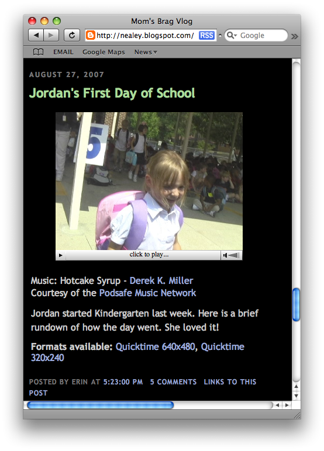
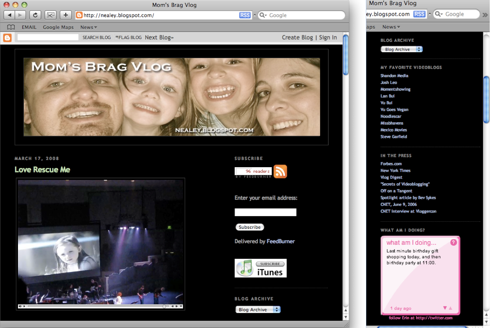
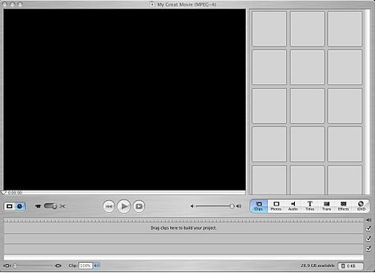
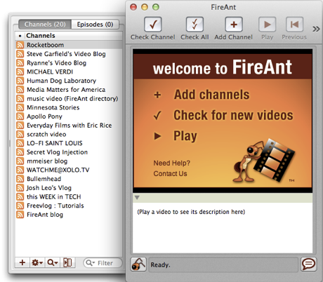
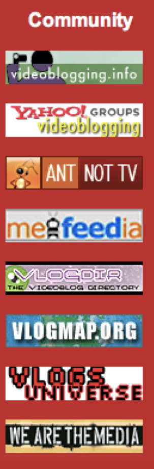

---
Pr-id: MoneyLab
P-id: INC Reader
A-id: 10
Type: article
Book-type: anthology
Anthology item: article
Item-id: unique no.
Article-title: title of the article
Article-status: accepted
Author: name(s) of author(s)
Author-email:   corresponding address
Author-bio:  about the author
Abstract:   short description of the article (100 words)
Keywords:   50 keywords for search and indexing
Rights: CC BY-NC 4.0
...

# 4. From Video-in-blogs to Videoblogging

In this chapter I want to spend some time connecting the previously
discussed technologies to their manifestation in particular
videoblogging practices. The aim is to highlight the socio-technical
aspect of videobloggers and to ensure that the cultural practices and
the technical practices are fused in the account I am making. This is
important because the videobloggers encountered the limitations,
breakdowns and glitches of their technical milieu in their everyday
practice – the technical was intimately related to their work. But
further to this, a number of the videobloggers were also developers and
programmers, and were keen to develop and iterate the tools they used
and share them more widely in the videoblogging community. In this
respect, they are very different from the videobloggers who are in
evidence today on YouTube. The Youtubers benefit from the ease and
abstractions of the platform, without much regard for the underlying
video technologies – indeed, they do not need to. However, back in 2004,
the milieu was remarkably different, with a plethora of formats,
standards, software and the limited bandwidth as previously discussed.
It is through a combination of cultural practices and technical
restrictions that videoblogging emerges as a practice, and goes on to
flourish for a number of years before being swept away in the double
whammy of social sharing sites and an avalanche of vernacular video that
proliferated in the post-YouTube era.

Much of the videoblogging community behaviour and activity is situated
in relation to discussions around working with an underlying set of
technologies in a competitive and collaborative atmosphere aimed towards
the development of a platform. This included the articulation of
competing and often normative ideas of how a video platform ‘should be’,
and eventually the emergence of a *platform imaginary* (see figure 3),
that guided the implementation and content creation practices in
videoblogging. This imaginary was constructed through discourse and
computer programming code and supplemented through demo websites,
prototypes and mock-ups. Usually, but not always, the platform imaginary
was guided by a few key individual developers and users, and some
companies, but in many cases the companies did not understand the
platform imaginary. This is fairly common, seen for example on Twitter,
in the way the early users’ practices developed the @mention and hashtag
functionality, and to which the company at first didn’t pay attention to
because it was considered to be ‘too geeky’. Equally, a set of norms
developed quite quickly around videoblogging and a number of developers
and companies attempted to build software around these emerging
practices. Similarly, the early Twitter platform had very little
functionality for sociality and was conceived as a communications
channel. The very active early adopter community therefore developed a
new set of practices, such as re-tweeting (RT), mentioning (@-mentions)
and hashtags (\#) to make up for lack of technical functions. These were
later absorbed into code in the current system. This kind of
appropriation of user innovation is very common on technical platforms.

Companies like Microsoft employ proprietary, or closed, code for most of
their software packages, and, likewise, companies like Facebook and
Twitter are notoriously protective of their technical systems. Within
these, the abstraction of technical processes (as seen with the
emergence of Web 2.0 technologies) creates new user experiences built
around convenience when using the web. For instance, compare the action
of posting a video on a website before the emergence of Web 2.0 –
copying a link, pasting the link (with the correct html) into your
website or blog, then either waiting for someone to visit your site or
emailing a link to this particular page (via your email) to a number of
contacts, all entered by hand – with the much simpler ‘one-click’
embedding of a YouTube video directly onto the Facebook Timeline,
instantly shared with your Facebook friends. Compare this again to
sharing a brief video clip with all your friends via Snapchat, or
Instagram stories – where short videos are instantly pushed to all their
devices. This has profound effects on the experiences of the users, and
should have profound effects on the way in which these technical systems
are studied; What we need to do is ‘to challenge our perception of the
Web as rooted within the visual aesthetic of the user interface’.[^05chapter4_2] A
platform-based methodology is a way to uncover these underlying
processes that tie the various ‘modular’ elements of Web 2.0 world
together, allowing for critical analysis of protocols and the way they
are ‘articulated so as to channel information in specific ways and this
enacts specific economic, legal and cultural dynamics’.[^05chapter4_3]

Figure 3: A
Schematic overview of the videoblog platform, 2005.

Langlois et al calls this going ‘beyond and below the user interface’.
Here I draw on software studies and related approaches to examine the
technical and social elements of platform-based communities. The aim is
to try and locate the interconnections and co-constructions of the
‘network’ and ‘community’. I do this by analysing the communities in
question at a point *before* the ‘corporate colonisation’ takes place.
In other words, I look at the constellation of technical systems and
user-practices of the early adopter communities in a period of
instability, before the platforms have been set in place, and at a point
where individual users still have the power to influence changes on the
building of the network. For these purposes, I use *network* to refer to
the material level of the technical-social level and *community* to
refer to the socio-cultural level of the socio-technical associations
that form in these technical-social assemblages. It is important to map
the way in which the technical level, as network, is co-constructed, and
yet constantly iterated by the early-adopter community who populate it.
Additionally, I am interested in the way in which mediators (like apps),
function to mediate the interface between the network and the community,
and in some cases intensify, shape and facilitate particular forms of
sociality on the network.

So now I want to use this approach to look at videoblogging itself,
drawing on the empirical data gathered through my virtual ethnographic
fieldwork. Looking at different aspects of the videoblogging practice, I
start with its technical foundation. I look closely at how the
technologies available to, created and maintained by the videoblogging
community were conceptualised and discussed. This helps explore the
emergence of a videoblogging platform imaginary. But although this
technical knowledge is necessary to gain a deep understanding of the
videoblogging practice, it is not sufficient unless we also look at how
these technological structures are negotiated and the conditions under
which these practices emerge. Participatory culture was not created by
Web 2.0 platforms such as YouTube, rather, platforms such as YouTube
were so quickly accepted by the mainstream because for decades groups of
participatory cultures had prepared the way for the early adoption of
these kinds of platforms.[^05chapter4_4]

From a purely screenic perspective, a videoblog is a blog that uses
video as its main form of expression. The videobloggers used a variety
of blogging software, most notably Blogger, although many converted to
Wordpress as that platform grew in popularity.[^05chapter4_5] Blogs settled into a
particular design in the early 2000s, where the sidebar contained links
to other blogs usually related to the one being read. This was called a
‘blogroll’ and was a popular way of building comments about and a
readership for blogs. The sidebar also signalled to the reader the kind
of context the blogger liked to position herself in (e.g.
‘mummy-bloggers’ would link to other ‘mummy-bloggers’, fashion bloggers
to other fashion sites and so on). The sidebar of a videoblog often had
additional information about the videoblogger, such as other sites they
maintained, a blogroll of other videoblogs they liked or would
recommend, and links to community websites, services and platforms.
Similar to a blog, the videoblog had an available archive, a profile
page and a profile image.

Figure 4: Typical videoblog post

A blog could be said to be made up of four main components. There was
the main body of text, which would contain the most recent post at the
top (figure 4), with subsequent posts displayed below. There was a
sidebar (Figure 5), which contained the blogroll, advertising, a search bar, link
to a profile page, subscriber button, and various other information.
There was also an archive, which gave access to the previous posts on
the blog, and finally, there tended to be a comment section, which
allowed other readers to post text and engage in debate on the blog. By
2003 these had become fairly standardised and with the emergence of
blogging platforms such as Blogger and Typepad, became very common
layout templates on blog systems. It was therefore natural for the
videobloggers to build on these existing structures when they first
started posting videoblogs.

Individual posts on a blog were time stamped with information such as
the date and time the video was posted, which video formats the
videoblogger made available, a short description of the video (including
credits to musicians of music hosting companies), how many comments had
been left, and a permalink to the post (figure 4). For example, a post
might link to four different video formats or codecs, such as QuickTime,
Windows media player (WMP), DivX or flash. The most common format was
QuickTime, due to the reliance on Apple hardware and software to create
the videos, but other formats were often included to widen the possible
audience. 

Figure 5: *Mum's Brag vlog* by Erin Nealy. Sidebar with blogroll.

Videoblogs generally featured short videos, each one usually between 1-5
minutes in duration, which could be viewed, commented on and downloaded
by users over the internet. The ability to download videos from
videoblogs was an important technical requirement. This was because the
de-coupling of the video from the videoblog was a necessity for
syndication, which formed the basis for dissemination of videoblogs at
the time. It also stood in direct contrast to other, proprietary video
platforms such as Vimeo, Veoh and YouTube, which prevented the user from
downloading content.[^05chapter4_6] The content of videoblogs varied greatly, from
personal diaries to news programs, sci-fi shows and more artistic
videos. The videoblog tended to have the author’s posts in reverse
chronological order, with the newest at the top (figure 5). This aided
the user with finding the latest blog post or video and helped to drive
user ‘traffic’ to the content and gave a sense of newness to the blog.

I want to spend a little time exploring further some of the technical
affordances, specifications and protocols that served to stabilise the
videoblog form. At a time of fervent development of technologies around
video and moving images, particularly in relation to codecs (used for
video compression), it is hard to remember just how confusing and
fragmented video in the web was during this time. Not only were there
competing standards, codecs, encoders and formats, but there were also a
multitude of different players, plug-ins and applications that
introduced their own idiosyncrasies as shown in the last chapter. For
example, the flash (.flv) format was written for desktops and was very
frustrating to use (most videobloggers at this time avoided it) and was
highly processor intensive – a reason that Steve Jobs banished it from
the iPod and iPhone. Taken together, these technologies slowly combined
to create what Kittler called a technical a priori, that is the
establishment of a common set of technical standards which serve as
foundations on which action and cultural practice might take place.[^05chapter4_7]
Bernard Geoghegan argues that a ‘technological a priori defines the
scope and logic of distinct cultural formations and epistemes’.[^05chapter4_8] In
this case, standards grew out of a number of cultural techniques that
were shared amongst the members of the videoblogging community. As
Adrian Miles, videoblogger, early community member and academic of
hypertext, narrative and technical systems, explained, ‘in terms of
codecs and picking up an earlier question about standards. I use
\[QuickTime\] for everything because I do interactive work and it is the
best architecture... The codec isn’t great but it… means any mpeg4
compliant client can view it, anywhere.’[^05chapter4_9] In many cases these
technical standards were defaults in video software or the common codec
or format used in industry, e.g. QuickTime was the default codec in
iMovie. But in a similar fashion to discussions over open source
software, videobloggers would question the use of closed codecs or
software platforms.[^05chapter4_10] For example, as one of the videobloggers, Jay
Dedman argued;

> I know a big question is simply: why should I care about open codecs?
> Aren’t codecs free now? Flash and QuickTime are monetarily free for
> the most part. It’s difficult to find arguments for this now. The
> concern is when either/both these codecs become totally dominant...and
> web video is the new TV for lack of a better word. We need an open
> codec to either challenge the status quo...or be a solid
> alternative.[^05chapter4_11]

At the time, there were many incompatible video standards, and rapid
updates, alongside the paucity of bandwidth on the internet, which
combined to render much video unwatchable or difficult to view. It is no
surprise then that the videoblogging community began to slowly coalesce
around a series of informal standards in relation to their work. These
standards created certain digital arti
facts embedded in the videos which
also created a distinctive digital video aesthetic. This aesthetic
featured high-compression and therefore pixelisation, low frame rates
and often muffled or distorted sound. Miles argued that most of the
presets within video-editing software packages ‘treat things like
‘dialup’ as a compression setting so that video will stream in real time
at that data rate, so it has to compress very hard to achieve this. But
you’re not trying to real time stream, you’re progressive streaming… If
they want it, they will wait.’[^05chapter4_12] By progressive streaming, Miles is
referring to the two major ways in which video is encoded, either as
progressive, that is the image is downloaded completely as an image,
rather like a photograph, before displaying the frame, or interlaced,
where alternating horizontal lines of video are displayed. In the second
case, the illusion of a higher resolution is made because the flipping
between frames (one is the horizontal lines 1, 3, 5, 7 and so on, and
then the other 2, 4, 6, 8, etc.), however the image does appear to jump
and move around if our eyes catch the interlacing taking place. In the
case of progressive video (and the reason why video is marked with a ‘p’
as in 480p, 720p, 1080p) the image is sharper and realistic, whereas in
interlaced (where video is marked 480i, 720i, 1080i) the image is sent
at half resolution on alternate frames. Clearly then, interlaced video
will download much faster than progressive, but with markedly lower
quality, and this would be *in addition* to the digital artifacts made
into the video by the video compression codecs. It is therefore
interesting that videobloggers believed they were maximizing video
quality in preference to the problems they associated with real-time
streaming. When downloaded, they argued it would be of higher quality
and more enjoyable to watch as a visual medium, which is ironic when we
now look back on these videos and observe their comparatively low video
quality and the various video digital artifacts that were common in
these early video codecs.

Discussions around standards were very common in the videoblogging
community. For example, the size of the window for the video, that is,
the number of pixels in the x and y plane that made up the image, was
widely discussed. This determined the size of the video but also the
complexity of the video content and hence the amount of time it would
take for the editor software (e.g. CPU processor time) to export a video
that could be distributed via blogs and online more generally. The
compromise between video size and quality was a perennial issue in
relation to videoblogging and defined, in many cases, the aesthetic of
the videoblog. The ‘typical’ videoblog was distributed with a resolution
of 320x240 pixels, which is essentially half the size of the visible
portion of a standard television signal in North America, otherwise
referred to as NTSC. These videos tended to display at 15 frames per
second. In fact 640x480 is the standard definition, 4:3 aspect ratio
NTSC video, so by halving the pixels the videoblogger halves the data
needing to be compressed and sent. The 480 lines is standard definition
(SD) video and anything above 480 horizontal lines (usually 720 or 1080
for consumer videos, camcorders or cameras) is high definition (HD)
video. Settling on 320x240 pixels for the size of the video file, was a
standard format that emerged out of these compromising technical
affordances (size of file, speed of processing, ease of distribution)
and cultural preferences (video aesthetic, length of video, complexity
of material). Agreeing on a standard preference also became a marker of
membership of the videoblogging sub-groups and became a relatively
standard format for distributing videoblogs.

It is amazing how fast video has developed such that we might talk about
the softwarization of digital video. There has been a disappearance of
the ‘prosumer’ video camera and its replacement with the digital video
(though of course, the digital camera and the digital mobile phone
remain pieces of hardware). This predates the launch of the iPhone in
2007 and other video-capable smartphones that have since become the de
facto device(s) for capturing everyday video. Indeed, videobloggers had
a keen interest in small, portable digital video cameras that could
create video quickly and transfer it to a computer with ease.

At the time of my interviews, only one of my informants shot videos on a
‘professional’ camera (Roxanne Darling) and only two recorded video on a
mobile phone, using the Nokia N95 (Steve Garfield and Rupert Howe), with
three others (Andreas Hagustrup Pedersen, Sam Reinsew and David Howell)
explaining that they combined mobile phone with a hand-held camera.
Casey McKinnon, who aimed to build a career from her videoblog sci-fi
show, Galacticast, shot video on a HD digital camera. A small group shot
on ‘digital cameras’ (Loiez Deniel, Juan Falla, Jen Proctor, Gromik
Nicholas and Raymond M. Kristiansen) and the rest referred to their
recording equipment as ‘hand-held’ (Richard BF, Richard Hall, Mary
Matthews, Markus Sandy, Erin Nealy, Daniel Liss, Cheryl Colan, Bekah
Havens, Erik Nelson, Paris Marashi, Zadi Diaz), either a ‘small, fits in
handbag’ (Brittany Shoot) or the most popular camera among the
videobloggers at the time, the Sanyo Xacti digital video camera (Ryanne
Hodson, Gena Hackett, Jen Gouvea, Enric Teller).

The Sanyo Xacti digital video camera actually became iconic within the
videoblogging community. This was because in so many ways it was *not*
different to traditional video cameras. The Xacti was designed to
‘function like a tiny camcorder, with a flip-out LCD view screen and a
camcorder-style ergonomic design \[which made\] shooting video from
different angles and getting yourself into the shot much easier.’[^05chapter4_13]
The camera was L-shaped, with the body resting nicely in your hand
(pistol grip) and the screen and viewfinder folding open to one side,
making it easy to watch footage while shooting, while also making sure
you were in frame at all times. This made the classic videoblogging shot
extremely easy to achieve, and was perhaps one of the reasons for its
success within the videoblogging community. The classic videoblogging
shot was filming yourself using your right arm stretched out in front of
you, and pointing the camera at yourself, the kind of image that has
become immortalised in the notion of the ‘selfie’ today. The Xacti
allowed you to flip the viewfinder towards oneself, which meant it was
easy to film. Importantly, the Xacti was one of the first video cameras
to move away from physical media. The camera relied on digital storage,
and did not use videotape or discs, storing video on a flash memory
card, making it easy to transfer to a computer.

Some videobloggers used the built in webcam in their laptops to record
videos, although none of my informants did this. The webcam is often
conceptualized in terms of voyeurism and exhibitionism, and as Tina
LaPorta’s work shows, ‘while the home represents a private space and the
Web a public site, webcams become a window or an invitation to look, to
gaze upon everydayness of the inhabitants.’[^05chapter4_14] Jimroglou’s feminist
critique of JenniCam argues that it was ‘not only the woman in front of
the camera, but it is the woman behind it too. \[She\] is both viewer
and viewee: she occupies the hybrid position of both object and subject;
she is composer and is composed’ thus offering a ‘fruitful as a tool of
feminist transformation’.[^05chapter4_15] In contrast, videobloggers tended to
prefer to use hand-held video cameras and they also shied away from the
‘webcam’ association of web cameras on laptops.

There were links made by videobloggers in my interviews between the
relative mobility working a laptop affords and the production of video
on-the-go, something many videobloggers reported as being important to
them (Susan Pitman, Juan Falla, Jay Dedman, Erin Nealy, Rupert Howe, Jen
Gouvea). There was also a tension between the cultural idea of Mac users
as more ‘creative’ than PC users, and although the majority of the
videobloggers used a Mac, there are clear examples of those producing
not only ‘regular’ videoblogs, but videoblogs considered ‘artistic’ (for
example, Adam Quirk), using Windows. Out of the 34 videobloggers I
interviewed, three quarters used a Mac, and three videobloggers combined
a Mac and a Windows machine (Cheryl Colan, Markus Sandy, Richard BF).
Five videobloggers relied solely on the Windows operating system
(Raymond M Kristiansen, Gromik Nicholas, Adam Quirk, Gena Hackett, Susan
Pitman). Amongst the Mac users, 22 videobloggers used laptops, and the
rest relied upon desktops, whereas two Windows users used laptops, and
the others used a combination of laptops and desktops. It is interesting
to note that FireAnt was only ever released for the Mac, despite
promises of making it available for Windows, and that the links between
the Mac and videoblogging were reinforced by the use of QuickTime.

Ironically, this technical specificity wasn’t really remarked upon by
the videobloggers, beyond a comment by Casey about the need to switch
from one to another for professional reasons; ‘for the first year and a
half, we used a PC,’ she told me. ‘However, due to the demands of our
new HD camera we are currently making a switch over to Mac in order to
use Final Cut Pro out of the box. Adobe Premiere Pro doesn’t have the HD
quality we need’. Software such as Apple iMovie (used by Rupert Howe,
Cheryl Colan, Ryanne Hodson, Markus Sandy, Jay Dedman, Adam Quirk, Erin
Nealey, Steve Garfield) was one of the most popular software for editing
video within the videoblogging community, despite being the more
‘simple’ compared to Final Cut Pro (used by Daniel Liss, David Howell,
Richard BF, Casey McKinnon, Jen Gouvea), Windows Movie Maker or Premiere
(Enric Teller), which required more advanced technical skills. iMovie
allowed the user to record video files directly from either the webcam
or an attached camera (like the Xacti) or import video files. It used a
simple editing layout (figure 6), with the captured footage on the right
side of the screen, each video file resting in a window of its own. The
bottom panel showed a timeline of the footage the user was editing
together, and the video would playback in a large window to the left.
The editing field also contained two audio-tracks, for added music or
voice-overs. In essence, it was very much the ideal video-editing
software for the everyday life aesthetic that was widely reproduced in
the videoblogging community.

Figure 6:
Screenshot of iMovie HD (version 5, January 2005)

In iMovie, below the captured or imported files the videoblogger had
easy access to photos or music stored on the laptop, as well as access
to effects, title cards and the export to DVD button. This simplified
framework for presenting data made producing the videoblog simple and
many videobloggers found it a more creative approach to working.

There was a suspicion in the videoblog community, however, that despite
being both accessible and intuitive, iMovie was inferior software
compared to professional software Final Cut Pro; as Daniel Liss told me,
‘once—I could even tell you which video—I was away at my parent’s
\[without\] a computer and I used iMovie on my mom’s laptop. And it was
a scarring experience. Yuck’. There was also a sense that iMovie was
less serious, and thus more playful perhaps than it’s more professional
counterparts; ‘I edit with iMovie’ Cheryl Colan told me, ‘whose effects
are terribly cheesy. I frequently abuse transitions and wipes because I
think they are campy and funny. What’s not to love about a transition
that’s an ever-widening heart shape? Or a barn door? I’m a big fan of
iMovie’s shooting star effect because it’s absolutely ridiculous. I
can’t figure out it’s real purpose.’ This dichotomy between amateur and
professional, serious and frivolous constantly played out in the
videoblogging community discourse and practice.

Videobloggers often described their computers. They were extremely
passionate about their systems, and it seemed to have replaced the
television as the central technology in the living room. This was new
and surprising in 2005, and anticipated many of the subsequent changes
in media consumption that we see today. More importantly, the
videobloggers’ focus on their computers was an early example of
computational visual media –videobloggers quickly moved to digital video
cameras, with no physical, analogue tapes. Videoblogging was a truly
digital practice, with the content captured, edited, produced,
disseminated and consumed entirely on a digital platform. The computer
occupied a similar position in the videobloggers’ homes, as the
television traditionally held. ‘It’s the “centre of attention” of the
living room,’ Juan Falla told me, ‘we not only use the computer to edit
or connect to the internet, but we use it to listen to music and watch
DVDs. So we use it for everything. Every time I arrive home, I turn it
on and put music on.’ Further, they explained, ‘the TV is in our room.
We watch A LOT of TV. I’d say minimum 3 hours a day. But, if we have
friends, we do everything in the living room WITH the computer, not only
listening to music but watching videoblogs or videos from YouTube, etc.’
In other words, the computer and the content found on the internet is
increasingly, for Falla, competing with ‘traditional television’ for the
attention of the viewer. Videobloggers were in some sense early adopters
of digital cultural practices that have become very dominant today.
Their practices signalled the merging of television and the computer
that has later manifested itself in the form of ‘streaming’ boxes like
the Apple TV and Fire TV.

The videobloggers often described their computers as more important than
their cameras. They highlighted the computer within their living space,
calling it a ‘centrepiece of the room’ (Steve Garfield) or ‘pretty
prominent. You see my computer set-up as soon as you enter my home’
(Zadi Diaz). Describing their work space, Ryanne Hodson also explained
that ‘we spend most of our time in that room. It’s also connected to the
kitchen, there is no wall separating it, so we eat and work on our
computers, it’s quite nice’. The computer had replaced the television as
the centrepiece of the videoblogger’s living space. This is reminiscent
of Ballard’s prediction from 1984, that one day

> Everybody will be doing it, everybody will be living inside a TV
> studio. That’s what the domestic home aspires to these days; the home
> is going to be a TV studio. We’re all going to be starring in our own
> sit-coms, and they’ll be strange sit-coms, too, like the inside of our
> heads. That’s going to come, I’m absolutely sure of that, and it’ll
> really shake up everything...[^05chapter4_16]

The videobloggers very much lived the coming world of online video in
their everyday practices – even if the tools were still relatively
primitive by todays standards.

Figure 7: Number of emails posted to the
videoblogging email list (June 2004 – July 2016). Screenshot taken from Yahoo.

I now want to turn my attention to the textual practices of the
videobloggers and how they used various forms of writing systems, such
as email, to build, develop and strengthen the videoblogging community.
In the period between 2004 and 2007, the videoblogging community went
from a small group of enthusiasts to a vibrant community of users. The
group met online on each other blogs and videos but also through the
Yahoo group Email list. The Yahoo group was the heart and soul of the
videoblogging community. New members were always greeted by at least a
few members, and encouraged to share links to their blogs, RSS feeds and
personal information. To begin with, the email list recruited mainly
through word of mouth and friends of friends. It was established on June
1st 2004 and is still going today, although now with much less activity.
As of the end of November 2017, there are 2750 members still signed up
to the list, and almost 80k messages in total have been posted to the
list.[^05chapter4_17] The most active period on the list was between December of
2004 and August 2007, which saw the list receiving &gt;1000 posts per
month, impressive by email group standards. The high point was in June
2005 when the email group received the highest number of posts (2974
posts). If volume of posts can be seen as an indicator of ‘community
participation’, this period was probably the most active (figure 7). In
more recent years the list has seen months go by with only 3 or 4 posts,
quantitatively demonstrating the way in which the videoblogging
community had changed and slowly declined.[^05chapter4_18]

The email list occupied a crucial position in relation to videoblogging
and the videoblogging community. It functioned as the initial meeting
point for the videobloggers, a digital *agora* in which the community
gathered (albeit asynchronously), and it acted as the main communication
channel between the early members. On the list, the videobloggers would
discuss their equipment, cameras, codecs and working practices as well
as their engagement with a selection of third-party applications, such
as FireAnt and Feedburner. It was a crucial part of a videoblogging
platform – at least in as much as the rest of the videoblogging
technology was relatively underdeveloped and dispersed. Indeed, the
email list was very stable. The list was very much the public hub of the
videoblogging community, rather like a café, lobby or meeting place;
where ideas were exchanged, expertise sought and shared, problems
discussed and arguments debated. As Steve Watkins explained ‘the
videoblogging group is about far more than the technologies necessary to
videoblog.’ It was also a place for people to form friendships and
discuss ‘incompatible ideas about what videoblogging will be to them,
ideas that clash with some fundamental beliefs about what videoblogging
is to the established/vocal crowd.’[^05chapter4_19]

The list also served as a community memory, as a repository of
knowledge, and as an archive of problems and solutions which was useful
for new members. The group members helped each other out, and there was
a sense of excitement about what people would come up with next;

> There were the technical people that were solving problems and then
> there were guys like me that were more about just trying to have fun
> and get people to think of ways of making video that they had never
> thought of before. When Michael \[Verdi\] and Ryanne \[Hodson\] would
> come up with these settings, they would then tell everyone how to do
> it and it would solve everyone’s problem. Then everyone’s quality
> automatically would just go up overnight. That was the cool thing
> about the group.[^05chapter4_20]

The list was a public email group, with an open, accessible archive of
every post written since 2004. As is standard with most Yahoo groups,
the software allows functionality in additional to email. This included
a public calendar, though this was not enabled by the moderators, a
polling system, used a number of times between 2005 and 2007, a links
section, also quite heavily used, and members had access to a
database-area. In the database-area, the videoblogging group had four
sub-groups; i. *Videoblogging directory*, a list of every videoblog in
the vlogopshere catalogued at the time (95 entries); ii. *Giving back* a
smaller sub-set (six entries) where some videobloggers have offered
services to other videobloggers,[^05chapter4_21]; iii. *Birthdays*, a list of
member’s birthdays (12 entries); and iv. *Location,* contact list (10
entries), containing information such as email address for user, what
platform she uses, software usage, country, state, videoblog or company
name and phone numbers.

The information posted in the database area is a useful indicator of the
role the email list played in the early days of videoblogging. Although
only a few entries were made between 2004 and 2005, at first the
database was used to collect and organise information about the
fledgling community. But this was soon superseded by the more narrative
content of email exchanges via the mailing list and the database
activity never became the norm among the later members of the community.
It is interesting to note that, as Enric Teller pointed out, ‘most
people define videoblogging as having control over the production and
distribution of their rich media work’, and this led to a paradoxical
distrust of public web resources that the videobloggers do not directly
control individually. This emphasis on control translated into control
of personal and potentially sensitive information, like birthdays and
geographical location, and although many videobloggers displayed this
information quite prominently on their own videoblogs, they hesitated to
enter it into a public/ corporate system like a Yahoo group.

The first messages on the mailing list give a snapshot of a community in
very early development. For example, the second post to the list
immediately mapped out the technical challenges faced by the
videobloggers and the poster articulated some of the technical issues
facing anyone wanting to post video on the internet in 2004. I quote in
full as I think it gives a good flavour of the very early discussions;

> i\. Technically, the process takes too long (capture, import, optimize,
> write some HTML, post); ii. Existing servers don’t allow much bandwidth
> and storage space. You’ll either get screwed because too many people
> watch your posts, or you have to erase your archive video because you’re
> out of space; iii. What is the language of videoblogging? Is it little
> movies? Or moments from your life?[^05chapter4_22]

Topics such as these were a constant theme in the conversations about
the practice of videoblogging. As previously discussed, the technologies
available to non-professional media creators at the time were limited,
under-developed and expensive and the opportunities that were seen to be
opening up in relation to the rise of Web 2.0 technologies gave the
videobloggers a sense of being part of an exciting change in media.

As with any new medium, discussions on the list were fervent around the
definitions and practices of videoblogging. Was it web video? Was it
television on the internet? Was it a new form of documentary, a new form
of art, or was it a political tool for taking on the media industry?
Depending on where one fell on those issues, how did that influence how
one videoblogged? Should one draw on televisual aesthetics? On cinema?
Or – as some argued – was videoblogging more like Astruc’s notion of
writing using video, and what did that mean for the look, the feel and
the sound of the videoblog? These discussions had a sense of urgency
with some videobloggers arguing that ‘the first successful movies – i.e.
the first moving pictures accepted as motion pictures – were not
applications of a medium that was defined by their giving significance
to specific possibilities. Only the art itself can discover its
possibilities, and the discovery of a new possibility is the discovery
of a new medium.’[^05chapter4_23] This initial burst of excitement around a new
medium was important for inspiring the community and giving a sense of
transformation and possibility that is crucial to any social movement.

As well as using email, videobloggers voiced their opinions in the
videoblogs themselves, thus spawning a new genre of videoblogs – what
one could call meta-videoblogs, or videoblogs about videoblogging. This
was exemplified in 2005, when Michael Verdi, an active member of the
group and co-founder of Freevlog, posted his seminal and hugely
influencial; video *Vlog Anarchy*. Filmed in his home, Verdi presents
what can only be described as a manifesto against manifestos, a call for
the community to stop trying to define what videoblogging is. In the
raw, unedited piece, Verdi laments the tendency among the early adopters
to ‘lock the medium down’ and through definitions and discussions limit
its potential. Instead, he calls for the community to ‘play with it’, to
let it ‘breathe and live and grow’. The video became notorious within
the community, and was referenced two years later in Rupert Howe’s entry
for the Vlog Deathmatch challenge, one of many community events
organized by the Videoblogging community. This took the form of karaoke
which was then voted on to determine the best video.[^05chapter4_24]

Although the majority of early videoblogs fell into what I categorised
as ‘personal’ video, Rocketboom was one videoblog that was distinctive
and new. Andrew Michael Baron founded Rocketboom in October 2004, and
until it closed down in November 2013, produced short videos that
parodied traditional newscasts through a technology-oriented comedy
show. Rocketboom was originally hosted by Amanda Congdon (from October
2004 – July 2006), though over the years it had a number of presenters,
including Joanne Colan, Mememolly and Keghan Hurst. Over the course of
2004, Rocketboom became very popular, to the extent of being featured
during Steve Jobs’ iPod presentation for Apple in October 2005. By
December, Rocketboom claimed that it cost about \$20 to produce an
episode, yet they were able to reach an audience the same size as shows
such as ‘Crossfire’ on CNN, a remarkable achievement. In September 2005,
Business Week covered the faux news show in a magazine feature that the
Internet was becoming more videocentric. Many of the members of the
videoblogging community, including Zadi Diaz, Richard Hall and Steve
Garfield, provided ‘raw footage’ for Rocketboom but also worked to draw
attention – and viewers – to their own sites. Rocketboom was therefore
one of the first videoblogs to ‘break out’ and find popularity beyond
the videoblogging community, even being featured on American TV drama
CSI in February 2006.

A key technology in the technical constellation around videoblogging
that helped simplified video distribution, was Feedburner. It was
founded in 2003 by Dick Costolo (later, CEO of Twitter 2010-2015), Eric
Lunt, Steve Olechowski and Matt Shobe, and launched in 2004. The
importance of Feedburner lies in taking a website address and generating
an RSS feed for the user. [^05chapter4_25] At the time, RSS (really simple
syndication) was the main technology for ‘pulling’ data from the web,
particularly blogs, into a computer. Feedburner was the first company to
make this process a user-friendly experience, and provided the members
of the videoblogging community with the ability to generate an RSS feed
from their videoblog, which could be picked up by content platforms such
as FireAnt or iTunes. Feedburner became hugely important in the
distribution of videoblogs, and a number of my informants relied heavily
on their ‘feeds’ for distributing their videos, but also for watching
other videoblogs. The importance of RSS feeds and Feedburner in
particular to the videoblogger could perhaps be summarised by this email
exchange from September 2005, after a new videoblogger announced her
arrival in the vlogosphere.[^05chapter4_26] Within 15 minutes of posting, there was
a reply; ‘I went to your site, but I couldn’t find your RSS feed in
order to subscribe to your videoblog’.[^05chapter4_27] Feedburner therefore became
a necessary link in the distribution chain of videoblogs, and in some
senses it was *the* mechanism for linking content between the
videobloggers and their audience. In consequence, Feedburner was
acquired by Google in 2007, for a reported \$100 million. However, with
the rise in real time streams like Twitter, RSS became less important to
most websites, who moved to push notifications instead. By buying a
competitor to YouTube, Google ensured that there was no alternative to
the streaming video platform. On May 26th 2011, Google deprecated the
Feedburner API, and in October 2012 it shut it down, reflecting a not
unfamiliar story of big corporations using their buying power to shape
the technical systems for their own benefit.

One of the main consumer oriented technologies that was designed by
developers and that was closely linked with the videoblogging community
was an RSS video player called FireAnt. The first beta was released in
2005.[^05chapter4_28] FireAnt was a desktop application that subscribed to RSS
feeds and allowed the user to play videos on the desktop. As one
videoblogger explained, ‘the point of using an in-computer aggregator
program like FireAnt would be the added benefit to the user that ‘new
video (and other) posts are automatically downloaded’.[^05chapter4_29] This
automatic downloading of new episodes made following videoblogs such
simpler. It also created a helpful abstraction from the inherent
complexity and messiness of web-links and surfing between blogs. Users
would be able to identify new videos and keeping up with episodes would
be much less of a chore.

These kinds of user interfaces are interesting in a number of respects.
Of course, by simplifying the technical process for the user they can
massively expand the audience beyond the technically competent user.
However, the act of abstracting away the underlying blogs in some sense
breaks an important link between the personality of the videoblogger and
their videos, removing the surrounded context the blog provided on the
webpage. But it also breaks a link with the comment culture that was
manifest in the blog-form, and took the form of personal comments and
criticism under each video post. FireAnt therefore represented a shift,
barely perceptible to the videobloggers of the time, from a web-based
medium to a video-centric media form. Of course, the temptation with a
video-centric metaphor was to look to television and film to inform the
design patterns and unsurprisingly, the notion of a ‘channel’ became an
important new way of presenting videoblogs. This too changes the way the
user interacts and thinks about videoblogs – from discrete stories or
moments to an unceasing stream of content, and where the user can flick
the channel at the onset of boredom.

Figure 8: FireAnt RSS videoplayer with pre-selected channels

FireAnt came with twenty pre-selected video ‘channels’ (figure 8),
including the popular Rocketboom, but the user could subscribe and
unsubscribe to as many other channels as she wanted. The pre-selected
channels made some of the videoblogs very popular, and featured
videobloggers who were very active in the community. I asked Jay Dedman,
one of the developers of FireAnt, about the pre-selected channels, and
he told me that;

> The feeds we chose for FireAnt were at first all the ones that
> existed! Difficult to imagine. We would add feeds as people made
> them…Then as there were more and more RSS feeds, we kind of just chose
> a set of feeds that had a mix of content so a new person could get a
> sense of the excitement we all felt. It certainly wasn’t scientific or
> well-planned. In those days, we were kind of flying by the seat of our
> pants.

In its early development, as the platform was still under construction,
it was marked by uncertainty and tentative development. There was a
trial and error exploration in both the technical and social aspects of
videoblogging but also a touch of naivety about turning videoblogs into
television, however inadvertently.

Some of the featured videobloggers (like Jay Dedman and Ryanne Hodson)
had also been part of developing FireAnt, and were early beta testers.
In fact, many of the announcements about updates to the FireAnt
software, were made by non-programmers or members of the community. In
return, these videobloggers made frequent videos promoting FireAnt, so
in a sense there was a kind of gift economy within the community at this
point. By gift economy I refer to the way in which services like these
were performed without expectation of pay or reward. The early adopters
would also be defensive and protective about the FireAnt software,
feeling it was part of the community.[^05chapter4_30]

The functionality of FireAnt was described by one of the founders,
Joshua Kinberg, in an email in July 2005. He explained that FireAnt
allowed the user to

‘subscribe to any RSS 2.0 feed, with Bit Torrent built in.’[^05chapter4_31] It
could playback most media formats, and sync media to iPods or Sony
Playstations. FireAnt allowed you to organise your content with tags,
had built in Yahoo video search and its ‘integrated directory of
videoblogs \[was\] constantly improving and expanding’. It further
allowed the user to ‘preview anything before downloading, or schedule
automatic download and notifications of new content’. While reflecting
on this period in videoblogging practice ten years later, one
videoblogger said that the ‘community was largely fuelled and glued
together by our excitement about the newness of it all. It wasn’t about
the content. We were video hackers’.[^05chapter4_32] The development of software
like FireAnt added to the sense that videoblogging was a growing and
important new medium.

In October 2005, Apple announced that they would start distributing
video ‘podcasts’ in their iTunes store. This new distribution network
would be available to anyone, amateurs and professionals. This opened up
distribution via the internet and further simplified the process.
Content creators no longer had to learn about RSS syndication or the
technical specifications of particular codecs in order to distribute
their work. Of course, Apple was keen to embrace online video throughout
its networks, codecs and technology platform, and thus cement their
control of the ‘media hub’ they controlled with iTunes. It is also
important to note that little commercial video or film was available at
the time due to licensing issues by the film and television industry who
were terrified of a Napster-like collapse of their industry. This helped
fuel consumption of videoblogs and related video resources. Apple
created an iTunes-ready format and provided all the technical means
necessary for distribution through their ‘music’ store. It was also a
way for Apple to experiment with video and film delivery and
distribution systems without waiting for the film and television
industry to give them permission to do so. For example, early video did
not make use of Digital Rights Management (DRM), which simplified their
technical systems. This was noted within the videoblogging community,
particularly by Dedman, who noted that ‘now that iTunes etc is making
videoblogging/podcasting popular... new people are coming in who don’t
really care of what came before them. And that’s their right. So those
of us who have been around, we know who we are. Isn’t it cool it’s
getting so out of control? It’s really happening.’[^05chapter4_33] With hindsight
we can see that rather than getting out of control these moves by Google
and Apple were in reality meant to reduce the ‘out of control’ anarchy
of video and podcasting by effectively monopolising the distribution
networks.

As Michael Verdi, Ryanne Hodson and Jay Dedman later reflected in a
special issue of the web series *The Web Ahead*,

> When the Apple store opened in New York, down on Prince Street, we
> were doing these events down there where they were asking us or we
> asked them if we could come and talk about videoblogging. And they
> were like, “Yeah, sure, no problem.” So we would try and explain what
> we were doing to people and we would have a whole crowd of people off
> the street, they all had their Macs, everyone seemed interested and
> excited but it was so complicated trying to explain to them how to do
> this… Film it on your camera, import it into iMovie or Final Cut, you
> have to edit it, you have to export it in this certain way, you have
> to take a screenshot and you have to embed that, you have to link
> this, you have to hand code this RSS feed. I mean, it was just so
> crazy. That’s when Ryanne and Michael made a site called
> [Freevlog](http://www.freevlog.org/). And that really I think was the
> point where videoblogging started really spreading fast.[^05chapter4_34]

At the time, RSS 2.0 was seen as the future of media distribution on the
web. Tags allowed the categorisation of content into different
taxonomies of media, as well as the increased usability of the archive.
Kinberg emphasised that FireAnt could play any media format – and this
was clearly in competition with YouTube, which was criticized for taking
whatever format the user uploaded and converting it to Flash, a format
shunned by the videobloggers due to its perceived low-quality and being
a closed format. This distinguished FireAnt from iTunes, which had
specific Apple requirements for the format that could be uploaded.
FireAnt was very much a product of and for the videoblogging community.
Any changes to functionality or features were completed in dialogue with
the community. The updates were regular and the developers wanted
testers. They encouraged the users to push the software to its limits,
as they would say ‘bang on it. Try to break it. We want your feedback.’
The co-dependent relationship between FireAnt and the videoblogging
community can be seen further in an email from Kinberg in June 2005,
‘many of you have helped us test FireAnt and we thank all of you for
your help, advice, and suggestions.’ [^05chapter4_35] Kinberg positioned the
videoblogger creator as a crucial actor in the development of FireAnt,
calling them ‘the power under the hood’, who have ‘energy and passion’.
FireAnt, he claimed ‘listen’ to’and ‘carefully consider’ all the
videobloggers’ ‘help, advice and suggestions’. FireAnt assisted the
videobloggers in getting their videos out there, but the videoblogger
reciprocated by promoting FireAnt on their videoblogs and by being
unpaid beta testers.

Interestingly, despite its popularity, few people (Erik Nelson, Erin
Nealey, Richard BF, Ryanne Hodson) specifically mentioned using FireAnt
in their interviews; ‘I have like almost 200 feeds in my FireAnt and I’m
so behind’, Hodson told me. When asked how he watched videoblogs,
Richard BF told me ‘on my computer, through FireAnt. I need to be able
to comment right then’. Of course it is possible (and likely) that more
videobloggers actively used FireAnt, yet it is interesting that even at
this point, there wasn’t a very vocal support for it.[^05chapter4_36] In fact, when
Apple released Version 4.9 of iTunes in June 2005, some videobloggers
opted for using this as their main video aggregator (Andreas Haugstrup
Pedersen, Richard Hall). Another reason for this might also be the
release of the 5th generation Apple iPod in 2005, which allowed mobile
video playback. Amongst my informants, six (Roxanne Darling, Raymond M.
Kristiansen, Gromik Nicholas, Cheryl Colan, Jennifer Proctor, Markus
Sandy) reported watching videoblogs on their iPods.[^05chapter4_37] The
videobloggers were very much ahead of the curve in their use of
technologies and the shaping of their cultural artifacts to it.

Figure 9: Badges promoting community sites from freevlog.org

An important website was Freevlog.org, which was created by two
videobloggers, Michael Verdi and Ryanne Hodson, in 2005. This site was
intended to be a resource for videobloggers, and it hosted tutorials on
video-editing, compression, how to take a screenshot, uploading and
hosting. Freevlog was one of the main sites around which the community
gathered in these early days of videoblogging and provided many services
to the community. At the time, small rectangular badges could often be
seen on the sidebar of a videoblog, promoting sites they approved of,
such as Blip.tv, Ourmedia.org and FireAnt, and the videobloggers would
also have their own badges and display the badges of their ‘friends’
(figure 9).

These badges were automated and could easily be generated on the
Freevlog site. They came in two different styles and sizes, and could be
generated using quite simple computer code. Freevlog actually embedded
these snippets of code in the sidebar of their front page, so anyone
could grab it and put in on their videoblog.[^05chapter4_38] Anyone with basic
understanding of HTML would be able to take this code, change the
content of the &lt;href&gt; (hypertext reference, or web-link) tag to
their own webpage, upload a small gif to their website and change the
&lt;img src&gt; (image source) tag to their own image link, and thus
create their own badges. The videos on Freevlog almost exclusively
featured Verdi and Hodson (themselves prominent members of the
videoblogging community) and became an important resource for new
videobloggers. Freevlog can be seen as a kind of community magazine
(zine), similar to those used and developed by previous communities of
practice; such as the Raindance corporation’s publication, *Radical
Software,* with its ties to the Guerrilla TV movement, and the Whole
Earth Catalogue, with its links with the web community The Well.[^05chapter4_39]

Freevlog would also post weekly tutorials about videoblogging and its
practices. For example, Hodson would walk the viewer through how to set
up an RSS feed with Feedburner, how to chose the right codec or
compression settings before exporting videos or making a screen capture.
The site presented videoblogging in ‘8 easy steps’ – talking the new
videoblogger through the entire process. The site was even translated
into five other languages (Spanish, Portugese, Japanese, Dutch and
Italian), with translation freely provided by members of the videoblog
community.

I also want to briefly mention the grass root media directory Mefeedia,
which launched in January 2005 with 617 videoblogs listed. This was
another important site for aggregating information about videoblogging.
By January 2007, Mefeedia.com listed 20,913 vlogs, showing that amateur,
independent videoblogs (i.e. not vlogs on YouTube) were still gaining in
popularity. The site was used by the videoblogging community as a place
to look for specific content, and acted as a hub for hashtag campaigns
like videoblogging week (\#vbweek08, \#vbweek09 etc) and videoblogging
month (\#vlomo), but as the site grew and their business model turned
more and more towards advertising and pop up ads and banners, the
community began to drift away. Michael Sullivan, who helped name the
site back in 2005, wrote to the email list in April 2009 saying that;

> I cannot use Mefeedia until at least pop-under ads are deactivated.
> There was a time that even promoting a site here with gentle
> advertising would be an issue. Mefeedia has gone way overboard. I
> understand you need to capitalize on all your traffic. But it sure
> makes it difficult to tolerate. Sorry. You know I've been a fan and
> always interested in a site that I named and I've helped out in some
> ways, but I have some web browsing standards to uphold.[^05chapter4_40]

Today, Mefeedia is an internet media-feed company, aggregating feeds
from sites such as Vimeo, Hulu and Vevo, as well as acting as an
umbrella company for a range of internet companies. However, instead of
being a grassroots site used by amateur video makers, today it is
infested with malware – described elsewhere as a ‘browser hijacker’ –
another indication of corporations monopolising distribution and the
user experience, and not necessarily for the better.

Video hosting became an integral part of the extended videoblogging
platform. Initially, the videobloggers hosted their own content on their
own sites – leading to a range of problems, for example, Howe’s mention
in the New York Times as discussed earlier in the book. To work around
these problems, the community worked closely with a number of sites and
developers to solve them. Among them, OurMedia.org, founded by J.D.
Lasica and Marc Canter in 2005 acted as a front-end for Archive.org,
where videos were hosted. Similarly, on June 16th 2004, Adrian Miles
offered the members of the group 1 GB of free hosting on his basement
server (in Australia) to ‘kickstart’ videoblogging, but even this would
have been vastly insufficient at this point. Amongst my informants,
Paris Manrashi, Brittany Shoot, Bekah Havens, Andreas Haugstrup Pedersen
and Ryanne Hodson indicated that they hosted their videos on blip.tv.
Dailymotion, Videobomb and Videosift were sites mentioned by Loiez
Deniel, a French videoblogger who used a number of sites based in
Europe. Steve Garfield also uploaded videos to Vimeo. Adam Quirk pointed
out that he, like many others, were uploading their videos to a ‘large
number of video-sharing sites’ in order to reach wider audiences.
Ultimately, however, the battle over video hosting came down to two key
players; Blip.tv and YouTube.

I have already introduced YouTube, but Blip.tv was founded in 2005 and
worked hard to convince videobloggers to stop paying for their own video
hosting and move to the service. After his experience with the *New York
Times*, Rupert Howe ‘found people using Blip for free, and that solved
my billing/bandwidth issue.’ Blip.tv was founded by Mike Hudack, Dina
Kaplan, Justin Day, Jared Klett, and Charles Hope. The founders were all
members of the videoblogging email list and the site was announced there
in May 2005 with a short message from Hope, ‘here’s blip.tv, a beta site
that features vlog hosting and aggregation of external RSS feeds. Please
take a look and kick it around!’[^05chapter4_41] Immediately, and amusingly, there
were responses from the community raising technical concerns; ‘I’m kinda
confused as to what it’s doing other than aggregating videos and
sticking them on the main page. It appears to pull from certain feeds,
but I don’t see any place even after logging in to submit a feed URL.
You can submit individual videos it appears’.[^05chapter4_42] Hope replied within
minutes, showing just how small these early networks were, ‘it is
confusing, I’m sorry. You can add stuff with the “Add content” link in
your user info, on the right side. It has just been made more
prominent’. Through these kinds of exchanges, the community directly
influenced design decisions on the blip.tv website. This demonstrates
how the *socio-cultural* level (community) could strongly influence the
*technical-social* (network) in the early phases of development of a new
platform. It also shows how the knowledge and expertise of the videoblog
community could be harvested to create digital media products.

Due to its engagement with the videoblog community, Blip.tv became a
huge success, but ultimately their business model moved towards
advertising – a move strongly condemned by the videoblogging community.
After a number of difficult years, Blip.tv rebranded as Blip – an
aggregation site featuring paid semi-professional content by new media
companies. As a result, the community largely abandoned the site. Blip
continued to host many of the early videobloggers videos for years, so
for a while these archives remained relatively safe. The latest entry
for any of my informants on Blip was in November 2011. In November 2013,
however, Blip – recently acquired by Maker Studios – wrote to the
members of the videoblogging community and told them they would no
longer be hosting their videos. The new owners were looking for content
of ‘high quality’ and most of the videoblogging content didn’t fit this
definition. They gave the users thirty days to download and back up any
content they might want to keep before Blip deleted it, a startling turn
around for a company that had worked hard in its early days to make
connections with the videoblogging community.

But from the start, Blip was very secretive about its business
decisions. They soon stopped engaging in community conversations on the
email list. Dedman told me;

> Blip had a similar experience \[to FireAnt\]. I don’t think any of
> this is public, but I know the original founders had a huge fight last
> year. Their shares were all diluted after their last round of funding
> and they lost control of the company. I think only one of the original
> guys still works at Blip. I assume the current owners are trying to
> mainstream it in order to sell it.

Despite trying to sell the site, Blip eventually closed in August 2015.
Another part of the videoblogging platform was therefore removed from
the internet and along with it any remaining archives it contained.

The videoblogging community had a complex and at times contradictory
relationship with YouTube. The community had an intense dislike of
YouTube, mentioning the media giant as little as possible in
discussions. One of the most interesting aspect of the YouTube debate is
how wrong the videobloggers were about the future of the site. One would
have thought that the launch of YouTube would have been celebrated in
the videoblogging community. Here was a site that finally answered so
many of the community’s problems. It was easy to use, it was free to
use, it seemingly solved some of the technical problems of aggregation
and distribution that the videobloggers had been struggling with – if
not all of them. However, instead of being conceived of as a solution,
YouTube was quickly conceptualised as the enemy.

When YouTube launched in May 2006, one of the three founders, Steve
Chen, posted a personal message to the email list. ‘\[We\] just launched
a new video blogging service at www.YouTube.com,’ he wrote

> Many of the same questions being asked here, we had also asked
> ourselves as this is still a nascent area for technology. Given the
> state of the technologies that video blogging depends on is still in
> developing stages, we had to answer the questions within these
> limitations… currently, we feel that bandwidth and storage is not the
> problem. The biggest obstacle is getting people to learn how to take
> videos and getting them onto the site.[^05chapter4_43]

Interestingly, Chen’s original email didn’t get much attention. Perhaps
because it was buried in a thread arguing about definitions of
videoblogging, or because at this time many new sites offering easy
video hosting solutions were launching. The email from Chen had only a
few responses and, as had become increasingly common within the
community at that time, they were mostly about technical issues. The
initial reaction from the community concerned formats, and particularly
YouTube’s decision to convert video submissions to a flash video file, a
proprietary web format owned by Adobe.[^05chapter4_44]

The reactions ranged from a disappointed ‘everyone is doing Flash...’ to
the more dismissive; ‘Flash gives me hives’. Flash was a mediocre
format, providing an inferior image quality. As Cubitt points out, ‘like
VHS, and so many other victors of previous format wars, they are only
good-enough’. YouTube’s decision to use interlaced streaming meant that
the videobloggers – who valued quality above anything else – were
unimpressed. For the average user, however, who just wanted to watch the
latest viral video, YouTube was ideal. In an episode of the podcast *The
Web Ahead* from 2014, Jen Simmons, Ryanne Hodson and Michael Verdi
reflected on the beginning of YouTube and particularly how and why it
became such a success;

> When YouTube started… they did everything we didn’t want to them to
> do, sort of. \[Laughter\] But it all turned out. In the end, it was
> actually... sometimes I think, “Man, they just saw way further than we
> did.” They had things like... the problem we were trying to solve with
> the RSS feeds and the downloading the videos, like Jay said,
> overnight. One of the things that YouTube did at the beginning was,
> they were like, “We’re going to make sure that the videos play
> automatically right away no matter what.” So the “no matter what”
> meant it had the crappiest quality in the world. It was like, a huge
> step back in quality and that was one reason why we didn’t ever want
> to use it at first. Because it just made your videos look like crap…
> All of a sudden, there were all these people who had never even
> thought to watch a video on the internet. Like, why would you even try
> to do that? They now had a reason to see video on the internet and
> they were like, “Oh, I need, whatever, a Flash player. I need a
> QuickTime plugin. I need a whatever plugin I need to see this
> stuff”.[^05chapter4_45]

One of the technical limitations experienced by the videobloggers early
on, was that producing videoblogs took a long time. With YouTube, this
problem was streamlined. The fact that non-YouTube videoblogging took a
long time and therefore produced a higher quality aesthetic than videos
uploaded to YouTube,[^05chapter4_46] became one of the defining factors for the
videobloggers when attempting to delineate themselves from the rapidly
growing community of Youtubers. The videos posted to YouTube were
considered to be of a lower standard than the videos produced by the
videobloggers. For example, when I first signed up to the email list (in
August 2005, six months after the launch of YouTube), I received plenty
of encouragement from other videobloggers, but also quite clear warnings
about using YouTube (which was where I had initially posted my videos,
for the same reasons as ‘everyone else’: it was really easy). One of my
first replies said: ‘congrats on the videoblog. I suggest you check
YouTube’s terms of service. They’re pretty oppressive. I would suggest
Ourmedia and or Blip.TV. They respect the creative commons[^05chapter4_47] (or
copyright) you assign to your work.’[^05chapter4_48] The videobloggers had a strong
sense of in-group/out-group, with the individual videoblogger encouraged
to follow community norms and values, which they manifested through this
set of technical norms and practices.

Other videobloggers did see the potential of YouTube for reaching a
wider audience; ‘video can often receive mass attention if it becomes
viral and contagious. Thousands or even millions of people will
participate in spreading worthy video clips and try to create video
clips that can garner such awesome attention on the Internet’.[^05chapter4_49] The
language and opinions varied, from seeing what YouTube offered the
videobloggers in terms of getting their work out to a much wider
audience, to a scepticism about control of content. There was also a
strong awareness of the economic possibilities in terms of the potential
for advertisers to profit from ‘the millions of workers who sit in front
of computers all day’. A later email referred to ‘some of the nutty
Youtubers who… were talking of getting several million viewers for their
videos. It’s nuts’, as Jay Dedman wrote in 2007.

The concerns about YouTube within the videoblogging community in 2005
were mainly related to technical issues, such as quality of videos,
formats and codecs. But there were also concerns about ownership and
branding, as well as being able to retrieve content back out of YouTube
after uploading it. Despite being lauded as one of the most successful
web 2.0 start ups, Uricchio argues that, ‘while YouTube’s economic model
is indeed predicated on participation, it fails the ‘2.0 test’ since
users may only upload — and not download — its videos’.[^05chapter4_50] The ability
to download videos might not seem like a deal breaker for the average
user, but within the videoblogging community this was an important
issue, especially for those wanting to use FireAnt. This also raised
questions of ownership, with Michael Verdi stating that ‘I don’t get
what people like about \[YouTube\] with their crazy terms of use where
you basically give your work away to them’. The discourse surrounding
YouTube is telling, their service is ‘crappy’, they ‘brand’ your videos
with ‘their’ logo, they ‘lock’ your content down, their terms of service
are ‘crazy’ and ‘you’ end up giving ‘them’ your work for free. However,
the response from Brad Webb perhaps clarifies why YouTube – despite
these concerns within the videoblogging community – became as successful
as it did. As Webb argued, ‘it works, works fast, and users are
generally willing to sacrifice quality and freedom for ‘just working’...
They also remove the “what version of plugin XYZ am I running”
headache’.[^05chapter4_51]

In trying to explain why YouTube appears so easy to use, Verdi and Webb
use a discourse of ‘us’ versus ‘them’. They display an assumed
superiority about the videoblogger’s technical understanding and
aesthetic sensibility, in contrast to the Youtuber, or the ‘average
user’, who would be ‘willing to sacrifice quality and freedom’, for a
user experience that ‘just works’. The videoblogger is positioned as
up-to-date with technical developments– they ‘actually follow these
things and care’ – and so the apparent problem of rapid changes in
codecs and format ‘isn’t an issue’ for them. Here we can see the
construction of a discourse that places YouTube on one hand and the
videobloggers on the other in terms of different cultural practices
distinctive to each. YouTube’s focus on content that attracts audiences,
with video that is low quality (in technical as well as cultural terms),
in order to attract audiences, advertisers and corporate sponsorships,
whereas the ‘craft’ of the videoblogging community lay in being able to
negotiate a complex technical constellation and produce a distinctive,
creative aesthetic.

YouTube was now positioned as the *other* against which the
videobloggers defined themselves and their practice. A distinction was
drawn between control and freedom, with the videobloggers keen to
protect and maximise the autonomy that they had outside of the YouTube
platform. Videobloggers tended to host their videos on sites such as
archive.org, ourmedia.org and blip.tv, or even pay for their own hosting
and domains. In general, these issues related to self-hosting were
accepted as part and parcel of retaining ownership of their content.
This individualistic and sometimes libertarian-leaning attitude formed
an important part of the subject position of the videoblogger and the
articulation through which their cultural practice was often expressed.
Pierre Bourdieu in his work on the sociology of photography, argues that
this type of relationship is ‘a mediate relationship, because it always
includes the reference to the relationship that the members of the other
social classes \[in this case, YouTube\] have to photography \[in this
case, videoblogging\]’. Bourdieu argues
that one class of photographers’ relationship to photography is a
different relationship, for instance, than that of the *petit
bourgeois*. Whereas the peasant ‘senses the particularity of his
condition’, Bourdieu argues, the *petit bourgeois* ‘seek to ennoble
themselves culturally by attempting to ennoble photography’. He further argues that the *petit bourgeois*, ‘find
within the disciplines of the sect that body of technical and aesthetic
rules of which they deprived themselves when they rejected as vulgar the
rules that govern popular practice’.[^05chapter4_52] Thus,
the rejection by the videobloggers of the low technical and aesthetic
standards associated with posting videos to YouTube becomes part of the
very definition of the high technical and aesthetic quality that make
videoblogging somehow *better*, or more ‘noble’. It also cemented
YouTube as videoblogging’s other.

As with most creative communities, the videobloggers organised a number
of events over the years. These aimed to develop the community
activities, but also to raise the public profile of videoblogging. For
example, in June 2005, the videoblogging community arranged and hosted
the first Vloggercon conference.[^05chapter4_53] The two-day event was held in New
York and included speakers such as email list co-founder Peter van
Dijck, Rocketboom-founder Andrew Michael Baron, J.D. Lasica and a number
of the core videoblogging community members.[^05chapter4_54] On a panel called
‘Tools’, a group of developers were presenting their various apps to an
audience of videobloggers. Josh Kinberg presented FireAnt, which was
already a darling of the videoblogging community, Graham Stanley
presented the idea hosting/distribution platform *V blog central* and
Daniell Krawczyk outlined the premise behind *Digital Bicycle*, a
service that compressed videoblogs into a video format with high-enough
resolution to be (re)playable through broadcast television.[^05chapter4_55]

The videoblogging community also organised *Pixelodeon* in June 2007,
the first independent video festival for internet film, held over a
weekend at the American Film Institute in Los Angeles. The event
combined speakers and presentations, workshops and social gatherings
with screenings of videoblogs, all curated by members of the
videoblogging community. The Vloggies were the videoblogging community’s
award show, which was first held in San Francisco in 2006. PodTech
produced the event, but it was the brainchild of Irina Slutsky and many
of the videobloggers were both nominated and won awards at the event
(including Casey McKinnon, Roxanne Darling and Ryanne Hodson).[^05chapter4_56]

In 2008, the activity on the videoblogging email list started to wane,
and by early 2010 the list was receiving fewer than 100 emails per
month. By late 2014 the list was receiving less than 100 emails per year
(total of 45 emails were sent to the list in 2013). On June 1st 2014 the
list’s ten year anniversary was marked with a sudden burst of activity.
‘Happy anniversary!’ Richard Hall wrote, ‘this Yahoo group and my video
blogging experience was (is) a highlight of my life’. ‘It was wonderful
to enjoy that brief period of collective excitement,’ Rupert Howe wrote,
‘I would like it if I could find a similar group of video hackers,
experimenting with the new technology that’s available to us now’.
‘Remember my life in five second increments?’ Susan Pitman reflected.
Mostly, the comments reflected how far online video has travelled since
2004; ‘online video is EASY now. What’s video (and tech) going to be
like in 10 more years? Yikes!’ and how the videoblogging experience had
impacted their lives; ‘I went on to use my videoblogging skills in
several jobs, and have managed to keep most of my archive together on my
YouTube channel,’ said one videoblogger.

The anniversary was also an opportunity for reflecting on what happened
to the community and how and why it dispersed. One member stated that;

> It’s interesting as a group of people with the shared common goals of
> posting video on the Internet in an easy way and in some cases, not
> all, wanting to monetize that content. We were a very active group.
> Once uploading video became pretty effortless our activity as a
> community became less. Coupling that with Twitter and Facebook making
> it even easier to find and share information about web video the group
> all but stopped.[^05chapter4_57]

I privately emailed Jay Dedman and asked him about the missing details
in the history of FireAnt. He told me that what had started as a ‘fun
project… just a RSS reader for video… Cool for our community but not a
big deal’,[^05chapter4_58] had grown and reached its tipping point, when one of the
founders suggested bringing in some ‘business guys he knew. It was
indeed heady times. YouTube was just bought for \$1 billion.’ It is
interesting that Dedman, a key member of the videoblogging community,
someone who had quite an idealistic view of videoblogging, told me he
‘never quite understood what happened’ with FireAnt. When the project
failed to raise money, it became apparent that FireAnt was in financial
trouble. Perhaps the different attitudes was part of the problem, but it
didn’t seem to Jay as if anything was happening to further the appeal of
FireAnt. ‘Again, I didn’t think we’d get rich, but I didn’t have a
better plan. Ryanne \[Hodson\] and I were busy putting on Vloggercon SF,
*Pixelodeon* in LA, and having fun in the community. My main job in
FireAnt was working with users and helping improve features. I went to
only a few meetings with \[Venture Capitalists\]’.

Dedman told me that ‘while it was happening it was very confusing’.
After some time, the co-founders worked together to make the project
sellable and pay off debts. Dedman had helped Josh \[Kinberg\] find a
buyer for the technology they built, and ‘after the sale, we paid off
all debts they had incurred. We never did find out exactly how it all
was spent.’ Despite the failure of FireAnt, Dedman remains reflexive of
his own part in the project. ‘If I had to do it all over’, he told me
over email ‘I would have open sourced the project. Have fun until it
wasn’t fun anymore. I was guilty of falling for the dreams of making it
big. Ha ha. Good lesson to learn’.[^05chapter4_59]

Here, I think it might be useful to think of FireAnt as ‘dead’ media, or
what Hertz and Parikka call ‘zombie’ media[^05chapter4_60] – ‘the forgotten,
out-of-use, obsolete and judged dysfunctional technologies’ that help us
‘understand better the nature of media cultural development’. In other
words, FireAnt, though no longer in active use, and perhaps never as
widely enjoyed as its developers would have hoped, serves as a ‘living
dead of media history’. Hertz and Parikka point out how zombie media is
never truly dead, but creeps back up in later instantiations of
technologies, and thus is ‘resurrected to new uses, contexts and
adaptations’.[^05chapter4_61] Significantly, FireAnt had much of the functionality
that was later adopted by other video sharing sites, such as YouTube
(for example, the ability to comment on videos directly in the player).
Yet, it’s biggest problem was that by automatically downloading every
video in a user’s RSS feed, the user ended up downloading such a large
amount of data that it became unmanageable, both in terms of storage
space on the user’s hard drive and in terms of being able to watch large
quantities of media (e.g. Ryanne Hodson having almost 200 feeds in
FireAnt meant she always felt ‘behind’). This issue of storage was
continually a problem, and being a pre Web 2.0 technology, FireAnt and
other videoblogging technologies never quite managed to resolve this
until YouTube essentially abolished the question of video bandwidth and
storage of video. But by then it was too late for the videoblogging
community, and so video moved onto a different pathway.

The extended videoblogging platform – as fragmented and unstable as it
was – presents a cultural and technical hybrid. The community worked
hard to make the platform a reality and displayed a strong sense of
loyalty towards the apps and app developers that had been supporting
them. Although their rejection of YouTube was tragic in hindsight –
after all Youtubers went on to find fame and fortune whereas the
videobloggers are mostly forgotten today – their position contributed to
a strong sense of community. The platform imaginary of the videoblogging
community remained true to its ideals even when the technology was
clearly moving in the opposite direction. It also had certain
consequences for the development of a videoblog aesthetic, which I
discuss in the next chapter.

[^05chapter4_2]: Langlois et al, ‘Mapping Commercial Web 2.0 Worlds: Towards a New
    Critical Ontogenesis’.

[^05chapter4_3]: Langlois et al, ‘Mapping Commercial Web 2.0 Worlds: Towards a New
    Critical Ontogenesis’.

[^05chapter4_4]: Henry Jenkins, ‘What happened before YouTube?’, in Burgess, J. and
    Green, J. (Eds)
    *YouTube*. Digital Media and Society Series, Cambridge: Polity,
    2009, p. 109-110.

[^05chapter4_5]: Possibly this was because Wordpress was open source, whereas
    Blogger was a proprietary piece of software. Blogger was the first
    truly mainstream blogging software, allowing anyone to create and
    maintain a blog without needing any prior technical knowledge of web
    design, programming or coding Infinitely customizable, Blogger grew
    exponentially after being purchased by Google in 2003.

[^05chapter4_6]: In the case of Veoh, it was founded by Dmitry Shapiro in September
    2005, Veoh combined user-generated content with professionally
    produced network content from among others CBS, ABC and ESPN. Veoh
    transcoded user-generated content into Flash and was not considered
    a good option within the videoblogging community. Veoh filed for
    bankruptcy in February 2010, before being acquired by Israeli
    start-up company Qlipso in April 2010. I discuss Vimeo in more
    detail later in the chapter. There are technical solutions to this
    today of course, sites such as Tubesock and KeepVid are some
    examples of clients that allow you to circumvent this. Tubesock
    (http://stinkbot.com) and Keepvid (https://keepvid.com) were both
    designed to download and convert content from YouTube or other
    flash-based video sites into other formats. They were especially
    popular with people who liked to view their video content on devices
    such as the video iPod. These sites are still active today.

[^05chapter4_7]: A condition of possibility for knowledge in the Foucauldian sense.
    See Jussi Parikka, ‘Friedrich Kittler - a media anthropology without
    the Man?’ (2011) http://www.media-anthropology.net/
    file/parikka\_kittler.pdf.

[^05chapter4_8]: Bernard D. Geoghegan, ‘After Kittler: On the Cultural Techniques
    of Recent German
    Media Theory’, *Theory, Culture & Society*, 30. 6 (2013) pp. 66-82.

[^05chapter4_9]: Adrian Miles, Email to Videoblogging list, 18 June 2004,
    https://groups.yahoo.com/neo/groups/videoblogging/conversations/messages/44.

[^05chapter4_10]: There are a number of free software or open source video codecs
    today, but perhaps the Ogg Theora is the one most well known (it is
    mentioned 213 times on the videoblogging email list). It was made
    available as an alpha in 2002 but was still in beta until 22
    September 2007. At the time Ogg Theora was not well supported and
    consequently little used.

[^05chapter4_11]: Jay Dedman, Email to Videoblogging list, 27 January 2009,
    https://groups.yahoo.com/neo/groups/videoblogging/conversations/topics/73905.

[^05chapter4_12]: Adrian Miles, Email to Videoblogging list, 22 July 2004,
    https://groups.yahoo.com/neo/groups/videoblogging/conversations/messages/38
    7.

[^05chapter4_13]: Hodson and Verdi, *Secrets of Videoblogging*, p, 53.

[^05chapter4_14]: Margot Lovejoy, *Digital Currents; Art in the Electronic Age,*
    London: Routledge, 2004, p. 264.

[^05chapter4_15]: Krissi M. Jimroglou, ‘A Camera with a view JenniCAM: visual
    representation, and cyborg subjectivity’, *Information,
    Communication & Society*, 2. 4 (1999), pp. 439 - 453.

[^05chapter4_16]: James Graham Ballard, ‘Interview with JGB by Andrea Juno and
    Vale’, *RE/Search,* no. 8/9, 1984.

[^05chapter4_17]: As of November 2017, there were 79627 messages posted to the
    group, the last one posted 13^th^ of July 2016.

[^05chapter4_18]: Table retrieved 16 October 2017 from
    http://tech.groups.yahoo.com/group/videoblogging/.

[^05chapter4_19]: Steve Watkins, Email to Videoblogging list, 15 July 2005,
    https://groups.yahoo.com/neo/groups/videoblogging/conversations/messages/16
    975.

[^05chapter4_20]: *The Web Ahead*, ‘Videoblogging with Jay Dedman, Ryanne Hodson
    and Michael Verdi’ \[transcript\], accessed 16 September 2014 from
    http://5by5.tv/webahead/76.

[^05chapter4_21]: For example, as one member posted; ‘I will happily whistle,
    record and email an mp3 tune for anyone on this list (kindly
    indicate ‘mood’ or public domain tune, and length)’, see
    https://groups.yahoo.com/neo/groups/videoblogging/database/4/edit.

[^05chapter4_22]: Jay Dedman, Email to Videoblogging list, 1 June 2004,
    https://groups.yahoo.com/neo/groups/videoblogging/conversations/messages/2.

[^05chapter4_23]: Stanley Cavell, *The world viewed: Reflections on the ontology of
    film*. London: Harvard University Press, 1979, p. 32.

[^05chapter4_24]: Vlog Deathmatch (http://vlogdeathmatch.blogspot.co.uk) Howe’s
    entry *Anarchy in the UK* was built shot, edited and uploaded on his
    Nokia N96, as he travelled around London (showing sites such as
    Parliament, Big Ben, Downing Street and the London underground, all
    while miming into his phone. With its stripped back production
    values and low quality sound and image, paid homage to Verdi’s
    argument that videoblogging “can be as punk rock as we want it to
    be”.

[^05chapter4_25]: RSS (Really Simple Syndication) has a long history, with early
    iterations seen in the 1990s. RSS 2.0 which is referred to here, was
    developed by Dave Winer and released in September 2002.

[^05chapter4_26]: Just like the ‘blogosphere’ became a collective term used when
    talking about the network of people who write and read blogs, the
    vlogosphere became a term for the collective consideration of anyone
    involved in the practice of videoblogging, be it producing or simple
    consuming the videoblogs.

[^05chapter4_27]: Joshua Kinberg, Email to Videoblogging List 12 July 2005,
    https://groups.yahoo.com/neo/groups/videoblogging/conversations/messages/16
    402.

[^05chapter4_28]: FireAnt, gets its name from a recursive joke often found in
    computer science and programming circles. FireAnt actually stands
    for Fire Ant’s Not TV (this is similar to the recursive slogan for
    GNU: ‘GNU’s Not Unix’).

[^05chapter4_29]: Jan McLaughlin, Email to Videoblogging list, 21 August 2005,
    https://groups.yahoo.com/neo/groups/videoblogging/conversations/messages/20
    517.

[^05chapter4_30]: Adam Quirk, Email to Videoblogging list, 15 June 2015,
    https://groups.yahoo.com/neo/groups/videoblogging/conversations/messages/14
    050.

[^05chapter4_31]: Bit Torrent is a communication protocol used for sharing content
    across peer-to-peer networks. See http://www.bittorrent.com.

[^05chapter4_32]: Rupert Howe, Email to Videoblogging List 30 May 2014,
    https://groups.yahoo.com/neo/groups/videoblogging/conversations/messages/79
    558.

[^05chapter4_33]: Jay Dedman, Email to Videoblogging list, 16 December 2005,
    accessed 18 July 2014 from email digest.

[^05chapter4_34]: The Web Ahead.

[^05chapter4_35]: Joshua Kinberg, Email to Videoblogging list 12 July 2005,
    https://groups.yahoo.com/neo/groups/videoblogging/conversations/messages/16
    402.

[^05chapter4_36]: Fire Ant never made it past its 4th Beta update, but the software
    is still available for download. In a pertinent moment of nostalgia,
    perhaps, it still comes with the same twenty preselected channels of
    Videobloggers, although the links sadly no longer work.

[^05chapter4_37]: The video iPod was a rather odd hybrid device when it launched,
    not being very suitable for video or film watching, as it had a 4:3
    aspect ratio. Of course, with hindsight we see that Apple used this
    as a means to develop video capacities which were later to emerge in
    the iPod Touch and the iPhone.

[^05chapter4_38]: The code was quite simple:

    &lt;!-- BEGIN FREEVLOG BADGE --&gt;

    &lt;a
    href=‘/web/20051126023358/http://www.freevlog.org/’title=‘Create A
    Videoblog For Free’target=\_blank&gt;&lt;img
    src=‘/web/20051126023358im\_/http://www.archive.org/download/FreevlogBadge80X15/freevlog\_badge\_80x15.gif’title=‘Create
    A Videoblog For Free’&gt;&lt;/a&gt;

    &lt;! -- END FREEVLOG BADGE --&gt; (Freevlog 2005).

[^05chapter4_39]: Fred Turner, *From Counterculture to Cyberculture: Stewart Brand,
    the Whole Earth Network, and the Rise of Digital Utopianism.*

[^05chapter4_40]: Michael Sullivan, Email to Videoblogging list, 8 April 2009,
    https://groups.yahoo.com/neo/groups/videoblogging/conversations/messages/74645
    (formatting in original).

[^05chapter4_41]: Charles Hope, Email to Videoblogging list 10 May 2005,
    https://groups.yahoo.com/neo/groups/videoblogging/conversations/messages/10
    817.

[^05chapter4_42]: Clint Sharp, Email to Videoblogging list, 10 May 2005,
    https://groups.yahoo.com/neo/groups/videoblogging/conversations/messages/10
    816.

[^05chapter4_43]: Steve Chen, Email to Videoblogging list, 3 May 2005,
    https://groups.yahoo.com/neo/groups/videoblogging/conversations/messages/10362.

[^05chapter4_44]: Sean Cubitt, *The Cinema Effect*, Cambridge, Mass.: MIT Press,
    2004.

[^05chapter4_45]: *The Web Ahead*, transcript.

[^05chapter4_46]: Other hosting sites, such as Veoh and Dailymotion would soon
    feature within this discourse too.

[^05chapter4_47]: Although this book does not go into the details surrounding the
    creative commons licenses in much detail, it might be worth
    mentioning that these licenses, in particular the
    ‘Attribution-ShareAlike (CC BY-SA)’ and the
    ‘Attribution-NonCommercial-ShareAlike (CC BY-NC-SA)’ licenses were
    used by a number of the videobloggers.

[^05chapter4_48]: Personal correspondence with Michael Verdi, August 2005.

[^05chapter4_49]: Michael Sullivan, Email to Videoblogging list, 8 November 2005,
    https://groups.yahoo.com/neo/groups/videoblogging/conversations/messages/26
    271.

[^05chapter4_50]: William Uricchio, ‘The Future of a Medium Once Known as
    Television,’ p. 25.

[^05chapter4_51]: Brad Webb, email to Videoblogging email list, 8 November 2005,
    https://groups.yahoo.com/neo/groups/videoblogging/conversations/messages/26280.

[^05chapter4_52]: Pierre Bourdieu, 'Towards a Sociology of Photography,' p. 132.

[^05chapter4_53]: http://vloggercon.com.

[^05chapter4_54]: For a full list of speakers, see
    http://web.archive.org/web/20060615065257/http://www.vloggercon.com/?page\_id=10.

[^05chapter4_55]: Ryanne Hodson and S. Van Every, *Tools*. Video from Vloggercon
    2005,
    https://archive.org/details/VloggerCon05SessionsTOOLStoolsvloggercon05mov.
    Another speaker on the panel was a young engineer from a small
    start-up called Vimeo. Jacob Lodwick explained how, in 2003, a
    friend had suggested that he start making weekly video updates,
    which he did. However, as he didn’t enjoy talking to the camera, so
    he started making creative videos and staying behind the camera,
    editing the footage into short films. Lodwick developed a program
    that allowed him to automate the editing process. By adding metadata
    such as dates, location and tags, Lodwick automatically edited clips
    together, in sequence, with added background music. The videos could
    be spliced together by date (e.g. play all videos from the past
    month), location (play all videos from New York) or tag (play all
    videos tagged with ‘girlfriend’) – creating an automatically
    generated, continuous algorithmically generated database narrative
    in video form. The early iteration of Vimeo presented by Lodwick in
    2005 never made it out of beta. The company he chose to develop
    instead has become a successful video platform. Although Lodwick is
    no longer working for the company (he now runs Elepath, a company
    developing iPhone apps), Vimeo is now one of the largest video
    platforms with over 60 million registered users and viewers as of
    November 2017.

[^05chapter4_56]: There was a big contention in the community in 2007 over
    trademark rights to the ‘Vloggies’ brand, when PodTech claimed
    ownership over it and subsequently fired Irina Slutsky. Whether the
    Vloggies should ‘belong to the community’ or be owned by a company
    were hotly discussed on the videoblogging list (see the full
    discussion thread at
    https://groups.yahoo.com/neo/groups/videoblogging/conversations/topics/62872).

[^05chapter4_57]: T. Street, Email to Videoblogging list, 30 May 2014,
    https://groups.yahoo.com/neo/groups/videoblogging/conversations/messages/79
    563.

[^05chapter4_58]: Personal email correspondence.

[^05chapter4_59]: Personal email correspondence.

[^05chapter4_60]: Garnet Hertz and Jussi Parikka, ‘Five Principles of Zombie
    Media’, *Defunct/Refunct*, (2012)

    http://ruared.ie/Documents/defunct\_refunct\_catalogue\_web.pdf


[^05chapter4_61]: Garnet Hertz and Jussi Parikka, ‘Zombie Media: Circuit Bending
    Media Archaeology into an Art Method’, *Leonardo*, 45.5 (2012), pp.
    424–430.
