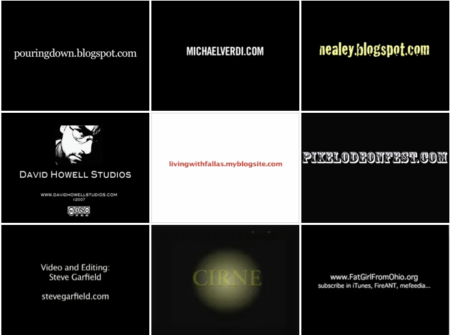
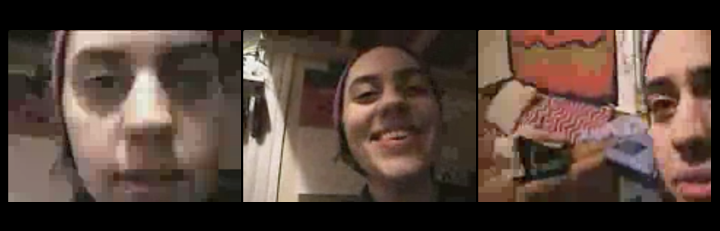
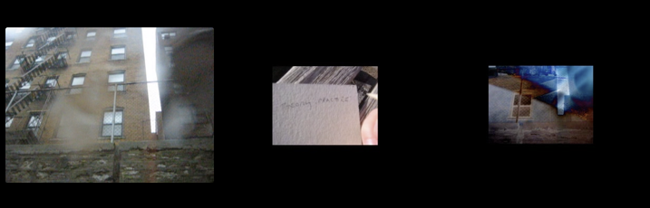
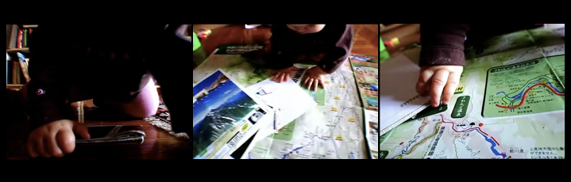
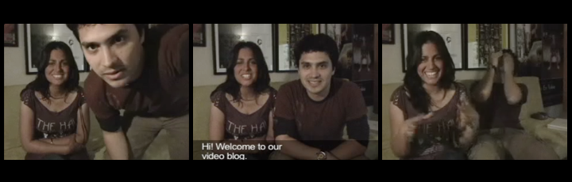
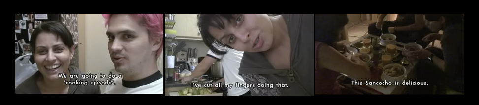

---
Pr-id: MoneyLab
P-id: INC Reader
A-id: 10
Type: article
Book-type: anthology
Anthology item: article
Item-id: unique no.
Article-title: title of the article
Article-status: accepted
Author: name(s) of author(s)
Author-email:   corresponding address
Author-bio:  about the author
Abstract:   short description of the article (100 words)
Keywords:   50 keywords for search and indexing
Rights: CC BY-NC 4.0
...

# 5. Videoblogging as aesthetic form

In this chapter I want to shift registers from the sociotechnical to the
aesthetic. Here I want to explore the experimentation and associated
discourses the videobloggers developed. Videoblogging stood in a complex
relationship to notions of quality, beauty, design and aesthetics more
generally. They were fully aware of the limited affordances of video,
and particularly the digital video form meant certain compromises in
terms of technical image quality and aesthetic. Clearly they could not
begin to approach either professional television or cinematic levels of
quality, but equally they looked with some disdain towards the low
quality, stuttering, blocky video of the flash video format, most
notably used by YouTube. Under the circumstances it was inevitable that
the videoblogger community through their discussions and video-work
would begin to theorise their video-practice and thereby develop a
justificatory language and new aesthetic practice in relation to these
challenges. By signposting links to radical film (Vertov, Astruc etc.)
but also to theorizations of media (particularly McLuhan) they opened a
space within which they created a sense of meaning in relation to their
work. This was pragmatically combined with experiments with video
practice, and with the affordances of what they saw as a new medium. But
videobloggers were always first and foremost makers of video –
demonstrating their ideas on the visual, the medium, narrative, form and
content through their videoblogs. It was never simply about the
audience, products, commercialization or clicks. This aspect of
videoblogging, their sense of distinction, and their commitment to
experimentation through practice are key markers of the videoblog
community at this time.

When the videoblogging community first started making online videos
there was no template for how to do it. Both technically and
aesthetically, the media form was very much open to experimentation, and
there were intense debates on the email list and in their videos about
what – if any – shape it should take and which direction it ought to be
developed. Over time, as the technical problems were ironed out,
solutions were found to things like distribution and consumption of
videoblogs, mainly through RSS clients such as Feedburner and media
players like FireAnt. Technologies began to improve and issues around
storage and bandwidth became easier to manage. Gradually, the aesthetics
developed into what I describe as a digital vernacular, a particular
style of video now strongly associated with web or internet video, in
terms of the size, length, cinematography, tone and editing. Today,
YouTube videos generally have a certain ‘look’ – an aspect ratio of
16:9, playing a video with a resolution of 360p, 480p, 720p or 1080p,
but this has changed over time. Initially, YouTube videos were displayed
at a resolution of 320×240, and in March 2008 this was increased
to 480×360 pixels. In November 2008, YouTube introduced 720p HD support.
The default length for videos uploaded to YouTube was initially set at
10 minutes, although this was increased to 15 minutes in July 2010 and
this could be further increased by uploading from a verified
account.[^06chapter5_1] The production values of YouTube videos are lower than
videos produced for television, utilising handheld cameras and regularly
feature intimate scenes (as opposed to sweeping landscape or shots) with
interiors and people’s faces.[^06chapter5_2] When put together, these elements form
a kind of ‘YouTube vernacular’ – a language through which a YouTube
video can easily be recognised, as opposed to a sitcom, a reality
television show or a documentary.

Videoblogging also developed its own video aesthetic, a distinct style
found in the vast majority of these early internet videos, and still
reflected in much first person user-generated content found online
today. This aesthetic developed over time, through discussion and
arguments, experimentation and failure. Some of the elements were the
result of technical limitations discussed in the previous chapter;
others again were methods to get *around* technical constraints such as
simple scenes and jump cuts. Videoblogs were influenced by other styles
and traditions and owed a great debt to filmmakers and documentary
makers of the past, such as Dziga Vertov, Alexandre Astruc and the
Guerrilla TV movement. Some also quite consciously drew on television
tropes to experiment with intimacy and familiarity using close-ups and
fast moving camera shots.

In this chapter, through an analysis of 30 videos from the videoblog
community, I explore some of the general elements that make up this
videoblogging aesthetic, from title cards to common video shots which
make a repeated appearance in videoblogs, such as faces and hands. I
also analyse in depth the work of three particular videobloggers who
represent different points on the videoblogging spectrum. Their work is
at once very different and distinctive, yet, as my analysis shows, the
resulting aesthetic has something in common with the majority of
videoblogs. By highlighting these commonalities, I hope to draw out and
further explore the videoblogging aesthetic and connect the development
of this videomaking approach to wider issues of technical affordance and
aesthetic experimentation.

I also undertake a close formal analysis of six exemplar videos from
these three videoblogs (approximately thirty minutes of video work). I
seek to trace what the videobloggers did and how they did it. This will
follow a ‘traditional’ film analysis approach, highlighting the use of
techniques such as close-ups, point of view and establishing shots, use
of sound (diegetic, ambient etc.), edits and credits. I combine this
with a medium-specific analysis, specifically drawing attention to the
way in which these formal elements of film production, theory and
analysis are re-framed within the particular practice of videoblogs. For
instance, a long-take in a movie screened at a cinema is different to a
one-take in a video screened in a web browser. By undertaking a formal
analysis I can highlight distinctive elements found within the videos,
in other words, the ways in which the videobloggers experimented with
the medium, or pushed at the boundaries of digital online video. I also
supplement this with interview data and discussions in the videoblogging
community. The aim here is to see how the discourses of early adoption,
experimentation and creative practices are reflected in the videos
themselves.

I specifically seek to draw together what the videobloggers do and what
the videobloggers say they do, to explore the visual aesthetic.
Videoblogging is a context dependent, self-referential cultural form, in
which the videoblogger is at once aware of herself as an early adopter
of a new public media, and at the same time speaking directly to a
particular, identified group of people, perceived to be part of an
invested network. Through a detailed formal analysis connected to the
way in which these issues are framed and discussed, I highlight the
distinctive elements of the videoblog.

The videoblog aesthetic grew directly out of the practices developed in
the community of videobloggers. Through their work, the members of the
videoblogging community experimented with different styles and genres,
and playfully explored a Do-It-Yourself (DIY) or ‘good enough’
aesthetic.[^06chapter5_3] The community shared ideas and methods, from sound and
external microphones to editing, which created what I call the videoblog
vernacular.

Figure 10: Typical credits showing use of URL as branding, note
similarity of form

To start, we might take as an example the title card that most
videobloggers used at the end of their videos (figure 10). This would
often display the URL on the last few frames of the videos; this was
usually done using white type on a black background. The typeface might
vary, but as can be seen from a few screenshots below, the result are
remarkably similar in form and presentation. The title card grew out of
a number of different needs. Firstly, the videobloggers had a strong
sense of ownership of their work, and marking it with a name and a URL
was a way of signing the work off, perhaps like signing a painting.
Secondly, the title card allowed the video to be separated from the
videoblog on which it was hosted. Which meant that if the viewer were
watching using FireAnt, Mefeedia or iTunes, in a long stream of other
videos, they would still be able to identify who the creator was.
Thirdly, the title card acted as a signifier that this was a
*videoblog*, not just an internet video. It signalled that the producer
was part of a community of practitioners following certain technical and
aesthetic conventions.

What is striking is the way in which the form of the title card and how
it was located within the timeline of the video soon became
conventionalised. Through various iterations and experimentations the
use of this method of marking videos enabled at least some sense of
social status, as members of a distinct community around videoblogging,
to be recognised and shared. These social signifiers are important for
identification and help maintain a sense of community, or at least some
shared practices around which social structures begin to cohere. But
just as important is the way in which these practices begin to
crystallize a shared sense of an aesthetic appropriate to the form of
videoblogging.

The videoblogging vernacular is reflected in a set of stylistic and
formal tropes, including narrative decisions and technical equipment,
all contributing to the creation of a particular visual result. This
shares certain commonalities with what Newman calls a DIY aesthetic, a
rather loose concept which he defines as referring to ‘a visual or sound
style, the modest-means quality summed up by the punk myth that all it
takes to start a band is three guitar chords… But DIY can also mean
media made using the new tools, themselves the products of professional
creators, that allow anyone to set up a blog or a Web photo album.’[^06chapter5_4]

The videoblogging vernacular not only refers to how a videoblog *looks*,
but also to the wider practices associated with amateur and
semi-professional production, which includes a ‘shift in taste from an
assumption of professionalism as the norm and standard of quality to a
position that amateurism has equal or even greater value’.[^06chapter5_5] Making do
with whatever equipment was available has a long tradition in amateur
and semi-professional film and video production, as Patricia Zimmerman
showed in her work on amateur film in America’s recent past.[^06chapter5_6] As
such, it is not ‘new’. For example, in the 1970s, the term DIY aesthetic
was used to describe the video-works of Guerrilla Television. However,
the particular constellation of technologies available to these
videobloggers was unique. So in contrast, Guerrilla Television had
access to portable equipment and editing tools, but access to
distribution remained one of their main problems. Whereas Miles argues,
networked distribution is where videoblogging is unique in the history
of film and video and the videobloggers were aware of this in the way in
which they produced the format, but also distributed it.[^06chapter5_7]

The videos selected for this formal analysis were recommended by the
videobloggers themselves as key examples of their work. Due to the time
that has elapsed since the interviews took place, however, some of these
videos, for a variety of reasons, are no longer accessible. As
mentioned, Blip.tv – where most of the videos were hosted – deleted old
videoblogs in October 2013.[^06chapter5_8] Other videos were hosted on a
videoblogger’s personal server, many of whom are no longer making these
files available online. Some have chosen to delete old videos, or have
migrated to new web domains and neglected to move the videos to the new
site. One videoblogger, Raymond M. Kristiansen, told me his website (he
migrated to a Wordpress blog in 2007) got infested with malware, and he
can no longer access any of his own videos. At the time I conducted my
interviews, I downloaded all the videos that were recommended to me.[^06chapter5_9]
Some are encoded in old obsolete codec formats, and will no longer play,
a frustrating aspect of technical media. Those videos uploaded to the
Internet Archive have survived technical upgrades and changes best. It
is interesting that so few of the videos survive, considering the
community consistently emphasised the desire to use videoblogging as a
way of archiving and aiding memory for the future. As Susan Pitman put
it, ‘I am documenting this for my kids to watch when they’re older’.

I chose two videos from each of the three different videobloggers for
the close reading from the categories I identified as personal
videoblogging, everyday life videoblogging and artistic videoblogging.
This was a combined total of 33:47 minutes of video footage. The first
set was two videos by Ryanne Hodson, one of the most prolific
videobloggers at the time and an early adopter of the practice. Hodson
made very personal videos on her blog Ryanedit.blogspot.com, often
filming herself as she was getting out of bed, or as she was travelling,
hanging out with friends or just videos of her expressing her ideas –
often reflections on videoblogging. Hodson worked through a variety of
cameras, from a digital camera with a video function, through to the
Sanyo Xacti. Hodson’s style was deceptively simple, using iMovie to edit
her work. Her videos were always more about what she had to say, than
how they looked. She was an active and generous member of the
videoblogging community whose contributions included the resource site
Freevlog, being instrumental in setting up *Have Money Will Vlog*, an
early community fundraising site, and volunteering at Apple stores
teaching people how to videoblog.

The second set of videoblogs was from Daniel Liss’ site Pouringdown.
Liss’ videos were explorations of the medium of videoblogging through a
singular aesthetic that made his work instantly recognisable. Liss was
not the most active member of the videoblogging community, and would
rarely engage in long discussions on the email list. He did, however,
follow the debates closely and often reacted to people through his
video-work, as can be seen in the video *Theory:Practice*, explored
below. Liss never filmed himself or his family directly, although they
often featured in his work indirectly. He relied heavily on voice-overs
and narration and would experiment with styles, and effects such as
blurring images, long, lingering shots with minimal movement and
editing, but also more rapid cuts and jarring edits that really brought
attention to the aesthetic possibilities of the medium. Finally, the
third set of videos was gathered from Juan Falla’s videoblog, *Viviendo
Con Falla*, following Falla and his wife through their everyday lives as
they settle in to their new lives in Los Angeles, having recently
relocated from Colombia. Falla’s videos were playful explorations of the
cultural differences between Colombia and the USA, and he usually spoke
both English and Spanish in his films. Falla was an aspiring filmmaker,
and he often drew on established tropes and styles in his work, caring
deeply about the editing process and the finished product.

The videobloggers are quite adept at using established cinematic styles
and tropes. There is a diverse mix of styles to be found used in their
work. As the practice developed, some videobloggers invested in more
professional microphones, but the majority recorded diegetic, ambient
sound through the internal microphone of the cameras they used, so
generally, the sound in videoblogging was fairly low quality, but its
rawness added to the vernacular aesthetic. Some voice-overs were
recorded in post-production, resulting in ‘better’ sound quality, yet
neither Daniel Liss or Hodson had these kinds of resources available.
Lighting was usually limited to the natural or artificial light that was
available where and when the videoblogger was shooting, which meant
faces were often ‘badly’ lit –all of which sharpened the aesthetic of
the end product. This aesthetic was increasingly deliberate, as
‘according to its own rhetoric, the new participatory online culture
needs none of the fancy apparatus of the mainstream media to create
something honest and worthwhile, something that communicates citizen to
citizen in an authentic and personal mode of expression. It is better
off as amateur media than it would be with the means available to
professionals’.[^06chapter5_10] Certainly, this was seen in videobloggers’ work
that would rejoice in its alternative and counter-mainstream aesthetic.

Birgit Richard argues that online video, and YouTube in particular,
perpetuates an ‘ideology of authenticity’ linked to the poor-quality
recording tools and subsequent poor resolution images produced. This
aesthetic, together with the small windows displaying videos ‘conspire
to create “a look of everyday life”’ and far from being a ‘substitution
or… an exchange for classic media art’, YouTube videos are a
‘supplement, a marginal but important fresh addition and revitalisation
of art’, with YouTube bringing to light previously invisible practices.
Steyerl likewise conceptualises this in her notion of ‘poor images’ – or
copies in motion – images that travel through culture at an accelerating
speed, and lose quality at every iteration, be it through compression,
remixing or travelling through low quality digital connections. ‘The
poor image is no longer about the real thing’ she argues, ‘instead, it
is about its own real conditions of existence: about swarm circulation,
digital dispersion, fractured and flexible temporalities. It is about
defiance and appropriation just as it is about conformism and
exploitation. In short: it is about reality.’[^06chapter5_11] As Richard argues,
through YouTube, ‘the thus far invisible common creative practices –a
lot of them may have existed before – are becoming more visible and open
up the possibility of emerging new art forms’.[^06chapter5_12] In contrast, Michael
Renov derides this ‘lure of authenticity’ associated with documentary
filmmaking, achieved through a ‘cunning appropriation of particular
tactics or stylistic traits (the use of ‘witnesses’; the low-tech look,
shaky camera; grainy, out-of-focus images)’, pointing out how some
non-fiction also ‘displays a number of ‘fictive elements’ – instances of
style, structure, and expositional strategy that draw on pre-existent
(fictional) constructs or schemata to establish meanings and effects for
audiences’.[^06chapter5_13]

In relation to the videoblogs I examined, but also more informally in
the wider videoblog community, there was a constant push and pull
between a form of grassroots ‘authenticity’ and a desire for
professionalism. Indeed, this would sometimes be observed in a desire
for professional ascription, or that some form of recognition was or
should be made towards their work. This resulted in a creative tension
within the videoblog community as this dual identity, part
pre-professional, part authentic artist, would be manifest in various
ways in their videos. In fact, I would go further and suggest that the
videobloggers identity was in some sense imbricated between two orders
of identity. That this tension was never fully worked out into a new
synthesis reflects on the shortness of the community’s existence, but
also in a challenge to their identity which came from an unexpected
direction – YouTube. As YouTube’s strength and online presence became
increasingly hegemonic, the fledgling videoblog community, which was
very poorly funded in relation to YouTube, struggled. Nonetheless, we
should remember that the aesthetic of videoblogs was largely settled
*before* YouTube emerged, and certainly before its full power was
realised. So if we look at formal aspects of the videos themselves, such
as editing style and technique, a number of recognisable practices
emerged early on.

The editing in videoblogs, for example, tended to be circumscribed. For
instance, one long-take bracketed each end by a title card and credits,
as seen in *Excited* and *V-Blog Conversations*, or feature a number of
quick edits, with cuts as short as 1-2 seconds long, for instance
*Theory:Practice* and *Greetings*. Videobloggers might chose to approach
one video in one way and one in another. For example, ‘one video can be
really simple,’ Juan Falla told me, ‘not a lot of editing, but then the
next one can be heavy-edited and music... in some videos I feel more
like being creative’. Further, the decision about whether a video had a
lot of editing might not be planned from the beginning of the shoot. For
example, after a weekend visiting Sundance, Falla knew he wanted to make
a video about his experiences. It wasn’t until he began editing he
realised what the video would end up looking like, ‘editing it,’ he told
me, ‘I realized that I could tell a story having 10 frame shots only.
And it would all be a crescendo for the last shot.’

For me, this comment really highlights how videoblogging differs from
conventional film-making practices. This open-ended approach of what we
might call elements of ‘found-shooting’ – that is on the fly video taken
in the moment, as life unfolds. I have never come across a videoblogger
story-boarding a video, for example, at most they might map out a very
rough structure. Richard BF liked to experiment with lots of different
styles. One week he would do a ‘slow motion piece, one in B&W… one
upside down, I did one with my camera gaffed to my motorcycle, I did
various character voice overdubs, I faked a few “personal” videoblogs,
short ones, long ones, art pieces with effects etc.’ This playfulness
allowed great freedom and personal risk-taking, which was crucial to the
way videoblogging was articulated and practiced. This experimentation
was not limited to aesthetic choices, but included the technical
specifications as well. For example, Hodson told me ‘you would play with
a number and you go, ‘Ok, oh, Q value. What if I put a 60 in here? Let’s
see what happens. Ok, that didn’t work. Let’s try 70. Let’s see what
happens.’ Until you got something that worked.’ Videoblogging gave her a
sense of creative freedom, not just to experiment but to ‘post whatever
I feel like. It’s my outlet.’ Jennifer Proctor told me ‘I use my site to
experiment with new techniques or ways of seeing or storytelling… it’s a
space that isn’t open to me anywhere else.  It’s kind of a judgment-free
zone for me, where I can make work that finds an audience (albeit a
small one) but is totally experimental and not necessarily polished. 
It’s a space where I can express myself and connect with others, however
imperfectly, and I love that.  It’s very liberating.’ This creativity
and space of experimentation also enabled different kinds of gender
representation to play out. Without the stifling weight of ‘traditional’
formats, and a sense of openness towards what a videblog could be, both
in terms of form and content, meant that, particularly for the women
videobloggers, there was no ‘wrong way’ to articulate their experiences,
affect or arguments. Of course, previous media forms can and did
influence the work produced, for example, film, television and video,
but there was seldom an attempt to close down experimentation because it
didn’t conform to a ‘norm’ established in or through any prior media.

Most informants told me they spent more time on editing than on
shooting, this aspect of the practice was important to them. For a
videoblogger, editing was highly valued and formed an important part of
how they identified the ‘craft’ of videoblogging. They felt a strong
sense of ownership over their content, and in this respect, editing, the
shaping of the image, the creation of narrative and affect, was central.
The ‘power’ to create something unique, to manipulate images and sound
to create new stories, clearly held a certain appeal; ‘in editing, it’s
only me and nobody else. I love this. I love how from different shots, I
end up with something people never imagined,’ Juan told me. This
emphasis on the importance of the editing process is perhaps best
summarised by Richard Hall, who told me that ‘editing is like meditation
– I’m in a different world,’ often spending 4-5 hours editing a video,
which ended up being no more than 3-4 minutes long. Falla, equally,
highlighted the importance of editing to the videoblogger, saying ‘I
like to edit a lot. So I take my time. The fastest edit I ever did was
like 4 hours. But in other more complicated videos I have spent probably
6 hours per day for 5 days. But that’s because I love editing.’
Similarly, Charlene Rule told me ‘I find shooting to be the most
difficult, but again, once I force myself to start, then I’m excited to
start editing.’

For Bordwell, the framing of an image shows the ‘conscious processes of
the film-maker’ and he argues that ‘whatever its shape, the frame makes
the image finite. The film image is bounded, limited. From an implicitly
continuous world, the frame selects a sleeve to show us, leaving the
rest of the space off-screen.’[^06chapter5_14] In contrast, there is a notable
absence of particular standard cinematic tropes such as the establishing
shot in videoblogging. An establishing shot is intended to give the
viewer a full overview of a scene before the action kicks off,
establishing boundaries of action and meaning. In some ways, it is one
of the main tools used by a director to frame a scene, both symbolically
and materially.[^06chapter5_15] These alternative and unconventional practices
within videoblogging more generally – even for those self-categorising
as makers of documentaries – is significant. Movie director Joe
Swanberg, who has adopted many ‘internet video’ elements in his work,
and makes movies that operate similarly to some videobloggers
(shoe-string budgets, digital cameras, heavily influenced by YouTube and
web video), argues the reason he almost never uses the establishing shot
is because ‘I don’t want you to know where people are because it’s not
important… I like working extremely close because it’s all about that
moment. When I photograph a body part – a hand or foot – this is what I
care about. The little things – tiny details separated from their
circumstances.’[^06chapter5_16] This wider mainstreaming of the aesthetic practices
of videobloggers is something that emerged later but nonetheless showed
the creative potentials of these communities.[^06chapter5_17]

In videoblogging, consequently, there was a move away from the
establishing shot and instead the focus on ‘tiny details’ such as
close-ups of objects; coffee machines (as in Erin Nealey’s *Mornings*),
hands (Charlene Rule’s *Mod,* Daniel Liss’ *Prototyping*), and faces
(Ryanne Hodson’s *V-blog Conversations*, Daniel Liss’ *Requiem* and
Charlene Rule’s *Bump*). Mary Matthews told me that when filming others
she focuses on the ‘face, eyes, hands. The parts of them that are truly
them’. She never elaborated on why these particular parts were ‘truly
them’ but it echoes the notion of partial objects and *faciality* from
Deleuze and Guattari. As they argue, the face can be read as a language
and ‘the close-up in film treats the face primarily as a landscape; that
is the definition of film, black hole and white wall, screen and
camera’.[^06chapter5_18] As such, the face gains an elevated position within film
theory and acts as a ‘veritable megaphone’. Raymond told me,

> I film myself, mostly… the face, the talking. The conversation… face,
> head… I don’t really see my body as the key of this either. The only
> reason why I show my body is that it is the carrier of my face, and
> even though I show my face a LOT less than I used to, I still see the
> face as being important for the kind of communication I want in my
> videos.

The emphasis on the face was repeated by a number videobloggers. It can
also be found across YouTube,[^06chapter5_19] where numerous videoblogs show
footage of people talking, singing, arguing and laughing into the
camera.[^06chapter5_20]

This idea that the face plays a vital part in communication is
interestingly developed in film theory. For example, Christian argues
that ‘pushing the camera against the face forces the viewer to
contemplate the character’s interiority and story expressed through the
screen; it defines the film as a mediated, intimate space first, and
eventually as a space where something ‘real’ is possibly but improbably
achievable’.[^06chapter5_21] Swedish auteur, Ingmar Bergman famously explored the
subtleties of the face through his uncomfortably close shots of Ingrid
Bergman and Bibi Anderson’s faces in *Persona.* In a more recent
example, Pablo Larrain’s intimate portrayal of Jaqueline Kennedy in the
movie *Jackie*, features similar relentless focus on Natalie Portman’s
face and hands. This mediation of some kind of ‘real’ is also central to
the videoblogging aesthetic, and also to their discourse. Of course,
this claim to the real, or to realism, is itself problematic, and even
those videobloggers who ‘love it’, are still reflexive about that fact
that what you see is mediated, or somehow manipulated.

There are also technical reasons why the face dominated the
videoblogging aesthetic. For example, Juan Falla moved between technical
and symbolic reasonings for focusing on the face in videoblogs, thus
performing a kind of medium analysis of his own work. He began by giving
a symbolic reasoning for his ‘directorial choices’ telling me that he
focuses mainly ‘on the face. That’s how people watching the video
"connect" with it. Because as a viewer we feel compelled and we can
understand and accept (or deny) a person’s reaction. And the best way is
either by an action of the person, like in a movie; or by the person’s
face.’ Falla then moves on to discussing how the medium of videoblogging
(though he is really discussing QuickTime here) lends itself to a facial
close-up ‘in order to connect’ with other people. ‘We have to understand
that videoblogs are 320 x 240, or in our case 480x 280, and *that* is a
small screen, so the closer we are to someone’s face, the better we can
understand and connect with her/him.’ Here we can see how the
materiality of videoblogging has a structuring influence on the visual
it produces, reminiscent of Marshall McLuhan’s ideas about close-ups as
specific to the medium of television. Falla also points to other
material affordances of videoblogging, positioning the practice within a
wider cultural frame. He told me that,

> I primarily show the face… because I only have the microphone of the
> camera, so the closer I am to the person talking, the better sound I
> get. Another thing is that I love the typical videoblog shot. The one
> where you shoot yourself holding the camera with your own hand. I
> think part of the magic of videoblogs is this particular shot. I mean,
> we have medium shots in CNN or BBC News, right? We also have all these
> incredible shots in the movies where the camera even flies around in a
> spectacular shot. In videoblogs, we have the camera in ‘a person’s
> face’, and this is way more personal.

The face in videoblogs has grown to represent a kind of realism, or
truth, and some kind of personal connection. However, it is not
necessarily the face itself as captured by the videoblogger that
suggests an unmediated or authentic record of the event but the fact
that the recording exists at an arm’s length. Indeed, if we imagine a
person holding up their mobile phone in front of them to take a ‘selfie’
or a snapshot, this makes more sense.

Some videobloggers, made a conscious decision never to show their own
faces in their videoblogs. Mica Scalin told me that in her work, ‘faces
are often secondary because they almost distract too much or allow
people to make too quick judgements’. Brittany Shoot told me she didn’t
‘want to talk to my camera anymore, and I also am not really convinced
that’s effective.  In the sense of putting myself into the video in
heart, yes, they are personal.  But do I show my face as much, talk
about my life, how I feel?  No.  I let people draw assumptions from
whatever I make’. Shoot talked at length about how she ‘used to show
emotion when I talked to the camera, but it backfired when I got too
angry on film’, and this affected her relationship with the
videoblogging community. Equally, Daniel Liss never showed his face in
his videos. Liss and Shoot’s positions echoes Patricia Lange’s notion of
a ‘privately public’ videoblogger. [^06chapter5_22] Lange argues that despite
having a group of followers/subscribers/fans/friends, some
videobloggers, particularly those she calls ‘privately public’
videobloggers, are fiercely protective of their friends and family. For
Shoot, her honesty on film left her vulnerable to personal attacks –
perhaps not surprising to anyone following the debates surrounding
Gamergate and more recent ‘hashtag events’ like \#metoo and \#notokay –
detailing the kinds of abuse, sexual and otherwise, women experience,
especially on digital media. In Liss’ case, his daughter, who featured
quite heavily in his videos, was only ever referred to as ‘Mookie’ and
her face is never fully shown in his work. Liss himself only ever
revealed snippets about his own identity in his videos, beyond the fact
he is male and lives in New York. Hiding became a way of squaring the
contradiction of living a private life in a public medium. I think this
dichotomy between the ‘real’ represented by an ‘arms-length’ selfie
video, and the desire by some videobloggers to withhold their faces is
interesting in thinking about what a videoblog is. We might term these
different approaches ‘selfie-real’ versus ‘talking-real’ to bring out
the different ways in which the documentary-mode, which was often
gestured towards through the aesthetic and practice, was presented. This
idea of the face as real as opposed to the voice as real (as in the
voice-over) is offered to explore and highlight different ways of
thinking about what the practice of videoblogging brought forward or
foregrounded in its practice. Nonetheless, the ‘selfie-real’ certainly
emphasised a stronger dimension, or representation, of the personal.

Now I want to change register to consider close readings of a number of
videoblogs, starting with what I term ‘personal videoblogs’. The aim
here is to give a stronger sense of the way in which different
videobloggers might work in a specific mode whilst nonetheless
conforming to the general principles of the videoblogging aesthetic. In
this case, a personal mode was reflected in the content of the
videoblog, but also in specific moments in the form of the videos. This
section will explore Ryanne Hodson’s videoblog. Hodson started
videoblogging in November 2004 and was one of the most active
videobloggers in the core community. She had been working as a video
editor at WGBH, a virtual channel part of a PBS television station in
Boston when she started feeling disillusioned with the constrains under
which she worked. She saw videoblogging as a medium that would allow
ordinary people to transform themselves from media consumers to media
producers. She self-defined as a ‘personal videoblogger’ documenting her
everyday life, and had a number of ‘talking head’ videos in which she
mostly speaks to the camera from her room in her apartment in New York.
She was heavily involved in promoting videoblogging, including
co-writing a book on videoblogging, speaking at conferences, organising
workshops and running freevlog.org.[^06chapter5_23] Hodson had a natural way of
being on camera. She was at ease with both herself and her audience,
creating a sense of intimacy with the viewer as she invited them into
her life. Her enthusiasm for videoblogging was also palpable in her
work. For instance, she would sometimes turn the camera on upon waking
up in the morning, giving a long, rambling monologue about a subject she
was passionate about with sleepy eyes and messy hair. This made her
videos compelling. What she had to ‘say’ was the focus of her posts, and
she was never short of an opinion, controversial or otherwise. One of
her first videos, *Excited* (00:50 min, 240x180) was the first video in
which Hodson turned the camera on herself. Her previous work had
featured her mother and time-lapse videos from Boston. After turning the
camera on her own face, manifesting what I am calling ‘selfie-realism,’
we might say Hodson found her ‘thing’ and she also found her audience.

In *Excited*, Hodson started creating her particular style of
videoblogging, which she develops further in *V-Blog Conversation*
(03:32 min, 160x120). The videos use the selfie-realism videoblogging
head shot, the talking head, which Hodson also highlighted as one of her
most used devices. ‘\[I film\] the face mostly, talking head, talking at
ya!’ In *Excited*, her face fills almost the entire screen (figure 11),
which is framed slightly off centre and slightly blurred. She is often
poorly lit, in fact, it looks as if her face is being lit by the light
emanating from her computer or laptop, which means she either filmed
this video using the recording video function in iMovie, on a webcam or
on a digital camera with video function perched on the desk in front of
her. Later, Hodson would go on to use the new Xacti camera for most of
her videos, but until the Xacti was launched (in January 2006), she
relied on one of these three methods of filming. With the move to the
Xacti, the quality of the image improved dramatically, but her style
remained similar. Hodson’s first mention of the Xacti is in 2006 (on the
videoblogging list, where she posted a review). Like many videobloggers,
using the video function on a digital camera was their preferred method
of capturing film, and Hodson soon moved to use this technique.

Figure 11: *Excited* (Hodson, 2004)

In *V-Blog Conversations*, it is clear that she is holding the camera in
her hand. The shot isn’t nearly as steady as in *Excited*, and it moves
around as she does. In their book, Hodson and Verdi call this the
‘classic ‘talking to the camera’ videoblogger shot’. Dedman and Paul
also refer to as the ‘classic videoblogger shot’[^06chapter5_24] and Will Luers
describes it as ‘the most pervasive vlogging camera position… the
arm-extended, camera-turned-on-oneself method of address’.[^06chapter5_25] I prefer
the term ‘selfie-realism’ which more strongly brings out the
connotations of the real and the personal that this technique
foregrounds. At one point in her video, Hodson also pans it around the
room to show where she lives. Again, the lighting is poor, this time her
face is half-lit by what looks like a light source off-screen to the
left, which means half of her face is hidden in shadows for most of the
duration of the video.

Figure 12: *V-blog Conversation* (Hodson, 2004)

Hodson’s face fills the screen in a close-up and only towards the end,
when she is showing the viewer her room, does the camera pan away from
her face (figure 12). The framing of her face echoes the way our faces
are framed in Skype chats or other kinds of instant video-communication.
In other words, the look of the videoblog is reflected in its content,
and Hodson is chatting, literally, to whoever wants to listen. As she
says in the video,

> Hello… hello videobloggers. Um, I… just watched Jay’s video of him
> sitting with like a purple curtain behind him, talking, um, and
> saying, wait, why shouldn’t I just type this, it’s a blog, so
> \[laughs\] I was inspired to just sit in front of my camera and talk
> about videoblogging, because, um, I am so excited about it.[^06chapter5_26]

She goes on to describe some of the things she loves about
videoblogging, which are linked to the kinds of intimate relationships
the medium is facilitating with a new audience,

> On the Internet, you just make it. And you post it. And people laugh.
> In California. \[smiles\] And they write you and they say ‘oh my god,
> I laughed so hard when I saw that’ \[laughs with entire face\] It’s so
> great! It’s just the best thing…. you know, the internet, it’s a five
> minute thing I want to do, ok I’m gonna do it and people can watch it
> and I feel great, oh my god, that’s the best thing in the world. So,
> it’s 3 am, right now, and I just played poker all night, and I
> couldn’t get to sleep, cos I just saw Jay’s video and I was like I’m
> totally going to get my camera and talk to people.[^06chapter5_27]

Both *Excited* and *V-Blog Conversations* are notable for being filmed
in one take, they have no cuts or edits in the main body of the video,
which is a common trait in this particular type of videoblog; the
personal, confessional, diary-style videoblog. This is for two reasons.
Firstly, from a purely technical perspective, having long single-take
video makes the production process much quicker and easier; the
videoblogger simply adds a title card at the beginning and credits at
the end, before compressing and uploading. Secondly, it creates a sense
of intimacy and realism. By showing herself in one take, Hodson gives
the viewer the impression that she is ‘able to put \[herself\] out there
and be so vulnerable with people’ – rather than present an edited
version of herself. This echoes André Bazin’s notion that ‘cinema is
objectivity in time’.[^06chapter5_28] Bazin argued for the ‘use of long, continuous
shots in order to preserve spatial and temporal continuity’ and believed
that ‘editing serves to falsify reality by breaking up space and
time’.[^06chapter5_29] Bazin also argued that the screen is ‘putting us ‘in the
presence of’ the actor. It does so,’ he claimed, ‘in the same way as a
mirror – one must agree that the mirror relays the presence of the
person reflected in it – but it is a mirror with a delayed reflection,
the tin foil of which retains the image’.[^06chapter5_30] Similarly, in an online
setting, these kinds of long, or one-take videos are part of creating an
air of authenticity surrounding the videoblogger. Her success is related
to her ability to communicate her sincerity to her viewers. As
Vanderbeeken points out, ‘what is special about web video documents is
that their credibility depends on the viewer’s willingness to accept
their authenticity, as there is no guarantee that they are not staged or
manipulated’[^06chapter5_31]. Clearly, the selfie-real forms of video are as open
to manipulation as other mediated forms. But nonetheless, it still seems
to contain a kind of aura of realism.

Interestingly, when Hodson started working with Jay Dedman on the
project *Ryan is Hungry*, a funded web series about sustainable living
and ecological farming, their videos were much ‘snappier’ – featuring
sharp edits, professional-looking logos and following much more
traditional documentary-style tropes (interviews, commentary,
narrative). The personal videoblog, then, was, for Hodson at least, a
personal space in which she could narrate stories from her own life and
share experiences with her other vlogger friends, ‘this has been the
greatest gift of videoblogging. Having people say ‘me too!’ Isn’t that
what we’re all looking for? I think so’. She also filmed inside her own
bedroom, inviting the viewer into her private sphere, even giving the
viewer a tour of her personal space highlighting the sense of intimacy.

In her work, Hodson also explores the idea of videoblogging as a new
platform for expression and free speech, a medium in which videobloggers
express themselves – ‘I am so excited about videoblogging. Because I can
say whatever I want and the FCC can’t do [BLEEP]’. This freedom of
expression, both artistic and political, was very important to her;
‘it’s like complete freedom, I post whatever I feel like. It’s like an
open diary to the world.’ At the time, Hodson was working in television,
and was frustrated with how making content was laborious, expensive and
censored. In her interview she said her videoblog is ‘something really
different than TV’. However, it is very clear from her video that Hodson
is also censoring herself, choosing to bleep out not only her swear
words, but even the surname of George W. Bush, whom she clearly
dislikes,

> Hodson: Hmm. *Looks away from camera as if she is thinking what to say
> next. Faces camera* BLEEP you, George W BLEEP BLEEP BLEEP BLEEP
> \[mouths ‘Bush, you fucking asshole’\]. You BLEEP \[mouths
> ‘suck’\].[^06chapter5_32]

In other words, there is a tension in Hodson’s video between the
perceived potential for artistic and political freedom, and the
self-censorship of bleeping out ‘bad words’ as if she is on a public
network channel. This could be seen in contrast to her video *V-Blog
Conversation*, in which she speaks much more frankly to a much more
specific audience, even referring to other videobloggers by name. She
mentions particular videobloggers in other videos too, an example of how
the videoboggers were creating a sense of community; referencing each
other’s work, commenting and engaging one another in conversations
across videos and across videoblogs. *V-Blog Conversation* was only
posted a month after *Excited*, but the tone and style had changed quite
dramatically. In *Excited*, Hodson was creating a fairly stylised piece
– the tone, tempo and combination of words, image and music work
together to form a polished piece. In *V-Blog Conversation*, however,
she is notably more relaxed and you get a sense that she is talking
directly at a specific audience. I believe this is a testament to how
quickly the community was forming at the time as Hodson had shifted from
addressing a generic (and unknown) audience to speaking directly to a
network of people she knew (probably by name) and felt part of, from
small imagined audience to a small but intensive real community. These
videos have roughly the same amount of comments (10 comments on *V-Blog
Conversation* versus 9 comments for *Excited*), but as Hodson starts to
learn not just that people *are* watching, but *who* are watching, her
tone changes, and her style becomes more conversational and less of a
performance.

Stylistically, *Excited* feels entirely self-contained; it has a clear
narrative arc, and, although it shares a theme with many of Hodson’s
other videos (the theme being videoblogging itself), it can be seen as a
stand-alone video that can be viewed in isolation and still make sense.
*V-Blog Conversation*, on the other hand, lacks the visual clues of a
narrative arc, there’s no title card, no credits, and, although she
starts with ‘hello’ and ends on ‘goodnight’, there is no real narrative
progression. *Excited* is clearly scripted, whereas *V-Blog
Conversation* feels like a complete improvisation, she saw a video
online she really liked, she was inspired to join the conversation and
she just started talking. The transcript reveals a kind of
stream-of-consciousness in which Ryanne is seemingly just talking to
herself or the audience, about whatever pops into her mind at any given
moment. In this sense, despite looking quite similar*,* the two videos
are in fact quite different. They also show that for a lot of
videobloggers at this time, videoblogging was very much about
experimenting, not just technically, but in terms of genre, style,
technique and ‘finding a voice’.

In contrast to personal videoblogs, I now want to turn to look at what I
am calling artistic videoblogging. These videoblogs, I loosely group due
to their focus on aesthetic practice in terms of both form and content,
I am particularly interested in the way in which the videoblog is
treated as a medium of expression, but not in the sense of the
selfie-realism I referred to earlier. In contrast, here the explorations
tend to be in terms of representational tropes, visual effects, montage
and collage and it is interesting to look at the work of Daniel Liss,
whose artistic practice and video work creates a critical case study of
the artistic videoblog.

Daniel Liss lived in New York with his wife and daughter when he
discovered videoblogging. Whilst home with his new-born child, and as an
outlet for his creative impulses, videoblogging became a way to explore
the city around him. Liss self-defined his practice as ‘experimental
personal film(?)making’ \[sic\]. When asked if his videos had any kind
of narrative, he was quite clear that he does not create ‘any linear
stories. But visual stories. Textural stories. Tone poems’. His work
explores a number of potentialities for videoblogging; *Theory:
Practice* explores the much-debated question of what videblogging *is*,
whereas *World Maps* is a video playing with the idea of videoblogging
as a medium for exploring concepts and ideas. The videos can be seen as
a reflection of Liss’ own practice, as well as a commentary on
videoblogging more generally.

*Theory: Practice* is a visual polemic, just short of 4 minutes long, in
which Daniel Liss presents his contribution to the community debate
around what a videoblog. For him, the video is an attempt to distance
himself from those in the community who had a tendency to lock down any
debate around definitions, demarcate and control a specific definition
of videoblogging that everyone should adhere to. As he told me, looking
back;

> I remember being (disproportionately?) incensed by a segment of the
> dialogue happening \[on the videoblogging email list\]. Specifically
> this: I felt that we were like a bloodthirsty horde marauding happily
> across the plains (what were we bloodthirsty for? maybe every
> perceived revolution is bloodthirsty?) and then suddenly some in our
> group: maybe some stragglers, or self-appointed generals even, were
> saying Guys Guys, you’re not marauding right! That’s not proper
> marauding! THIS is proper marauding. There were suddenly rules about
> which chunk of online video was eligible, and which wasn’t. And I was
> riled up. And that specific video, *theory : practice*, was certainly
> a response to that.

*Theory: Practice* (3:54 min, 400x300) is a tone poem on the
relationship between the city, art and practice. The video features
footage from New York; an apartment block filmed through the window of a
car and, later, the botanical gardens, interspersed with close-ups of
objects that drive the story; scraps of paper, a mechanical pen, a
baby’s hand, and views of objects through windows (figure 13). Liss’
voice-over is used in conjunction with the images. *World Maps* (03:38
min, 400x300) is a reflection on the capriciousness of memory and is
structured much in the same way, hand-held footage of a baby exploring
maps, books and other travel memorabilia set to Liss’ self-composed
music and voice. Here, however, the narrative is more linear than in
*Theory: Practice* – as the video progresses, the objects become more
and more scattered, and the baby is more and more intimate with them,
putting them in her mouth, touching, feeling. The voice-over in *World
Maps* follows a narrative path, whereas in contrast, the footage and
narrative in *Theory: Practice* is cut in a non-linear way.

Figure 13: *Theory:
Practice* (Liss, 2004)

In contrast to Ryanne’s videos, Liss never makes talking-head
videos,[^06chapter5_33] something he discusses in *Theory: Practice*, saying he
doesn’t ‘point the camera at myself and explain’ what is going on in his
videos. ‘It’s probably shyness but I think it’s something more than
that. I don’t see the world that way and I don’t tend to listen that
well when information approaches head on.’

Instead of selfie-realism, Liss uses the point-of-view shot as his main
form of expression. Always looking out at the world from his eye level
and almost always hand-held, the camera, which ‘roams freely’, acts like
an extension of his eye, seeing the world as he sees it. Like Dziga
Vertov’s *kino-eye*, or Alexandre Astruc’s idea of the *camera stylo*,
Liss writes his story through images, matching words and images, cuts
and words, visual movement with rhetorical movement. In *World Maps*
this is evident, as the camera pans around at floor level, panning
around the baby, as she is experiencing the map, zooming in and out to
focus on her hands, then feet, and finally a full shot of her as she is
sitting on the map (see figure 14).

Figure 14: *World Maps* (Liss, 2004)

By situating the camera in the middle of the action, the viewer feels
part of the story as it unfolds. Like hand-held camera footage from a
concert or a demonstration, where the camera travels between bodies, the
present-ness of Liss’ camera connects the viewer to the world he’s
creating. The effect is twofold. Firstly, as the camera is situated
literally in the action, the viewer feels quite close to it. Secondly,
the hand-held camera is close to the floor and not able to capture a
perfect image at all times, and so the quality of the image is variable,
in and out of focus. This acts as a reflection on the limitations of
memory – as the baby is discovering memorabilia from past travels, Liss
is also remembering them, but poorly, as a faint (blurred) memory.

In *Theory: Practice,* similar blurred images and ‘half-captured’ scenes
– objects seen through car windows obscured by rain drops – contributes
to Liss’ theory of videoblogging, an art form which he argues isn’t
*supposed* to be perfect. Campanelli calls these artifacts ‘disturbed
aesthetic experiences’ and presents the hypotheses that ‘the use of
digital tools in relation to cinema, and the consequent lowering of
product quality, are not necessarily a consequence of the small budgets
of young independent directors. Rather… we are in the midst of a new
aesthetic positioning – one which, as usual, is picked up by the
antennae of artists before becoming obvious to all… these are all
conscious aesthetic choices, which have nothing to do with finances
available to the production’.[^06chapter5_34]

This can be seen as a deliberate stylistic choice, as much as a result
of the constraints on the videoblogger due to equipment and bandwidth,
especially in the case of *Theory: Practice*. As well as bringing the
viewer closer to the action, creating a sense of intimacy, Liss is
making the point that this is videoblogging as he sees it, because this
is how he sees the world; ‘I am showing you a part of my world and
telling you a little something about it…. This is my world. This is how
I see it, how I think it’*.* As Newman argues, ‘rare is the videoblog
that has anything resembling the look or sound of a local news program
or network sitcom. Just as punk is opposed to the polish of pop, Web
video is opposed to the gloss and sheen of Hollywood entertainment. That
sense of opposition is the spirit and ethos of DIY production whether in
music, publishing, or audio-visual media. As Frank describes it,
videoblogging is "a cheap and fast alternative to making media — that
looks cheap and fast"’.[^06chapter5_35]

Throughout his work, Liss plays with form and narrative. He skips back
and forth in time, for example, a sheet of paper is initially shown with
writing, scribbles all over it, and later in the video the same sheet of
paper is shown blank. Sometimes he displays the same image repeatedly.
For example, the image of the New York building is shown twice before he
uses it a third time with an inverted image of a hand layered over it.
He manipulates the image by using double exposure on the images of the
hand and the building, to highlight the mediated nature of videoblogs,
pointing out that even when someone simply shoots-and-posts, their videos
are still mediated. ‘To pretend that’s something unmediated in itself is
I think a little naïve’, he explains. He also manipulates the sound,
bringing in music at dramatic moments in the narrative, to create
emotional effect often in conjunction with sharp cuts or swift camera
movement.

Like Ryanne Hodson, Liss speaks directly to the viewer, although his
style is very different. Whereas Hodson is talking to the viewer,
sitting down in front of and facing the camera and speaking into it in a
conversational tone, Liss’ interactions are more subtle. Here, I am not
thinking of the way he communicates through sound and image, rather by
the way in which he occasionally comments ‘I vlog it for you’ or ‘I
wanted to bring you something’ and, at the end of *World Maps*; ‘I never
thought of the possibility of someone else going through it, not the
baby leafing backwards through her dads adventures. And not you.’ I
asked Liss about his particular use of ‘you’ in his videos. He replied,
‘if I had to speculate – and really why do you make the choices you make
artistically? – I’d say that there is/was a somewhat heartening
immediacy to it all, an inexorable feeling of conversation, a presumed
someone looking back at you. And maybe at the best of times an intimacy
to the proceedings. And so you address it directly’. This notion of an
‘imagined community’ of others to whom one speaks is a fascinating
aspect of the videoblogging form. Even in notionally subjectless,
perhaps aesthetic oriented work, there remains the perceived or imagined
other to whom one addresses the work. Not as an audience, but rather as
a colleague, an equal, a member of one’s community.

Looking through his archives, I noted that initially, Liss’ videos were
cut with sound, image and text only, very little narration, but that at
some point he started talking directly to the viewer. I asked him why
this was. ‘I remember being somewhat dismayed by this at points,’ he
told me ‘people responded much more... if I spoke in my videos. Like,
they weren’t my favourites but they were relative crowd pleasers (where
crowd equals something like 30 visitors)’. In other words, Liss started
adding more voice-over narrations because his viewers seemed to respond.
The feedback from the community – the recognition from the invested
network perhaps – was important to the videobloggers, even to someone
focussing on or trying to create a different aesthetic.

Pettman argues that in the age of digital sound, ‘the subject is
increasingly vulnerable to being lost in an aural version of Fredric
Jameson’s Bonaventure Hotel. The cues for recognizing individuality via
the ear become something other than the timbre of the voice: the melody,
the beat, or a catch phrase, for instance’.[^06chapter5_36] Liss’ voice certainly
contains some of these qualities. Contrary to the visuality of his
videos ‘images are *out there*, on the screen, and framed by it’, the
sonic - and particularly his voice – ‘does not appear to stand before us
but rather to come to us or at us’.[^06chapter5_37] His narration is melodic and
rhythmic, clearly scripted, and yet, because it is repeated over the
narrative arc of his entire body of work, becomes synonymous with the
videoblog itself. I would probably not recognise Liss if I walked past
him on the street, but I would have no trouble picking his voice out.
His voice is part of what makes his videoblogs unique, which emphasises
that videoblogs are not just visual objects, but aural.

Newman argues that videoblogging ‘might usefully be considered as
self-taught art, a term art historians use to refer to artworks by
individuals “who have no academic artistic training and little
connection to the mainstream traditions of Western art history.”’ The
self-taught artist is someone who lacks the skills considered the
standard within a particular art world and ‘connotes an absence of rules
for the artist to follow, a lack of familiarity with ‘proper’ ways of
solving certain aesthetic problems.’[^06chapter5_38] Although he had no formal
training, Liss was clearly familiar with both cinematic rules and how to
apply them to develop his work and increase viewership. For example, at
the end of *Theory: Practice*, Liss uses denouement to conclude his
polemical defence of his right to videoblog expression. A denouement is
defined as either the final scenes after the dramatic climax of a story,
where the author/film maker ties up all the lose ends or the brief
period of calm at the end of a film where a state of equilibrium
returns. As the music gets louder, the video cuts back to the park
scene, and zooms in on the piece of cardboard, now shown to be filled
with tiny scribbles. ‘While the baby was out,’ he narrates, as if to
summarize, ‘I filled first the cardboard and now this wrapper with these
scribbles, it’s all in here.’ Then,

> \[*Cut to park bench, with (white) wrapper and cardboard, both filled
> with writing*\] Voice-over: But let me show you one last thing, and I
> feel a lot better already doing this. \[*Camera pans to baby, who is
> smiling*, *Cut to image of spring flowers peeking up through the
> grass*\] Voice-over: Here in the garden, there’s the first sign of the
> spring thaw. \[*Cut to black screen*\]*.*[^06chapter5_39]

By returning to the park scene, where his theorizing about videoblogging
began, Liss captures a glimpse of the baby, now awake, who is smiling,
reminding us that ‘naptime’ is when Liss gets most of his videoblogging
done. Showing us the ‘first sign of spring’, Liss shows the viewer his
life, symbolic both of the aesthetic aspect of his videoblogging
practice, and a reminder that videoblogging can be a crystallisation of
a collection of scattered moments.

With the last videos, I want to spend some time exploring the notion of
what I call everyday life videoblogging. In contrast to the previous
forms of videoblogs, in this section I want to examine videoblogs that
celebrate and document the everyday, the commonplace and the quotidian.
This form of videoblog tends towards the documentary, toward the
exploration with the camera as the ‘eye’ and in the recording of the
quiet and transient moments of life as lived experience. Again, I
attempt to explore this type of videoblog through a set of exemplar
videos, which I subject to a close reading.

The spectacle of the everyday and the intimate view of private life has
always been of interest to the film and television industries, ‘what is
different about videoblogs (or vlogs) is the spectacle of the
un-commodified everyday’.[^06chapter5_40] Although there are examples of videoblogs
attempting to monetise their practice, there is something new about
videoblogging in that it exists within a social context that is not
explicitly consumerist. Luers recognises that although the technologies
available to the videobloggers (be it ‘RSS feeds, video compression
codecs, and tagging systems’) can be seen as technical extension of
advertising strategies, aimed at allowing the videoblogger maximum
exposure and reach of her videoblogs, ‘rather than compete for attention
in the marketplace, most vloggers look to their peers for feedback and
conversation. For perhaps the first time, we have a somewhat organized
public arena for a cinema without show business’. It might be argued
that people videoblog to make their life cinematic, prompting the
question of why dramatic conflict is a necessary filter for
understanding the stories we occupy in our everyday? Further, he asks
what we are missing in our private lives that can be rediscovered and
shared with others through the medium of video. For Luers, it is the
idea of living cinematically that lies at the heart of videoblogging, a
need to aestheticise the everyday through the process of framing,
editing and (re)-presenting the personal. Digital production tools and
online distribution systems make us into a kind of global citizen with
new forms of visual vocabulary and grammar. But as an example of a
nascent global cinema culture, videoblogging has been part of
rediscovering a collective value in the local and the personal. Not the
bland universals offered by the entertainment industries, but the depth
and texture of everyday experience. But unlike personal videoblogs, here
what I am calling everyday life videoblogs eschew the single take shot
dominated by selfie-realism, and instead use cuts and other techniques
to change the experience of watching dramatically.

To explore these ideas I look at the videoblogs of Juan Falla and his
wife Ximena, who made videoblogs because they wanted to stay in touch
with friends and family.[^06chapter5_41] Falla described his videoblog as a
reality show of their life in Los Angeles. Originally from Colombia,
Falla told me they ‘wanted to show \[their\] families how \[their\] life
is \[in LA\]… So we began shooting our selves doing normal things like,
going to the grocery store, going to the beach, in our apartment
cooking, if we made a trip we would shoot it, etc.’ Stylistically,
Falla’s videos draw on televisual aesthetics, rooted in the visual style
of situation comedy. Mainly featuring himself and Ximena, Falla’s videos
are on average between 4 and 5 minutes long, and have relatively high
production values especially when seen in comparison to some of the
earlier videoblogging videos (like Ryanne Hodson). Falla told me he
‘want\[ed\] each video to feel ‘real’. Just as ‘real life’ is. This
meant he made a deliberate choice to, for instance, not use any effects
on the image, filters etc., and keep transitions to a minimum; ‘from the
moment we decided to make our videoblog, we decided that we wanted each
video to be entertaining, to have a beginning, middle and end. So we
edit and add music to each video. This way, it’s exciting, and not
boring’. Falla attempted to edit and add music to make it more
‘enjoyable’. He told me ‘nobody wants to see “boring moments”, not even
our own family (not even me!), so I edit out those boring moments…
instead of having a half hour video, we have a 3 or 5 minute “really
nice video”’. Here, it would seem that Falla’s decision to make
videoblogs of a certain length, which other videobloggers argued were
made for technical reasons, such as restrictions on bandwidth, were in
fact made for deliberate, stylistic, reasons. Later, he elaborated
on this, telling me that ‘between you and me, I prefer the short video,
instead of a long one. Our attention span is getting shorter every year,
we want things to happen fast. So having short videos, things begin and
end in a blink of an eye.’ In essence, the everyday life videoblog, in
trying to conform to the 4-5 minute videoblog norm, reconstitutes life
as a series of sharp cuts and highlights. Life remediated and reedited,
but life nonetheless.

Figure 15: *Greetings* (Falla, 2005)

*Greetings* (4:07 min, 384x288), is Falla’s first video, and acts as an
introduction to the couple’s videoblog practice. The video has only a
short fade-in from black, and is shot with Juan and Ximena both directly
facing the camera. Throughout the video, the Fallas are sitting next to
each other on a sofa with the camera resting either on a table or on a
tripod about a meter in front of them. They speak either directly to the
camera or to each other. As the image fades in from black, Falla is seen
moving away from the camera to the sofa behind him, in other words,
showing the viewer that he has just turned the camera on (figure 15).
This is a technique often used in documentaries and films to show that
the protagonist is filming herself on a small, usually hand held device.
It is often followed by a monologue directed at the camera, the moving
image’s version of the selfie, but here not the selfie-realism
represented by the extended arm. It is a visual representation of the
way the camera doesn’t simply observe events, but becomes an active
participant in the film.

*Greetings* features a quick succession of short cuts, all edited
together. Usually, cuts and edits are made in a video to remove content,
but what is interesting here, is that what is usually discarded has been
left in. Apart from the sequence between 02:47 and 03:58 in which Juan
and Ximena introduce their videoblog (in both English and Spanish), the
video is basically a collection of out-takes, showing Ximena and Juan
joking and laughing as they repeatedly forget what they are supposed to
say (‘where is the SCRIPT!’), speak over each other, feel silly on
camera (‘That sounded so bad!!!’ ‘Why is it that people get nervous when
they’re in front of a camera’), or one of them starts talking about
something unrelated (‘We don’t have any fights… or sex’). These
out-but-in-takes are reminiscent of gag-reels from television or films,
where actors are shown breaking character, or what is called corpsing or
breaking, through fits of giggles. Gag-reels are often presented to the
viewer to create a human connection between the performer and the
audience, showing that even the successful actor is ‘only human’ and
makes errors just like the rest of us. However, this material is rarely
or never left in the original footage, but instead assigned to the
external gag-reel. In some videoblogs, this material is often brought to
the forefront and instead of being cut, it is shown to the viewer. This
is often done to assure the audience that what they are seeing is the
full story, a gesture towards authenticity and seeing behind the
curtain, perhaps in some sense, breaking the fourth wall of video as a
mediated form.[^06chapter5_43]

In a similar way Daniel Liss and Ryanne Hodson both discussed
videoblogging within the videoblog itself, Falla and Ximena at one point
digress into the same topic,

> Ximena: This is so stupid. Stop the camera! \[*laughing*.\] *Cut*
> Falla: That’s what a videoblog is \[*points to himself*\] We don’t
> have to act. We don’t have to be another person Ximena**:** ok ok
> \[*She starts counting down (in Spanish) to another take.*\] Cinco,
> Quatro, tres, dos, uno, action. *Cut* Ximena: I need a script. This
> doesn’t work without one. \[*Both laugh*\] *Cut*.[^06chapter5_44]

It is interesting how videoblogging becomes the subject of the videoblog
itself. However, where Hodson projects excitement at the ‘new’ medium
she is about to start exploring, and Liss is vehemently opposed to being
put in a pre-defined box, Falla – who came to videoblogging slightly
later – seems to have accepted some kind of idea of what a videoblog is
or should be. Falla described his videoblog as a ‘reality show’ and
looking at the various stylistic and editing decisions he repeatedly
made, as well as the structure and narrative of the videos produced,
this description is revealing. His videos of himself and his wife on
various trips, events and domestic settings might fall into the category
of everyday life videoblogging, yet as both *Greetings* and *Sancocho*
show, Falla’s editing practice echoes those of reality TV shows in terms
of cuts, focus and narrative development. Here, perhaps, is the key to
understanding Juan and Ximena’s practice – they were influenced greatly
by what they loved, television, stating ‘we watch a lot of TV. I’d say
minimum 3 hours a day’.

‘What I like about videoblogs’ Falla told me ‘is that they are done by
‘normal people’. He also liked the non-commercial aspect of
videoblogging at the time, explaining,

> If I want to see a good mystery story, I might go to the movies or
> watch a TV show; but both these mediums don’t deliver the raw footage
> that a videoblog does. When you have a housewife, or an architect, or
> a truck driver (people who don’t work in the TV or Movie business)
> telling you how they see life, the things they do, there’s something
> there that commercial TV and the Movies can’t give us… Both TV and the
> Movies are a business which needs to give profits; instead videoblogs
> are done by people who just want to express themselves. They’re doing
> it because they like to, because they want to. They are not doing it
> for the money. So this makes all the difference.

*Sancocho* (5:52 min, 480x270), another of their videoblogs, features
Juan and Ximena in their kitchen, making Sancocho, a Colombian dish. It
was first uploaded on 15th September 2006, so we can see that in the
year after uploading *Greetings* (4:07min, 320x240), Falla was already
improving his production values and experimenting with the quality of
his videos. In *Sancocho*, Falla films using a combination of the PoV
shot (‘everything we show is based on our point of view’) and the
talking head shot. Here, he holds the camera stretched out and slightly
up above himself, in order to capture not just his face but his wife in
the background. At some point he also places the camera on the kitchen
counter, which allows him to help with the preparation, whilst carrying
on recording. The result is a slightly odd image, sometimes cutting off
the top of his head, whilst at other times, they lean down towards the
camera to chat (figure 16).

Figure 16: *Sancocho* (Falla, 2005)

Videoblogs are sometimes criticised for their poor quality, and if one
downloads any of the videos today, what will stand out is not just the
poor compressions, but the limited lighting, sound, editing and the
mundanity of the subject matter. However, as Lange argues in relation to
her work on YouTube, what people often fail to understand about
videoblogging, is that the quality of the videos is not necessarily the
deciding factor in terms of how these videos affect the social networks
they interact with.[^06chapter5_45] For Lange, the videos have value because the
creation and circulation of video endorses social relationships between
those who create and those who watch the videos. Regular and frequent
interaction between video bloggers and viewers is a core component of
this participation. The social network on YouTube is created, not merely
through profile pages, linkages and so forth, but through the videos
produced and the interaction between users watching, commenting on and
sharing videos. I argue the same can be said for the videoblogging
community at an earlier period in digital media history.

The videobloggers understanding of cinematic tropes shows how they
utilise them to create their stories. Through their work, they employ
cinematic elements to drive narrative, draw the viewer in and try to
keep their attention right through to the end credits. But videoblogging
is a medium-specific practice, which utilizes and experiments with its
own technical restrictions, in order to push the boundaries of what (at
the time) was possible to achieve within the online production of moving
images. In October 2006, Will Luers, videoblogger, artist and frequent
poster on the videoblogging email list made the following observation
about the videoblog aesthetic as a reticular aesthetic,

> The other day I screened, that is projected on a screen, a little bit
> of pouringdown and 29fragiledays. I expected that, as art students,
> they would see creative possibilities. Not so. There was more of an
> appreciative shrug. What’s the point? One student asked. Then it hit
> me. These were shown completely out of context. There is the context
> of the vlogger’s serialized posts, the ongoing layering of ideas, the
> sense of a living person picking up the camera or finding images
> elsewhere. The excitement, the suspense, of what they will come up
> with next. There is also, of course, the text introducing the post and
> the comments etc. But here is the other part that is so intangible.
> The context of seeing the work along with other vloggers. To see
> Duncan \[Speakman\]’s work next to Daniel \[Liss\]’s and Jay
> \[Dedman\]’s and \[Michael\] Verdi’s etc. This is the context of the
> network and it is very different from a screening of shorts at a
> festival, where each work is made and presented without awareness of
> the other work. The social part is central to the activity.[^06chapter5_46]

In contrast, Newman sees the videoblogs as an ‘interstitial form’ of
media, due to the fact that it ‘fills gaps between other
activities’.[^06chapter5_47] He argues that by design, web video is only meant to
fill the gaps in the daily schedule of the viewer. In other words, the
fact it is rarely more than 3 minutes long, with no necessary links to
other videos, users or narratives, indicates that the videoblog is only
meant to be viewed in gaps in the viewers’ daily schedule. Where Newman
sees Web video as an ‘in-between’, I argue that actually the
videoblogging community was always very much *an invested network*. The
participants actively sought out other videoblogs to watch, creating
meaning for its members through the very shared context in which it
existed, the collective experiences of making and watching videoblogs
together. Not in the same place, or at the same time, but rather in the
same network.[^06chapter5_48]

This is a cultural-technical community of videoblogging – the
videobloggers and the videos, the blogs, the emerging platforms,
networked together through links that are both material (http, blip,
archive.org) and symbolic (friendships, work relationships, shared
aesthetics). Adrian Miles’ argues that videoblogs differ from
(text-based) blogs in that their content (the videos) are not tied to
the blog itself, but can float free from it. In 2000, he argued that
‘currently you can place the video content of your videoblog onto DVD
and project it in a gallery or cinema, and it is for all intents and
purposes the same content as appears in the videoblog’.[^06chapter5_49] Further, he
argues that once video (or audio) have been published online (regardless
of the efforts to produce it) it becomes a ‘closed and whole object that
is deaf to the network that it ostensibly participates within’. I
disagree. For me, the videoblog can only truly be understood
contextually, within its specificity as a digital and networked cultural
object. The videoblog itself, within the community, forms an invested
network and a community of interest around a shared set off practices,
norms and aesthetics that are historically specific.

In the next chapter I want to develop some of these ideas by thinking
about the more cross-cutting issues around the practice of
videoblogging. In particular, I want to develop a theoretical response
to some of the questions I have explored in this and previous chapters,
and start to look at what the videobloggers do.

[^06chapter5_1]: Formats and resolutions vary across platforms and applications;
    for instance, Instagram recommends uploading mp4 files using H.264
    CODEC and AAC audio at a 3500 kbps bitrate and keeping the file size
    under 50MB. Snapchat recommends a max size of 32MB using mp4 or .mov
    files at a bitrate of 192 kbps minimum.

[^06chapter5_2]: I am here referring to user-generated content, not professionally
    produced or sourced videos such as movie trailers, music videos and
    clips from TV and film. These videos would obviously fit into a
    different category of video.

[^06chapter5_3]: Cubitt, *The Cinema Effect*. See also Caroline Bassett, ‘Is this
    not a Screen’, in Marsha Kinder and Tara McPherson, (Eds)
    *Transmedia Frictions: The Digital, the Arts, and the Humanities*,
    Berkley and Los Angeles: University of California Press, 2014;
    Robert Capps, ‘ The Good Enough Revolution: When Cheap and Simple Is
    Just Fine’, *Wired*, 2009, from
    http://archive.wired.com/gadgets/miscellaneous/magazine/17-
    09/ff\_goodenough?currentPage=all.

[^06chapter5_4]: Newman, ‘Ze Frank and the poetics of Web video’.

[^06chapter5_5]: Newman, ‘Ze Frank and the poetics of Web video’.

[^06chapter5_6]: Zimmerman, Reel Families: A social history of Amateur Film.

[^06chapter5_7]: Adrian Miles, ‘A Vision for Genuine Rich Media Blogging’, in Aksel
    Bruns and Joanne Jacobs (eds), *The Uses of Blogs,* New York: Peter
    Lang, 2006.

[^06chapter5_8]: Compumavengal, Email to Videoblogging list, 10 October 2013,
   https://groups.yahoo.com/neo/groups/videoblogging/conversations/topics/79534.

[^06chapter5_9]: Some videos, especially those in a flash format, couldn’t be
    downloaded at the time, so, some videoblogs were never archived.

[^06chapter5_10]: Newman, ‘Ze Frank and the poetics of Web video’, see also Vito
    Campanelli, ‘The DivX Experience’, in Geert Lovink and Sabine
    Niederer (Eds) *Video Vortex Reader. Responses to YouTube*,
    Amsterdam: Institute for Networked Cultures, 2011, p. 55-56.

[^06chapter5_11]: Hito Steyerl, ‘In Defence of Poor images’, *e-flux journal,*
    10.11 (2009).

[^06chapter5_12]: Richard, ‘Media Masters and Grassroots Art 2.0 on YouTube’ p.
    150.

[^06chapter5_13]: Renov, *The Subject of Documentary*, p. 22.

[^06chapter5_14]: David Bordwell and Kristin Thompson *Film art: an introduction*,
    New York: McGraw- Hill, 2007, p. 197.

[^06chapter5_15]: Bordwell and Thompson further argue that ‘whatever its shape, the
    frame makes the image finite. The film image is bounded, limited.
    From an implicitly continuous world, the frame selects a sleeve to
    show us, leaving the rest of the space off-screen. If the camera
    leaves an object or person and moves elsewhere, we assume that the
    object or person is still there, outside the frame’ (p. 187).

[^06chapter5_16]: Aymar Jean Christian, ‘Joe Swanberg, Intimacy, and the Digital
    Aesthetic’, *Cinema Journal,* 50. 4, Summer, (2011) pp. 123.

[^06chapter5_17]: Scottish comedian Brian Limond, who is behind the popular *Limmy’s
    Show* on BBC Scotland, adapted similar elements in his work. The
    show features many of the aesthetics, structures, and technical
    choices and limitations seen in the work of the videoblogging
    community. It is worth noting that Limond started his career
    posting videos to Vine and YouTube, and returned to YouTube once his
    show was cancelled. Interestingly, his half hour special from 2018,
    *Limmy’s Homemade Show*, was self-made, using only
    ‘videoblogging’ tools and technology.

[^06chapter5_18]: Gilles Deleuze and Felix Guattari, *A Thousand Plateaus*, London:
    Continuum, 2004, p. 191.

[^06chapter5_19]: For an interesting critique of this, see Adam’s *video is fun of
    this computer website!* which is edited to show various images of
    his face, from a medium-shot of him walking in the park, to close up
    of his drooling mouth. The video carries the caption ‘I am big fan
    of Youtbue and Love to make vidoe of me walking in park and my
    face.
The Youtube is for all fun and people to me’ (spelling
    mistakes in the original text, added as a deliberate critique of
    content on YouTube).

[^06chapter5_20]: The Tumblr-based art project Webcam Tears featuring YouTube videos
    of people crying is another example.

[^06chapter5_21]: Christian ‘Joe Swanberg, Intimacy, and the Digital Aesthetic’, p.
    123.

[^06chapter5_22]: Patricia Lange, ‘Publicly Private and Privately Public: Social
    Networking on YouTube’, *Journal of Computer-Mediated
    Communication,* 13, (2008): p. 372.

[^06chapter5_23]: Ryanne Hodson and Michael Verdi, *Secrets of Videoblogging*,
    Berkeley: PeachPit Press, 2006.

[^06chapter5_24]: Jay Dedman and Joshua Paul, *Videoblogging*, Indianapolis: Wiley
    Publishing, 2006, p. 46.

[^06chapter5_25]: Will Luers, ‘Cinema Without Show Business: a Poetics of
    Vlogging’, *Post Identity* 5.1 (2007).

[^06chapter5_26]: *V-blog conversation*, transcript.

[^06chapter5_27]: *V-blog conversation*, transcript.

[^06chapter5_28]: André Bazin, ‘The Ontology of the Photographic Image’, in *What
    is cinema?* Vol 1, Berkley and Los Angeles: University of California
    Press, 1967.

[^06chapter5_29]: Richard Brody, *Everything is Cinema. The Working Life of
    Jean-Luc Godard*, London: Faber and Faber, 2008, p. 14.

[^06chapter5_30]: Bazin, ‘The Ontology of the Photographic Image’ p. 409.

[^06chapter5_31]: Robrecht Vanderbeeken, ‘Web Video and the Screen as a Mediator
    and Generator of Reality’, in Geert Lovink and Rachel Somers Miles,
    (Eds) *Video Vortex Reader II: Moving Images Beyond YouTube*,
    Amsterdam: Institute for Networked Cultures, 2011, p. 40.

[^06chapter5_32]: *Excited*, transcript.

[^06chapter5_33]: Not once in his entire archive could I find a video of him
    pointing the camera at himself. Additionally, when footage emerged
    from the videoblogging film festival *Pixelodeon*, he either shied
    away from being filmed, or requested that his face be blurred out.
    Amusingly, within the community, a cut out photo of the American
    actor Yul Brynner was often pasted over Liss’ face in photos as a
    joke.

[^06chapter5_34]: Campanelli**, ‘**The DivX Experience’, p. 52.

[^06chapter5_35]: Newman, ‘Ze Frank and the poetics of Web video’. ‘Frank’ here
    refers to American comedian and ‘videoblogging pioneer’ Ze Frank,
    who ran a videoblog *The Show with* *Ze Frank* every day for a year,
    between March 2006 and March 2007. Frank is a professional comedian
    who was not a member of the videoblogging community. Consequently,
    he does not feature heavily as part of this book.

[^06chapter5_36]: Dominic Pettman, ‘Pavlov’s Podcast: The Acousmatic Voice in the
    Age of MP3s’, in Rey Chow and James Steintrager (Eds) *Differences.
    A Journal of Feminist Cultural Studies,* 22. 2&3 (2011).

[^06chapter5_37]: Ray Chow and James A. Steintrager, ‘In Pursuit of the Object of
    Sound’ *Differences. A Journal of Feminist Cultural Studies,* 2.2/3
    (2011), p. 2.

[^06chapter5_38]: Newman, ‘Ze Frank and the poetics of Web video’ p. 142.

[^06chapter5_39]: *Theory: Practice*, transcript.

[^06chapter5_40]: Luers, ‘Cinema Without Show Business: a Poetics of Vlogging’.

[^06chapter5_41]: Although Falla and Ximena made their videos together, Falla did most of the shooting and editing, so unless indicated otherwise, it is his
    voice that is heard here.

[^06chapter5_43]: Newman, ‘Ze Frank and the poetics of Web video’. This style was
    adapted by Amanga Congdon, anchor of the internet news videoblog
    Rocketboom (2004 – 2006), but it was also used by Ze Frank and
    others (like Juan and Ximena) for comic effect.

[^06chapter5_44]: *Greetings*, transcript.

[^06chapter5_45]: Lange, ‘Publicly Private and Privately Public: Social Networking
    on YouTube’, p. 368.

[^06chapter5_46]: Will Luers, Email to Vlog Theory List, 4 Octover 2006,

    https://groups.yahoo.com/neo/groups/vlogtheory/conversations/messages/840

[^06chapter5_47]: Newman, ‘Ze Frank and the poetics of Web video’.

[^06chapter5_48]: Newman’s point is well observed in relation to recent videos on
    Instagram where videos are often accompanied by subtitles
    making it possible to watch them with the audio turned off. This
    indicates that the videos are being watched (or specifically
    designed to be viewed) in (social) situations where silence is
    required or desired, in other words, in between other activities,
    for example at work or whilst on public transport.

[^06chapter5_49]: Miles, ‘A Vision for Genuine Rich Media Blogging’.
