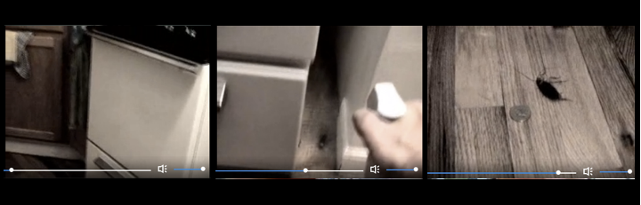

---
Pr-id: MoneyLab
P-id: INC Reader
A-id: 10
Type: article
Book-type: anthology
Anthology item: article
Item-id: unique no.
Article-title: title of the article
Article-status: accepted
Author: name(s) of author(s)
Author-email:   corresponding address
Author-bio:  about the author
Abstract:   short description of the article (100 words)
Keywords:   50 keywords for search and indexing
Rights: CC BY-NC 4.0
...

# 6. Doing Videoblogging

> This is why good videoblogs are so personal, because superficially
> they look like they’re about a subject, but in reality, they’re about
> the videoblogger (Richard BF).

Crucial to the question of what people *do* with media, is what people
*say* they do with media, and what it means to them. De Certeau famously
theorized the practice of everyday life, exploring the relation between
the spatial and signifying practices that make up our everyday
experience of the world.[^07chapter6_1] His notion of the practice of everyday life
strongly influenced theories of media consumption, particularly the way
it ‘reaches beyond individual experience and action towards the
(transcendental) ground of everyday practice and includes a defence of
‘ordinary’ language’.[^07chapter6_2]

In this chapter, I want to use some of de Certeau’s insights to engage
with videoblogging as a media practice. I seek to explore the embodied
practices the videobloggers perform routinely. The focus on media as
practice has intensified in scholarly writing in recent years[^07chapter6_3] but
here I am also drawing particular attention to Nick Couldry’s notion of
media as practice[^07chapter6_4] as a starting point for thinking about what
videobloggers do with media. The emphasis on practice in the study of
media does not start with Couldry, nor is it unique to the study of
media, but I think Couldry’s work is very helpful for thinking through
the way in which videobloggers’ practices were organised and actualised.

I also draw on Roger Silverstone’s notion of the ‘double articulation’
of media in my analysis of videoblogging as a technical-cultural hybrid,
with a specific aesthetic vernacular. By taking into account the
material social practice and cultural content of the media, as well as
its technological conditions and visual output, we can think about
cultural production as a ‘field of embodied, materially interwoven
practices centrally organized around shared practical
understandings’.[^07chapter6_5] 

Couldry argues that a theory of media as practice is concerned with
analysing two publicly observable processes, namely practices and
discourse.[^07chapter6_6] Here, practices are understood as routine activities that
are unconscious and ‘un-thought’ in character, as opposed to consciously
chosen actions.[^07chapter6_7] Discourse is understood not only as the things
people say, but the system of meanings that makes it possible for them
to say anything in the first place. Se we can examine *videoblogging as
practice* as un-thought in character and how the practice of
videoblogging is part of the everyday life of the videoblogger. By
observing their practices, and by listening to how they articulate their
practices, we are able to gain a more complete picture of videoblogging.
In her exploration of amateur home-movies in the bourgeois family,
Patricia Zimmermann discusses the complicated relationship between
discourse and practice. She argues ‘the complexities of the relationship
between discourse, which often presents itself as even, uninterrupted,
and organized, and practice, which is much more unruly, and
contradictory, erupt when we consider the myriad of relations between
amateur-film discourse and actual amateur filmmaking. While these
theoretical issues are tempting to analyse, their empirical answer is
bound by the availability of amateur film’.[^07chapter6_8] Equally, this
investigation into the practice of videoblogging is bound by the amount
of material available to me.

I am interested in the following questions; what types of things do the
videobloggers do in relation to videoblogging, and what types of things
do the videobloggers say in relation to their practice? We can look at
the activities of the videobloggers, and how they use videoblogs in and
around their everyday activities, for example how they shape space and
time. It is also crucial to analyse the content of the videoblogs.

There is a tension here, between the ‘un-thought’ in relation to
everyday life practices – which in some sense is centred around the
achievement of the everyday in itself – and the way I use ‘un-thought’
to refer to the videobloggers creative practices. There is also a
question related to how one gets at individuals’ un-thought practices –
if they are un-thought they are also possibly not self-reflexive – and
when asked to describe them, they are by definition no longer
un-thought. But by undertaking a long period of participant observation
I was able to draw on both what the individuals were saying they did and
my own experience of doing it, thus gaining a richer understanding of
the practices of videoblogging. I do not claim that this process of
reflexivity lies only within the expert domain of academia, rather I
argue that videobloggers themselves are also continuously reflecting on
their own practice. Indeed, observing the high volume of posts on the
Vlog Theory email lists, one can see discussions and reflections on
videoblogging were regular occurrences at a high level of theoretical
and technical fluency.

The perspective of practice helps us understand how media are embedded
in the interlocking fabric of social and cultural life. It allows us to
get an understanding of how media practices are ‘differentially ordered
for those with ready access to media resources… and for those
without’.[^07chapter6_9] In other words, doing things with media isn’t ‘one thing’
to ‘all people’: it is a different thing depending on the context in
which you do them. So, for instance, although Jenkin’s concept of
participatory culture acts as an anchoring term for a variety of
activities and practices performed by individuals across the world,
participatory culture isn’t one thing to everyone. Participatory culture
is a diverse practice, with a variety of practices that inform and
illuminate it, be it blogging, videoblogging, tagging content on Flickr,
Instagram or Tumblr, or actively or occasionally contributing to the
constantly evolving content of Wikipedia. Further, participatory culture
also provides a structure under which people can create discourses for
understanding and articulating what they do. The subject position of the
videoblogger, is discursively constructed through the email list, and
more concretely asserted as an identity and a set of practices in the
interviews. Videobloggers use space and place in their practice, and
attempt to mediate these notions. Questions of time and temporality are
crucial in relation to understanding videoblogging by exploring how
ritual and habit are both lived and mediated by videoblogs.

As previously discussed, my analysis involved a formal coding of the
videos submitted, as well as a discursive analysis of the interviews.
Despite many self-defining as artistic or experimental
film/video-makers, in terms of a more formal theory of aesthetics, most
fit in a category of autobiographical, or personal video-making.[^07chapter6_10]
This resonates with the idea of videoblogging as a personal practice,
drawing on influences such as home-movies and scrapbooking,[^07chapter6_11] which
also use creative and artistic tropes. Few, if any, videobloggers have
any institutional support or links with the traditional art world,
galleries or such like. However, later there was a move towards
film-inspired screenings and short-film festivals, such as *Pixelodeon*
(2007) in Los Angeles and award-type events, like the Vloggies
(2007).[^07chapter6_12]

As previously discussed, one of the main distinctions between someone
posting videos to YouTube and a videoblogger in the sense that is used
in this book, is that the videoblogger maintains her own (video)blog,
usually individually designed, with custom blog-rolls (or vlog-rolls),
archives and about pages, where they might post videos between three
times a week to once a month. Compared to the relative ease with which
people adopted blogging in the early 2000s, videoblogging required quite
a high level of technical competence and knowledge. In contrast, someone
who posts videos on YouTube, will often define him/herself as a Youtuber
or ‘Tuber. Amongst the videobloggers I interviewed, they generally felt
they were part of a videoblogging community. Indeed, all were
subscribers to the videoblogging email list around which the community
was mainly situated. The videoblogging list was also followed by a
number of people who were not formally videobloggers, but who would
occasionally post to the list. In contrast, Youtubers have much less of
a sense of community and shared practice, being dispersed, but also more
hierarchically structured with celebrity Youtubers at the top – often
earning millions in sponsorships – and amateur Youtubers at the
bottom.[^07chapter6_13] Nonetheless, there has been a shift in vocabulary with some
Youtubers beginning to prefer the term ‘videoblogger’ to define
themselves. For the original self-defined videobloggers, the
videoblogging identity was an important aspect of their self-definition
and constitutive of their practice and community, something that perhaps
Youtubers don't share even today.

Videoblogging is both a private practice, carried out, mostly from
within the confines of the home, and at the same time a public practice,
both in terms of the availability of the videoblog to the internet as a
whole and as a practice existing within a public community of users.
Here we might consider the way in which videoblogging was creating
practices around what we might call intimate technologies, long before
the arrival of smartphones that capture life through phone cameras. It
is also interesting to think about the way in which they also functioned
as ‘domesticated’ technologies, in the sense of Roger Silverstone, which
is that they are brought into the home and make an important
contribution to the everyday life of the users of technology. But also
in contrast to Silverstone’s conceptualisation, they are able to reverse
the valence – not only bringing the outside world into the home, but
also taking the inside of the home outside into the world. Although the
sharable nature of videoblogging and sharing practices often took place
within a self-referential community of interest, rather than shared as a
public or wider community public practice, the majority of my informants
emphasized the way in which videoblogging was a personal, quotidian
practice, a way to narrativise their lives and archive experiences for
the future.[^07chapter6_14] There were of course other, different discussions going
on in the community at the time, about copyright, remix culture and the
relationship between amateur and professionally produced content. In the
videos themselves, however, the representation of the everyday and the
much-celebrated intimacy between videobloggers helped forge deep
emotional bonds and friendships reinforced by the intimate form of the
videoblog. Some videoblggers even formed strong real-world relationships
and one couple who met through videoblogging actually married.

Many of my informants would say their videoblog could be considered an
art project or a personal diary. From the very beginning, the
videoblogging community showed clear resistance against creating a
unified definition of what videoblogging was or should be. I think it is
helpful to think about videoblogging starting as an *empty
signifier* which helped enroll video and film makers into a shared set
of practices and which slowly began to coalesce around practices,
technologies and aesthetics. There were no unambiguous *types* emerging
at the end of my interviews, and instead it was more fruitful to look
focus on *how* they described their practices, as well as examining the
videos themselves.

From a total of thirty-three informants, fourteen described their
practice as ‘art’ (Sam Reinsew, Mica Scalin, David Howell, Adam Quirk,
Brittany Shoot, Andreas Haugstrup Pedersen, Daniel Liss, Jay Dedman, Jen
Proctor, Markus Sandy, Loiez Deniel, Charlene Rule, Paris Marashi, Bekah
Havens) or artistic (Charlene Rule) videos (see figure 17). Brittany
Shoot called it ‘arty junk’. Paris Marashi told me ‘I consider my vlog a
studio space or workshop, I use the blog mechanism to help me apply some
order to the ideas that come tumbling from my head’. Daniel Liss called
his practice ‘experimental personal film(?)making’ \[original
formatting\] and Jennifer Proctor told me she makes ‘short experimental
nonfiction videos… about everyday life that attempt to shift the
ordinary into something novel or to make the unnoticed bigger or more
profound’. Rule said her work was ‘generally more artistic and it
contains pieces that are from my daily life and pieces of little art
ideas or sketches’. Mica Scalin, Jen Gouvea and Gromik Nicholas
identified as making documentaries. Erik Nelson and Enric Teller both
called their videoblogs ‘short films for the internet’ whereas Cheryl
Colan preferred ‘short personal documentaries’.
 

| Videoblogger   | Self-defined type |
| :-----------------------------|:----------------------------| 
|   Zadi Diaz, Steve Garfield, Raymond M. Kristiansen, Brittany Shoot, Bekah Havens, Cheryl Cole, Gena Hackett, Juan Falla, Richard Hall, Susan Pitman, Ryanne Hodson, Rupert Howe, Richard BF, Mary Matthews, Adam Quirk   |Personal |
|    Sam Reinsew, Mica Scalin, David Howell, Adam Quirk, Brittany Shoot, Andreas Haugstrup Pedersen, Daniel Liss, Jay Dedman, Jennifer Proctor, Markus Sandy, Loiez Deniel, Charlene Rule, Paris Marashi, Bekah Havens   | Art  |   
|  Andreas Haugstrup Pedersen,, Erin Nealey, Jay Dedman, Jen Gouvea, Juan Falla, Mary Matthews, Richard BF, Charlene Rule, Gena Hackett, Paris Marashi  |   Everyday life   | 
| Mica Scalin, Jen Gouvea, Gromik Nicholas |   Documentary   | 
| Erik Nelson, Enric Teller, Juan Falla |   Internet TV   | 
| Adam Quirk, Casey McKinnon |  Comedy    |    

Figure 17: Videobloggers’ self-definitions

Among the videobloggers, ten told me their videoblogs were about their
‘daily’ or ‘everyday life’, Marashi told me her videos were ‘everyday
moments that make up your life, that can give a western audience some
perspective into Iranian life’. Haugstup Pedersen told me his videoblogs
were ‘video snapshots on my daily life’. Interestingly, the term most
commonly used by the informants to describe their videoblogs, was
‘personal’. Sixteen videobloggers said their videos fell into this
category, meaning, as Bekah Havens told me, they ‘fit under the giant
umbrella of personal videoblogging’. Havens further added that she saw
‘each video… like a little arts & crafts project that I get attached to,
because they are usually personal in terms of subject matter’.

To illustrate what was meant by ‘personal’, Susan Pittman added her
videoblog acted as a ‘diary’ or as Mary Matthews put it, as ‘intimate,
personal experiences of my life, my work, my relationships, my spirit,
all captured in moments’. Erin Nealey likened the practice of
videoblogging to ‘home videos’ with the added element of being ‘edited
and a little more polished and hopefully more pleasant to watch. These
are moments from our family life and I like to think of them as a video
scrapbook of our memories and times together.’ As seems clear, there was
quite a lot of overlap between these categories, with fewer defining
themselves within just one type. Further, it seems that many of these
descriptions, although consistent, could easily be grouped together –
where describing a videoblog as ‘personal’ might just be another way of
saying that their videoblogs were stories from their ‘everyday life’.
Equally, terms such as ‘home movies’ and ‘scrapbooking’ have been shown
by others to be terms used quite frequently when describing social and
personal activities online. As Hof explains, ‘scrapbooking exemplifies
how an everyday cultural practice can magnetize and mobilize people
through a community of practice’.[^07chapter6_15] Indeed, the majority of the
videobloggers fell within the category of producing ‘personal’
videoblogs, in other words, *not* producing content for wider public
circulation as such, ‘artistic’ and ‘everyday life’ were the second
largest groups.[^07chapter6_16]

Even those, like Jennifer Proctor, who initially told me their videos
were not ‘personal,’ and that their videos ‘don’t often feature people
at all’ and instead featured ‘objects or shapes or landscapes or
movement’, admitted that even these videos were on some level personal
to them. ‘Sure, almost all of them, on some level,’ she elaborated.
‘It’s all an on-going process of watching, incorporating, chewing up,
spitting back out’. Haugstrup Pedersen further problematized the
category of personal media by stating that his videos ‘are personal
because they are all me (created by me, dealing with my life) but they
are not personal because they don’t deal with personal matters’.

Nonetheless, many of the videobloggers defined their practice as falling
into the category of a kind of personal media: ‘these are windows into
my life,’ Kristiansen told me ‘small windows into a mood I might be in,
or it may be the result of me playing around with the computer’.
Kristiansen explained that he usually was the protagonist of his
videosblogs. Adam Quirk told me the ‘12" nude plastic doll’ that
features in his videoblogs, was in fact ‘my thinly veiled doppelganger’.
A few users expanded on this idea of themselves as protagonists in their
own videoblogs, for instance, Cheryl Colan told me that she saw herself
as the protagonist of her videos. ‘Why me? Well, because I’m making
videos about my life, so I’m the natural choice. If I switch to someone
else, it would be because I want to highlight them or am making a
tribute to them. Or because I want to try to see/show the world through
someone else’s eyes.’ Similarly, Juan Falla told me he and his wife were
the protagonists of their show, *Viviendo con Falla* (Living with the
Fallas), ‘Everything we show is based on our point of view,’ he told me.
‘Although, I have to say that we don’t touch political or religious
themes. Our videos are of ‘normal moments of life’. And we are the
protagonist because we want to show our families (and friends) the
things we do here in Los Angeles.’

Richard BF conceptualised videoblogging as a genre in itself, and
attempted to outline this for me, arguing that he considered
‘videoblogging a genre, so I guess they fit themself. I would describe
what I do as “I carry my video camera with me wherever I go, and if I
see something interesting, I’ll shoot it and put it on the web. It’s
like what people do with a camera phone, but I also talk into the
camera. It’s like a video diary, but the whole world can see it”.’ Other
videobloggers were less interested in any kind of definition, as Markus
Sandy wrote, ‘I don’t have an interest in defining videoblogging. I
don’t want to define it. It’s like writing’. Indeed, Erik Nelson
explained he ‘intentionally attempts to avoid getting pinned into
something that is easily describable’ and Kristiansen told me he tried
to ‘avoid the boxes, putting my work into this or that narrative
tradition’. This resistance to being ‘put in a box’ was echoed by Markus
Sandy, who told me that ‘the quest to define videoblogging has been
going on since it started and it’s the videos themselves that define it,
not people, not critics, academics or anyone else. Just the videos. And
even then, people still want to describe it, box it, corner it and catch
some of it, maybe. I don’t know. Is this how it was for the early days
of television? I think we are still discovering what television can do
and be.’ Sometimes they would describe their narrative practices in ways
that could be said to *automate* their identities. This raised questions
of how their life stories are archived, edited, and reassembled in forms
‘influenced and constrained by the architecture of the system, by users
who may in the end narrate or refuse the tale’.[^07chapter6_17] Videoblogging as a
media form constantly engaged with archival practices – it should be
noted that informants were extremely cognizant of the problems of
digital storage and backup and the dangers of losing their archival
material.

We might consider why people take photographs. They do so for a number
of reasons, including ‘to construct personal and group memory; in order
to create and maintain social relationships; and for the purposes of
self-expression and self-presentation’.[^07chapter6_18] Indeed, the idea of
‘self-expression’ and ‘self-presentation’ is reflected in videoblogging
practice and demonstrated by Cheryl Colan, who explained her motivations
for videoblogging. ‘Videoblogs,’ she told me, ‘are a means of productive
self-reflection. A way for me to live an examined life and have
something to show for it. And a way to re-story my life… It’s a valuable
record too.’ Here, then, Colan actively uses her videoblog to ‘live an
examined life’, to reflect on her actions and learn something from her
experiences. This notion is deeply philosophical in construction and is
reminiscent of Socrates, who thought ‘the unexamined life is not worth
living’.[^07chapter6_19] Colan also gestured towards memory as a technical effect
of media, arguing that her videoblog gives her ‘something to show for
it’; a ‘valuable record’ of her lived experiences.

It has been argued that one of the motivating forces behind amateur
photography has been the desire to create a record of one’s own life.
Drawing on Bourdieu, Gye argues that ‘the *desire* to photograph is not
a given—it is socially constructed and culturally specific’ and that
‘the rise in its popularity can be directly attributable to the
emergence of a correlation in the public imagination between
photographic practice and private memorialization’.[^07chapter6_20] Bourdieu, too,
argued that as ‘a private technique, photography manufactures private
images of private life . . . Apart from a tiny minority of aesthetes,
photographers see the recording of family life as the primary function
of photography’.[^07chapter6_21] This is echoed from the videobloggers such as Erin
Nealey who said comments that her videoblog explores ‘moments from our
family life and I like to think of them as a video scrapbook of our
memories and times together. This will be something I’m sure I will
cherish in years to come (and hopefully my children will too!)”.

Dedman also conceived of videoblogging as a way of archiving life, but
he argued that it also provides a sense of narrative connections and
meaning to what would otherwise be random and disconnected moments. He
told me ‘my videos are really just an exploration of moments I live
through. You know, most of life could be said to be very mundane, while
it could also be said that every moment is full of meaning’.
Videoblogging was Dedman’s way of noticing moments of meaning,
remembering them and sharing them with others. Like many of the artistic
videobloggers, Jan McLoughlin, a freelance sound designer with a
particular interest in audio (she submitted her interview to me as an
audio file rather than as text), used more creative language in her
description of what a videoblog is, saying, ‘videoblogging is anything I
want it to be’ and ‘it’s making something of beauty and sharing it with
the world’.

Similarly, Falla said he was creating a ‘visual archive of my life’,
taking a camera with him everywhere ‘because I like to keep track of my
life on video. I want to be able to ‘see’ my life how it was, and not
only have a memory of the moment’. Colan also described a similar
experience. ‘I would say that the videos are short, personal
documentaries that I use to share my life experiences,’ she told me,
‘together they make a longer documentary of the journey of my life, from
the silly or mundane to more profound experiences’.

Some videobloggers argued that videoblogging was actually a sub-genre of
blogging, and utilised quite technical language to describe it. For
instance, Richard Hall, a university professor of Information Science
and Technology at an American University, gave a rather technical
definition. ‘It’s like a web page,’ he said, ‘but it’s a log where
people have a linear list of posts. A video blog is a variation on that
where you have a linear list of videos and they are usually associated
with some text and a traditional thing with video blogs is that they
have syndication so that you can use an RSS reader so you can use RSS
with enclosures.’ Enric Teller equally defined his practice in quite
technical terms. A videoblog, he told me, is basically ‘video in a blog
format with entries in reverse chronological order that can be
syndicated for distribution. The creation and distribution of the
videoblog is personally controlled by the videoblogger(s) without
approval required from any media gatekeeper.’ Control over content, both
the production process and the distribution across media platforms, was
clearly as important to Teller as the content of the videos or how they
were displayed in the blogs, as he explained, ‘most people define
videoblogging as having control over the production and distribution of
their rich media work. Having no gatekeepers for making and distributing
vlogs. This is not explicitly defined, but through their actions of
talking about the process of making vlogs on their own, where it gets
distributed to, how to control and get information on syndication
(distribution), concern and action on unauthorized distribution by
others.’[^07chapter6_22] This definition of videoblogging as ‘control over
production and distribution’ and ‘having no gatekeepers’ was clearly
influenced by strands running through the open-source and free culture
movement. Many articles from the same time on sites such as Techcrunch,
Digg and Gawker were very influential on the videoblogging community,
and a lot of discourses written at this time were influenced by the work
of Lawrence Lessig, on copyright, code and law, and Tim O’Reilly on Web
2.0.[^07chapter6_23]

In contemporary society, we tend to think of user-generated media as
being produced ‘on-the-go’. New technologies such as smartphones and
software platforms such as Snapchat and Instagram make mobile media
engagement through video easy and quick. It is important to remember
that the practices we now take for granted were once slow meticulous,
negotiated and invented processes that took considerable time to
produce. These practices – now at the tip of our fingers – required a
different kind of labour and commitment. The technical equipment and
necessary bandwidth meant that most videobloggers produced their work at
home, using quite crude technologies compared to the software available
post-Instagram or post-Snapchat.

We might therefore describe the videoblogging practice as an early
instance of *everywhere computing*. The ubiquitousness of mobile
computing which today allows us to interact with each other anywhere and
any time, via our devices, was quite avant-garde when the videobloggers
were experimenting with mobile devices such as the Nokia N95 (which
looked like the Sanyo Xacti, but provided a lower technical standard,
made up for by having access to the internet). Yet, there were many
videobloggers who still preferred to work from within the home, and
whose videos reflect the domestic use of desktop computers and keyboards
and mouse video-editing. Silverstone emphasised the important and
contradictory nature of the home in relation to media. At once a secure
space, the home also acts as a protection against the world outside;
‘the home, as the shell around the body \[…\] and as the walls around
the family, articulates this defensiveness even as it offers security.
The domestic space is thus forged dialectically, as a
contradiction’.[^07chapter6_24] With this in mind, and remembering both that
Silverstone would have envisaged the media as entering into the home, as
opposed to being projected from the home, and Couldry’s notion of
‘un-thought’ practice, the *videoblogger at home* is an interesting way
to explore the videoblogger’s relationship to the ‘domestic’, in
Silverstone’s terms.

Of the 33 videobloggers I interviewed, 17 said they recorded their
videos either at home or a variant of the home, ‘home office’ (Zadi
Diaz, Markus Sandy), ‘home studio’ (David Howell), ‘home/ on location’
(Enric Teller, Jennifer Proctor) or the more general ‘home/out’ (Mica
Scalin, Raymond M. Kristansen). When it came to editing the videos, the
overwhelming majority (all but one) revealed they worked from home. When
asked to expand, they told me they edited (and uploaded) their
videoblogs at home, usually from the bedroom, or a space characterised
as a ‘studio’ or ‘home office’. An example of this was illustrated by
Haugstrup Pedersen, a 25 year old student from Denmark, who, when
describing to me ‘where his main work computer was located in relation
to the rest of the room it was in,’[^07chapter6_25] gave me the following, detailed
description, ‘It’s on my work desk. The desk itself is filled with
various papers and trinkets. When working I’m staring into the wall, but
one of two windows in the room are on the immediate right. Directly
behind me is my bed and to the right after the window my bookcase is
sitting (I need to buy a new one, this one is overflowing – I even
placed a smaller bookcase on top of the actual bookcase). To the left of
the desk I have my tv and behind that the kitchen area begins. Behind me
and to the left I have a small table with some chairs. Usually the table
has either more papers or laundry sitting on it.’

What struck me immediately about his description was how the space he
uses for working had invaded (or was invaded by) domesticity, most
notably his laundry and his bed. Further questions revealed that ‘I do
everything from my apartment’ and that ‘everything is jumbled together
on the same desk and the same computer’. The fact that Haugstrup
Pedersen (at the time of the interview) was a student and working
freelance perhaps explains this feeling of living in one room from where
everything necessarily needs to be done, but he was not the only
videoblogger describing this to me. Adam, a self-employed 28 year old
from New York, stated that ‘my bedroom doubles as my office’, and
Brittany Shoot, 24 from Boston, explained; ‘my desk is in my room, which
sort of doubles as my office at home’. Jennifer Proctor, a 33 year old
professor of arts, told me she, too, works from ‘a converted bedroom’.
Amongst those videobloggers who self-identified as ‘artistic’, the
demarcation of a space to videoblog was more prominent than amongst
those who self- identified as making ‘personal’ videoblogs. David stated
he works from a ‘modified attic space’ and Erik Nelson, a 31-year-old
American based in the Netherlands, divulged ‘I have the entire attic
space to myself, along with the washer and dryer.’

The lack of a separate space within the home from where they recorded or
edited the videoblog was a very prominent outcome of the interviews.
Facilitated by laptops and small, portable equipment, those who didn’t
indicate that they had a dedicated ‘office-space’ or ‘studio-space’ in
which they worked, told me that one of their reasons for videoblogging
was that it was something they could do ‘anywhere’. For instance, Colan
said she videoblogged ‘in the house, classroom, office, car, restaurant,
grocery store, wilderness – everywhere!’ Dedman revealed he produces
videos ‘wherever I am. I have a camera right in my pocket’. He also told
me he ‘record\[s\] everywhere.. and then edit on my laptop. Usually at
home, but could be anywhere’. Similarly, when asked where his computer
was located in the house, Daniel Liss described how ‘it roams freely’.
Shoot stated that ‘sometimes I bring my computer – a laptop – into the
living room and do work out there.’ She indicated she worked mainly from
her bedroom, so explained that ‘mostly, especially for editing, which
requires external hard drives, I’m in my room’. In other words, it was
the technical requirements of an external hard drive, not as mobile as a
laptop, which caused Shoot to work mainly in one space.

Female videobloggers described the importance of being ‘comfortable’
whilst videoblogging. This was illustrated by Pitman, who described how
videoblogging, ‘forms part of my every day life, because when I get home
from work, I recline back in my lazy boy chair, and there’s my laptop
waiting for me beside the chair.’ Similarly, Colan stated that she had
‘strategic power strips located around the house - in the dining room
and near the comfy LazyBoy chair’ which allowed her to ‘move to where
I’m comfortable’.

Charlene Rule, a 37 year old film editor living in New York, revealed
how she usually edits videos on the kitchen table. ‘If I’m at the
kitchen table, I’m facing a wall with two windows on either side,’ she
told me. ‘Fridge to my right (it’s a very tiny kitchen). Stove behind
me. The living room is also behind me’. From her own description, Rule
was working in a domestic space, surrounded by everyday things, like the
fridge and the stove. Rule’s video, *Dear Tesla* (1:08, 320x240)
illustrates this domestic space mediated through her videoblog. The
video shows her sitting in her kitchen eating spaghetti, talking, with
her face reflected in her toaster. This mediation of household objects
and domestic space is also the theme of some of her other videos, for
instance *Quarterplus* (0:51, 320x240), which features her attempts to
kill a cockroach that had hidden in a cupboard (figure 18).

Figure 18: *Quarterplus* (Rule, 2005)

Rule’s extensive use of lighting and sound effects contributes to an
attempt to defamiliarise her home – much like the space she has created
on her videoblog, a space where ‘the boundaries are crossed between what
is real and what is not…’ She elaborated,‘I am able to jump into playful
ways of looking at my own reality and that is what seems to be a given
in terms of the vernacular for the audience’. Nonetheless, even at this
moment, as the home becomes uncanny, it remains central to the form and
content of the videoblog.

As this example shows, the home has a dual significance to the
videoblogger. It is both the space from where she videoblogs, but is
also often represented in the videos, for example, Erin Nealey’s video
*Mornings* (3:05, 320x240), which is a fast-paced video montage of her
morning ritual – making coffee and breakfast for her kids – in which
short sharp edits are cut together to create a vibrant montage of the
everyday rituals of life. In *Mornings*, the video creates ‘the intimate
space of the home at once the site for mundane transactions and a
constituent part of this other vaster space which might have both
psychical and mythical dimensions’.[^07chapter6_26] Nealey’s video is cut to the
diegetic sounds of getting ready in the morning, with the coffee grinder
providing the acoustic rhythm and cups and spoons providing the beat.

Similarly, Hodson told me her videoblog was ‘a document of my life. Me,
observing the world and translating it. It’s like complete freedom.’
This sense of freedom is reflected in a number of her videos, ‘this is
like the reason I vlog. I’ve showed myself crying, laughing, ranting,
thinking, anything. I just want to relate to other people, not feel like
I’m alone and crazy’. Howe also reflected on this aspect of
videoblogging, telling me how amazed he was when he first found the
videoblogging community. The videos were like nothing he had ever seen
before, a mix of ‘intimate and mundane parts of their lives. Stuff you
still didn’t see anywhere... Back then it was extraordinary to see
someone making a video about taking their child to the park and talking
to you about it… For me, the more mundane it was, the more excited I was
by the newness of it.’

As one of the most outspoken of the videobloggers, Dedman mused that ‘if
done well, something is really shared in these moments. The visual
artform is just so rich. The fact that videoblogs are archived also
allows me to go and watch a person’s past creations and life’. The idea
of sharing the spaces of their lives, of creating archives and
repositories of memory, of narrativising their lives and being able to
draw on the videos at a later time, was clearly important to the
videobloggers. ‘I think most of my videos are simply sharing moments
rather than telling a story,’ Erin Nealey told me. Jen Gouvea described
videoblogging as ‘my way of sharing of myself personally and processing
my experiences’. ‘I would describe my videos as moments,’ was how Mary
Matthews put it, ‘intimate, personal experiences of my life, my work, my
relationships, my spirit, all captured in moments’. Paris Marashi, who
made videos about Iran and being an Iranian in America, revealed to me
that ‘sharing’ was one of her main goals through videoblogging.
‘Initially, it was about cultural expression and sharing’ she
elaborated. However, as she got deeper into the community, she found
that videoblogging spoke to her on a more personal level; ‘through this
experience of videoblogging,’ she said ‘I have been learning about how
it can facilitate my own personal self-expression. Sharing my cultural
identity with others, so that others can identify with it, I began to
experiment with emotion and feeling.’

Many videobloggers saw videoblogging as a way of sharing stories and
personal experiences, as well as their, perhaps unrealistic, notion that
the videos they produced in 2004 would remain as an archive for future
generations. Dedman speculated, ‘imagine what it’ll be like in 50 years
when people’s lives are all in video in different ways! It’ll be gold to
our ancestors.’ Ironically, writing in 2018, due to technical changes,
shuttered web sites and general link breaking, only a handful of
Dedman’s videos are still available on the internet, and only to those
who know where to look. The unstable nature of the technologies that
made up the original techno-social foundation of the practice, as well
as unexpected things, such as hosting companies changing owners, or
changing terms of service etc., caused the videoblogging community to
slowly fracture. When videoblogging fell out of favour with hosting
sites such as Blip in November 2013, a company ironically started by
videobloggers and which used to be intimately linked with the community,
a large set of archival videoblogs was mostly deleted.

I now want to turn to briefly think about how time and temporality are
manifested in the practices of the videobloggers I interviewed, but also
consider how this is demonstrated in their rituals, habits and
repetitions. To Silverstone, the ‘veritable dailiness’ of everyday life,
the routinized practices that make up the fabric of the everyday, exists
through a sense of order and ritual.[^07chapter6_27] Couldry also describes media
practices, understood as ‘routine activities’ as opposed to ‘consciously
chosen actions’.[^07chapter6_28] How we make sense of these quotidian practices,
Silverstone argues, is through ‘an order manifested in our various
traditions, rituals, routines and taken for granted activities – in
which we, paradoxically, invest so much energy, effort and so many
cognitive and emotional resources.’[^07chapter6_29] I want to note how these are
mediated through the videoblogs, both consciously and unconsciously.
Videoblogging was a practice that required technical expertise and was
very time consuming. Thus, I wanted to explore the amount of time, in
general, the videoblogger spent videoblogging; was it a daily
occurrence, weekly, monthly? Did they videoblog all day, for a couple of
hours or five minutes? How long would it take to produce an entry on a
videoblog, how often would the videoblogger produce content, what time
of day (or night) would she work? Many videobloggers talked about
sharing stories and developing visual archives for the future, thus I
was interested in the idea of videoblogs as repositories of memory,
working archives of lived experiences and how the videobloggers
articulated this both discursively and in their work.

Having to *make* time for videoblogging was highlighted by a number of
respondents. To illustrate, Gromik Nicholas told me it would take him on
average ‘1 day or more’ to record a video, ‘a day to edit and up to half
a day to upload’. Erik Nelson said he spent 1-2 hours recording, up to
20 hours editing and 30 minutes to an hour uploading a videoblog. Zadi
Diaz revealed her videos took her, on average, 1-2 hours to record, 6-8
hours to edit and 2 hours to upload. There were, of course, those who
spent ‘3 minutes’ recording, and only ‘15 minutes’ editing (Steve
Garfield) or ‘a few minutes’ shooting (Markus Sandy) but ‘anything up to
an hour’ to edit (Richard BF), but the majority of respondents reported
spending at least an hour recording, editing and uploading videos to
their videoblogs.

Mary Matthews told me that, ‘vlogging is routine… though \[it\] does
fall behind if other work gets busy, but I video blog every day – be it
shooting, editing, writing. I look forward to it. I am always thinking
about it’. Mica Scalin’s answer was an ambiguous ‘whenever,’ but when
asked to elaborate, she revealed that, ‘artmaking is a daily process for
me. I have always made myself do something every day. I started working
with digital video and vlogging simultaneously so it was about making a
process that was simple and something that could be incorporated into
daily life. When it feels like a chore I take a break. I have taken
periodic breaks to work on specific projects.’ Mica’s answer represented
a more general attitude to videoblogging – that it shouldn’t be a chore.
For Jennifer Proctor, the incorporation of videoblogging into her
everyday life was part of her routine, but for others, like Susan
Pitman, a mother of two, videoblogging could be a guilty pleasure as
well; ‘sometimes (guilty) I have to make myself wait until after the
kids go to bed, so I can spend some time with them instead of editing
videos when we could be playing together’. Erin Nealey, 33 year old
mother, expressed a similar mix of guilt and pleasure when she described
her perfect night in. ‘I absolutely LOVE to edit video that I have
captured,’ she said. ‘There have been times where I’ve let that overtake
my day, but since I have two children I am trying to be careful about
that \[…\] there is nothing better than the feeling of the kids sleeping
peacefully in their beds, me at my desk with a coffee in hand and
working on my latest project.’

Many of the respondents highlighted that one of the main obstacles to
videoblogging was that the process took a long time. In general, the
editing was by far the most laborious part of the creation of
videoblogs, with recording mostly completed in around an hour and
uploading generally completed within 15 minutes. With upload times being
fairly slow, creating shorter videos (no more than 5 minutes in length
and compressed to as small a file as possible made a lot of sense
technically). Jennifer Proctor told me she makes videos, ‘really
randomly. I have no schedule. I usually take 1-6 months recording
moments, and then actually sit down and put them together. I really see
it like making a photography book.’ Similarly, when I pressed on whether
taking more time over videos allows for greater reflection, she
answered, ‘oh yeah.... I got to let things sit. Usually I’ll record a
moment and know its good. You just know. But I have no idea how to use
it. I have to collect these good moments over time...and then let them
fall into place. Allowing time to pass between recording moments and
publishing moments allows me to understand why I happen to record it at
the time. To be clear, there are no answers here. Time just helps me see
how ‘cool’ life can be. That’s all recording a moment is. Trying to make
the mundane...special.’

Amongst those self-identifying as ‘artistic’ videobloggers, there was a
clear trend towards working at night. ‘I reserve the hours 9:00PM-3:00AM
for video work, after the kids are put down for the night,’ Erik
revealed. Adam was convinced his ‘best work happens between the hours of
9pm and 4am.’ Equally, Loiez Deniel, who defines videoblogging as a form
of poetry, said he works ‘during the night generally.’ For some, like
Richard BF, working at night wasn’t a necessity, i.e. to work around
children, work or other commitments, but merely out of choice. ‘\[I
work\] all over the place,’ he told me. ‘Sometimes I’ll edit straight
after shooting, which could be any time of the day or night. I guess
generally it’s at night, but that’s just because I like to work at
night, not because I’m busy during the day’. These were also the
participants who were most likely to tell me they worked from a ‘studio’
(Adam Quirk and Jennifer Proctor, see above) – most notably from a
converted attic space (David Howell and Erik Nelson, again, see above).
This recalls images of the romantic artist and, interestingly, these
were the participants whose explanations of their videoblogging
practices were also quite ambiguous. By this, I mean that they were more
likely to talk about their videos in ‘artistic’ terms. Interestingly,
media theorists Kember and Zylinska argue that in the age of the
digital, with the distributed networks of users and potential
collaboration across time and space, the creative subject is now
collaborative rather than individualistic, yet she is still ‘driven by
the very same desires, motivations, and fantasies that had shaped the
Romantic creative: those of artistic freedom, self-worth, and individual
fulfilment’.[^07chapter6_30] So a comparison between the answers of Erin Nealey,
who mainly videoblogged about her family and children, and David Howell,
who self-identified as an artist, is interesting. Nealey usually
allocated ‘10-30 minutes’ recording her videos, whereas Howell told me
he spent ‘as long as is required’ to complete the process of capturing
video. Additionally, Nealey told me she used ‘anywhere from 6-12 hours’
to edit a video, whereas Howell would work ‘until it is finished’.
Lastly, when explaining the length of an individual video, Nealey
articulated a clear and rational reasoning for the length of her videos
(her videos range from 3 to 5 minutes). ‘I just feel like people don’t
have the attention span to watch anything much longer than that sitting
at their computers,’ she stated. ‘Every now and then, I’ll throw a
longer video in there that maybe I didn’t create specifically for the
videoblog. But generally if I’m creating something that is especially
for my site, I will try and keep it under 5 mins.’ In comparison,
although his videos tended to be within a certain range, (mostly between
1 and 5 minutes) Howell couldn’t (or wouldn’t) give me a reason, ‘no
rhyme or reason to the length. I am currently trying to make them
shorter than 1 minute and tell a longer more complex story. It doesn’t
always work out that way though. My videos generally dictate to me how
long they wish to be’. He did add, however, that the pleasure he
experienced in relation to videoblogging was linked to spending hours
alone creating something, a bit like a craftsman at work; ‘I fit it in
when I have time to sit locked away for an extended time. I very much
look forward to making them and wish I could do it all the time’.

This difference in terms of gender and the time and space available are
reflective of external pressures such as family or domestic labour, so
for Nealey, consideration for kids, family and the everyday demands of
being a mother came first. Nealey’s notions of videoblogging are shaped
by these external (or rather, domestic) demands on her time. She knows
exactly how long she has to videoblog, and exactly when she can take the
time to do so, which are determined by the extent of the domestic labour
that shapes her videoblogging practice.

A few of the ‘everyday life videobloggers’ have had periods of reduced
videoblogging and even complete withdrawal from the ‘vlogosphere’.
Raymond M. Kristiansen, who whilst the interview was taking place was on
a self-imposed hiatus from videoblogging, showed signs of burn-out when
he talked to me; ‘in the beginning of “my videoblogging career” I
structured my days around producing videos, watching videos, interacting
with other videobloggers. I would wake up, and watch videos before
eating breakfast. I might make a movie after breakfast. I might spend an
evening after work talking with other videobloggers on AIM or Skype.
Especially between October 05 and June 06 I spent a LOT of time…
videoblogging’. Others showed a pragmatic approach to videoblogging.
Jennifer Proctor maintains her own personal site where she posts ‘short
experimental non-fiction videos’. She worked full time as a professor at
a university in America and tried to ‘fit my videos in when I can.’ Her
attitude, similar to Mica Scalin’s, is that videoblogging is an organic
process and that she usually does it ‘when the video calls for it,
rather than forcing myself to do a video… But I do put some pressure on
myself to keep producing.  If it’s been a while since I’ve posted
anything, then I more actively seek stuff to shoot, or find stuff to
edit, or try to come up with something interesting to post.  It’s
something that’s always on my mind, in the back of my head, but I really
just fit the process in where I can, like another piece of my weekly
life puzzle.’

In relation to whether she had to *make* time for videoblogging, she
stated categorically ‘I would say no – it’s simply on-going, like
another part of life.  It’s just another thing I do during the week,
like going for a walk or making a nice dinner’. Proctor was drawn to the
contingency of videoblogging, and described how it allowed her to react
to events in her life in a more spontaneous way. As a professor of film
studies, videoblogging presented an alternative approach to creating
moving images that she found ‘liberating’. She told me ‘I think part of
the great power in videoblogging is related to its spontaneity, to its
now-ness, and to its capturing of those beautiful, fleeting life moments
that we all experience but rarely have an opportunity to document. So
for me, those random events are often the more uncanny or moving or
interesting, the being-there-at-the-right-time kind of moments, that
don’t as often occur when you capture life in more of a planned or
scripted way.’

Videobloggers have a number of different motivations for videoblogging,
from Richard BF’s ‘there’s something exciting about the immediacy and
global audience that makes it fairly unique as a hobby’, to the
self-fulfilment Juan Falla felt from being a content producer with an
audience; ‘it’s great to be with the camera shooting stuff. I feel like
a movie director doing short films’. Kristiansen told me, ‘I felt as if
my head was about to explode every few hours, when I realized just how
much \[videoblogging\] could change everything... To me, videoblogging…
was the missing link. It was what would allow people from regions like
sub-Saharan Africa to communicate with the world... Videoblogging, if
done with a low-key approach to it, could really change how we
communicate.’

Hall, a university professor of information science and technology and
‘early adopter’ of videoblogging, told me he prefers videoblogging to
his ‘real’ work. With some irony (he is an academic) he told me that
‘... many more people have watched my most popular videos, than have
read my most prestigious journal publication’. Hall described
videoblogging ‘like meditation – I’m in a different world \[…\] several
hours goes by and it feels like I just started and my concentration is
such that little sounds and stuff really bug me if they get my attention
... very much a feeling of “flow”’. It also became clear that the
practice of videoblogging was conceptualised and experienced by the
videobloggers as inherently *social*. For some, it also became a way of
meeting people, like Quirk, who told me that ‘when I found videoblogging
I realized that I could have conversations with these other people
online and experience some kind of socializing without having to resort
to going to bars and meeting strangers face to face.’

So, videoblogging is an everyday media practice, defined in many ways by
where and when the videoblogger was able to produce her work. In this
chapter I have explored some of the social dimensions related to
videoblogging and how it created a means for the videoblogger to mediate
her life, whilst creating a personal archive of lived experiences. For
the majority of the videobloggers interviewed for this project,
videoblogging engendered an intense personal relation with mediated time
and space, one in which social relations were explored and engaged with,
where ideas were exchanged and life experiences were shared.
Videoblogging practice, mediated through the channels of communication
available to and utilized by the videobloggers, shaped the contours of a
community of users forming what I have been calling an invested network.
By invested network I point toward the notion of a self-referential
community of interest around a shared object of focus, in this case the
videoblog and related technologies, email lists and video artifacts. I
now turn to the final chapter in the book to bring many of these strands
together.

[^07chapter6_1]: Manuel De Certeau, *The Practice of Everyday Life: Living and
    cooking,* (Trans. Steven Rendall), Berkeley and Los Angeles:
    University of California Press, 1984, p. 105.

[^07chapter6_2]: Helga Wild, ‘Practice and the Theory of Practice. Rereading
    Certeau’s “Practice of Everyday Life”’, *Journal of Business
    Anthropology*, Spring (2012) p. 3.

[^07chapter6_3]: John Postill and Birgit Bräuchler, ‘Introduction: Theorising Media
    and Practice.’ In John Postill and Birgit Bräuchler (eds)
    *Theorising Media and Practice*, New York: Berghahn Books, 2010, p.
    1-32.

[^07chapter6_4]: Nick Couldry, ‘Theorising Media as Practice’, *Social Semiotics,*
    14.2 (2004).

[^07chapter6_5]: Elisenda Ardèvol, Antoni Roig, Gemma San Cornelio, Ruth Pagès, and
    Pau Alsina. ‘Playful Practices: Theorising ‘New Media’ Cultural
    Production.’ In Birgit Bräuchler and John Postill (Eds) *Theorising
    Media and Practice*, New York: Berghahn Books, 2010, p. 259-80.

[^07chapter6_6]: Here he draws on the work of Ann Swindler.

[^07chapter6_7]: Couldry, ‘Theorising Media as Practice’, p. 121.

[^07chapter6_8]: Zimmermann, *Reel Families*, p. xiv.

[^07chapter6_9]: Couldry, ‘Theorising Media as Practice’, p. 129.

[^07chapter6_10]: The use of quotation marks here is not meant ironically, or as a
    comment on informants self definition, but rather to signal that the
    text is drawn from the interviews and email corpus.

[^07chapter6_11]: Karina Hof, ‘Something you can actually pick up: Scrapbooking as
    a form and forum of cultural citizenship’, E*uropean Journal of
    Cultural Studies*, 9. 3 (2006); p. 364.

[^07chapter6_12]: The uncertain register of videoblogs was a constant source of
    debate within the videoblogging community during its early phase.
    Whether the videoblog was a documentary, reportage, short-film,
    artwork or as Richard BF put it, a genre in itself, was never really
    decided upon until YouTube created its own notion of a ‘YouTube
    video’ which is now a commonplace form. However, at the time this
    was far from settled.

[^07chapter6_13]: Instead, one can perhaps talk of YouTube communities, dispersed
    groups centered around interests or subject areas, in contrast to
    the videoblogging community which was centered around videoblogging
    itself.

[^07chapter6_14]: Roger Silverstone, *Media and Morality: On the Rise of the
    Mediapolis,* Cambridge: Polity Press, 2006, p. 91.

[^07chapter6_15]: Karina Hof, ‘Something you can actually pick up: Scrapbooking as
    a form and forum of cultural citizenship’, p. 364.

[^07chapter6_16]: One notable counter-example was Casey McKinnon, who told me she
    produces a ‘sci-fi comedy show’ aimed at earning her and her partner
    a living.

[^07chapter6_17]: Bassett, *The Arc and the Machine*, p.110.

[^07chapter6_18]: Lisa Gye, ‘Picture This: the Impact of Mobile Camera Phones on
    Personal Photographic Practices’, *Continuum: Journal of Media &
    Cultural Studies*, 21.2 (2007): pp. 280.

[^07chapter6_19]: Plato, *Plato in Twelve Volumes*, Vol. 1 (Trans. Harold North
    Fowler; Introduction by W.R.M. Lamb), Cambridge, MA: Harvard
    University Press, 1966, 5-6.

[^07chapter6_20]: Gye, ‘Picture This: the Impact of Mobile Camera Phones on
    Personal Photographic Practices’, p. 280, itallics in original.

[^07chapter6_21]: Pierre Bourdieu, ‘Towards a Sociology of Photography’, *Visual
    Anthropology Review*, 7.1, Spring, (\[1965\] 1991): pp. 130.

[^07chapter6_22]: Enric Teller, Email to Videoblogging list, 7 July 2006,
    https://groups.yahoo.com/neo/groups/videoblogging/conversations/messages/44493.

[^07chapter6_23]: O’Reilly, ‘What is Web 2.0. Design Patterns and Business Models
    for the Next Generation of Software’.

[^07chapter6_24]: Caroline Bassett, ‘Of distance and closeness: the work of Roger
    Silverstone’, *New Media & Society,* 9.1 (2007): pp. 45.

[^07chapter6_25]: The detailed description asked for in the interview was an
    attempt to bridge the gap created in the shift from a ‘standard’ to
    a virtual ethnography. I didn’t want to ask the participants to send
    me photos of their home, as this may have seemed intrusive, which is
    why I asked them to describe it instead. However, two of the
    informants did in fact send me photographs, whereas two others
    referred me to photos on their Flickr accounts in which their
    offices were depicted.

[^07chapter6_26]: Bassett, ‘ Of distance and closeness: the work of Roger
    Silverstone’ p. 45.

[^07chapter6_27]: Silverstone, *Television and Everyday Life*, p. 3.

[^07chapter6_28]: Couldry, ‘Theorising Media as Practice’, p. 121.

[^07chapter6_29]: Silverstone, *Television and Everyday Life*, p. 1.

[^07chapter6_30]: Sarah Kember and Joanna Zylinska, *Life After New Media,*
    Cambridge, MA: MIT Press, 2012, p. 175.
