#Videoblogging Before YouTube
##Trine Bjørkmann Berry
 
 
 
 
 
 
Theory on Demand #27 
**Videoblogging Before YouTube **
Trine Bjørkmann Berry 
 
Cover design: Katja van Stiphout 
Design and EPUB development: Rosie Underwood 
 
Published by the Institute of Network Cultures, Amsterdam, 2018  
 
ISBN: 978-94-92302-22-9 
 
 
 
**Contact  **
Institute of Network Cultures  
Phone: +3120 5951865  
Email: info@networkcultures.org  
Web: http://www.networkcultures.org 
 
This publication is licensed under the Creative Commons Attribution-NonCommercial-NoDerivatives 4.0 International (CC BY-NC-SA 4.0) 
 
This publication is available through various print on demand services and freely downloadable from http://networkcultures.org/publications  

 
 
 
Bjørkmann Berry’s sharp, timely and endlessly fascinating book explodes a common assumption that the world of YouTube celebrities, online memes and ‘haul videos’ is horribly banal and ephemeral. At its heart is a revealing ethnographic analysis of the practices of videobloggers. This is an ambitious, richly-layered and resonant study: alive to broader aesthetic, technical, political, and cultural questions, it reveals the complexities and significance of online video cultures more generally. By charting the emergence of these media ‘hybrids’ and immersing us in their fast-mutating subcultures, Bjørkmann Berry forces us to look well beyond the obvious example of YouTube - and requires us to think afresh about the ‘newness’ of all so-called ‘new media’. Such historical sensibility is a rare commodity and should make her Videoblogging Before YouTube vital reading for anyone with an interest in contemporary media. 
 
David Hendy, Professor of Media and Cultural History, University of Sussex.  
This critical history of the present, and disruptive intervention into the progress narratives of new media technologies, is crucial reading for anyone in media studies. Trine Bjørkmann Berry’s Videoblogging Before Youtube is a fascinating, in depth and meticulous cultural history of an important moment in the history of digital media. It examines the use of video in its vernacular, everyday and experimental formats in a moment of transition. The book brings together richly ethnographic material in relation to media practices of videoblogging and interrogates this authoritatively and beautifully, in relation to film and digital media theory. It shows us the value of thinking about media futures in relation to their histories, and the moments of practice, disruption and appropriation that are so important in understanding the current media landscape. 
 Kate O’Riordan, Professor of Digital Culture, University of Sussex, UK.

Trine Bjørkmann Berry's compellingly written and highly original study of the historically located and embodied, medium-specific and cultural-technical practices of the early-adopter video blogging community eloquently fills a significant gap in previous studies of online video. Through her painstaking ethnographic, historical, aesthetic and media-archeological research she successfully argues that, in order to maintain critical understandings of the media practices and theories we observe around us today, it is essential to remember and understand the media practices of the past, even or perhaps especially those that led to ‘dead-ends’ and ‘failed’ media forms. This is an essential study that will change the ways in which we think about past, present and future online creative communities and digital platforms.
  Catherine Grant Professor of Digital Media and Screen Studies, Birkbeck, University of London.

Trine Bjørkman Berry has given us a rich and illuminating narrative of the communities, aesthetics and technologies of videoblogging before YouTube - revealing it to be a site of mundane expression, cultural innovation and social hope. At a moment when the digital media imagination seems to have been captured by corporate behemoths, we need more stories like this. 
  Jean Burgess, Professor of Digital Media and Director of Digital Media Research Centre, Queensland University of Technology, Australia. 

 
 
 

For my parents and my children.

 
 
 

The film of tomorrow appears to me as even more personal than an
individual and autobiographical novel, like a confession, or a diary.
The young filmmakers will express themselves in the first person and
will relate what has happened to them. It may be the story of their
first love or their most recent; of their political awakening; the story
of a trip, a sickness, their military service, their marriage, their
last vacation...and it will be enjoyable because it will be true and
new… The film of tomorrow will resemble the person who made it, and the
number of spectators will be proportional to the number of friends the
director has. The film of tomorrow will be an act of love.

– Francois Truffaut, 1957.

 
 
 
# Contents

Acknowledgements

1. Situating Videoblogging
2. The Early History of Videoblogging
3. Building the Videoblogging Infrastructure: A Brief History
4. From Video-in-blogs to Videoblogging
5. Videoblogging as aesthetic form
6. Doing Videoblogging
7. The Ends of Videoblogging

Tables and Figures

Bibliography

Film/Videography

# Acknowledgements

Writing a book is never a solo expedition; it enrols other people, some
voluntary, some through need and others by accident. This book reflects
a project that has been running since 2005, and owes a debt of gratitude
to many generous, inspiring and thoughtful friends, associates and
networks who by good fortune I was able to meet, bounce ideas off,
discuss and argue with along the way. During the course of this research
I had to manage the pressures of my own everyday life experiences from
pregnancy to relocation, from sickness to health. To all who made time
for me I would like to give my deepest thanks.

Specifically, I would like to thank Geert Lovink for his generous help,
support and patience while I finished the final drafts of this book. I
would also like to thank him for pushing me to write this book in the
first place; to Miriam Rasch and everyone else at the Institute for
Network Cultures for all the help and support along the way; to my
copyeditors, Rosie Underwood and David M. Berry; to Marcus Leis Allion
for designing the diagram in chapter 4. A number of people have helped
me in a number of ways at different stages of writing this book and in
particular I would like to mention Arne Andreassen, Nils August
Andresen, Thomas Austin, Caroline Bassett, Sarah Baumber, Matthew
Beetar, David M. Berry, Rikke Bjørkmann, Tullen Bjørkmann, Michael Bull,
Jean Burgess, Hanne Castberg Tresselt, Cécile Chevalier, Gemma Cobb,
Amelia Culliford, Soraya Cotwald-Ray, Anders Fagerjord, M. Beatrice
Fazi, Natalie Flynn, David Gauntlet, Alison Gibb, Claudia Ginsburg,
Catherine Grant, Lucy Haynes, Hegel, David Hendy, Tanya Kant, Raquel
Leis Allion, Tine Levin Granlund, Adrian Miles, Gemma Quinton-Moulds,
Caroline Nikiforov-Clarke, The Pelham Arms, Jane Perry, Kate O’Riordan,
Elizabeth Reed, Laura Reynolds, Sara Russet, Hedda Rønnevig, Shirley
Tang, Rachel Tavenor, Daniela Tepe and Cecilia Virlombier. I would also
like to thank Dr Adam MacDermaid-Gordon and everyone at the Royal Sussex
County Hospital for looking after me. I would also like to thank the
wonderful institution that is the British NHS.

This book would not be possible without the very generous members of the
videoblogging community, who not only welcomed me into their lives when
I signed up for the videoblogging email list in August 2005, but who
have helpfully shared their insight and experiences with me over the
course of many years. In particular I would like to thank Richard BF,
Cheryl Colan, Roxanne Darling, Jay Dedman, Loiez Deniel, Zadi Diaz, Juan
Falla, Steve Garfield, Jen Gouvea, Gena Hackett, Richard Hall, Bekah
Havens, Ryanne Hodson, Rupert Howe, David Howell, Raymond M.
Kristiansen, Daniel Liss, Casey McKinnon Jan Mcloughlin, Paris Marashi,
Mary Matthews, Erin Nealey, Erik Nelson, Gromik Nicholas, Andreas
Haugstrup Pedersen, Susan Pitman, Jennifer Proctor, Adam Quirk, Sam
Reinsew, Charlene Rule, Markus Sandy, Mica Scalin, Brittany Shoot, Enric
Teller and Michael Verdi.

Through what has been a rather tough year, my family have been patient
and understanding, and I would like to thank my husband David for being
there through all of it. Lastly, no words can describe the love and joy
I get from my three wonderful children, Helene, Henrik Isak and Hedda Emilie Davidsdatter. This is for them.

T.B.B.

Lewes, 2018.

# 1. Situating Videoblogging 

This book is about a particular moment in media history when the
internet switched dramatically from a mostly textual medium to a fully
multimedia one. At first the revolutionary potential of this digital
transformation took place under the surface, indeed most people were
oblivious to the changes taking place. Today, we take for granted the
delivery of different media forms streaming seamlessly across the web,
just as much as we take for granted the seemingly unlimited storage
aspects for photo and video. However, back in the early 2000s standards
were weak and complicated, bandwidth was slow and erratic, and storage
was miniscule compared to today’s internet. One could say that we lived
in a different media universe, and in important respects this would be
true. Throughout this book I revisit this often forgotten world that was
pre-social media, pre-YouTube and most importantly, refreshingly amateur
in its experimentation and aesthetic. My focus is on what was known as
‘online video’ and what soon became known as *videoblogging.* I want to
demonstrate the ways in which this practice which was mostly
small-scale, self-funded and bottom-up, a truly experimental media form,
was an important predecessor to, and anticipated, our current media
ecology.

The story of online video is usually said to begin at 8:27 pm on
Saturday, April 23, 2005, when a 19 second long video clip entitled *Me
at the Zoo* was uploaded to YouTube, making it the first video published
online through the YouTube platform and shared around the world through
the website.[^02chapter1_1] This video featured a short recording of one of the
YouTube founders, Jawed Karim, on a visit to a local zoo. The video was
notable for its mundane sense of the everyday. As the New York Times
noted, ‘the video has a certain pleasing obviousness. “Here we are in
front of the, uh, elephants,” Karim says. “They have really, really,
really long” — suspense, but no double entendre — “trunks”. Karim turns
to face the elephants as if to confirm his observation. “And that’s
pretty much all there is to say.”’[^02chapter1_2] Nonetheless, as of January 2018,
the video has received over 44 million views and nearly four hundred
thousand comments from viewers.[^02chapter1_3] This video represents a key moment in
media history, however it was not the first, and perhaps not the most
important video to be posted online.

In the years since, online video has been transformed from an expensive
to distribute media-form to one which can be networked, shared,
downloaded and re-used with ease. Digital videos, a kind of ‘vernacular
avant-garde’, can now be found in a variety of short-form genres, from
family videos to haul videos (documenting things people have bought) to
unboxing videos (people opening the wrapper from their new purchases)
and from a new type of YouTube celebrity to amusing ‘meme’ videos.
Indeed, one of the most watched videos on YouTube is an amateur family
video titled *Charlie bit my finger* which has had more than 857 million
views as of January 2018. Between 2009 and 2010, it became a viral hit
and temporarily became the most viewed video on YouTube. It has since
been overtaken by a host of music videos like Psy’s *Gangham Style* (3
billion views), Wiz Khalifa’s *See You Again* (3.3 billion views) and
Luis Fonsi’s *Despacito* ( 4.6 billion views). Today, music videos
occupy at least the top 5 most viewed videos on YouTube, signaling a
shift in digital video consumption from amateur to professional, often
corporate sponsored, content. This further highlights the ways in which
the internet continues to move in a more commercial direction. Video is
now generating serious income for a number of different participants but
also, and importantly, for YouTube itself.

Rewind to 2005, however, and YouTube was losing money. Despite being
nearly exhausted by the massive costs of infrastructure, bandwidth and
storage, YouTube nonetheless grew at a furious pace from 2005 to 2006,
until it was bought by Google, a then seemingly puzzling purchase for a
search engine giant. The cost was an outrageous figure of \$1.65 billion
(£2.2 billion in 2017), which made its founders instant millionaires. By
2010 YouTube hosted more than 120 million videos and 300 million
accounts, creating new viral videos and must-watch clips daily which
would be circulated by email and other media.[^02chapter1_4] As *The* *Economist*
noted, by 2014 ‘viewers are spoiled for premium-quality choice… and
remarkably \[spend\] close to an hour watching videos online’[^02chapter1_5] per
day, in comparison to the 4.5 hours spent watching television. In 2016,
online-video advertising in the US was forecast to rise to \$10 billion,
and Forbes forecasts that the US digital marketing spend will close in
on \$120 billion by 2021. This demonstrates the prescience of Google’s
move into streaming media and highlights the way in which audiences have
adapted to online video and transformed the possibilities for its
monetization. From start-up, to incorporation into an internet giant,
this narrative about the story of digital video is the dominant way in
which we understand video becoming part of the internet.[^02chapter1_6]

In contrast, in this book I argue that one of the key moments in the
development of the practices of online video actually begins *before*
the founding of YouTube, as indeed do many of the practices and
aesthetics that YouTube’s founders made use of in their early video
work. In order to examine the often forgotten pre-history to YouTube’s
later dominance of online video, I examine the earlier moment of
community practice and video-making. In some ways my approach can be
understood as complementary to a media archaeology, in as much as it
seeks to uncover what we might call the ‘failed’ project of
videoblogging, and is certainly informed by some of the insights of that
method. Not only in seeking to uncover past technologies and old media
forms but also using such media to think about contemporary digital
culture. Indeed, I share a ‘discontent with “canonized” narratives of
media culture and history… that widely endorsed accounts of contemporary
media culture and media histories alike often tell only selected part of
the story, and not necessarily correct and relevant parts.’[^02chapter1_7] As such,
I want to add that this book is *a* history of videoblogging, and by no
means *the* history of videoblogging, just as it aims to position itself
in *a* history of some media, not *the* history of all media. It aims to
highlight the continuities and ruptures and ‘construct alternative
histories of suppressed, neglected, and forgotten media that do not
point teleologically to the present media-cultural condition as their
“perfection”.’[^02chapter1_8] Hence, this book uses non-institutionally archived
historical resources, collected as part of the project, and focuses on
different facets of online moving-image culture and its technological
conditions of possibility to present a corrective to the overly YouTube
oriented histories.[^02chapter1_9]

Nonetheless, the research materials on which this book draws form an
archive of sorts – a distributed network of texts (interviews, emails,
websites), memory (the videobloggers and others, materialised in texts
but also through the affective re-experience of the films), and a large
collection of videos. The videos are more dispersed than they were in
2005, particularly after Blip.tv, one of the main sites for hosting
videoblogs, closed its doors in November 2013, but they are still mostly
locatable, although not always straightforward to find. YouTube, which
was considered such a poor platform by the videobloggers back in 2005,
has ironically remained more stable as a site for storing, finding and
re-discovering videoblogs – some videobloggers have even retrospectively
uploaded their old films to YouTube.[^02chapter1_10]

I explore this early online video history and seek to understand it
within its historical context as a creative and experimental community
of video-makers that has been largely forgotten. The research project
itself was originally conceived of in those early days, from around
2001, when the internet was rife with the ideological promise of
creative freedom for rugged individuals (usually gendered as a man),
entrepreneurial figures soon to become dominant on the web. A
cyberlibertarian ideal, given to neoliberal ideas and venture capital
funding, was soon to be seen making money on the ‘information
superhighway’. These individuals knew how to take advantage of the wild
west of the internet as it turned into what Tim O’Reilly called Web 2.0
– using what Barbrook and Cameron had previously described as the
Californian Ideology; Information technologies are claimed to ‘empower
the individual, enhance personal freedom, and radically reduce the power
of the nation-state. Existing social, political and legal power
structures will wither away to be replaced by unfettered interactions
between autonomous individuals and their software.’[^02chapter1_11]

This was the idea of seeing the internet as a marketplace, populated by
self-actualising rational actors in a competitive free market. For
example, John Perry Barlow famously argued in his influential article *A
Declaration of the Independence of Cyberspace* that cyberspace,
immaterial in form and thus a ‘civilisation of the Mind’ should not –
could not – succumb to the rules and regulations of the world of ‘flesh
and steel’.[^02chapter1_12] The notion of the rational, individual actor, an
entrepreneur, was further popularised through the work of a number of
writers, for example Eric Raymond and Lawrence Lessig.[^02chapter1_13] It became an
influential way to conceive of the political economic structures of the
internet, and as Lanier later argued, the internet ‘needs entrepreneurs
to come up with the products that are competing in the first place. In
other words, clever individuals, the heroes of the marketplace, ask the
questions which are answered by collective behaviour.’[^02chapter1_14] But of
course, in reality,

> The Net’s development was almost completely dependent on the much
> reviled American federal government…. large amounts of tax payers’
> dollars went into building the \[internet\] infrastructure and
> subsidising the cost of using its services. At the same time, many of
> the key \[internet\] programs and applications were invented either by
> hobbyists or by professionals working in their spare-time.[^02chapter1_15]

But we should also remember that the early internet was also populated
by cyborgs, cyber-goddesses, feminists and queer bodies.[^02chapter1_16] And for
others, the internet and the web offered something more than a digital
market, a place of contact, communion and community – and this is where
the videoblogging story really starts.

Indeed, videoblogging was also hugely reliant on the collective
resources that produced the internet and its technologies. It was
created through volunteerism and the contributions of videobloggers’
work towards a notion of community. Which is not to say there were not
aspects of capitalism inherent in the development of these cultural
practices and artefacts, in fact, some of the early pioneers were keen
to create standalone possible ‘products’ that might be later sold or
licensed in the creative economy. However, there remained an early
commitment to free software, open source, community-oriented values and
the excitement of building not only the technical infrastructure for
videoblogging, but also a new aesthetic and grammar of video culture.
These are the issues that fuelled videoblogging in its early days and
drive the focus in this book.

We should remember, however, that the claims of technological and
creative freedom often mask the gendered reality of an internet
political economy that favoured the already wealthy, connected, or
famous ­– indeed, the practices that emerged were sometimes less about
creative freedom, and more about power, technical skill and know-how.
The emergent practices that developed on the internet after 2000 were
reliant on existing knowledge of how the technologies worked and could
be applied, a gendered technological environment and political economy.
Although this book does not formally adopt a political economic
approach, it is clear that wealth and capital were hugely influential
and technological know-how was unevenly distributed between the
participants.[^02chapter1_17]

There are a few key issues I wish to highlight in relation to this.
These are important, and underlie and inform this work. Firstly, many of
the videobloggers I will go on to discuss self-identify as amateur. By
amateur I gesture towards the idea that one does something without
getting paid, that instead of monetary recompense, the personal
satisfaction of having created (or achieved) something is assumed to be
sufficient reward. In the digital age, the definition of being an
amateur includes being someone who pursues a passion for personal,
rather than professional, pleasure; someone who lacks either the
knowledge or means to produce professional–quality work; or someone who
labours without expecting to be paid.[^02chapter1_18] The definition of a media
amateur can also describe ‘technically interested private individuals
who acquire and develop technology before commercial use of the
technology is even recognisable’.[^02chapter1_19] In other words, being an amateur
may not be purely about doing something you love, for free, but is also
linked to the access to and knowledge of a practice and is usually
contrasted with professional work. It also refers in some sense to the
notion of the ‘early adopter’. The definition of amateur also needs to
be contextualised and historicised, and in her seminal study, Patricia
Zimmerman shows how the concept of the amateur has shifted historically.
She locates the origins of amateur film within a particular,
historically specific romanticized vision of the bourgeois nuclear
family, ‘thereby amputating its more resistant economic and political
potential for critique’. For Zimmermann, amateur film ‘occupies one of
the central contradictions of communications in the twentieth century:
on the one hand, domination and consumption; on the other, resistance
and hope’.[^02chapter1_20] This is a crucial starting point for thinking about the
interplay of amateur media forms and new digital media.

Secondly, understanding of how early adopters of videoblogging practices
engaged with the nascent technologies available to them is central to
this book. This contributes to an understanding of how their practices
developed and were conceptualised, alongside new kinds of visual tropes
and styles that emerged from their practices and experimentations.[^02chapter1_21]
New, often custom-written digital technologies and the emergence of new
forms of amateur online communication, sharing and culture, crystallised
in the practice of what they began to call videoblogging. A videoblogger
was defined as someone who produces and maintains a videoblog, and is
also likely to self-identify as a ‘videoblogger’. One of the main
distinctions drawn between someone posting videos to YouTube (here
referred to as ‘vloggers’) and a videoblogger, is that the videoblogger
maintains her own blog. This was usually individually designed, with
custom blog-rolls (or vlog-rolls), archives and about pages, where they
post videos weekly or monthly.[^02chapter1_22]

Thirdly, the terms videoblogger and videoblogging share their history
with terms such as life-casting, video-streaming, video-podcasting and
vlogging. It has become common to use the term videoblogging within
academia when referring to the practice of posting home-made videos to
video sharing sites such as Dailymotion, Vimeo or YouTube, but there are
variations of the terms in use. Adrian Miles first referred to ‘vogs’ in
his early writings and experiments with online video though he also
refers to ‘desktop video’. Lange consistently refers to ‘vlogging’ and
‘vloggers’ in her work. Burgess and Green use both ‘videoblogging’ (and
‘videobloggers’) and ‘vlogging’ (and ‘vloggers’) to describe the
practice of posting videos to YouTube, Venderbeeken refers to ‘Web
Video’, Willett to ‘moblogs’ and Treske defines ‘the time and space that
we as human beings share with ‘video’... a video sphere’*.*[^02chapter1_23] Despite
these differences, there is a certain agreement in definition of the
term(s) as videoblogging emerged as the social practice of posting
videos on an internet blog, originally a form of online journal called a
web-log. Thus, a videoblog is a blog that uses video as its main form of
expression. This definition is complicated by the emergence of vlogs on
YouTube, where vlogging would grow to include anyone posting a video of
themselves online but also encompassed other kinds of user-generated
content in video form. To distinguish between posting video on YouTube
and within the videoblogging community, and following the practice of
the videobloggers themselves, I refer to videos posted to YouTube as
vlogging and vloggers, and in the videoblogging community as
videoblogging and videobloggers.

Fourthly, videoblogging practices drew on blogging, on audio podcasting,
and the sharing of photos which had emerged on sites such as Flickr. By
the mid-2000s, the hype surrounding the concept of Web 2.0 was starting
to make its way from tech journalism and into the mainstream media, and
the ‘participatory turn’ in media was heralded as the next big
thing.[^02chapter1_24] In this fervent environment, early videobloggers sought to
create new art, documentary, film, technology and, in some cases, a hint
of micro-celebrity.

By bringing these issues together, this book contributes to our
understanding of the early practices surrounding online video production
through a cultural history. By developing a critical understanding of
how the practices developed and were used by the early adopters of
videoblogging it outlines a new cultural-technical hybrid. It outlines
an historical ethnography of the sociotechnical practices between 2004
and 2009. A running thread throughout concerns the challenges of
studying a history such as the one I am analysing here, complicated by
the fact that the empirical data is historically very recent. The book
is also a reflection on the digital present, touching, as it does on
many practices that were absorbed into ‘new’ technologies (these will no
doubt be out of date within a few years too) such as Instagram stories
and Snapchat.

I also want to challenge the claim that technology, especially internet
technology, is ‘participatory’, this is a form of technological
determinism. I want to restate that people make their own culture, but
not always in the media ecologies of their own choosing. Although it is
important to uncover the way in which hype and excitement about these
possibilities served to actually inspire individuals and collectives
seeking to build new technologies, we need to remain firmly focussed on
the way in which people make their own history, their own culture and
their own communities. By contesting fairly common descriptions of
cultural practice on the internet, and providing a cultural history that
creates dominant narratives, particularly the smooth corporate tales of
mass market success and profitability, I hope to offer an alternative
to, and corrective for, these celebratory descriptions. Today, with the
success of massive socio-technical platforms such as YouTube, Blogger
and Soundcloud, many of the smaller communities of practice across the
internet, some of which were part of creating many of the practices
around them that we now take for granted, have either been forgotten,
disbanded or co-opted into corporate platforms. This highlights the
importance of documenting these early cultural practices and
communities. For example, the upset caused by Yahoo’s decision to shut
down the social community GeoCities in 2009 led internet archivist Jason
Scoll to pose the following question: ‘is user content a right, a
treasure, a heritage, a meaningful part of the human condition?’.[^02chapter1_25]
This question also lies at the heart of this book, preoccupied as it is
with a history of a part of digital culture that is at risk of being
forgotten, and which is becoming harder and harder to uncover due to the
decisions by hosting companies to mass-delete large volumes of data from
their servers and by contemporary accounts to overstate the contribution
of corporate platforms at the expense of grassroots organising and
creativity.[^02chapter1_26]

Despite a large volume of writing on YouTube, the use of online video in
political campaigns and so forth, little has been written about the
everyday practices of vernacular online video production at the turn of
the millennium. These practitioners and artists avoided the emerging
dominant platforms of YouTube and Vimeo, indeed they offered a direct
critique to these giant aggregating systems. Videoblogging was the
result of the rapid growth in digital technologies and the relative
cheapness of new digital equipment for recording, storing and sharing
data. This increased availability of digital media technologies,
recording and editing software, networking platforms and distribution
tools ignited a flourishing of creativity amongst amateur and
semi-professional media creators, much of which converged (at the time)
under the umbrella of either ‘citizen journalism’ or ‘the creative
consumer’.[^02chapter1_27]

In 2004, a group of videobloggers came together to form a community of
practice originally based primarily around individual websites and an
email group. In subsequent chapters, I explore the contours of this
community through interviews with a group of users (33 individuals in
total, self-identified as 16 men and 17 women), and close reading of the
technologies available to, utilised by and sometimes created by them.[^02chapter1_28] I also critically engage with the discourses surrounding these
technologies and their practices and artefacts. I look at not just the
material underpinnings of the video practices, but the practices
themselves and the aesthetic these practices manifested.

Briefly, as a quick background to the book, I want to highlight the main
empirical resources that were drawn on in the development of the
argument. Firstly, I undertook semi-structured interviews to explore the
interplay between the technologies used in videoblogging as moving-image
culture, and the co-production of identity, community and critical
technical practice that developed unique short-form narratives,
aesthetics and meanings.[^02chapter1_29] Secondly, I use historical data specific to
videoblogging, such as archived email lists, articles and books (written
at and around the time by the videobloggers themselves) to develop a
critical technical and cultural understanding of how the
cultural-technical practice of videoblogging emerged and developed.
Lastly, I combine this historical material with rich ethnographic data
gathered from interviews and participant observation of the
videoblogging community, and apply this knowledge to a selection of
videoblogs to gain a deeper understanding of the aesthetic of what I
call the short-form digital film. To this end, I asked the following
questions; how did early communities of practice and related cultural
forms crystallise around digital video on the internet between
2004-2009?; why did the technical-cultural assemblage of the videoblog
emerge as a specific instance of short-form digital film, and how was
the community around this media-form sustained?; and how did the
videobloggers understand and conceptualise their own practice and the
co-construction necessary in creating the conditions of possibility for
videoblog work, sharing and community building? These questions inform
my work and act as a heuristic for the discussions in the book.

The concept of ‘community’ used here probably requires some explanation.
Benedict Anderson argued that all communities are in some sense
‘imagined’ and that throughout history various forms of communication
media have played an important role in determining the different styles
these communities have taken.[^02chapter1_30] I argue that the videoblogging
community can be understood similarly, although my meaning of community
is defined in terms of the weak ties made possible by the internet,
rather than the nation-state community that Anderson was interested in.
Similarly, in early discourses surrounding the internet, the term
‘virtual community’ – first coined by Howard Rheingold – was often
liberally applied to any group of people convening online around shared
topics of interest. It follows, therefore, that the concept of ‘virtual
community’ is open to a variety of interpretations at a variety of
moments. That technologies affect social relations is also not a new
idea. Already in 1990, Ursula Franklin announced herself ‘overawed by
the way in which technology has acted to reorder and restructure social
relations, not only affecting the relations between social groups, but
also the relations between nations and individuals’.[^02chapter1_31] The term
virtual community may seem somewhat out-dated today, as we now tend to
think of groups of people who meet and socialise online as operating
across social networks, yet to historically position videoblogging
requires the utilization of certain concepts that were used at the time,
such as ‘community’, ‘cross-post’, ‘meet-up’, and so forth. Social
networking sites such as Facebook, Twitter and Instagram either did not
exist or were in a very early development in the period I am looking
at.[^02chapter1_32] Although the videoblog community did gradually migrate over to
these platforms, the early history of the community was organised in a
very different way with very different technologies.

In many ways, this book started by attempting to engage with and capture
a rapidly changing “digital present” in which new technologies were
announced glorified and abandoned on a yearly, if not monthly basis.
Many articles, papers and books published at the time shared a certain
naïve optimism about the potential of new digital technologies, seen for
instance in Jenkins exploration of participatory culture which lauded
digital technologies for their ability to bring people together and
empower them to produce and consume content in completely new ways. As
he later put it, ‘a participatory culture is one which not only lowers
the barriers to participation but also creates strong social incentives
to produce and share when one produces with others’.[^02chapter1_33] In some ways,
today we are less likely to reproduce these overly optimistic
observations, in a time when the reality of participation looks a lot
more like surveillance than freedom.

When I started planning this study in 2005, the mainstream media, as
well as media studies itself, was charged with anticipation about the
new participatory turn in online culture, as well as excitement about
‘being digital’, ‘life on the screen’, online communities, etc.[^02chapter1_34] The
promise of cheaper technologies, smoother learning curves and easier
access to both digital technologies and the internet itself, spurred an
excitement about a condition of possibility within digital culture that
would somehow aid creativity and increase participation among users.
Linked to this was the importance of digital literacy, with writers such
as Livingstone arguing that digital literacy was ‘crucial to the
democratic agenda’ because users of new media were not merely consumers,
but citizens.[^02chapter1_35]

I mention these debates because they strongly shaped the original
project that formed the basis of this book. In a sense, I am here
attempting to historicise my own experience of early videoblogging
because so many of the debates have since moved on to other questions –
notably debates around automation, surveillance and the emergent
political time-bomb that is fake news. This book, however, came out of
another almost gentler moment in digital culture, a period in which
questions of creativity, identity and community were very much at the
forefront of culture. Within this small video sub-culture on the
internet, was a relatively small group of artists and video-makers who
enthusiastically spent their time producing short digital films that
they shared with the world through their blogs. YouTube was still in its
infancy, social media did not exist and, to use a common internet meme,
Pluto was still a planet.[^02chapter1_36] And yet, this tiny community was
ambitiously trying to create a new grammar, a fresh aesthetic and a
genuinely sharing community of practice around the idea of
‘videoblogging’.

I conducted interviews with the videoblogging community in the period
between June and September 2007. Around the time, the term ‘Web 2.0’
suddenly became a hotly debated topic on the internet. Tim O’Reilly’s
paper on the social web seemed to encapsulate the very essence of what I
saw was happening in the videoblogging community. The ideas and concepts
in Web 2.0 were not so much new technological standards, as the
articulation of the web as a platform, where ‘real-time streams’[^02chapter1_37] of
live data could be accessed at any time and from anywhere via RSS and
syndication, and where the individual device from which you accessed
this data was rendered irrelevant because the software used to display
that data was ‘written above the level of a single device’.[^02chapter1_38] Web 2.0
was always a contested term, for example Trebor Scholz argues that the
ideology of Web 2.0 is merely a ‘framing device of professional elites
that define what enters the public discourse about the impact of the
Internet on society’.[^02chapter1_39] Nevertheless, its articulation still
represented an important moment for the development of the social web
and the starting point of many Web 2.0 companies, like YouTube and
Twitter. It is also an important discursive moment in the history of
videoblogging, particularly with regard to framing the practice within a
wider discourse of participatory media.

Lev Manovich goes a long way to describe the ‘emergent conventions, the
recurrent design patterns, and the key forms of new media’ [^02chapter1_40] which
he sees as the new dominant cultural form of the 21st century. Manovich
highlights numerical representation, modularity, automation, variability
and transcoding as the main principles of new media, although he is
perhaps more famous for his theorisation of the database as narrative
form. In any case, the softwarization of media, and further, the
softwarization of cultural artefacts and the rise of what has come to be
known as a digital aesthetic or digital art, has contributed to a ‘new’
typology of sorts of what constitutes a digital cultural artefact.[^02chapter1_41]
In terms of the commercial aspects and the wider questions of monetizing
the Web 2.0 technologies, and knowing the amount of free labour that
goes into the creation of both successful Web 2.0 businesses and the
plethora of not-so-successful and failed businesses, it seems pertinent
to reiterate that in this book, there are obvious political economic
considerations related to the exploitation of free labour and the
enclosure of what has been called the digital commons.[^02chapter1_42] Chanan
discusses this in relation to videoblogging where, drawing on Marx, he
conceptualises the work done by videobloggers as ‘free aesthetic
labour’.[^02chapter1_43] However, whilst this is an important critique, this book
seeks to do other work, more related to the socio-technical and cultural
unfolding of a new aesthetic-technical project. As such, and for reasons
of conceptual clarity and space, I largely bracket out the political
economic issues. This is not to say that there are not important
questions to be asked in relation to free labour and videoblogging
itself, but that the focus in this book is the material cultural
formations which relate to the condition of the web from 2004-2009[^02chapter1_44]
under which videoblogging emerged and flourished as a cultural and
material practice. This enables me to explore the way in which the
technical, the social, narrative and imaginaries surrounding
videoblogging are constructed in particular ways before the platform was
commodified and co-opted into the larger digital economy.

The theoretical framework of this book draws on emerging theories
surrounding materiality and digitalisation within the field of media
studies, particularly drawing links with German media theory and its
emphasis on the materiality of media, which makes explicit certain
characteristics in relation to undertaking a media history that I find
useful. I argue for a material understanding of the digital, seeing
videoblogs as material artefacts. Indeed, videoblogs depend entirely on
physical technology both during production, distribution and
consumption. At no point does a videoblog escape from this materiality.
Matthew Kirschenbaum’s analysis of the hard drive is a wonderful example
of thinking about materiality. Storing a video for editing requires a
hard drive. A hard drive is a non-volatile storage device made of
rotating platters with magnetic surfaces, and a video file (as with all
digital files) rests on this physical layer, without which it would not
exist. In other words, although ‘as a written trace digital inscription
\[may be\] invisible to the eye, \[…\] it is not instrumentally
undetectable or physically immaterial’.[^02chapter1_45] What this means is that,
despite having little or no technical knowledge of the underlying
structures of the computer, and particularly the hard drive, the
videoblogger depends on its materiality, and it’s stability, for her
work. The irony here, as Kirchenbaum points out, is that ‘since hard
disks, in most users’ experience, either work flawlessly or else crash
spectacularly, the notion of the device as a binary black box with no
capacity for error short of global failure is perhaps inevitable. But
these functional extremes are precisely what reinforce the dominant
perception of immateriality’.[^02chapter1_46] It is also notable that exemplary as
Kirschenbaum’s forensic approach to the hard disk is, we must also note
the historical nature of hard disks, which are themselves increasingly
being replaced by a new material storage medium, namely solid-state
drives (SSD). It is ironic that the very immateriality that hard disks
made possible to experience, when looked back upon, were actually noisy
mechanical, and actually quite fragile constituent parts of a computer.
It is clear then that ‘immateriality’ is an historically constructed and
technically created form of experience in relation to the digital, much
like the dial-up modem, floppy disc or CD Roms.

Equally, the early instability of the videoblogging practice begs the
question of how to study it. Following a long tradition of scholars
questioning how to study the media,[^02chapter1_47] N. Katherine Hayles argues for
what she calls a media-specific analysis of media, an approach to
critical enquiry which acknowledges that texts are always embodied
entities and that the form of embodiment of a given text matters to its
interpretative meaning. However, like McLuhan, Hayles does not call for
media to be ‘considered in isolation from one another’, rather,
following Bolter and Grusin, she argues that ‘media constantly engage in
a recursive dynamic of imitating each other, incorporating aspects of
competing media into themselves while simultaneously flaunting the
advantages that their own forms of mediation offer’.[^02chapter1_48] This book,
then, considers videoblogging a media-specific practice, meaning that
its material and symbolic properties are both important. These
properties are in constant interplay, and can be seen to co-construct
each other. As Hayles argues, ‘in emphasizing materiality, I do not mean
to imply that all aspects of a medium’s apparatus will be equally
important. Rather, materiality should be understood as existing in
complex dynamic interplay with content, coming into focus or fading into
the background, depending on what performances the work enacts.’[^02chapter1_49] In
this sense, some aspects of the videoblogging practice may be given more
importance than others. For example, certain kinds of videoblogs require
closer attention to the embodied use of the camera to convey certain
messages, whereas others might place a stronger emphasis on narrative,
editing or effects. The aim, then, is to highlight the dynamic interplay
between the technology and the content, the medium and the performance,
through which the videoblog is constructed.

Although questions of identity and community remain crucial in
understandings digital culture, particularly with regard to a new
generation of users, it is crucial to look at the symbolic and the
material. For example, some of the early cyber-feminism literature
argued that ‘the virtual and material are intertwined and superimposed
on every aspect of cyberspace’. It is also interesting to note the
growing influence of New Materialisms, for instance in the work of Iris
van der Tuin and Rosi Braidotti.[^02chapter1_50] At universities, studying the
digital is no longer confined to a single strand within media studies,
tagged on at the end of the course, but is being adopted across the
humanities and the university more generally. Today we are faced with
‘computational media’ and ‘computational culture’.[^02chapter1_51] We might note
that Ursula Franklin argued that ‘everyone’s vernacular reality has
changed’ and that ‘there are genuinely new activities that are possible
now that could not have been done without the new technologies and their
infrastructure’. In particular, she refers to the ability of these new
technologies to more easily transfer, store and reconstruct information
and the fact that ‘some of these affect our approaches to and
perceptions of the future, that is, the projected realities’.[^02chapter1_52]

To understand this I have found Nick Couldry’s work on media as practice
very helpful for developing my conceptualisation of videoblogging as a
practice. Couldry makes it clear that he doesn’t want to reject other
forms of media research, like studies of audiences or texts, altogether.
However, he argues that by reorienting the study of media towards
practice, one is allowed to answer questions about media in ‘more
precise ways… based in the details of everyday practice and its
organisation’. To Couldry, his approach is ‘alarmingly simple; it treats
media as the open set of practices relating to, or oriented around,
media’. In other words, he aims ‘to decentre media research from the
study of media texts or production structures (important though these
are) and to redirect it onto the study of the open-ended range of
practices focused directly or indirectly on media’.[^02chapter1_53] In this book,
then, practice is defined both as the way in which the videobloggers
engage with the technologies available to them, the way in which these
ways of engaging became adopted by the community as a whole, and how a
sense of what videoblogging was became adopted as a kind of standard.

Equally, Roger Silverstone’s writing on media and everyday life has been
very influential on my own research on videoblogging. In his work on
technology and the everyday, Silverstone attempts to formulate an
approach to studying media that takes into account both the material
approaches associated with a political economic and structural side of
media production, and the symbolic content of media, i.e. audience
research, textual analysis etc. This book uses Silverstone’s argument
that media are doubly articulated as its methodological starting point.
Although referring to television, he could easily be talking about the
digital when he argues, it is ‘through its double articulation into
culture its significance is extended beyond its status “simply” as
object or medium, for in its status as medium, and through the provision
of information and entertainment, television provides the basis for an
“education”, a competence, in all aspects of contemporary culture.’[^02chapter1_54]
Silverstone’s work is situated in a long history of writings attempting
to bridge the gap between the material analysis of media and the
cultural signification of the media content. For example, Raymond
Williams argued, ‘the social history and the social analysis needed to
be directly related to critical and analytical examination of the
materials *and* processes of the specific communication’,[^02chapter1_55] in
contrast to Marshall McLuhan, who famously proclaimed that the medium is
the message, emphasising the importance of studying medium-based
analyses of media as ‘it is only too typical that the ‘content’ of any
medium blinds us to the character of the medium’.[^02chapter1_56] In his attempt to
reconcile these positions, Silverstone argues that media is not
either-or, but both material and symbolic – hence his notion of the
media as doubly articulated. This book follows in this tradition by
emphasising not just the content of videoblogs, but their materiality.
This is done in three stages; firstly, by tracing the technical
constellation around videoblogging we start to see the outline of the
videoblogging platform articulated by competing and often normative
ideas of how the platform ‘should be’ – and eventually the emergence of
a hegemonic platform imaginary. Secondly, through a formal analysis of a
number of video blogs, a particular aesthetic emerges; a medium-specific
aesthetic which is both influenced by and works in conjunction with the
technical restrictions of the platform. Finally, by conceptualising
videoblogging as a media practice, materially performed through embodied
experiences and discursively reflected upon by the participants
themselves, we see the emergence of a videoblogger identity. I now want
to turn to situating videoblogging historically in the next chapter to
broaden and deepen these discussions in terms of specific case of
videoblogs and the practices of videoblogging.

[^02chapter1_1]: The banality of the title and content pointed in some ways to
    early video on the internet was predominantly
    documentary/biographical or self-consciously aesthetic. As *The New
    York Times* observed in 2009, ‘this founding clip makes and repeats a
    larger point, too, with every pixel: Video — trivial or important —
    can now quickly and at no cost be published, broadcast and shared
    ‘Me at the Zoo’ also sets a style standard for the classic YouTube
    video: visually surprising, narratively opaque, forthrightly poetic’
    Virginia Heffernan, ‘Uploading the Avant-Garde’, *The New York
    Times*, 3 September 2009,
    http://www.nytimes.com/2009/09/06/magazine/06FOB-medium-
    t.html?\_r=0.

[^02chapter1_2]: Heffernan, ‘Uploading the Avant-Garde’.

[^02chapter1_3]: Including the very first, by the user Tim Leister, a friend of
    Karim who used the username COBALTGRUV, and who ironically described
    this founding video as ‘Interesting…’.

[^02chapter1_4]: Hermione Hoby and Tom Lamont, ‘How YouTube made superstars out of
    everyday people’, *The Guardian*, 11 April 2010,
    http://www.theguardian.com/technology/2010/apr/11/youtube-web-video-stars.

[^02chapter1_5]: The Economist ‘New Tube’, *The Economist*, May 3-9 (2014).

[^02chapter1_6]: Indeed, GAFA (Google, Amazon, Facebook and Apple) and related
    platforms now dominate the web and our experience of the Internet.

[^02chapter1_7]: Erkki Huhtamo and Jussi Parikka, *Media Archaeology: Approaches,
    Applications, and Implications*, London: University of California
    Press, 2011: 3.

[^02chapter1_8]: Huhtamo and Parikka, *Media Archaeology: Approaches, Applications,
    and Implications*.

[^02chapter1_9]: The lack of a historical archive is a major handicap to
    undertaking this kind of research project with early online video,
    relying in large part on the personal collection amassed by the
    researcher, and in some repositories, such the Internet Archive, or
    personal collections of the video-bloggers. A large cultural history
    has already potentially been lost due to the difficulty of
    persuading traditional archiving bodies to take internet culture
    seriously, and also to understand that it is more than a textual and
    still-image medium, requiring a complex set of technologies to be
    taken into consideration, such as the multiplicity of video codecs
    that were used for early work.

[^02chapter1_10]: For a similar exploration of groups and communities of video
    makers who actively avoided YouTube as their main platform for
    distribution, see John Hondros, *Ecologies of Internet Video: Beyond
    YouTube*. New York: Routledge, 2018.

[^02chapter1_11]: Richard Barbrook and Andy Cameron, ‘The Californian Ideology’,
    1996, http://www.hrc.wmin.ac.uk/theory-californianideology-main.html.

[^02chapter1_12]: John Perry Barlow, A Cyberspace Independence Declaration, 1996, http://w2.eff.org/Censorship/Internet\_censorship\_bills/barlow\_0296.declaration

[^02chapter1_13]: Eric S. Raymond, *The Cathedral & the Bazaar*, Beijing: O’Reilly
    Media, 2001, Lawrence Lessig, *Free Culture*, London: Penguin Press,
    2003.

[^02chapter1_14]: Jaron Lanier, DIGITAL MAOISM: The Hazards of the New Online
    Collectivism, *Edge*, 2006,
    http://edge.org/conversation/digital-maoism-
    the-hazards-of-the-new-online-collectivism.

[^02chapter1_15]: Barbrook and Cameron, ‘The Californian Ideology’.

[^02chapter1_16]: Donna Harraway, ‘A cyborg manifesto: Science, technology, and
    socialist-feminism in the late 20th century.’ *The international
    handbook of virtual learning environments* (2006).

[^02chapter1_17]: Geography might play a part here too, as observed by Rupert Howe:
    ‘Even though I was a geek, I was one of those people that used to
    think that people who spent time talking to other people on the
    internet were sad.  That attitude prevailed among the general
    population until Facebook blew it away.  I’d say it was much more
    prevalent in the UK than in the US.  Later when we met in person,
    Jay Dedman and I spoke about this.  I said that people in the UK
    were suspicious of technology and geeks.  He said, ‘Americans think
    that technology is the only thing that's going to save us’.

[^02chapter1_18]: Michael Z. Newman, ‘Ze Frank and the poetics of Web video’,
    *First Monday,* 13.5. 2008.

[^02chapter1_19]: Brigit Richard, ‘Media Masters and Grassroots Art 2.0 on
    YouTube’, in Geert Lovink and Sabine Niederer (eds) , Amsterdam: The
    Institute for Network Cultures, 2008: 142.

[^02chapter1_20]: Patricia Zimmerman, *Reel Families: A social history of Amateur
    Film*, Indiana University Press, 1995: ix-x.

[^02chapter1_21]: Videoblogging as practice is not uniquely limited to the
    videoblogging community explored in this book, and one could argue
    that videoblogging has multiple of definitions and uses, however, in
    this book the terms ‘videoblogging’ and ‘videoblogger’ are used to
    specifically to denote the members of the early-adopter community
    under examination, in the period 2004-2009.

[^02chapter1_22]: Today videoblogging has come to be strongly associated with
    posting video to YouTube, and a much easier process than all the
    technical know-how required in the early days.

[^02chapter1_23]: Jean Burgess and Joshua Green, *YouTube*, Digital Media and
    Society Series, London: Polity, 2009; Rebekah Willett, ‘Always on:
    Camera Phones, Video Production and Identity’, in David
    Buckingham
and Rebekah Willett (eds) *Video cultures,* London:
    Palgrave McMillan, 2009; Andreas Treske *The Inner Lives of Video
    Spheres*, Amsterdam: Institute for Network Cultures, 2013; Adrian
    Miles, *Vogma, a Manifesto*,
    http://hypertext.rmit.edu.au/vog/manifesto/, 2000; Adrian Miles,
    Softvideography: Digital Video as Postliterate Practice, in Byron
    Hawk, David M. Rieder and Ollie Oviedo (eds) *Small Tech: The
    Culture of Digital Tools,* Minneapolis: University of Minnesota
    Press, 2008; Patricia Lange, The Vulnerable Video Blogger: Promoting
    Social Change through Intimacy, *The Scholar and Feminist Online*,
    volume 5, no. 2, www.barnard.edu/sfonline, 2007; Robrecht
    Vanderbeeken, Web Video and the Screen as a Mediator and Generator
    of Reality, in Geert Lovink and Rachel Somers Miles (eds) *Video
    Vortex Reader II: Moving Images Beyond YouTube*, Amsterdam:
    Institute for Networked Cultures, 2011.

[^02chapter1_24]: Henry Jenkins, *Convergence Culture. Where Old and New Media
    Collide*, New York: New York University Press, 2006.

[^02chapter1_25]: Laura E. Hall, ‘What Happens When Digital Cities Are Abandoned?’,
    *The Atlantic*, 2014,
 http://www.theatlantic.com/technology/archive/2014/07/what-happens-when-digital-cities-are-abandoned/373941/.

[^02chapter1_26]: This highlights the importance of current work on web archives,
    see for instance Niels Brügger ‘Web history and social media’, in
    *The SAGE Handbook of Social Media*, Jean Burgess, Alice Marwick and
    Thomas Poell (eds) London : Sage Publications, Incorporated, 2018,
    pp. 196-212, but also the work of Olia Lialina, ‘A Vernacular Web,
    The Indigenous and The Barbarians’, talk at the Decade of Web
    Design Conference in Amsterdam, January 2005,
    http://art.teleportacia.org/observation/vernacular/ . It is also
    worth mentioning the Internet Archive (http://arhive.org), founded
    in 1996 by Brewster Kahle, which is one of the earliest video
    archive or storage websites for video. Kahle has been committed to
    building a full archive of the internet, storing every webpage and
    providing a history of the internet through the Way-Back Machine.
    Referred to only as ‘The Archive’, this has the potential to be
    perhaps the most lasting of all the video archiving sites. It is
    still possible to find videoblogs from this period in these
    archives. Many videobloggers used the archive to host their earliest
    videos (before the founding of Blip.tv, another video-hosting site)
    and many continued to cross-post their films there for many years,
    as a backup. However, the majority did not, which means much of the
    early videoblogging archive is already lost. Cross-posting was an
    important videoblogger practice of uploading the same video to a
    number of different repositories and hosting sites in order to
    spread the risk of one of the sites going bankrupt or merely
    disappearing without notice from the web. It was also practiced as a
    way of spreading content to wider audiences.

[^02chapter1_27]: Luke Goode ‘Social news, citizen journalism and democracy’, *New
    Media & Society,* 11.8 (2009): pp. 1287-1305; Jean Burgess,
    *Vernacular Creativity and New Media,* PhD Diss. Creative Industries
    Faculty, University of Technology, Queensland, 2007: 11.

[^02chapter1_28]: User is here used to refer to ‘active internet contributors, who
    put in a ‘certain amount of creative effort’ which is ‘created
    outside of professional routines and platforms’’, cited in José van
    Dijck, ‘Users like you? Theorizing agency in user-generated
    content’, *Media, Culture & Society,* 31.1 (2009) p. 41.

[^02chapter1_29]: Phil Agre, ‘Toward a critical technical practice: Lessons learned
    in trying to reform AI’, *Bridging the Great Divide: Social Science,
    Technical Systems, and Cooperative Work, Mahwah, NJ: Erlbaum*,
    (1997): pp. 131-157.

[^02chapter1_30]: Maria Bakardjieva and Andrew Feenberg, ‘Involving the Virtual
    Subject: Conceptual, Methodological and Ethical Dimensions’,
    *Journal of Ethics and Information Technology*, 2.4 (2004): pp.
    233-240. See also Benedict Anderson, *Imagined communities:
    Reflections on the origin and spread of nationalism*. London: Verso
    Books, 2006.

[^02chapter1_31]: Ursula Franklin, *The Real World of Technology,* Ontario: Anansi,
    1990, p.13. See also Sherry Turkle, *Life on the Screen,* London:
    Simon and Schuster, 2011; Sherry Turkle, *Alone together: Why we
    expect more from technology and less from each other*, London:
    Hachette UK, 2017.

[^02chapter1_32]: For instance, Facebook was founded in February 2004, but didn’t
    open registration to other universities until October 2005, and to the
    wider public in September 2006. Twitter launched in March 2006.
    Instagram was first released on the iTunes app store in October
    2010.

[^02chapter1_33]: Henry Jenkins, ‘What happened before YouTube?’, in Jean Burgess,
    Joshua Green, (eds) *YouTube. Digital Media and Society Series,*
    Cambridge: Polity, 2009, p. 116.

[^02chapter1_34]: My initial thoughts on this were heavily influenced by the work
    of writers such as Nicholas Negroponte, *Being Digital,* New York:
    Vintage, 1996, Sherry Turkle’s *Life On the Screen* and Howard
    Rheingold, *The virtual community: Homesteading on the electronic
    frontier*. Harvard: MIT press, 2000.

[^02chapter1_35]: Sonia Livingstone, ‘Media literacy and the challenge of new
    information and communication technologies’*. Communication Review*,
    7.3-14 (2004): p. 11.

[^02chapter1_36]: BWPWAP, or Back When Pluto Was a Planet, is “an expression used
    whenever one wants to talk about things in our recent past that have
    changed quickly”– for a more detailed discussion of this term, see
    the full curatorial statement from Transmediale 2013 in Kristoffer
    Gansing et al ‘BWPWAP CURATIORIAL STATEMENT’, *Transmediale 2013*,
    Amsterdam,
    http://www.transmediale.de/content/bwpwap-curatiorial-statement.

[^02chapter1_37]: David M. Berry, *The Philosophy of Software: Code and Mediation
    in the Digital Age*, London: Palgrave, 2011, p 143-171.

[^02chapter1_38]: Tim O’Reilly, ‘What is Web 2.0. Design Patterns and Business
    Models for the Next Generation of Software’, 2005, from
    http://oreilly.com/web2/archive/what-is-web-20.html.

[^02chapter1_39]: Trebor Scholz, The Participatory Turn in Social Life Online,
    2007, http://www.slideshare.net/trebor/the-participatory-turn; see
    also Evgeny Morozov, ‘The Meme Hustler’, *The Baffler,* 2013,
    http://www.thebaffler.com/salvos/the-meme-hustler; and Caroline
    Bassett, Maren Hartmann, Kathleen O’Riordan, ‘After convergence:
    what connects?’, *The Fiberculture Journal*, 2008,
    http://thirteen.fibreculturejournal.org, who who were ‘wary and
    aware’ of the ‘discourse circulating around these innovations; one
    that proclaims their importance, underscoring and perhaps
    overplaying their radical novelty.’

[^02chapter1_40]: Lev Manovich, *The Language of New Media*, London: MIT Press,
    2001: 38. Manovich rejected the term ‘aesthetics’ in favour of
    ‘language’ – arguing that it ‘implies a set of oppositions which I
    would like to avoid— between art and mass culture, between the
    beautiful and the ugly, between the valuable and the unimportant’.
    However, as a field, digital aesthetics has been established as a
    useful concept in describing the collection of stylistic elements
    and tropes that encompass the digital and so it is used in this book
    to denote this enclave of practices, styles and techniques.

[^02chapter1_41]: Lev Manovich, *Software Takes Command*, London: Bloomsbury
    Academic, 2013a.

[^02chapter1_42]: Tiziana Terranova, ‘Free Labour: Producing Culture in the Digital
    Economy’, *Social Text,* 18.2 (2000): pp. 33–58; Michael Hardt and
    Antonio Negri, *Multitude*, London: Hamish Hamilton, 2005; Eben
    Moglen, ‘The DotCommunist Manifesto: How Culture Became Property and
    What We’re Going to Do About It’, 2001,
    http://moglen.law.columbia.edu.

[^02chapter1_43]: Michael Chanan, Tales of a Video Blogger, *Reframe*, 2012,
    http://reframe.sussex.ac.uk/activistmedia/2013/03/free-e-book-tales-of-a-video-
    blogger-by-michael-chanan/.

[^02chapter1_44]: A note on dates; I define the period of the early videoblogging
    community as falling between 2004 (when the email list was started)
    and 2009 (by which time the community had more or less disbanded).
    However, at some points in this book, I refer to earlier instances
    of video-in-a-blog, notably Kontras and Miles as significant moments
    in the history of videoblogging. These moments are included to
    highlight the difficulty of pinpointing exactly when an historical
    period begins and when it ends, and further, the importance of
    keeping an open mind about the fluidity of periods of medial change.
    It is perhaps also worth noting that although I draw on archival
    material from 2004 onwards, my initial interviews were conducted in
    2007, thus reflecting the historical specificity of that time (ie
    the videobloggers had already had a few years to reflect on their
    practices).

[^02chapter1_45]: Matthew Kirschenbaum, ‘Extreme Inscription: The Grammatology of
    the Hard Drive’, *Text Technology,* 13. 2 (2004): pp. 91-125.

[^02chapter1_46]: Kirschenbaum, ‘Extreme Inscription: The Grammatology of the Hard
    Drive’, p. 95.

[^02chapter1_47]: Raymond Williams, *Television: technology and cultural form*,
    London: Routledge, 1990 (1974); Roger Silverstone, *Why Study The
    Media?,* London: Sage, 1999; Christian Metz, *Film Language: A
    Semiotics of the Cinema,* University Of Chicago Press, 1990.

[^02chapter1_48]: N. Katherine Hayles, ‘Print is flat, code is deep: The importance
    of media-specific analysis’, *Poetics Today*, 25.1, (2004): p. 69.

[^02chapter1_49]: Hayles, ‘Print is flat, code is deep: The importance of
    media-specific analysis’, 2004: 71.

[^02chapter1_50]: Margaret Morse, ‘Virtually Female: Body and Code’, in Jennifer
    Terry and Melodie Calvert (eds) *Processed Lives; Gender and
    Technology in Everyday Life*, London: Routledge, 1997, p. 28.

[^02chapter1_51]: David M. Berry, *Understanding Digital Humanities*, London:
    Palgrave Macmillan, 2012; Manovich, *Software Takes Command*.

[^02chapter1_52]: Franklin, *The Real World of Technology,* p. 47.

[^02chapter1_53]: Nick Couldry, ‘Theorising Media as Practice’, *Social Semiotics,*
    14. 2 (2004): pp. 117; see also Nick Couldry, *Media, society,
    world: Social theory and digital media practice*. London: Polity,
    2012.

[^02chapter1_54]: Roger Silverstone, *Television and Everyday Life,* London:
    Routledge, 1994: 123.

[^02chapter1_55]: Williams, *Television: technology and cultural form*, p. vi
    (emphasis mine).

[^02chapter1_56]: Marshall McLuhan, *Understandig media. The Extensions of Man.*
    New York: Routledge, 1964: 9-11.

# 2. The Early History of Videoblogging

Video on the web has had a number of false starts with a variety of
companies attempting to be the first to solve the delivery of online
video. However, the technical issues were difficult, not only in terms
of raw download bandwidth, which was miniscule in comparison with today,
but also in terms of the lack of a universal video standard that could
be used on the internet. The previous standards developed with physical
products in mind, such as DVDs, were unsuitable, being large in size and
not easily reconstituted for packet switching delivery. MPEG1 and MPEG2,
for example, required the entire file to be downloaded before playback
could start, and even then the file sizes tended to be gigantic. Whilst
standards bodies sought to develop more suitable protocols, companies
such as Apple began experimenting with a number of new formats, and the
underground pirate-film networks began to gravitate towards the DivX
format. But even on the ‘player’ side, users would often find that their
existing software could not cope with an esoteric video codec (Code
Decode video plugin) or even a strange set of video format requirements
– size, scan, colours and interlace were just a few of the multiple
settings on early video coding software.[^03chapter2_1]

For example, on January 2nd 2000, Adam Kontras, a radio host travelling
to Los Angeles from his hometown Columbus, Ohio, posted what is now
widely considered to have been the first video-in-a-blog to his website.
Kontras was on a mission to break into Hollywood, and for the following
years chronicled his attempts to break into show business. The first
video, however, was just 11 seconds of compressed footage (he had
compressed it down to a remarkable 222 KB) of Kontras smuggling his cat
J-Dog into a hotel (0:11min, 160x112). The video featured Kontras and
his fiancée Jessica carrying their cat through a hotel lobby. Kontras
continued to post these little videos almost every day throughout the
year 2000. Kontras’ site (accessed today through the Internet Wayback
machine), was a personal website with text and links, and thus not what
I define or the videobloggers themselves define, as a ‘videoblog’,
however, it was possibly the first known instance of someone linking to
a video file from their website. Whether many people were actually able
to view it at the time, is more difficult to ascertain. Certainly,
viewing audiences would have been relatively small.

Another example was on the 27th of November 2000, when Adrian Miles
posted his first video on his blog. Miles was an academic based at RMIT
University in Melbourne, Australia, where his research interests
included hypertext, networked interactive video, and interactive
documentary. In the winter of 2000 he was granted a fellowship in Norway
and left the warm beaches of Australia for the wet and windy streets of
Bergen. Miles had long been interested in the intersection of video and
the digital and on this uncharacteristically sunny Wednesday morning in
Bergen, he decided to give it a try himself. Miles’ video (QuickTime,
2:10, 194x144, figure 1) was accompanied by a short text, which can be
seen as Miles’ first attempt to articulate his thoughts on videoblogs,
or *vogs*, as he called them, writing ‘welcome. This is a video blog.
Don’t know if there are lots around, or what they should be called. But
if its ok to call a web log a blog then this can be a vog’. Miles’ work
is interesting because as well as being a practitioner, he was one of
the first people to start theorising online video as part of his
practice. A few days later, on December 6th 2000, Miles posted his first
iteration of what was to be known as the ‘Vogma manifesto’. In it, Miles
called for a set of principles (nine to be exact) for posting video to
the internet. Over the years, Miles expanded on his manifesto, turning
it into a full article, which has been widely cited.[^03chapter2_2] The initial
video, however, would have had a limited audience, but the bringing
together of a project (‘Vogma’), hypertext and video as an online
cultural challenge was inspiring to a number of people who were also
developing an interest in online video.

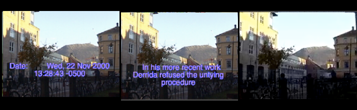

Figure 1: *Welcome* (Miles, 2000) [^03chapter2_3]

Miles set out a simple set of rules for videoblogs. Coming out of a
hypertext tradition and with years of practical experience with film and
video, in *The* *Vogma Manifesto*, Miles wrote that a ‘vog’;

> respects bandwidth \
> is not streaming video (this is not the reinvention of television) \
> uses performative video and/or audio \
> is personal uses available technology experiments with writerly video
> and audio \
> lies between writing and the televisual explores the proximate
> distance of words and moving media \
> is Dziga Vertov with a mac and a modem.[^03chapter2_4]

Miles’ definition is useful for a number of reasons. Firstly, it was one
of the first attempts at theorising online video, written at a time when
posting a video on the internet was incredibly difficult, hence the
first rule; respecting bandwidth. It is also interesting in that it
distances online video from the televisual through the rejection of
streaming technologies. Thus, Miles’ definition has already defined the
online video as a discrete, limited format, one which has a clearly
defined beginning, middle and end, and stands alone in a potential sea
of other online videos. It also sets the videoblog apart from live
streaming technologies that were to flood the internet a few years
later, Justin.tv being a notable example. Miles also defined the online
video as ‘personal’, a definition that may have excluded a number of
practitioners who considered themselves ‘videobloggers’ but who did not
make inherently personal content (see for instance *Galacticast*, *Epic
Fu* and *Chasing Windmills* – these shows were videoblogs but not
‘personal’). Lastly, Miles’ definition nods to the filmmaker Dziga
Vertov in an attempt to provide historical antecedents for online video.

In between these early experiments, most people accepted that the
combination of low bandwidth and dispersed video standards meant that
online video would have to mature sufficiently before becoming useful.
Despite these early instances of video-in-a-blog, the practice of
videoblogging as we think of it today didn’t really begin until 2004. In
a seven second long videoblog posted to his site on the first of January
2004, Steve Garfield declared 2004 ‘the year of the videoblog’.[^03chapter2_5]
Garfield, a video producer and editor, had started blogging in 2000, and
being convinced the internet had more to offer, he had started tinkering
with video in 2002. From his home in Boston, Massachusetts, he was
determined to make videoblogging the next new big thing. This was also
the year Jay Dedman and Peter van Dijck got together to start the
Videoblogging Yahoo Group, an email list that would act as the central
hub for videoblogging activity and community, from its inception till
the community more or less disbanded in 2009. Dedman and van Dijck met
in 2002. Van Dijck, originally from Belgium, had relocated to New York
for work and had a small place in Harlem. He and Dedman got on well, and
would spend a lot of time walking around the parks of New York
discussing the future of robots. They were both technically literate.
Van Dijck moved to Hoboken soon afterwards, but the two stayed in touch.
A couple of years later, on one of their walks, they started talking
about video. Dedman, a video-editor, was working for the Manhattan
Neighbourhood Network (MNN) at the time, and was getting frustrated with
the community television model. They used to hang out, bounce ideas off
each other and put the world to rights. After a long walk in Central
Park one evening, they hit upon the idea of posting video to the
internet. They both got very excited. Soon after, in May 2004, they
discovered Steve Garfield’s videoblog and figured the best way to get
people to work together was to create a space they could meet. Distance
was an issue though, so the space would have to be virtual. On the
evening of May 31st they created the videoblogging mailing list.

The email list was an interesting choice. Not only did it connect people
who lived in geographically disparate places and bring them to a shared
space online in which they could communicate, it also gave them the
opportunity to reach all the members by sending just one email. Slowly,
the users began to treat the email list as a form of membership list.
This emphasised a sense of inclusion and shared ownership of the
videoblogging project. As more people joined, older members would greet
new members, and the group would mostly self-regulate in terms of
community behaviour and expectations. The email list also had an
automatic archiving function which was important in that it gave the
fledgling community a sense of how it was growing and developing shared
traditions and norms.

Peter Van Dijck posted the first message to the Yahoo videoblogging
email list (hereafter referred to as ‘the email list’) on June 1st 2004.
His main focus was providing technical support, but Dedman insisted that
they needed a community of users. This idea of building a ‘community’
around a new technical medium product or technology was not new, of
course. However, rather than being generated by a large corporation
seeking to sell a product, such as Apple who actively used
community-building early in their history, these individuals were first
and foremost excited by the potential of new forms of expression on the
internet. To Dedman, it wasn’t enough to discuss this amazing new
ability to put video on the web, they needed to bring more people into
the conversation. The pair were quickly joined by others, including
Garfield, Adrian Miles, Anders Haugstrup Pedersen, an MA student based
in Copenhagen, and Mica Scalin, an artist who saw online video as
allowing the medium of web content to ‘truly come into its own and begin
establishing its unique language’. It attracted her, she said, ‘because
of this unique combination of traits in a visual medium. What is
most interesting to me is that it provides a way to tell a story that
could eliminate worn-out narrative forms.’[^03chapter2_6]

The first flurry of messages on the email list was mostly technical, but
there were also discussions, and theorisations about the medium and its
potential. For the first 4 months there were less than 50 members on the
list, with an average of 300 messages sent each month. In December 2004
this jumped to over 1000 messages, which led the way into one of the
most active years in the history of the community.[^03chapter2_7] On July 9th 2005,
Adam Quirk, initiated and hosted the first ever Vloggercue (videoblogger
BBQ) on his roof-top in Hoboken, New York. Quirk had started
videoblogging in 2004 when there were only a handful of people on the
videoblogging list. An introvert, Quirk had found it difficult to get to
know people after he’d moved to the city with just his girlfriend and
his cat, and videoblogging afforded him the chance to ‘have
conversations with these other people online and experience some kind of
socializing without having to resort to going to bars and meeting
strangers face to face’. Vloggercue 2004 was attended by a small group
of videobloggers, among them Jay Dedman, Steve Garfield, Bre Pettis (who
started the website *We are the Media* and would go on to found
MakerBot), the founders of Blip.tv, Josh Leo (one of the youngest videobloggers at the time,
and later host of the web show *Daily Kawaii*) and Chris Weagel (who
found success with the daily – and slightly absurd – videoblog
production company *Human Dog*). This was the first time many of the
videobloggers had met in person.[^03chapter2_8] Also present was Joshua Kinberg,
who would go on to make FireAnt, and Ryanne Hodson, co-creator of
freevlog.org, both of which I explore more fully later. The event was a
huge success, both in terms of getting together to discuss technical
issues with videoblogging, but also in terms of forging bonds between
the members of the group. The night even inspired some romance, with
Hodson and Dedman soon after becoming a couple.

Despite the increasingly activity on the email list and occasional
events within the community, videoblogging remained a niche activity,
limited to a small group of people who mainly hung out online and
thrived on the process of sharing their experiences and learning from
each other. This all changed on the 21st July 2005 when Rupert Howe – a
website designer and amateur film maker living and working in London, UK
– posted a short video, *Should I Stay or Should I Go* (figure 2) on his
blog, *Fat Girl In Ohio*. Despite never formally studying film (he read
classics at Oxford and hated it), Howe’s great passion had always been
the cinema, so it made sense for him to name his blog after the famous
quote by filmmaker Francis Ford Coppola, who once said that his

> Great hope is that now that \[we have\] these little 8mm video
> recorder people who normally wouldn’t make movies are going to be
> making them. And, you know, suddenly one day some little fat girl in
> Ohio is going to be the new Mozart, and you know, and make a beautiful
> film with her father’s little camera-corder and for once this whole
> professionalism about movies will be destroyed forever and it will
> become an art form.[^03chapter2_9]

*Fat Girl In Ohio* was Howe’s second videoblog. In the spring of
2005 he had been working for his father, but he was bored and spent his
days making short videos which he posted to a blog[^03chapter2_10], and messing around
on the internet. Without a distribution network, Howe had been emailing
the videos to his friends and his blog had little or no traffic. Again,
this was all about to change.

Although individuals had created personal webpages (home pages) for
years, Pyra Lab’s launch of Blogger in 1999 contributed to changing how
people interacted on the internet. Blogger was a publishing platform
that allowed individuals without any previous skill to run their own
blogs easily and free of charge. The term weblog was coined by John
Barger in December 1997 whereas the more popular term ‘blog’ was coined
by Peter Merholz in April/May 1999. The terms were used to signify a
personal homepage that was distinctly different from a personal home
page. Instead of a static web page with text, links and images, blogs
are ‘web-based journals in which entries are displayed in reverse
chronological sequence’.[^03chapter2_11] As early adopter and early weblogger
Rebecca Blood points out, there have been personal websites that have
subsequently been identified as ‘blogs’ since 1998. Initially, there
were very few of these weblogs, which meant that – similarly to the
early videoblogging community – the bloggers were all reading each
others posts. With the launch of Blogger and what she calls the
‘post-Blogger explosion’ the nature of blogs changed. Whereas the early
community of bloggers had been concerned with the ‘web at large’, the
new bloggers treated their sites more like a diary and these blogs,
which were often updated several times during the day, were ‘a record of
the blogger’s thoughts: something noticed on the way to work, notes
about the weekend, a quick reflection on some subject or another.’[^03chapter2_12]

Similarly, danah boyd traces the development of the early blogging
platforms, including Typepad, Diaryland and Live Journal as well as the
evolution of the definition of blogging. Whereas most early theorisation
of blogs attempted to define it as a genre of writing, boyd finds it
more helpful to ‘reframe blogs as a culture-driven medium upon which the
practice of blogging can occur’. She argues that within the context of
communication, ‘a medium is the channel through which people can
communicate or extend their expressions to others’ in a similar way that
paper is the medium of writing. Drawing on McLuhan, boyd contends that a
medium allows people to express themselves and asserts that ‘blogs are
precisely this; they allow people to extend themselves into a networked
digital environment that is often thought to be disembodying. The blog
becomes both the digital body as well as the medium through which
bloggers express themselves.’[^03chapter2_13] This is a useful way of thinking
about blogs and is relevant for the way in which videoblogging later
developed. Through blogs, wikis and message boards, the idea was that
previously passive readers became active writers and producers of
knowledge. Through aggregation and syndication, the individual user
could create her own media stream.

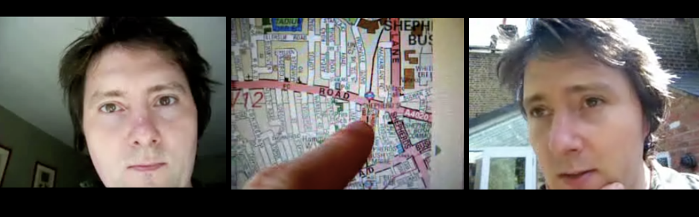

Figure 2: *Should I Stay or Should I Go* (Howe, 2005)

In his video *Should I Stay or Should I Go*, Howe moves around in his
London home, talking, more or less coherently, directly into his
handheld camera, a Kodak dx7440, about his reactions to a terrorist
attack. Rupert told me he was recommended that particular camera by
Andreas Haugstrup Pedersen, another videoblogger on the email list,
because he ‘liked the colour in his videos.’ This is interesting in
relation to an already evident aesthetic consideration of videoblogging
practice. At one point, the camera cuts to a map, trailing Howe’s finger
to show how close he lives to the location of the attacks. The cuts are
fast, and longer sequences have been trimmed to make the video snappier
and flow better. After a sharply edited section in which he discusses
his feelings about the attacks, Howe moves into the garden. Flooded in
natural sunlight (he was shooting on this small, handheld camera, with
no additional ‘production values’ such as lighting, sound or crew), he
makes a short, but bold statement about how he will not leave London –
instead he will take his sister and nephew to the park and spend a
normal afternoon with them. As he puts it, ‘I guess… we’re not afraid’.
*Should I Stay or Should I Go*, (QuickTime, 2:47, 320 × 240) was shot,
edited and produced in Howe’s home in Shepherds Bush in 2005, and showed
him talking directly to the camera about his reactions. The video
footage had been shot on the day of the explosions.[^03chapter2_14]

Like Kontras, Miles and Garfield before him, Howe posted his video on
his small, relatively unknown videoblog, but the video was picked up and
featured on the online edition of the *New York Times*. Howe was not a
journalist, nor a filmmaker, nor a public person. He was an amateur
video-maker with a camera and an internet connection, talking about an
event that was lacking a personal video side to the story. This was a
format that was new and fresh and seemed to speak from the heart –
giving it a personal, on-the-spot situational quality, which was
magnified by the technical limitations of the medium of video. Howe was
one of the first to experience the world of new and old media feeding
off each other in challenging ways.

I highlight *Should I Stay or Should I Go* for three reasons. The first
is personal. Although it was by no means the first video posted online,
the video marked my own discovery of the use of video, as opposed to
text, within the blog format. Despite having read (and written) blogs
for a while, I had never before seen anyone use video to communicate
through their website, and my reaction to Howe’s video was a mix of
fascination and excitement. The intimacy channelled through the video
(mostly close-ups of Howe’s face, with his home always in the
background) seemed different to me to the mainly text-based blogs I was
used to reading. I was inspired to watch other videos on his blog, and
later, to follow the links in his sidebar to other videoblogs. From
there, I discovered an entire community of videobloggers, and I was
fascinated by the many videos, genres and topics covered, from the
political to the personal, videos about families, children and cats,
videos captured whilst the videoblogger was at work, walking down the
street, or just rolling out of bed. It seemed to me to raise a number of
interesting questions in terms of artistic expression, identity and
community. On one level, therefore, *Should I Stay or Should I Go,*
marks one of my personal starting points for not only videoblogging and
the community of users, but also my interest in the practice and –
eventually – this book.

Secondly, the story arc of Howe’s videoblog (initially small in scope
and entirely personal, followed by massive attention from mainstream
media, and eventual disappearance) is an example of the instabilities of
videoblogging as media-form, especially in its early days. In this case,
the cause was partially economic. Howe had to take the video offline
because he could no longer afford to keep it online. This instability,
in Howe’s case, wasn’t altogether positive, however. As a result of the
feature in the *New York Times* the traffic to his site grew
exponentially, eventually resulting in him having to take his entire
website down. This is because bandwidth has a political economy that has
been hidden by the rise of YouTube. Essentially, the website owner pays
for bandwidth and when that usage is exceeded the website is
disconnected.[^03chapter2_15] His mention in the *New York Times* meant hundreds of
thousands (or even millions) of visitors from across the world visited
his site, and watched his videos. Before the days of free online video
hosting, Howe was paying for his own traffic, and suddenly found himself
in a situation where he owed his Internet Service Provider (ISP) large
sums of money. As he told me, ‘The rate was something like £10 per
additional 1GB, and the files would have been around 5-6mb per minute
(at 750mbps) and around 3 mins - so say 18mb each. That means I would
have maxed out my allowance with 555 views. And then had to pay £18 for
every 1,000 views after that. So 10,000 would have been £180 and so on
with no realistic proposition of getting anything back from advertising
or \[merchandise\]. That was much more than I had to spend.’ I should
also add that the bandwidth costs weren’t Howe’s only reason for
removing his blog. As he explained to me after he ‘got profiled in the
*New York Times*, and I got a lot of hits, \[I\] got afraid of being
found out by people I worked with. So I took my site down.  I really
really really regret this. I got freaked out by it and walked
away.’[^03chapter2_16]

My third reason for mentioning *Should I Stay or Should I Go* is that it
can be seen as an example of the practices that emerged in the early
2000s that contributed to the increased number of users with little or
no previous technical knowledge who entered and started participating in
a global media landscape.[^03chapter2_17] And it is an early example of how this
could be achieved through the medium of film. *Should I Stay or Should I
Go* thus represents a meeting point between citizen media (Howe was
engaging in debate with other citizens about terrorism), citizen
journalism (Howe was reporting on where the attacks took place, what
some of the early news and reactions were), personal media (Howe was
talking from a subjective position, about the concerns of his own family
and doing so from within his own home. Howe also used his own private
equipment and initially shared his video mainly to a small community of
friends, i.e. other videobloggers) and user-generated content (Howe’s
video was featured on the New York Times website alongside works by
their own journalists).

Howe felt he was left with no option but to remove the entire site.
However, videoblogs were unstable in other ways too. There was, for
instance, no standard format that was used by all videobloggers. Whereas
some preferred to encode their videos using Apple’s QuickTime, others
relied on Windows’ media player or one of many Flash players available
across the internet. Sites such as YouTube, Blip.tv, Vimeo and others
all had different players, which would display videos in slightly
different ways. For example, some players, like the Blip-embedded
plug-in, allowed the viewer to navigate within the video being shown (by
pausing, fast forwarding or stopping) but also browse through the entire
archive of videos by the artist they were watching. In contrast, at the
time, if a videoblogger used YouTube, the viewer could only access other
videos at the end of the current one. Digital formats (or codecs) could
easily change and/or became obsolete, sites were moved and links broken,
and some formats (such as Flash) might play nicely on the web, but not
on mobile devices (such as the video compatible iPod, and, later, the
iPhone).[^03chapter2_18] Technologically, therefore, videoblogs were susceptible to
vanishing due to their instabilities and shifting versioning of the
underlying technical a priori.

From a social or cultural point of view, and particularly within the
community of these early videobloggers, there were intense debates about
what videoblogging *was*. Some contributors refused to define it, while
others insisted on making strong links with, for instance, televisual
techniques and aesthetics, blogging, or amateur film. Some videobloggers
also wrote or created manifestos for videoblogging, causing large
disagreements and debates. For instance, the video manifesto *Vlog
Anarchy* by Michael Verdi, Haugstrup and Shoot’s *The* *Lumiere
Manifesto* and Adrian Miles’ already referred to *Vogma Manifesto*; the
latter two both reminiscent of the Dogma 95 manifesto written by
filmmakers Lars von Trier and Thomas Vinterberg back in 1995, with
strict principles of digital ‘austerity’. These debates from both within
the community and in the more general arena, were coupled with the
question of what videoblogging was *for*.

Some people, like the creators of *Galacticast* (galacticast.com), *Epic
FU* (epicfu.com) and *Ryan Is Hungry* (ryanishungry.com) would later
attempt to monetise their videoblogging activities, relying on
advertising, sponsorships and corporate investment to generate income.
There was also awareness within the community of the inherent problems
with attempting to make money, as Howe commented on the email list. ‘I
would never pay \$3 for a video to my phone,’ he asserted, ‘But then I
watch all these people’s videos for free on my iPod every day.’ Most
practitioners treated their videoblog as a personal diary, a visual
archive of their lives, and argued that they would never dream of trying
to make money from videos they saw as highly personal. After a
particularly unpleasant exchange between a new member and the ‘core’
community around the buying and selling of domain names, Steve Watkins,
an active member who would often write long, considered replies to
issues, stated bluntly that ‘business and money often get a bit of a
rough ride here, as they do elsewhere on the net. Some people have
ideals about the net and what is happening with vlogging which doesn’t
really have much to do with profiteering.’[^03chapter2_19]

So, for example, Jen Gouvea, who lived in San Francisco with her
boyfriend Kent Bye, ran a website exploring the ‘internal and external
approaches to social change and how the two are reciprocal.’ The pair
had started videoblogging as a way to communicate, they made videos
about ‘spiritual activism’ and used their online presence to promote
spirituality and well-being. Gouvea had no previous camera experience,
so she kept her videos simple with few edits. Having grown up without a
lot of technology in her life and considering herself a ‘bit of an
introvert’, Gouvea never posted videos about her everyday life, yet told
me her videos were ‘sometimes almost too personal, to a point where it
might only make sense to me and a few select initiated’. Some tried to
find ways to use their videoblogging skills to generate income in
tangential ways. Another videoblogger, Adam Quirk, told me
‘I don't think videoblogging itself will ever pay the bills, but I think
I can find ways to make money through other projects related to it, such
as creating video ads for other companies, or selling products through
our video blog’. These different approaches to videoblogging as a
practice, as a medium, as a distribution network and through various
moments of contestation and debate, were reflected in the debates over
lack of a coherent and stable definition of videoblogs, especially in
its early days.

As mentioned in the last chapter, in September 2005, Tim O’Reilly,
entrepreneur and publisher, announced the contours of what he called the
‘Design Patterns and Business Models for the Next Generation of
Software’, thus launching what became known as Web 2.0. In computing, a
2.0 upgrade (from a 1.x version of a program) indicates significant
changes and improvements. Likewise, Web 2.0 indicates a significant
upgrade, or shift in the how the web works. Examples of Web 2.0
technologies include the move from static to dynamic webpages, the
increase in user-generated content and the growth of social networks.
Andrew Keen argued that Web 2.0 is ‘Socrates’s nightmare: technology
that arms every citizen with the means to be an opinionated artist or
writer’.[^03chapter2_20] Keen despaired at the ‘cult of the amateur’, a culture
that merges the ideology of the 1960s counterculture with the techno
fetishism of Silicon Valley to produce ‘an ideology \[that\] worships
the creative amateur: the self-taught filmmaker, the dorm-room musician,
the unpublished writer. It suggests that everyone – even the most poorly
educated and inarticulate amongst us – can and should use digital media
to express and realize themselves.’[^03chapter2_21]

Within the contours of this book, however, Web 2.0 was an important
concept for three reasons. Firstly, the discourses and ‘hype’
surrounding the term were very important to the videoblogging community,
and its sense of emerging identity and practice. The promise of dynamism
and widened participation was important to the videoblogging project.
The growth of YouTube meant more people started to understand and
appreciate the work the videobloggers had been championing. Secondly,
the technical advantages that the Web 2.0 technologies offered (such as
seamless RSS syndication for instance) had an effect on the development
of the videoblogging platform. Thirdly, Web 2.0 ironically heralded the
beginning of the end for the videoblogging community. As the big Web 2.0
companies, such as YouTube, started to attract users, and Twitter and
Facebook became the key social networks for communication, video and
photo-sharing on the web, the videoblogging community began to
breakdown. So, Web 2.0 is important as a symptom for understanding the
problems videoblogging was facing at the time, whilst simultaneously
signalling the beginning of its transformation from craft practice to
being co-opted into industrialised global media systems.

As mentioned in the last chapter, in February 2005, Chad Hurley, Steve
Chen and Jawed Karim founded YouTube.com, at that point a rather small
Web 2.0 platform, allowing anyone with a video camera, computer, a
mobile device and internet access to watch and publish video content
online. The contribution of YouTube was to simplify the technical
process of videoblogging, leading to a transformation of online video
culture. This was a shift from the idea of the website as a personal
storage facility for video content to a platform for public
self-expression. It was also the beginning of a shift to a new political
economy for video online, although few at the time realised this.

We might think of the mass-media distribution model of the twentieth
century as a ‘one-way, hub-and-spoke structure, with unidirectional
links to its ends, running from the centre to the periphery’.[^03chapter2_22] These
structures facilitated the control of a small number of big media
corporations, whether private (commercial) or public (national), over
the media landscape. In contrast, the underlying internet protocols have
affordances towards networked and decentralised ways of transferring
information. Early commentators on the internet lauded it as an
alternative distribution model, without the gatekeepers of ‘big media’,
allowing anyone with access to it, the possibility of becoming an active
member of the public sphere. However, as the debates around net
neutrality show us, although the ‘old’ gatekeepers of the media are
losing some of their power, there are new gatekeepers emerging that
control both access to, and interactions within the web itself, be it
Google, Amazon, Apple or Facebook.

Until YouTube was sold to Google in October 2006, one of the fiercest
competitors in the video platform market was Google’s own Google
Video.[^03chapter2_23] The purchase of YouTube by Google is significant as it was a
deliberate attempt to bet on video as a key cultural force online.
Google’s acquisition was not just about ‘bringing innovative technology
into the home, as its own GoogleVideo was already running on superior
software; it was about bringing in communities of users’.[^03chapter2_24] YouTube
had the largest number of users of any Web 2.0 platform at this time,
and securing access to this user-group was clearly one of Google’s aims
with the acquisition. This strategy was similar to Facebook’s later
purchase of Instagram in April 2012 and News Corp’s less fortunate
purchase of MySpace in 2005.

Signifying this shift towards user-generated content in 2006, Time
Magazine designated person of the year as ‘you’ – the everyday person
uploading, sharing and disseminating content across the internet. In the
issue, ‘the editors paid tribute to the millions of anonymous web users
who dedicate their creative energy to a booming web culture’[^03chapter2_25]. In
contrast to Thomas Carlyle who argued that ‘the history of the world is
but the biography of great men’, Time highlighted that alongside stories
of war and conflict (in Iraq, Israel and Lebanon), 2006 offered an
alternative story, one in which participatory culture and the global
media landscape began to merge.

The shift from the individual, personal website as the main source for
video content, to platform-based sharable media, was a perfect fit for
the ideas about a user-led revolution that characterizes rhetoric around
Web 2.0. As the Time article argued, 2006 was

> A story about community and collaboration on a scale never seen
> before. It’s about the cosmic compendium of knowledge Wikipedia and
> the million-channel people’s network YouTube and the online metropolis
> MySpace. It’s about the many wresting power from the few and helping
> one another for nothing and how that will not only change the world,
> but also change the way the world changes.[^03chapter2_26]

It is an interesting footnote to these larger media tectonic shifts
that, at a more prosaic level, by December 2006 the videoblogging email
list membership had risen to 1000 members.

As YouTube began to fight a number of copyright claims from the large
media conglomerates because of users uploading clips from movies and
television, videoblogging also began to encounter legal issues. If there
was a breach of copyright law, a video hosting site (such as YouTube or
Vimeo) must remove a video immediately to avoid itself becoming
embroiled in a copyright claim. There were debates around issues of
copyright, with writers such as Lessig arguing that the US copyright
laws had begun to place substantial limits on creativity.[^03chapter2_27] These
factors were in danger of encouraging a ‘precautionary’ environment in
relation to online video in particular. If users began to be worried
about possible expensive legal issues from uploading a video with a
snippet of background music or video, this would have chilled the growth
of video usage in social media. The worry was not just that casual users
might be caught up in dragnet copyright suits – but also political
movements, activists and others might have copyright used to silence
them. Indeed, new and innovative music, artists and video
experimentation might also be inhibited. The use of the notion of a
‘safe harbour’ was crucial to these developments, but a side effect was
that media sharing sites became (over)zealous in the removal of any
content that could be considered to be copyright infringing.[^03chapter2_28]

These ideas and others were picked up and developed in 2007, when Geert
Lovink and the Institute for Network Cultures in Amsterdam organised the
first *Video Vortex* conference. The conference, which ran seven
workshops over five years and produced two books, attempted to
contextualise the developments in the emerging field of video-based
media on the internet and critically engage with questions surrounding
‘art online, visual art, innovative art, participatory culture, social
networking, political economy, collaboration and new production models,
censorship…YouTube, collective memory, cinematic and online aesthetics’.
Over the years, some videobloggers were invited to the *Video Vortext*
conferences, including Andreas H. Pedersen and Brittany Shoot (who wrote
*The Lumiere Manifesto*),[^03chapter2_29] Michael Verdi, Adrian Miles and Jay
Dedman. Within the videoblogging community, these invites were seen as
indications that videoblogging was being recognised within academia and
a further legitimation of their practices.

It is important to keep in mind that the internet today is very
different from the internet in 2004. Although many of the issues that
were raised and discussed in 2004 remain relevant today, the way in
which they were debated and the concerns they prompted were experienced
in a different milieu. This historical dimension is crucial for
understanding media as I believe a comparative approach can be very
powerful in relation to understanding the kind of media disjunction that
videoblogging signified. Consequently, at this point I want to take a
historical detour to think about previous iterations of film and video
technology, and also how artists, filmmakers and theorists thought about
these changes. The aim is to broaden the connections and to start to
make links to the continuities and often explicit references
videobloggers made to this previous history.

For example, we might recall that in 1929, Dziga Vertov released *Man
with a Movie Camera* which, in his words, was ‘an experiment in the
cinematic communication of visible events without the aid of
intertitles, without the aid of a scenario, without the aid of theatre’.
The film followed Soviet citizens as they went about their everyday
lives, working, playing, and interacting. Yet the movie was not shot as
a narrative story, rather, Vertov shot the movie over four years, and
the footage was later edited together from what we might now call a vast
database.[^03chapter2_30] The film is lauded for its experimentation with a range
of different cinematic techniques, yet it’s greatest contribution is
perhaps its message that the camera can travel anywhere, and capture
anything from any angle, position or placement. Vertov’s influence on
later film and video movements stems from his concept of the camera as
an eye (the *kino-eye*);

> An enhanced eye, beyond human perception, that catches life unawares,
> understood as “that which the eye does not see,” as the microscope and
> telescope of time, as the negative of time, as the possibility of
> seeing without limits and distances, as the remote control of movie
> cameras, as tele-eye, as X-ray, as “life caught unawares”. Kino-eye as
> the possibility of making the invisible visible.[^03chapter2_31]

The kino-eye, however, is not transparent, in that it also foregrounds
its own construction as formal intervention, as mediation, and hence
adds artistic value to whatever is being created. As Dawson argues,
Vertov proclaimed ‘primacy of the camera itself (the ‘kino-eye’) over
the human eye \[…\] He clearly saw it as some kind of innocent machine
that could record without bias or superfluous aesthetic considerations
(as would, say, its human operator) the world as it really was’.[^03chapter2_32]

Vertov’s influence on film has been widely discussed and remarked upon,
but interestingly his work also consciously or unconsciously inspired
the practice of videoblogging. Videobloggers followed one or more of
Vertov’s elements in their work. Whether they explored everyday life,
interactions with other videobloggers, stories with clear conventional
narratives or more experimental videos, their cameras –
like the kino-eye – acted as an extension of their own eyes looking out
on the world, catching life candidly and often blind to traditional
cinematic conventions. Like Vertov, the videobloggers didn’t try to hide
the camera, technology and tools they used as part of their practice.
Instead, by making these elements part of the aesthetic itself, they
added a specific Vertovian vernacular aesthetic to their work that has
subsequently become recognisable.

It would be fair to say that the history of moving images presents a
series of cyclical phenomena, or repeating commonplaces[^03chapter2_33] – which,
when placed side by side, might induce in the media historian a sense of
*déjà vu*. Erkki Huhtamo uses as an example the similar reactions from
the audience watching Étienne Gaspard Robertson’s *Fantasmagorie* shows
in Paris towards the end of the 18th century, and the first presentation
of the *Cinématographe* by the Lumiére brothers, famously showing a
train arriving at a train station (*L'Arrivée d'un train à La Ciotat*,
1895). Huhtamo also draws similarities to a more recent display of such
immersive performances, the ‘stereoscopic movie spectacle *Captain EO*,
the ‘onslaughting’ aspect of which has been enhanced – in addition to
the customary 3-D effects – by laser beams, which are released as if
from the screen world to the audience space’. What connects these
seemingly different experiences, is what Huhtamo calls *topoi*, what he
refers to as commonplace formulas that act as ‘building blocks of
cultural tradition’.[^03chapter2_34]

I think it is helpful to use these ideas to consider the way that
‘topics of media culture… are recurring, cyclical phenomena and
discourses that circulate’. This allows one to think of moments in media
history as ‘motifs that are recurring – whether as more general cultural
phenomena… or in more tactical use’. I also want to link to Zielinski’s
work and the notion of an archaeology of videoblogging that ‘does not
follow a divine plan’ but instead acknowledges ‘an interest in and a
need for new ways of understanding media cultures outside the
mainstream’.[^03chapter2_35] In other words, I am interested in tracing the
development of certain *motifs* that can be seen as recurring in the
history of film, video and digital media. These often fall into the
following forms; (i) *significant technological advances*, in this case
small, handheld cameras, making portability and mobility not only
possible, but desired; (ii) *the relationship between technical change
and aesthetic change*, for instance the employment/development of
certain narrative techniques, such as talking directly to the camera, as
opposed to the more traditional voice-of-god-style of narrative; (iii)
*community*, the coming together of individuals to form communities of
practice, experimentation and technical expertise. Indeed, the
videobloggers might have seen themselves as pioneers in a new visual
medium, but these motifs appear in many previous instantiations of
amateur video production, both past and present, and by reflecting on
the similarities and differences we can learn a lot about the
motivations, trajectories and inspirations for the subsequent
development of videoblogging. Nonetheless, it is helpful to follow the
call to start in the middle, ‘from the entanglement of past and present’
and explore ‘the part-futures and future-pasts, as well as parallel
side-lines of media archaeology.’[^03chapter2_36] This should not distract from
seeing what is distinctive in particular historical constellations
around media-forms. That is, that although there may be similarities and
continuities, there are also discontinuities and disjunctions.

To illustrate the way in which videoblogging sought continuities as well
as contrasts with previous media forms, take the example of a discussion
on the videoblogging email list in November 2009. Here, Rupert Howe made
a point that a video he had watched that morning ‘however pretentious
you may think this sounds… really \[is\] carrying forward and
reinventing the tradition of observational documentary filmmaking that
can be traced back through Direct Cinema, Cinema Verité and Kino Pravda
all the way to the Lumiére brothers’ first films’. This was not the only
comment of its kind to be made on the email list. The other members
often brought up cinematic styles or theories – drawing comparisons with
videoblogging or recognising the debt their practice owed to video and
film pioneers of the past. For instance, as commented by Adrian Miles on
the email list in February 2005, there were clear attempts made to
position videoblogging in a wider history of film and cinema. As he
argued;

> There’s Astruc’s famous camera stylo… Chris Marker’s experiments with
> video (he has whole series of two and three minute works that to a
> contemporary eye are vogs), and of course Vertov’s numerous manifestos
> and dreams in the 1920s where he explicitly called for filmmakers to
> be distributed everywhere contributing from everywhere and the work
> being collated and shown nationally. What he was describing of course
> we would recognise as CNN.[^03chapter2_37]

In many ways, then, there was certainly a knowledge of early forms of
cinema amongst the videobloggers, and some of the early videoblogger
practices could be mapped onto Vertov’s checklist, including ‘rapid
means of transport, highly sensitive film stock, light handheld film
cameras, equally light lighting equipment and a crew of super-swift
cinema reporters’.[^03chapter2_38]

I believe it is crucial to position videoblogging within the context of
this history of early cinema. As others argued, ‘most so-called new
media have been imagined from a cinematic metaphor’.[^03chapter2_39] Indeed, cinema
itself exists in what Rodowick calls an ‘expanded field’ – which means
that entertainment was not necessarily cinema’s intended function,
rather, ‘there have been very distinct uses of the cinematograph and the
moving image, as well as of the recording and reproducing technologies
associated with them, other than in the entertainment industries’.
Elsaesser gives the example of cinema’s medical and scientific use,
military and surveillance use, censoring, monitoring as well as ‘the
sensory-motor coordination of the human body in classical cinema.’[^03chapter2_40]
Renov further reflects on cinema’s ‘potential for the observation and
investigation of people and of social/historical phenomena’.[^03chapter2_41] Tom
Gunning argues along similar lines, pointing out that a ‘full
understanding of film’s relation to technology demands more than a
longer span of diachronic history’ and that, instead, the history of
film needs to be read alongside a ‘wider system of interlocking
technologies which compose the terrain of modern experience’.[^03chapter2_42] These
observations apply equally to the development of videoblogging, which
has become more important as a cultural practice in recent years.

Here it is worth mentioning Steve Neale’s approach to cinema, which is
important for the way he bridges two separate schools of thought in
cinema history; the first in which film technology is treated as ‘a
self-contained sphere with a self-contained history’, a chronological
account in which ‘each new feature or process either displaces those
already in existence or else simply adds to them, increasing the stock
of technical resources available’; the second being completely engrossed
with the concept of realism and the indexical which ‘works from the
premise that the sounds and images comprising films are linked
ontologically to the objects that the microphone and camera record’.
Neale draws on the theories of Bazin and Kracauer, which explore a
contradictory and troubled relationship with technology. Here, the
advances in technology allow for more realistic cinema, yet this
increased use of technology leads to it’s complete disappearance, with
representation and technology being repressed, along with the film
industry itself. Neale develops a ‘counter-approach’ by locating
technological innovation within aesthetic, ideological and economic,
scientific and technical contexts, all of which exist within the broad
umbrella of the film industry.[^03chapter2_43]

Of course, the invention of the movie camera and the subsequent
development of film have had far reaching effects on what we now call
the cultural industries, but also on the growth and reach of amateur
cultural production. In this context, the movie camera and – later – the
video camera allowed ordinary people the opportunity to create moving
images, whether within the context of the home, or in a wider societal
context. As mentioned above, Vertov’s ‘checklist’ for *Man With A Movie
Camera* has inspired many subsequent manifestos for filmmaking and
film-makers. Vertov’s distinctive kind of self-reflective cinema, in
which the viewer identifies themselves with the filmmaking process,
doesn’t reappear until the end of the 1950s, most notably in the work of
filmmakers like Chris Marker or Jean-Luc Godard, described the 1972
translation of Vertov’s writings as the ‘cinematic equivalent of
Chairman Mao’s ‘Little Red Book.’[^03chapter2_44] Vertov’s influence can also be
seen reflected in the *Dogme manifesto* (written by Lars von Trier and
Thomas Vinterberg in 1995) and the ‘10 Golden Rules of Lomography’,
which encourages a similar method for capturing photography, based on 10
‘anti-rules’, ‘clearly intended to offer resistance to the ways in which
the rules of “professional photography” repress “ordinary” creativity
and continually redraw the boundaries between amateur and
professional’.[^03chapter2_45] Vertov also continues to inspire film and photography
movements in the digital age.[^03chapter2_46] Here though, I want to draw attention
to its use as an inspiration directly for videoblogging, particularly,
Adrian Miles’ *Vogma Manifesto*, a list of ‘commandments’ for early
videoblogs, and Pedersen and Shoot’s *Lumiere Manifesto*. The
videobloggers drew on this cinematic history and made a point of
connecting lineage to it. Miles even went as far as proclaiming that
videoblogging, or vogs as he called them, were ‘Dziga Vertov with a mac
and a modem.’[^03chapter2_47]

Where Vertov concentrated on the visual power of cinema, with the camera
as an enhanced eye through which the world could be captured, the French
critic and film director Alexandre Astruc conceived of the camera in a
more literary tradition, as a pen, which he called the *caméra-styló*,
another cinematic metaphor frequently referred to on the videoblogging
email list. Miles, for instance, remarked that ‘a camera in your phone
is pretty much Astruc’s Camera Stylo isn’t it?’ For Astruc, the camera
follows the tradition of the literary, where ‘the idea of the camera as
a tool to write with – indeed twice over, first when you shoot and then
when you write the film on the timeline’ is in focus.[^03chapter2_48] He argued
that cinema developed a language, much like the essay or novel had done
previously. As Astruc argued, ‘new age of the cinema \[is\] the age of
caméra-styló (camera-pen)… the cinema will gradually break free from the
tyranny of what is visual, from the image for its own sake, from the
immediate and concrete demands of the narrative, to become a means of
writing just as flexible and subtle as written language’.[^03chapter2_49]

Astruc imagined that the breakthrough for film and cinema as an art form
would not come through the entertainment industry, where it had been
treated as a mere ‘fairground attraction’, but as ‘a fundamental tool
for human communication’. Astruc further argued that ‘with the
development of 16mm and television, the day is not far off when everyone
will possess a projector, will go to the local bookstore and hire films
written on any subject, of any form, from literary criticism and novels
to mathematics, history, and general science.’[^03chapter2_50] Although there is no
denying how important Astruc’s remark became to the pioneers of the
French new wave cinema of the late 1950s and 60s, his thoughts just as
well apply to video and the rise of videoblogs.[^03chapter2_51]

Although Atruc was correct when he suggested that these developments
within film and television would revolutionise media, it is also the
case that with film, cultural production was itself democratised in new
and unforeseen ways. For example, in the 1930s, as part of the
consciousness-raising propaganda machine in socialist Soviet Union,
Alexandre Medvedkin travelled across the Soviet Union on a *kino-poezd*,
or ciné-train, consisting of ‘three train carriages transformed into a
film-production studio complete with projection room and living
quarters’.[^03chapter2_52] Medvedkin’s ciné-train is interesting here because of
the production processes that were used.[^03chapter2_53] Medvedkin and his team
would stay in one place for a few days, make a film and screen it in
that same location. This meant that the feedback loop from conception to
completion was very tight and that the intended audience were also the
subjects of the films. The group’s motto was ‘film today and show it
tomorrow,’ an idea that is echoed in later film and video work. This
fast production-line system of capturing, producing and displaying film
was revolutionary, and, years later would inspire French film maker
Chris Marker to experiment with a similar process, when he worked with
the factory workers in Besançon. The ultimate aim of Medvedkin and his
contemporaries was to ‘hold up a transformative and coercive mirror to
the people, to show them the facts of their daily existence, which, once
reflected back to them, would provoke them to take their lives into
their own hands and *change*’.[^03chapter2_54] In other words, to break false
consciousness by making people aware of their own subjective position in
a larger objective movement of history. That is, to help people become
aware of their own place within society, culture and politics, and hence
become reflexive and critical actors.

This ‘film today – show tomorrow’ approach to film making can be seen
reflected in videoblogging work from everyday life, to conventions and
conferences. For instance, at Vloggercon 2005 – the first videoblogging
conference to move beyond the videobloggers own homes and incorporate
representatives from various start-ups and community groups – the
organisers would film panels all day and spend the nights editing and
uploading video so that those unable to attend would be able to take
part in the conversations as soon as possible. The fast turn-around of
videoblogging – most people I talked to would publish their videos
within a week of shooting – echoes Medvedkin’s attempt to close the loop
between filming and viewing, and is something that digital filming and
editing made easier.

We might also consider another history of amateur/documentary film
making known as ‘Militant Film’, or ‘experiments in *autogestion*’,[^03chapter2_55]
in which a group of workers at Rhodiaceta textile factory in Besançon,
known as *Groupe Medvedkine*, ‘emerged from a sustained *recontre* with
the French film maker Chris Marker’.[^03chapter2_56] Marker spent a period of time
in the factory, interviewing and filming the workers (not always with
the permission of the factory owners) and produced a film, *A bientot
j’espere* (*Be seeing you*, 1968), which explored life in the factory,
with focus on the factory occupation in 1967, following one worker in
particular, a young militant, Georges Maurivard. The aim, in Marker’s
own words, was ‘to give the power of speech to people who don’t have it,
and, when it’s possible, to help them find their own means of
expression’.[^03chapter2_57] What was important about this example is that although
the workers demanded better working conditions and increased pay, the
originality of the Rhodiaceta strike, and what places it as one of the
main influences of the protest movement that engulfed Europe in the
spring of 1968, was the workers’ demand for access to culture. Marker’s
work thus emerges out of a particular social and political context.
Videoblogging was equally emergent at a time of relative political and
cultural change, for example the 7/7 terrorist attack in London.[^03chapter2_58]
Personal video accounts of citizen engagement with political issues,
with video broadcast and shared on social media, contributed to debates
in the mainstream media, academia and beyond and led ultimately to a
growing recognition of the importance of vernacular video.

In 1968, when screening *A bientot j’espere*, Marker was strongly
criticized by a large proportion of the workers for romanticising their
struggle, exploiting the workers and misrepresenting the women in the
film; making them appear merely as wives, ‘rather than as workers and
militants in their own right’.[^03chapter2_59] In response, Marker supplied those
of the workers who were interested with filming and editing equipment,
as well as training in film production, and helped setting up a second,
parallel film company, which became the Besançon Medvedkin Group.
Intended to be more open and collaborative than Marker’s own work, ‘this
militant cinema would follow a collective and non-hierarchical model of
production, seeking to abolish the separating between expert and
amateur, between producer and consumer’. There were also parallels
between the Medvedkin group and the contemporary work of another French
film maker, Jean-Luc Goddard, who established the *Groupe Dziga Vertov*
‘with its parallel but ultimately irreconcilable claims for
self-reflexivity, collectivity, and class consciousness’.[^03chapter2_60] Indeed,
these fed into videoblogging in addition to Vertov’s notion of the
*kino-eye* and Astruc’s concept of the *camera-stylo* and have proven
hugely influential on both theories and practices of digital film and
videoblogging itself.

There were also videobloggers who used their practice as a way to both
engage with political issues, and indeed take political action. In
particular, the videoblogger Josh Wolf, who was arrested, and later
sentenced to prison, for refusing to testify before a U.S. grand jury.
When arrested, Wolf also failed to hand over unpublished video footage
he shot during a raucous clash on the streets between San Francisco
police officers and anti-G8 protesters in July 2005. The incident was
interesting because it challenged the relationship between the
videobloggers and the media. Like many a videoblogger at the time, Wolf
employed a discourse that was often scornful of corporate-controlled
media. He was freed on April 3rd 2007, after seven and a half months in
prison, when his lawyers reached a compromise with the federal
prosecutors. He eventually handed over the tapes, but was excused from
identifying any of the individuals that featured on the video. He
famously appeared on *The Colbert Report* on June 12^th^ 2007 where he
discussed with Stephen Colbert whether or not bloggers should be
classified as journalists, arguing that bloggers’ practices and subject
matter meant that they should be considered journalists even if they
lack official recognition.

I now want to zoom in on another important background for thinking about
videoblogging, namely the creation of home-movies. This is a practice
that can be traced back to the end of the 1890s. As an aesthetic, it
highlighted domesticity situated within particular cultural contexts,
allowing people to curate mediated versions of their own lives that
encouraged new ways of seeing the present and shaping their collective
memory. Through this form, people ‘negotiated their relationship with
their surroundings and sense of self’.[^03chapter2_61] The practice developed in a
period in which ‘amateur film was defined in economic and technological
terms rather than within social, aesthetic, or political
relations’.[^03chapter2_62] Zimmermann provides perhaps the most extensive overview
of amateur film in her exploration of the development and
conceptualisation of home movies from the early days of cinema (from
1897 onwards) until the late twentieth century. Her work shows how the
early developments of film cameras, film stock and projection equipment
had great influence on artists, entrepreneurs, workers and
hobbyists.[^03chapter2_63] What her account shows is that, given access to
equipment and technical knowledge of filmmaking, individuals were
allowed to play and experiment with the making of films, exemplified by
Stan Brakhage’s experimentation with splitting the lens and
non-camera-based film making. In a limited sense, then, home filmmaking
was potentially ‘democratised’ from the very beginning.[^03chapter2_64] However, it
actually remained a mostly private practice, especially in terms of
projection and viewership, for reasons of distribution and medium
affordances.[^03chapter2_65]

Zimmermann argues that amateur film from the 1950s can be seen in
parallel with the social, political and economic conditions in post-war
America. Zimmermann traces the development of what has been known as a
‘Do-It-Yourself’ (DIY) ideology - where the ‘domestication of amateur
filmmaking as a leisure-time commodity erased any of its social,
political, or economic possibilities’.[^03chapter2_66] It is interesting that
Zimmermann also makes links between gender, patriarchy and power,
although these issues are not at the centre of her study. Instead, she
traces the material conditions for amateur filmmaking,[^03chapter2_67] the
standardization of the 8mm equipment (over 16mm, first made commercially
available in 1923[^03chapter2_68] which became standard for semi- and professional
film making) and the development of what she calls ‘aesthetic control’
whereby many stylistic traits from Hollywood were incorporated into
amateur filmmaking in the domestic sphere. Among the avant-garde, on the
other hand, filmmakers were encouraged to break with aesthetic
conventions and ‘exploit their minimal budgets through exploration,
experimentation, and risk taking’.[^03chapter2_69] Here, we see a divergence
between amateur-domestic filmmaking, on the one hand, and avant-garde
experimentation on the other. This desire to break with conventions, and
push the aesthetic boundaries of the medium can be seen echoed in the
discourses of the videoblogging community. It is interesting to note
that those identifying as personal or everyday life videobloggers were
more likely to adopt more ‘traditional’ narrative structures.[^03chapter2_70]

According to Zimmermann, the rise in amateur filmmaking was assisted by
a number of factors, including increased free time for the middle
classes, a general increase in knowledge about technical equipment and
filming technique. This was due partially to publications such as
*Amateur Movie Maker* and *America Cinematographer*, which encouraged
‘technique and technical mastery as the first phase on the road to
achieving cinematic “perfection”’.[^03chapter2_71] However, despite being
constructed discursively as a private hobby, amateur film contributed to
the democratisation of media production, and digital affordances may in
the future ‘liberate it as a more accessible and meaningful form of
personal expression and social and political intervention’.[^03chapter2_72]

The political potential of moving images was brought one step closer to
fruition with the invention of video. Whereas Marker, and Medvedkin,
Vertov and Astruc had worked hard to utilise film in their art for
political critique and change, the emergence of video gave rise to a new
set of practices made possible by the more flexible medium of videotape.
Ina Blom persuasively argues that video ‘propels artists to take media
power in their own hands, using televisual techniques for the
non-instrumentalist purposes of art’.[^03chapter2_73] From the start, video was
always conceptualized as a personal, intimate medium. From the first
versions of the Portapaks to the miniature digital camcorders of the
late 1990s and early 2000s, video has always been ‘low to the ground and
potentially private, and intimate in use.’[^03chapter2_74] Indeed, in the 1960’s
Sony introduced the new category of the ‘industrial standard’
video-recorders and as Garcia explains, ‘these machines were the first
relatively affordable and easy to use video standard. What had been
until then the exclusive domain of the TV industry suddenly became more
widely available’.[^03chapter2_75] It is interesting how, throughout history, we
see a return to the same discourse regarding the potential for ‘ordinary
people’ to take control of their own media production and consumption.
One of the early movements to articulate these ideas was the Guerrilla
television movement.

In the 1971 Guerrilla Television Manifesto, Michael Shamberg outlined a
technological radicalism attacking commercial television, arguing that
it was ‘a conditioning agent rather than a source of enlightenment’ for
the masses.[^03chapter2_76] Video was seen as a decentralising force that had the
potential to bring forth a ‘Whitmanesque democracy of ideas, opinions,
and cultural expressions’. Integral to this was the idea that this new
form of video would be made by and for ordinary people. The ideas behind
Guerrilla television were articulated in Shamberg’s work, as well as in
the magazine *Radical Software* (published by the collective Raindance,
made up of, among others, Shamberg, Frank Gillette, Paul Ryan and Ira
Schneider). Shamberg was strongly influenced by Marshall McLuhan[^03chapter2_77]
and argued that the significance of the medium of video was ‘much
greater than that of a mere improvement of an old medium, that videotape
could be a powerful cultural tool’.[^03chapter2_78] He provides a theoretical
context for Guerrilla television, and this is also where his influences
are most strongly seen; arguing that ‘Americans are information
junkies’. He was also influenced by the cybernetics of Norbert Wiener and
Buckminster Fuller, with his theoretical exploration resting on four
elements; ‘a philosophy of media ecology, a critique of ‘Media-America’
and broadcasting, a belief in video as a remedy to this system, and a
tentative understanding of how computers might influence the future of
video.’[^03chapter2_79] Central to the movement was Shamberg’s belief that
‘guerrilla television gets cameras to the people to let them do it
themselves’, heralding a new age of media production by the people, for
the people.

Shamberg saw enormous potential for citizen journalism in the work of
the video-makers at the time, and it is tempting to draw parallels
between video collectives such as TVTV and Videofreex on the one hand,
and the early videoblogging community on the other. Shamberg wanted to
disrupt the media ecology of ‘Media America’, to empower individuals to
actively take part in their own media environment, because, following
McLuhan, he believed that ‘media and man evolve together’, and that
video represented the most important cultural technology of our time, as
it ‘frees film to become an art form’.[^03chapter2_80] Interestingly, in the early
days of the videoblogging community, individual members would often
volunteer at their local Apple store, teaching people simple video
editing techniques and how to start a videoblog. For example, Susan
Pitman, a single mother of two who videoblogged about her kids and went
under the moniker ‘kitykity’, told me she had given her first video
presentation at an Apple store in December 2005. The response from the
store indicated that there was a real interest in videoblogs and editing
skills, with Pitman telling me, ‘before I ever gave the presentation,
the lead instructor at the store told me that he wanted me to present
once a month, and to pick dates for the next couple months.’

Ryanne Hodson also volunteered teaching videoblogging at her local Apple
store, and Steve Garfield even set up the collective Boston Media
Makers, a small but regular media training workshop in Boston that still
continues to run. This volunteerism – and the enthusiasm and excitement
about videoblogging it reflected – was common in the early days of
videoblogging. It was also a reflection of how different and specialized
the practice was. We sometimes forget that most internet users had never
posted - or even watched – a video online at this point. This can be
seen reflected in a comment on the videoblog email list by Clint Sharp
who argued that;

> We’re doing something different that’s going to change things. I have
> no visions of being on a sitcom. I do have visions of someday
> professionally creating niche content or in some way doing video,
> audio and text related to technology. I do have visions of people
> being able to find content of interest to them that Television
> wouldn’t produce because 99% of people aren’t interested in it…
> There’s nothing wrong with the old media system… it’s just that we’re
> doing something different. Old Media has served us well for 50 years,
> but we’re changing things.[^03chapter2_81]

As with earlier forms of amateur and semi-professional media production,
the Guerrilla television movement would not have been possible had it
not been for the changes in the technologies available to them. The new
video equipment was compact, lightweight and affordable, and the
hand-held video recorders and accessories allowed individuals to record
and edit film and video on the go. This technological basis made for an
aesthetic that is reflected in the content of the films/videos,
featuring interviews, close-ups, point of view shots and ‘smaller’
visual vistas than those utilised in cinematic productions. These
portable technologies contributed to the emerging *style* of these kinds
of films and videos, a style that initially disrupted the viewers’ ideas
of what film and television should be like, and which, eventually,
formed part of what has subsequently become known as the DIY aesthetic.
Today, this way of seeing has been adopted into mainstream film and
broadcast television programs, such as *The Office, The Blair Witch
Project*, *Grizzly Man* and others.[^03chapter2_82]

The style and content of Guerrilla television was largely determined by
the technology available to the video makers at the time. Lack of access
to expensive cameras and editing technologies, national distribution
channels and access to a wider audience, meant guerrilla television had
to make do with limited technologies. Chapman argues that ‘the
development of a totally new style of media production surrounding
half-inch video-tape was due both to the experimental inclinations of
the early adopters and to the unique cultural and technical features of
the new portable equipment’.[^03chapter2_83]

Guerrilla television style was informed by the understanding that
corporate television was structured as an opposition between ‘people
with transmitters’, and the people with receivers.[^03chapter2_84] The form and
content of Guerrilla television, which was largely documentary, was
dictated by the technological limitation the video makers were working
within, as much as any political or philosophical conviction these
‘video freaks’ might have shared. Ironically, Boyle argues that the
beginning of the end for TVTV, for a while the most media-friendly and
controversial group of Guerrilla television, came with the commissioned
to make a pilot for NBC, called *The TVTV Show*. However, with the perks
and privileges of working for NBC, also came certain restraints and
restrictions. Having to operate within a corporate framework and to the
network’s deadlines caused an enormous amount of friction within the
group, and Boyle tracks how the community slowly grew apart. The
rhetoric of the TVTV collective, and the Guerrilla television movement
more generally might seem out-dated today, but their aim of utilising
new video technologies to challenge the entire informational
infrastructure of the media landscape, remains not only timely, but
pertinent. In many ways, the digital video activisms we see today – and
which was pioneered by the early adopters of online video – can be seen
as the ‘fulfilment of a radical 1960s dream of making “people’s
television”.’[^03chapter2_85] Although I wouldn’t want to over-claim here or press
this similarity too strongly, it remains suggestive.

Indeed, feminists have utilised video as a contribution to
consciousness-raising of women and other oppressed groups. Whereas film
is an expensive medium, video made it cheap and displaying it was
easier. This, in conjunction with activist movement of the time, led to
the creation of specific events, like the New York Women’s Video
Festival which ran between 1972 and 1980. This festival linked portable
video, the women’s movement, and the emergence of new cultural practices
and new spaces for political contestation. For many women, creating
video became a unique means of self-expressions (this is also the
argument put forward by Alexandra Juhasz in her work on YouTube).[^03chapter2_86]
This was often achieved through ‘sharing individual life experiences and
analysing them collectively’, allowing them to ‘discover\[…\] their own
subjectivity \[through the idea that\] personal testimony leads to
theory and action’. Video likewise allowed women to explore their
subjectivity, and the feminist political documentary (concerned with
biography, characterized by structural simplicity, and eager to
establish trust between the filmmaker and her subject) proved an
especially flexible form.[^03chapter2_87] There are resonances here with the way in
which women videobloggers used the videoblog to explore, contest and
question the traditional male ‘public sphere’ values by highlighting the
personal, the particular and the domestic in their videoblogs, something
I’ll return to in later chapters.

Renov makes a strong argument that ‘something happened’ between 1970 and
1990 that facilitated a shift in the politics of documentary film making
– from political and social commentary to more personal perspectives on
culture and identity. He points in particular to the work of video
artists Wendy Clarke, who began experimenting with the video diary
format in 1977 as one example of the shift in documentary style and
content in this period.[^03chapter2_88] Renov argues that after the political storm
of the 1970s, which the Guerrilla TV and the feminist movements had both
been part of, the period after became rather more interested in the
‘mundane’. Renov also points out how, in this later period, the
documentary tradition moved away from an ‘informed’ and ‘objective’
style to a more individualistic perspective. Norris Nicholson makes a
similar argument, when she states that ‘early amateur film is one way of
tapping into people’s memories about themselves and how they relate to
others in contrasting contexts’.[^03chapter2_89]

At this point we might also make a connection to the 1995 BBC2 series,
*Video Nation*. This featured ‘ordinary people’ with access to hand-held
cameras who were encouraged to speak directly into the camera about
their everyday lives and experiences, thoughts and feelings. Although
the series was firmly in a public broadcasting tradition, it was
different from earlier first person media in the way that it focussed
almost exclusively on individual domestic issues and personal narrative
accounts, instead of focussing on more structural issues. Arguably,
*Video Nation*, which ran from 1995 – 2000, signalled, and possibly
helped to contribute to, a critical change in the notion of the public
sphere, paving the way for ‘what Jon Dovey has described as ‘first
person media’ forms, within contemporary lifestyle and docu-soap
programming’ and thus, creating audiences for the arrival of personal
media diaries in the UK.[^03chapter2_90] Looking back on these early
experimentations with ‘first person media’ it is striking that many of
the earlier notions of personal media as a reflexive practice were
evident in videoblogging and social media.

The adoption of video and film technologies has been significant in the
emergence of the practices explored so far. Blom persuasively argues
that ‘digital platforms… reduce the difference between film and video to
a question of rhetorical (as opposed to technical) formatting.’[^03chapter2_91] To
explore some of these ideas and the effects of digital technology on the
production of personal media I now want to contextualize some of the
elements of digital technology that have contributed to this. As such, I now turn
to the socio-technical considerations that make up the technical a
priori of videoblogging. To do this, I briefly explore some of the
genealogies of key technologies in the context of video and the
internet.

[^03chapter2_1]: This complexity of encoding and decoding can still be seen in the
    French VLC project, https://www.videolan.org/vlc/.

[^03chapter2_2]: Miles, ‘Vogma, a Manifesto’, 2000,
    http://vogmae.net.au/ludicvideo/commentary/vogmamanifesto.html.

[^03chapter2_3]: A quick note on my method in relation to the images of videoblogs
    included in the book may help with their understanding. Essentially
    these images are made up of three frames, one from the beginning,
    one from the middle and one from the end of the videos. The idea is
    to give a sense of the arc of narrative, visual movement and
    aesthetic of the video in a simple visual form. I call these images
    *time-images*, after the Deleuzian idea in relation to cinema,
    although in this sense they are very much meant to be static
    representations of time-based media.

[^03chapter2_4]: Adrian Miles, ‘Vogma, a Manifesto’.

[^03chapter2_5]: Steve Garfield, *Year of the Videoblog*, 2004,
    https://web.archive.org/web/20041231011613/http://homepage.mac.com/stevegarfield/videoblog/year\_of.html.

[^03chapter2_6]: Mica Scalin, Email to Videoblogging list, 1 June 2004,
    https://groups.yahoo.com/neo/groups/videoblogging/conversations/topics/3.

[^03chapter2_7]: I discuss the email list and the group activities there in more
    detail in chapter 3.

[^03chapter2_8]: For Steve Garfield’s photos from the evening, see
    https://www.flickr.com/photos/stevegarfield/sets/570690. Ryanne
    Hodson also documented the event with a few videos, see for example,
    https://ryanedit.blogspot.co.uk/2005/07/vloggercue-weekend-begins.html
    and
    http://ryanedit.blogspot.co.uk/2006/01/vloggercue-flashback.html?m=0.

[^03chapter2_9]: Francis Ford Coppola, *Hearts of Darkness: A Filmmaker’s
    Apocalypse, Fax* Barh, George Hickenlooper and Eleanor Coppola (Dir)
    USA: Paramount, 1991.

[^03chapter2_10]: http://workingformydad.blogspot.com.

[^03chapter2_11]: Susan C. Herring, Lois Ann Scheidt, Sabrina Bonus and Elijah
    Wright, ‘Bridging the Gap: A Genre Analysis of Weblogs’, *System
    Sciences*, 2004, pp. 11.

[^03chapter2_12]: Rebecca Blood, ‘Weblogs: A History and Perspective’, *Rebecca’s
    Pocket*, 7 September 2000,
    www.rebeccablood.net/essays/weblog\_history.html, accessed 5 March
    2014.

[^03chapter2_13]: danah boyd, ‘A Blogger’s Blog: Exploring the Definition of a
    Medium’, *Reconstruction*, 6. 4 (2006).

[^03chapter2_14]: Howe had originally posted a shorter, less polished version of
    the video, which he took down because he felt it was too personal.
    The version I am referring to here is the later video which was
    picked up by the news media.

[^03chapter2_15]: Slashdot, a technology website, became famous for ‘Slashdotting’
    websites by sending millions of users to a site. This has since
    developed into what’s called Distributed Denial of Service (DDoS)
    attacks, where a network resource or website is made unavailable to
    users after multiple attacks from a variety of sources.

[^03chapter2_16]: Personal correspondence with Howe.

[^03chapter2_17]: Jenkins, *Convergence Culture. Where Old and New Media Collide*.

[^03chapter2_18]: Steve Jobs’ letter from April 2010 expands on Apple’s reasoning
    behind choosing to disallow Flash on the iPhone. Jobs explains that
    Apple is committed to open standards on the web, and that Flash is
    100% a propriatory product owned by Adobe. Further, he points out
    that despite Adobe’s claims that because they refuse to use Flash,
    Apple customers cannot access what he calls the ‘full web,’ there
    are ‘over 50,000 games and entertainment titles on the App Store’
    and ‘are more games and entertainment titles available for iPhone,
    iPod and iPad than for any other platform in the world.’ Jobs goes
    on to highlight the issues with reliability, security and
    performance associated with Flash and the lack of ability to use
    touch screen technology, before presenting a damning account of the
    way in which Flash drains the battery life of a device (‘The
    difference is striking: on an iPhone, for example, H.264 videos play
    for up to 10 hours, while videos decoded in software play for less
    than 5 hours before the battery is fully drained’). Lastly, and most
    importantly to Jobs, Apple’s decision to disallow Flash on the
    iPhone relates to the company’s refusal to allow what Jobs calls ‘a
    third-party layer of software’. As he argues, ‘If developers grow
    dependent on third party development libraries and tools, they can
    only take advantage of platform enhancements if and when the third
    party chooses to adopt the new features. We cannot be at the mercy
    of a third party deciding if and when they will make our
    enhancements available to our developers’ Apple, Thoughts on Flash,
    2010, http://www.apple.com/hotnews/thoughts-on-flash/.

[^03chapter2_19]: Steve Watkins, Email to Videoblogging list, 6 December 2006,
    https://groups.yahoo.com/neo/groups/videoblogging/conversations/messages/53080

[^03chapter2_20]: Although it seems highly likely that Socrates would not have had
    this nightmare, he theorized that we all have the capacity to
    ‘remember’ complex ideas.

[^03chapter2_21]: Andrew Keen, *The Cult of the Amateur: How blogs, MySpace,
    YouTube, and the rest of today's user-generated media are destroying
    our economy, our culture, and our values.*

[^03chapter2_22]: Yochai Benkler*, The Wealth of Networks: How Social Production
    Transforms Markets and Freedom*, London: Yale, 2006, p. 179.

[^03chapter2_23]: Google Video was launched in January 2005 and was officially
    closed in August 2012.

[^03chapter2_24]: José van Dijck, ‘Television 2.0: YouTube and the emergence of
    homecasting’ *Creativity, Ownership and Collaboration in the Digital
    Age*, Cambridge, Massachusetts Institute of Technology (2007): p.
    27-29.

[^03chapter2_25]: van Dijck, ‘Television 2.0: YouTube and the emergence of
    homecasting’.

[^03chapter2_26]: Lev Grossman, ‘You — Yes, You — Are TIME’s Person of the Year,
    *Time Magazine’*, 2006
    http://content.time.com/time/magazine/article/0,9171,1570810,00.html
    , accessed 15 June 2014.

[^03chapter2_27]: Lessig, *Free Culture*; see also David M. Berry, *Copy, Rip,
    Burn: The Politics of Copyleft and Open Source*, London: Pluto
    Press, 2008.

[^03chapter2_28]: More recent years have also seen the rising importance of social
    media and videoblogging, in particular in relation to social
    movements such as the Arab Spring, which echoes what Geert Lovink
    once called ‘tactical media’, which utilises digital technologies
    such as Twitter and Facebook, to post violent videos directly from
    political protests in potentially violent conflict zones.

[^03chapter2_29]: *The Lumiere Manifesto* called for videoblogging to embrace the
    simplicity of the ‘natural limits of the original Lumieres’ by
    encouraging the creation of videos of no more than 60 seconds that
    featured no edits, no audio, no effects, no zoom and a steady, a
    fixed camera. The collection of Lumiere videos archived on
    http://videoblogging.info/lumiere/ currently stands at 1665 videos
    by 110 participants.

[^03chapter2_30]: Seth Feldman, ‘Vertov after Manovich’, *Canadian Journal of Film
    Studies*, 16.1, (2007).
    Interestingly, an early example of convergence between amateur and
    professional/mainstream culture, the movie *Tarnation* (dir:
    Caouette 2003) was created from a large database of sorts of
    archived home move footage, including answer phone messages,
    photographs, Super 8 footage and VHS videotape.

[^03chapter2_31]: Lev Manovich, ‘Visualizing Vertov’, *Russian Journal of
    Communication,* 5. 1, (2013) pp. 44-55.

[^03chapter2_32]: Jonathan Dawson, ‘Dziga Vertov’, *Senses of Cinema,* issue 23
    (2003).

[^03chapter2_33]: Jussi Parikka, *What is Media Archaeology?* Cambridge: Polity,
    2012

[^03chapter2_34]: Erkki Huhtamo, ‘From Kaleidoscomaniac to Cybernerd. Towards an
    Archeology of the Media’ 19 June 2014, 1997, from
    http://www.stanford.edu/class/history34q/readings/MediaArchaeology/HuhtamoArchaeologyOfMedia.html.

[^03chapter2_35]: Zielinski, in Parikka, *What is Media Archaeology?*: 11-14.

[^03chapter2_36]: Parikka, *What is Media Archaeology?* p. 5.

[^03chapter2_37]: Adrian Miles, Email to Videoblogging email list, 26th May 2005,
    accessed 09/09/2014 from
    https://groups.yahoo.com/neo/groups/videoblogging/conversations/messages/12
    165.

[^03chapter2_38]: Vertov, quoted in Dawson, ‘Dziga Vertov’.

[^03chapter2_39]: David N. Rodowick, *The virtual life of film*, Cambridge, MA:
    Harvard University Press, 2007, p. viii, see also Manovich, *The
    Language of New Media*, p. 78-79, who argues that ‘a hundred years
    after cinema’s birth, cinematic ways of seeing the world, of
    structuring time, of narrating a story, of linking one experience to
    the next, have become the basic means by which computer users access
    and interact with all cultural data’.

[^03chapter2_40]: Thomas Elsaesser, ‘Early Film History and Multi-Media: An
    Archaeology of Possible Futures?’ in Wendy H. K. Chun and Thomas
    Keenan, (eds) *New media, old media: a history and theory reader*,
    London: Routledge, 2006, p. 20-21.

[^03chapter2_41]: Michael Renov, *The Subject of Documentary*, London: University
    of Minneapolis Press, 2004: p. 171-172.

[^03chapter2_42]: Tom Gunning, ‘Systematizing the Electric Message’, in Charlie
    Keil and Shelley Stamp (eds) *American Cinema’s Transitional Era:
    Audiences, Institutions, Practices,* Berkeley: University of
    California Press, 2004: p. 19.

[^03chapter2_43]: Steve Neale *Cinema and Technology: Image, Sound, Colour*,
    London: Macmillan Education, 1985, pp 159-160. See also André
    Bazin. *What is cinema?*. Vol. 2. University of California Press,
    2004, Siegfried Kracauer, *Theory of film: The redemption of
    physical reality*. Princeton University Press, 1960.

[^03chapter2_44]: Jeremy Hicks, *Dziga Vertov: defining documentary film*, London:
    IB Tauris, 2006, p. 134. It is worth mentioning here that Godard,
    too, held some influence over a section of the videoblogging
    community. Although I don’t have much space to discuss his work in
    much detail here, some of the mentions on the list included this
    thought experiment from Adrian Miles; ‘there is no art without
    constraint. Bandwidth, screen size, user time and network stutter
    are constraints (Thought experiment, if Godard started his career as
    videoblogger, what do you think he’d be doing?)’. Robert Croma, who
    made short artistic pieces pushing digital effects to their limits,
    invoked Godard in a debate about the whether videoblogging should
    follow cinematic conventions; ‘To me there’s a large element of YAWN
    to the strictures and suggestions being proffered here… How very
    very dull it all becomes when you tell people this is how you should
    do it if it’s to be done ‘correctly’. So terribly boring. ‘Watch
    those eyelines.’ ‘Don't shoot from below.’ And definitely no jump
    cuts. Godard must be vomiting as we speak... Free your mind, tell
    your stories in whatever way feels good to you. Life’s too short.’
    Two of my informants also listed Godard as one of the filmmakers
    influencing their work (Sam Reinsew, Brittany Shoot). One also cited Vertov as
    influential on his work (Sam Reinsew).

[^03chapter2_45]: Jean Burgess, ‘Re-mediating Vernacular Creativity: Digital
    Storytelling’, Paper Presented at *First Person: International
    Digital Storytelling Conference*, Australian Centre for the Moving
    Image, Melbourne, Australia, February 2006, 15 June 2014, from
    http://eprints.qut.edu.au/3776/1/3376.pdf.

[^03chapter2_46]: I would also like to draw attention to the Norwegian amateur
    photographer Carl Størmer, who when he was a student in the 1890s,
    would walk around Oslo, Norway with a spy camera fastened in his
    buttonhole and secretly take everyday pictures of people he
    encountered. This shows how these amateur everyday practices have
    been around for far longer than the digital camera. For more, see
    https://www.boredpanda.com/spy-camera-secret-street-photography-carl-stormer-norway/.

[^03chapter2_47]: Adrian Miles, ‘The Vogmae Manifesto’, 2000.

[^03chapter2_48]: Chanan, ‘Tales of a Video Blogger’.

[^03chapter2_49]: Alexander Astruc, ‘The Birth of a New Avant-Garde: La
    Caméra-Stylo’, in Timothy Corrigan (ed) *Film and Literature: An
    Introduction and Reader*, NJ: Prentice-Hall, 1999 (1948): p. 160.
    This emphasis on narrative writing through video has been explored
    through the work of Laura Rascaroli,  'The essay film: Problems,
    definitions, textual commitments.' *Framework: The Journal of Cinema
    and Media* 49, no. 2 (2008): 24-47;
 Timothy Corrigan, *The Essay Film: From Montaigne, After Marker*,
    New York: Oxford University Press, 2011;
 and Catherine Grant. ‘The audiovisual essay as performative
    research’, NECSUS: European Journal of Media Studies, Autumn
    2016, http://www.necsus-ejms.org/the-audiovisual-essay-as-performative-research/.

[^03chapter2_50]: Alexander Astruc, ‘The Birth of a New Avant-Garde’, p. 161.

[^03chapter2_51]: Marsha Kinder, ‘The Conceptual Power of On-Line Video: 5 Easy
    Piece’, in Geert Lovink and Sabine Niederer, (eds) *Video Vortex
    Reader: Responses to YouTube*, Amsterdam: The Institute for Network
    Cultures, 2008.

[^03chapter2_52]: Interestingly, Marker both celebrated and criticized Medvedkin in
    his film *The Last Bolshevik* (1993).

[^03chapter2_53]: The moving train is an interesting *topoi* in media history, from
    the Lumière Brothers’ *L’Arrivée d’un train en gare de La Ciotat*
    (1895), via Medvedkin to numerous digital video.

[^03chapter2_54]: Trevor Stark, ‘Cinema in the Hands of the People’: Chris Marker,
    the Medvedkin Group, and the Potential of Militant Film, *October
    Magazine*, 139 (2010): p 131.

[^03chapter2_55]: Trevor Stark, ‘Cinema in the Hands of the People’: Chris Marker,
    the Medvedkin Group, and the Potential of Militant Film, p. 118.

[^03chapter2_56]: Chris Marker, ‘Marker Direct’, *Film Comment,* 39.3 (2003): p.
    119.

[^03chapter2_57]: Marker, ‘Marker Direct’: 39.

[^03chapter2_58]: Similar
    technologies are now being used in the Black Lives
    Matter movement in America. Black Lives Matter are utilising
    personal media technologies, social media and video technology to
    engage citizens on a grass root level. This is also seen in the campaign \#metoo.

[^03chapter2_59]: Stark, ‘Cinema in the Hands of the People’: p. 126-127.

[^03chapter2_60]: Stark, ‘Cinema in the Hands of the People’: p. 119.

[^03chapter2_61]: Heather Norris Nicholson, ‘In amateur hands: framing time and
    space in home-movies’, *History Workshop Journal*, 43 (1997): p.
    203.

[^03chapter2_62]: Zimmerman, *Reel Families: A social history of Amateur Film*, p.
    12.

[^03chapter2_63]: Zimmerman, *Reel Families: A social history of Amateur Film*: p.
    12-13. See also Broderick Fox, ‘Rethinking the Amateur, Acts of
    Media Production in the Digital Age’, *Spectator*, 24:1 (2004): 5-16
    and Alan Kattelle, ‘A Brief History of Amateur Film Gauges and
    Related Equipment, 1899-2001’, 17 July 2014,
    http://oldfilm.org/content/brief-history-
    amateur-film-gauges-and-related-equipment-1899-2001 for an overview
    of amateur film gauges from 1898 – 1973.

[^03chapter2_64]: Again, as has been argued with regards to the internet, questions
    of class, gender, and race problematize any notion of ‘democratized’
    media access, technological expertise, and practice.

[^03chapter2_65]: For an interesting moment of public use of amateur film footage
    on the film footage of the assassination of John F. Kennedy, see
    Alex Pasternack, ‘The Other Shooter: The Saddest and Most Expensive
    26 Seconds of Amateur Film Ever Made’, *Motherboard*, 15 July 2014,
    http://motherboard.vice.com/en\_uk/blog/the-other-shooter-the-saddest-and-
    most-expensive-26-seconds-of-amateur-film-ever-made.

[^03chapter2_66]: Zimmerman, *Reel Families: A social history of Amateur Film*, p.
    113.

[^03chapter2_67]: Zimmerman, *Reel Families: A social history of Amateur Film*, p.
    113-121.

[^03chapter2_68]: Norris Nicholson, ‘In amateur hands: framing time and space in
    home-movies’, p. 202.

[^03chapter2_69]: Zimmerman, *Reel Families: A social history of Amateur Film*, p.
    130.

[^03chapter2_70]: Norris Nicholson, ‘In amateur hands: framing time and space in
    home-movies’, p. 202.

[^03chapter2_71]: Zimmerman, *Reel Families: A social history of Amateur Film*, p.
    68.

[^03chapter2_72]: Zimmerman, *Reel Families: A social history of Amateur Film*:
    157.

[^03chapter2_73]: Ina Blom, ‘The Autobiography of Video: Outline for a Revisionist
    Account of Early Video Art’, *Critical Inquiry*, 39. 2, 2013: 277.

[^03chapter2_74]: Tom Sherman, ‘The Nine Lives of Video Art: Technological
    evolution, the repeated near-death of video art, and the life force
    of vernacular video...’ Lecture held during the conference 'Video
    Vortex - Responses to YouTube', Amsterdam, 18 January 2008.

[^03chapter2_75]: David Garcia, ‘(Un)Real-Time Media: ‘Got Live if you Want It’’,
    in Geert Lovink and Sabine Niederer, (eds) *Video Vortex Reader:
    Responses to YouTube*, Amsterdam: The Institute for Network
    Cultures, 2008: p. 294.

[^03chapter2_76]: Deidre Boyle, ‘Subject to Change’, *Art Journal*, 1985: 229-230,
    10 April 2013,
    http://www.experimentaltvcenter.org/sites/default/files/history/pdf/boylesubjectt
    ochange\_182.pdf.

[^03chapter2_77]: The videobloggers were certainly aware of the work of McLuhan, as
    a few quotes off the email list show; ‘I just stumbled on this
    superb quote from Marshal McLuhan. ‘The old medium is always the
    content of the new medium. As movies tend to be the content of TV
    and as books tend to be the content of movies.’ It pretty much
    perfectly sums up the web. It started by gobbling up TV, radio,
    movies, music etc., but since some of these media companies
    wholesale boycotted it a black market of goods spring up as well as
    leaving a tremendous opportunity for innovative media makers... i.e.
    the world of videoblogging and YouTube among others.

[^03chapter2_78]: Michael Shamberg, *Guerilla Television,* New York, NY: Holt,
    Rinehart and Winston, 1971: 32. 


[^03chapter2_79]: William Merrin, ‘Still fighting ‘the Beast’: Guerrilla television
    and the limits of YouTube.’ *Cultural Politics* 8.1, 2012: 97-119.

[^03chapter2_80]: Shamberg, *Guerilla Television*, p. 7-8.

[^03chapter2_81]: Clint Sharp, Email to videoblogging list, 14 July 2005,
    https://groups.yahoo.com/neo/groups/videoblogging/conversations/messag
    es/16789.

[^03chapter2_82]: Thomas Austin. ‘“...to leave the confinements of his humanness”:
    Authorial voice, death and constructions of nature in Werner
    Herzog's' Grizzly Man’. In Thomas Austin and Wilma de Jong, (eds.)
    *Rethinking documentary: new perspectives, new practices*. Open
    University Press, Maidenhead, 2008: pp. 51-66.

[^03chapter2_83]: Sara Chapman, ‘Guerrilla Television in the Digital Age’, *Journal
    of Film and Video*, 64.1-2 (2012) p. 42.

[^03chapter2_84]: Chapman, ‘Guerrilla Television in the Digital Age’, p. 42.

[^03chapter2_85]: Boyle, ‘Subject to Change’.

[^03chapter2_86]: Alexandra Juhasz. *Learning from YouTube* \[Video Book\], MIT
    Press (BK) (2011).

[^03chapter2_87]: Melinda M. Barlow, ‘Feminism 101: The New York Women’s Video
    Festival, 1972–1980’, *Camera Obscura*, 18.3 (2003), pp. 3-40.

[^03chapter2_88]: Renov, *The Subject of Documentary*, p 177-179.

[^03chapter2_89]: Norris Nicholson, ‘In amateur hands: framing time and space in
    home-movies’, p. 199.

[^03chapter2_90]: Nicole Matthews, ‘Confessions to a new public: Video Nation
    Shorts’, *Media Culture & Society,* 29. 3 (2007): pp. 435-448.

[^03chapter2_91]: Blom, ‘The Autobiography of Video’, p.280.

# 3. Building the Videoblogging Infrastructure: A Brief History.

The early development of the videoblogging community in many ways maps
directly onto the growth of online video technologies on the internet.
In this chapter I want to critically engage with videoblogging as a
technical platform. I do this in part by looking at archived
technologies, discourses and recordings of events, combined with an
exploration of the research data gathered during the empirical study
conducted over the course of my ethnography. As such, this chapter has
two main functions. The first is concerned with mapping the development
of a constellation of technologies. The second is concerned with how the
videobloggers articulate their technical practices, which include the
kinds of technologies they use, how they express their highly technical
digital skills, camera skills, and how they organise around and through
their social networks. Running through the analysis are the technical
contours of the short-form digital film, usually under ten minutes in
length, due mainly to technical limitations, narrative practices within
videoblogging, as well as social norms and practice. This informs part
of the self-description, or subject position, occupied by the
videoblogger. This process of identity-making can be seen in relation to
what we might consider a nascent form of database informed narrative,
using digital tools to cut and paste film in innovative ways. This
editing process opens up new and radical forms of video-reflexivity in
the presentation of self. This is combined with reticular video-sharing
fascilitated by bespoke tools and blogging platforms to distribute this
through a shared community of practice.

There is considerable literature on the emergence of digital culture,
life on the screen, communities and lived experiences online,[^04chapter3_1] yet it
is only in recent years that focus has started shifting towards a closer
analysis of the material structures of the web.[^04chapter3_2] The advent of
software studies and infrastructure studies, network politics, tactical
media and political economic studies of code and software, has meant
that more attention is given to the structures that facilitate and shape
digital media. The study of computational systems is made difficult by
the fact that researchers often have limited or no access to what lies
beneath the interface itself,[^04chapter3_3] and indeed in my own work I have had
to acquaint myself with unfamiliar technical details which are often
obscure, difficult to understand and unfriendly for non-technical
researchers. With this in mind, I introduce some of the major
technologies underlying videoblogging and briefly describe their
emergence and development. The aim is to contextualise these technical
systems, but also to provide a map of the continuities and
discontinuities that videoblogging, and particularly its technical side,
have in relation to internet technologies.

In this chapter, I move rapidly through the history of a number of
technical and social systems and due to limitations of space, I cannot
hope to do them all justice here. Nonetheless, the aim is to provide some
sense of the major events, technologies and movements that are important
for the light they cast on understanding the rise of videoblogging,
which is, of course, the focus of this book.

First, I want to spend a small amount of time thinking about the
internet as a now well-known a global computer network. Often described
as a network of networks, the internet was developed by Darpa in the
1960s. Its quasi-military origins show how ‘military concerns and goals
were built into the Internet technology… favour\[ing\] military values,
such as survivability, flexibility, and high performance, over
commercial goals, such as low cost, simplicity or consumer appeal’.[^04chapter3_4]
But much of the development of the DARPAnet was technical as well as
militaristic, driven by engineers and mathematicians who were invested
in the network through a love of programming, not a concern for military
tactics. Decisions made early on to implement things like packet
switching and networked computers were seen as technical problems, often
divorced from their social context as a way to increase computing time
and increase efficiency across the network.

But the internet also opened up, often inadvertently, new possibilities
through its agnostic approach to centralisation, verification and
hierarchy. That is not to say there are no hierarchies manifested on the
internet, indeed that is patently untrue. Rather, earlier decisions on
the technical structure allowed multiple points of communication,
shifting to a model of data transfer and a paradigm of knowledge that
was networked and distributed. This later created the ideal conditions
for the spread of grass roots, viral media forms. It remains a curious
historical artifact that the cold war should produce a counter-power in
the form of a reticular system that the internet makes possible. Of
course, this is the foundation on which videoblogging and other social
media were built.

The origins of the ideas that informed the internet might be traced back
as far as 1938, with H.G Wells’ publication of *World Brain*, a concept
that conceived of ‘a complete planetary memory for all mankind’. Wells’
ideas re-emerged in the writings of Vannevar Bush, whose *As We May
Think* from 1945 described a collective memory machine for information
storage and retrieval called the *memex*. The traditional narrative
about the origins of the internet tends to describe the ‘demonstration
of 4-node ARPANET network in 1969’ as the ‘epoch-making’ moment.
Campbell-Kelly and Garcia-Swartz argue that ‘when the Internet took off
in the early 1990s the world was covered by thousands of isolated
networks and the integration of these networks into a global entity was
likely to happen, whether ARPANET existed or not’ due to the fact that
linking up these systems was an obvious inventive step in the
development of networking technology.[^04chapter3_5] But we have to keep in mind
the difference between the internet and the World Wide Web that was
built upon it and which was inspired by these previous ideas.

The World Wide Web didn’t emerge out of the ARPA research community
itself, but from a separate group of computer scientists working at the
European Organization for Nuclear Research, CERN, amongst them Tim
Berners-Lee and Robert Cailliau. Berners-Lee developed the world wide
web in response to the increasing difficulty of sharing information
between scientists at dispersed universities and other institutions
across the world. The World Wide Web also owes some debt to the work on
hypertext developed by Ted Nelson, whose manifesto *Computer Lib* (1974)
partly influenced Berners-Lee.[^04chapter3_6] What was unique about the web as
conceived by Berners-Lee, was that it did not require a directory of any
kind, be it local or global. As Berners-Lee explains;

> Given the go-ahead to experiment… I wrote in 1990 a program called
> ‘WorldWideWeb’, a point and click hypertext editor which ran on the
> “NeXT” machine. This, together with the first Web server, I released
> to the High Energy Physics community at first, and to the hypertext
> and NeXT communities in the summer of 1991.

The ‘specifications of UDIs (now URIs), HyperText Markup Language (HTML)
and HyperText Transfer Protocol (HTTP) \[were\] published on the first
server in order to promote wide adoption and discussion.’[^04chapter3_7] Needless
to say, their simplicity and ease of implementation meant that they were
widely used, and usage accelerated over time.

It is also important to remember that sociality was happening across
computer networks long before the development of the web. In fact, the
first Bulletin Board System (BBS) went online in 1978 and grew
increasingly popular as functionality improved. Initially, only one user
could be online at any one time, but by 1994 it became possible for
users of bulletin boards to connect to one another through low-speed
telephone networks’.[^04chapter3_8] In 1985, Larry Brilliant and Stewart Brand
started the Whole Earth ’Lectronic Link (the WELL), which went on to
become one of the most prolific, and certainly one of the most
influential online communities at the time.[^04chapter3_9] These early technical
platforms that inculcate a sense of belonging, and hence a sense of
community, soon gave rise to the emergence of community-formation as an
explicit design goal. Of course we are familiar with this logic, which
today is incorporated into platforms, but in these early days community
often emerged organically.

By October 24th 1995, the formal definition of the term ‘the internet’
was unanimously agreed by the Federal Networking Council (FNC). The
resolution states that the Federal Networking Council (FNC) agreed to
define the term ‘Internet’ as ‘the global information system that – (i)
is logically linked together by a globally unique address space based on
the Internet Protocol (IP) or its subsequent extensions/follow-ons; (ii)
is able to support communications using the Transmission Control
Protocol/Internet Protocol (TCP/IP) suite or its subsequent
extensions/follow-ons, and/or other IP-compatible protocols; and (iii)
provides, uses or makes accessible, either publicly or privately, high
level services layered on the communications and related infrastructure
described herein.’[^04chapter3_10] In 1995, the number of commercial users also
overtook the number of research and academic users.

Conflicting ideas about the internet have circulated since its
emergence. As previously mentioned, John Perry Barlow’s *Declaration of
the Independence of Cyberspace* demanded autonomy from governments and
nation states.[^04chapter3_11] The declaration was part of the writings of a
generation of thinkers influenced by the revolutionary rhetoric
associated with the early web, drawn from, among others, William
Gibson’s *Neuromancer* (from 1984) and government discourse on the
‘information superhighway’. A close reading of Barlow’s text, however,
reveals ‘a wealth of contradictions and misdirection: newness is rooted
in history; revolution is effected by commercial transaction; and
liberal democracy becomes libertarianism’.[^04chapter3_12] Nevertheless, the
bodiless, immaterial world of distributed identities Barlow describes
can be seen reflected in early writings on behaviour and communities
online. Writers such as Sherry Turkle and Howard Rheingold both describe
user practices and community bonds that are somehow intensified through
digital technology. This utopianism is reflected through a discourse
describing ‘diffused networks \[which\] *equalize* social practices and
values evolved in and around them’ and describe ‘*all* virtual social
practices \[as\] equalised in the sense of being “more equal than the
real world”’.[^04chapter3_13] It is interesting to note the degree to which
Barlow’s writing contributed to a conception of cyberspace and its users
that emphasised immateriality and virtuality above materiality. We might
note this moment as a significant marker for the emergence of the
dichotomy within technical systems of the tension between the individual
and community. This remains in place today in most technical systems,
and of course reflects a wider contradiction manifest in liberal
democratic systems within capitalism.

These early systems had a strong feedback loop between community and
network, with the network here understood as including the developers of
the platform itself. As such, ‘Web 2.0 platforms are not simply about
facilitating user-produced content and carrying content across networks
to large audiences or ‘end-users’; rather, they are primarily concerned
with establishing the technocultural conditions within which users can
produce content and can be re-channelled through techno-commercial
networks and channels.’[^04chapter3_14] Indeed, a software platform has to work to
inculcate a sense of community in users, understood here as a form of
sociality, and into their technical processes. Or to put it another way,
it is when the network and the community are brought together that a
socially-oriented platform can emerge. Langlois et al put it aptly when
they write, ‘the ontogenesis of Web 2.0 is about the creation of
inhabitable worlds within which users can exist and extend themselves
according to specific technocultural logics’. Once a certain logic of
sociality within technical systems had been identified, this notion of
community was quickly incorporated into the development of online
network platforms. In many ways, Web 2.0 was the first codification of
this logic online, although of course this exploitation of the social
inclinations of human beings had been used throughout the twentieth
century in a number of marketing and PR processes for industrial
production and consumption.

It is now common for technical platforms, when they are launched
commercially, to alienate the original early community surrounding its
technical development, and in many cases to offer little monetary
rewards to the very people who were so instrumental in its early
success. Examples abound of these ways of exploiting early adopter
communities, Apple, for example, was heavily reliant on its early
adopter community before it become successful.[^04chapter3_15] Equally, we can
consider the examples of Flickr, which originally had a means for the
community to take a part in its governance. This practice was also
followed by Facebook and Instagram, which, in the case of Facebook,
later proposed to amend and remove this ‘community’ from the company
ordinances in December 2012 when they began an IPO process, that is when
they realised that community stood in the way of profits.

I now want to turn from this broad overview to think about the more
particular case of technologies that were key to the development of
videoblogging. For example, one of these is the video codec format
technologies which were crucial for allowing the encoding (‘co’) and
decoding (‘dec’) video. I want to spend some time talking about codecs
mainly because they are key technologies – but also because they were
highly unstable, constantly shifting, except at the time that
videoblogging emerged. In some sense, due to a number of different
external factors, codecs stabilised, which enabled users to get a grip
on the technologies and utilise them to produce creative work.

The technical conditions for online video were represented by codecs and
compression algorithms that were changing digital video. A codec is a
device or computer program responsible for encoding or decoding a
digital stream and a standard. It is a compression format – a way of
storing data – and an implementation of a program that can read and
write compressed files. After being compressed, files only retain some
of the data from the original file (this is called a lossy format), so
in some sense the codec could be considered a ‘translator’ that makes
decisions about which data is included in the compressed file – so
called lossy compression. To store large files on computers, or to
transmit them across networks, requires that they are ‘compressed’. This
means that through clever mathematical equations, a digital file can be
reduced in size, sometimes dramatically, and therefore assist in the
sharing and transfer of files. Perhaps the most famous version of
compression is that of MP3, which was able to reduce a file in size by
more than half. This allowed music files to be fitted on a number of
devices, but also shared widely on the internet.[^04chapter3_16] Similarly, for
video, compression algorithms made video on the internet (but also DVDs,
BluRay and 4K video compression) possible. It goes without saying that
video compression was a key technology that laid the foundations for
videoblogging. But using video compression codecs is not just technical,
it is also a social practice. There has to be some social agreement on
which practices are reflected in the technical standards used – in order
to create, use view and distribute the community work and ideas.

Ursula Franklin suggests that thinking about technology as practice
‘links technology directly to culture, because culture, after all, is a
set of socially accepted practices and values’. Moreover, Franklin
suggests that ‘well laid upon practices also define the practitioners as
a group of people who have something in common’. Further, she argues
that ‘the experience of common practice is one of the ways in which
people define themselves as groups and set themselves apart from
others’.[^04chapter3_17] In terms of the videobloggers, this *setting themselves
apart* is perhaps most clearly seen in their attitudes towards
technology and video platforms, and one of the issues I want to spend
some time on to show how video technologies and platforms developed in a
crucial time between 2004 and 2007.

Today, there are a plethora of video codecs. Here, though, I wish to
highlight QuickTime in particular. QuickTime was one of the fundamental
technologies that formed part of the videoblogging practice. Apart from
a very small number of users who relied on Windows Media Player, the
majority of the independent videobloggers I interviewed relied on
QuickTime (both the application and the codec) in some way through their
videoblogging practice.[^04chapter3_18] As Cubitt argues, ‘there is no internet
without the standardisation of internet protocols; and there is no
exchange of moving pictures without standardisation of the codecs on
which the various proprietary players can function’.[^04chapter3_19] I highlight
QuickTime because it was such an important codec for the videobloggers
to know and understand, and because, as it turns out, the
development-cycle of QuickTime was significant to the videobloggers.
QuickTime was also the first consumer-based video handler that actually
worked, both as video support and as a shared platform amongst a large
group of users. Manovich argues that the ‘introduction of QuickTime in
1991 can be compared to the introduction of the Kinetoscope in 1892:
Both were used to present short loops, both featured images
approximately two by three inches in size, both called for private
viewing rather than collective exhibition.’[^04chapter3_20] Manovich shows how the
QuickTime and the Kinetoscope even appear to play a similar role in the
cultural sense;

> If in the early 1890s the public patronized Kinetoscope parlours where
> peep-hole machines presented them with the latest marvel – tiny,
> moving photographs arranged in short loops – exactly a hundred years
> later, computer users were equally fascinated with tiny QuickTime
> movies that turned a computer into a film projector, however
> imperfect.

QuickTime was an extensible software framework that abstracted many of
the complexities of multimedia formats. It not only supported the
playback of video but allowed encodings of video and transcoding to
other formats. The native video format for QuickTime was called
QuickTime File Format, which was a ‘container file’ that stored
different types of data, such as audio, video, texts or effects. Because
QuickTime contained an abstraction of the underlying formats, it could
support abstract references and edit lists – this made QuickTime ideal
for editing video. Its abstraction affordance meant that other formats
could be ‘plugged in’ to the framework and it could therefore handle
other popular formats like Asf, DivX etc. Indeed, in many ways,
QuickTime was the ‘killer app’ for videoblogging.

QuickTime was originally designed by Bruce Leak and was first shown to
the public at the World Wide Developer Conference in May 1991. During
Apple’s onstage presentation, QuickTime was displayed playing Apple’s
iconic 1984 advert playing directly off the computer on the stage. As
has become usual with Apple’s big launch presentations, the event was a
huge success and QuickTime was considered an astounding technical
breakthrough. The first generation of QuickTime (version 1.0) displayed
an aspect ratio of 320 x 240 pixels, and had a frame rate of 15 frames
per seconds, fairly primitive to us today, but a real technical
achievement at the time.

The next year, 1992, Apple launched QuickTime 1.5, which added the
Cinepac codec and vector-quantization. Cinepac was a lossy video codec
that had previously been used in, amongst others, the Atari Jaguar. This
allowed for more compact video compression. The 320 x 240 ratio
remained, but QuickTime now supported 30 frames per second. Apple also
added text tracks, and released their first Windows compatible version
of QuickTime (1.0 for Windows). This version included Cinepac and INDIO
(from Intel). In February 1994, Apple launched QuickTime 2.0, which
supported the addition of music tracks in addition to the already
supported video and text. With this, QuickTime was becoming a fully
integrated multimedia format. In the same year, Microsoft launched their
competitor Video for Windows (version 1.0), using Microsoft’s own RLE
and Video Codecs, but these were woeful in comparison, having few of the
technical breakthroughs of QuickTime.

QuickTime 2.5 was launched in 1995, and supported sprite tracks (which
allowed the use of animation to be superimposed over the video) and an
early version of Virtual Reality (VR). In the same year, Microsoft
launched Windows 95 which came with the Direct X codec – an important
competitor technology. The languages Java and Javascript were also
introduced in 1995. In 1997, QuickTime MPEG was launched, which
basically allowed and supported the playback of the MPEG codec. This is
significant because the MPEG format was an important industry standard.
1998 saw Apple launching QuickTime 3.0, which added the ability for
QuickTime to understand GIFs, JPEGs and TIFFs. Perhaps more importantly,
QuickTime 3.0 allowed the user to output video directly to Firewire,
cutting down export time dramatically. QuickTime 3.0 also included
support for the Sorenson video codec, which meant QuickTime could now
support fully professional codecs.

In June 1999, Apple launched both QuickTime 4.0 for Mac and QuickTime
4.0 for Windows. This iteration supported MP3 and video streaming. It
also supported connecting to a QuickTime streaming server. Here, one of
the fundamental building blocks for the live streaming of audio-visual
data across the internet was laid. In December 1999, Apple launched
QuickTime 4.1, meaning Apple released two big updates this year. This
was a major update, allowing the processing of video files larger than 4
GB. The update introduced variable bitrate for Mp3 files, allowing
better quality files to be produced. In 1999, Apple also launched
iMovie, a video editing software aimed at consumers, not professional
filmmakers. This software radically simplified video editing by building
on the abstraction that the QuickTime framework created. Needless to
say, for videobloggers, iMovie enabled a more rapid and professional
looking production of video and was widely used.

QuickTime 5.0 was launched in 2001, which allowed MPEG 1 video playback
(for both Mac and Windows). Apple added Sorenson video 3 playback, Flash
4 playback and export, and had a new VR engine. By supporting real-time
rendering of effects and transitions in DV files, QuickTime 5.0 was the
first launch that seriously developed QuickTime’s potential as a video
*editing* software, and not just a media player. The elements of
technology for supporting videoblogging were therefore strengthening
into a comprehensive technical system. In 2002, Apple launched QuickTime
6.0, supporting MPEG 4 playback, import and export, as well as support
for Flash 5, JPEG 2000 and MPEG 2 playback. Apple also included support
for Instant On Streaming Playback, which would change the way video
content could be consumed online. Also launched, but not by Apple, was
the RSS 2.0 feed specification and many implementations of it were
supported on websites and blogs, enabling the syndication and
distribution of videoblogs. This was another key technology for
videoblogging.

Additional support for AAC/AMR codecs, which increased the quality of
compression for audio output, was introduced in June 2003, when Apple
released QuickTime 6.3. Apple also included the first support for mobile
formats, the 3gPP codec,[^04chapter3_21] which supported mobile video camera
formats from brands such as Nokia and Sony Ericsson. This allowed
seamless movement of files between mobile and computer, allowing not
only playback possibilities, but also more logical storage and archiving
of mobile video files.[^04chapter3_22] In October of the same year, Apple launched
the Pixlet codec, allowing QuickTime to process High Definition (HD)
video files. By December, QuickTime 6.5 was launched, reinforcing
Apple’s support for 3gPP (mobile), AMC (audio) and Apple lossless
format. Thus we can see that Apple yet again moved the bar in terms of
democratising its software, which was usable by professionals and
consumers, and laying the foundations for increased streaming services
across wireless networks. Indeed, 2003 was also the year Chris DeWolfe
and Tom Anderson launched Myspace, which, for a short period before
Facebook and Twitter, would become one of the largest social networks on
the internet, as well as one the first sites to promote video content.

In 2003, Apple released Final Cut Pro 4, a professional video-editing
software suite which included a package of additional applications,
*Compressor* for transcoding between video formats, *LiveType*,
*Soundtrack,* and *CinemaTools.* Apple also launched Final Cut Express,
a cheaper and slightly downgraded version of Final Cut Pro. Final Cut
Express became a useful tool for those within the Videoblogging
community who wanted to edit their videos but who either didn’t have the
technical expertise or financial ability to get to grips with Final Cut
Pro. Final Cut Express allowed more advanced editing than iMovie,
producing a more professional looking result and again found an
important user base in the videoblogging community.

The term ‘podcasting’ was coined by Ben Hammersley, a technology writer
for the Guardian, in 2004, when he ‘rhetorically asked what the emerging
practice of amateur online radio should be named: ‘Audioblogging?
Podcasting? Guerilla Media?’’[^04chapter3_23] Podcasting was the creation of

> A digital media file, or a series of such files, that is distributed
> over the internet using syndication feeds for playback on portable
> media players and personal computers. Like ‘radio’, the term can refer
> either to the content itself or to the method by which it is
> syndicated… The host or author of a podcast is often called a
> podcaster.[^04chapter3_24]

As such, podcasting can be seen as closely related to both blogging and
videoblogging (there also exists the term audio-blogging, which
indicates that audio files are regularly embedded in a users’ blog, much
like videos are embedded in the videoblogger’s videoblog). Sterne et al
argue that podcasting is a conflation of iPod and broadcasting and
divide podcasting into practice and product. They further observe that
podcasting continues to work through the division between producer and
consumer – that it is not merely an extension of blogging culture.[^04chapter3_25]

After the launch of YouTube, a number of competing video platforms were
launched in 2005. In April, Dailymotion was launched, a French video
sharing website founded by Benjamin Bejbaum and Olivier Poitrey. Other
examples of video platforms include Veoh (founded by Dmitry Shapiro in
September 2006), Vimeo (founded November 2004, VideoEgg (founded by
David Lerman, Matt Sanchez and Kevin Sladek in early 2005).[^04chapter3_26] In
July, News Corporation bought Myspace in a shocking \$580 million deal.
Since February 2005, Myspace users’ had the ability to embed YouTube
videos in their Myspace profiles and realizing the competitive threat to
the new MySpace Videos service, Myspace banned embedded YouTube videos
from its user profiles. MySpace users widely protested the ban,
prompting Myspace to lift the ban shortly thereafter. However, News
Corporation failed to capitalise on Myspace’s potential, and it was soon
overtaken by its rivals.

Apple launched QuickTime 7.0 on April 28th 2005. This upgrade introduced
the codec H264,[^04chapter3_27] which was to become the standard format for
audio-visual digital content across all of Apple’s mobile media devices
(including the iPhone, iPod touch, iPad, and Apple Watch). It would
later become the industry standard format for displaying audio-visual
content on the internet, but at the time it was widely derided as poorly
supported in contrast to the flash ‘.flv’ format. Ironically, in
QuickTime 7.3 Apple dropped support for the flash format altogether.
Apple also upgraded to iMovie HD, which included support for HDV (720p
and 1080i) and introduced a new feature called ‘Magic iMovie’ –
streamlining the video editing process by automatically inserting a
pre-selected video-transition between clips. The H.264 format was
important as it allowed high quality video at lower bitrates than other
standards. It was half the bitrate of MPEG-2, H.263 or MPEG-4 part 2.
It’s best known for being the video encoding standard for Blu-Ray discs
and was well-designed to support streaming video. It is also notable for
its ability to support 4K UHD video and in this sense was a very
forward-looking technology.

In 2009 the discourses around online practices shifted from
participation to consumerism. The focus on participation and involvement
that had dominated media discourse since 2005 gave way to studies
showing how much online content people were consuming, how many hours of
video were being watched on YouTube and so on. This shift is mirrored by
the development of QuickTime. After four years of few major updates,
QuickTime X launched. This was significant, moving QuickTime from being a
specialised tool to a social media oriented application. In this
upgrade, Apple introduced visual chapters and the ability to perform
more complex editing from within QuickTime itself. It also supported
screen capture, the ability to record the screen of the computer whilst
the user is performing other tasks, and support for capture of video and
audio streams. It increased GPU acceleration and improved live
streaming. This version of QuickTime, which had been completely
re-written in order to support 64-bit audio and video codecs, dropped
some of the earlier codecs. Perhaps most interestingly, however,
QuickTime now allowed direct sharing to YouTube, bypassing the previous
complex system of compression and codecs, essentially allowing anyone
with little previous knowledge of video formats to export video *in the
correct and optimised format* directly to YouTube. In other words, one
expert layer of knowledge about the export of audio-visual content via
QuickTime was abstracted away, transforming the process of creating,
uploading and sharing video to the internet. Video-sharing’s technical a
priori was now in place.

Gradually, corporations and industry started to see the potential profit
from online video distribution. For example, in February 2007, Netflix,
the online movie-rental service, which had been posting DVDs to
subscribers since 1994, introduced video-on-demand to its subscribers.
In December 2007, the BBC iPlayer was launched; a Flash based video
streaming service giving users online access to BBC programmes. The
service had been in ‘beta’ since the summer, and was criticised for only
working with the Windows XP operating system. As a publicly funded
public service broadcaster, it was very odd for the BBC to miss an
opportunity to develop the spirit of community and diversity represented
by the GNU/Linux and open web. It goes without saying that Microsoft at
the time represented a monopoly on user desktops. After a petition
signed by over 16,000 people, the government said the BBC would ensure
the iPlayer worked with other operating systems. In October, the BBC
entered a strategic relationship with Adobe, in order to provide
streaming across multiple platforms (Macintosh, Linux and Windows). This
relationship was ‘part of the BBC’s strategy to reinvent bbc.co.uk to
ensure that all its rich-media content is accessible to the widest
audience possible’.[^04chapter3_28] When the iPhone 3GS (the first in Apple’s
iPhone range capable of shooting video) was launched in 2009, the
possibility for short-form digital film went truly mainstream. The Apple
App Store opened in 2008, and brought with it a potentially massive
market for film editing apps.

Unfortunately, one cannot talk about online video without talking about
the elephant in the room, YouTube. Not only does YouTube dominate online
video consumption, but the desirability of its audience compels others
to chose the platform to upload their videos. Likewise, YouTube also
tends to dominate academic discussion of online video, now of course
naturalized to digital video. The way in which digital technologies have
a tendency to monopoly as platforms is an interesting research question
– but its oversized representation in academic discussion is something
this book aims to push back on. Nonetheless, to do justice to the
development of videoblogging, YouTube has to feature, if only
tangentially. With this in mind, I want to quickly sketch the technical
milieu that soon came to overwhelm and undermine grass roots
videoblogging.

YouTube grew at an incredible rate between 2006 and 2008, and in only a
few years the site completely dominated the online video sphere. In 2008
alone, YouTube received around ‘64 million unique visitors a month and
\[was\] the third most visited site in the United States after Google
and Yahoo’.[^04chapter3_29] There is no doubt that this growth led to many changes
to the site itself. In 2005, for example, it was still possible to
upload a video and watch it hover on the ‘recently uploaded’ tab for at
least an hour or so. This feature was later removed, as the stream of
uploaded videos started moving so quickly that it was impossible to keep
up. This has now been replaced with a ‘recently uploaded – recommended
for you’ feature, based on your viewing history, similar to Twitter’s
‘in case you missed it’ feature. By 2014, YouTube boasted an impressive
1 billion unique visitors a month, and by 2017 a staggering 3.25 billion
hours of video were watched on the site every month. YouTube might not
be the haven of user-generated content it once was, as Geert Lovink
reminds us, ‘YouTube’s slogan, ‘Broadcast Yourself’, is put into action
by less than 1 per cent of its users’.[^04chapter3_30] Rather, he argues, ‘in this
Long Tail age, we know that it’s mainly about “Broadcasting to
Yourself”’. In many ways, then, YouTube has developed and grown into a
platform which is ‘negotiating and navigating between community and
commerce’.[^04chapter3_31]

YouTube is often talked about in popular culture as if it is a library,
an archive or a laboratory, and sometimes as if it is a medium like
television. Although cultural contexts give the site different meanings,
from a strictly computer-science viewpoint, YouTube is nothing but a
database.[^04chapter3_32] This reflects Lovink’s comment from 2008 that ‘we no
longer watch films or TV, we watch databases’.[^04chapter3_33] Attempts have been
made to tackle the platform analytically, providing useful overviews of
the service, it’s users and cultural significance. These studies often
do so at the cost of much detailed investigation into the specifics of
the platform. Jean Burgess and Joshua Green’s important text on YouTube
gives an impressive snapshot of the platform. They create a typology of the
videos found on YouTube, from corporate advertising campaigns, via music
videos, fan videos and vlogging. This survey is incredibly valuable as
it gives us an indication of where the platform was at the time and how
much it has changed since.

In 2008, over half the videos on YouTube were user-generated, 40% of
which were vlogs.[^04chapter3_34] Vlogging was a relatively established practice
amongst the early adopters on YouTube. However, traditional content,
defined as ‘videos originally produced within the established media
industry’ ranked higher than the user-generated content in terms of
number of views and favourites. On the other hand, user-generated
content far outweighed the traditional when it came to most discussed
and most responded to, thus reinforcing the value of vlogging for a
sense of community.

Patricia Langeon the other hand, points out a number of what she calls (mis)conceptions
about YouTube. The first is that YouTube is a video sharing site. She
argues that in addition to sharing videos there, ‘for a subset of
participants, YouTube is an imagined community of people who share an
interest in video making or communicating through interactive
video’.[^04chapter3_35] As such, YouTube is arguably *more* than a video-sharing
site. The second (mis)conception is the desire for researchers to study
‘ordinary people’ on YouTube, arguing that ‘if you are posting videos on
YouTube, you are arguably no longer ordinary, if by ordinary we mean a
person who has no special interest in or connections to intensive
media-making’. Lange argues that the technical requirements, time and
effort it takes to post videos, coupled with the fact that only a small
percentage of registered YouTube user actually post videos at all, means
the idea of studying ‘ordinary users’ is itself flawed. Thirdly, Lange
argues that contrary to the fact that most users simply go to the site
to watch particular videos, YouTube is a community, populated by users
who invest in each other and each other’s content. As she argues, ‘the
suggestion here is not that all people on YouTube feel part of a
community or even part of a specific community or group of friends. The
contention is rather that not all people who watch videos on YouTube are
casual two-minute viewers of specific videos’.[^04chapter3_36]

>By January 2009, it was estimated that 100.9 million viewers watched 6.3
billion videos on YouTube.com (62.6 videos per viewer) for a 43 per cent
market share. In comparison, Fox Interactive Media ranked a distant
second in terms of videos viewed, with 552 million videos (3.7 per
cent). On a global scale, 77 per cent of the total US Internet audience
watched online video for an average of six hours in January 2009.[^04chapter3_37]

Towards the end of 2009, what we see is a shift in the way
social media use was being reported; whereas so far the focus had been
mainly on participation, and the way in which new participatory media
opened up far wider audience interaction, at the end of 2009, the focus
started drifting towards ‘engagement’, a euphemism for consumption. To
illustrate, in January 2009, YouTube announced a new partnership with
Apple, offering users ‘a dynamic, lean-back, 10-foot television viewing
experience through a streamlined interface’.[^04chapter3_38] This announcement
meant the integration of YouTube with Apple iTunes, allowing users to
watch YouTube videos directly on their televisions, further blurring the
distinction between online and offline content, as well as the
distinction between online and offline behaviour. YouTube’s expansion
into ‘offline’ media continued with the announcement, in April 2009, of
a partnership with Sony ‘to expand its library of movies and TV shows’.
The extent to which YouTube is an accepted part of the media landscape
is also reflected in the decision of the Library of Congress to create its
own YouTube channel. During spring 2009, the Library announced that it
would begin to upload millions of clips to YouTube.

Since 2010, online video moved in two directions. In terms of viewing
online video, increased bandwidth has meant a massive increase in
real-time streaming of either live or archived data. This has made
viewing content online easier, more readily available and, with services
such as Netflix, Hulu, BBC iPlayer Apple iTunes, and HBO Online,
bringing a much wider range of content to the user. Some of these
services, like the BBC iPlayer, are ‘free’ (or, in the UK at least,
funded by the TV licence), whereas Netflix and HBO online charges a
monthly subscription fee. Other services, such as the UK-based BlinkBox
(rebranded as TalkTalk TV Store in July 2016), charge users per episode,
series or film. On the other hand, sites such as YouTube allow its users
to upload videos up to 15 minutes long and files larger than 20GB.
Video-sharing also moved out of the browser and into mobile
applications, which are highly personal (also see Lovink on what he
calls ‘*totale Mobilmachung*’ of visual culture).[^04chapter3_39] Similarly, Nanna Verhoeff
argues that ‘screens are objects, technologies, apparatuses and machines
of vision, all at once’.[^04chapter3_40]

To complete this compressed history of digital video, more recently, in
September 2011, Snapchat was launched. Initially named Picaboo,
Snapchat originally allowed users to share images that would
self-destruct after a few seconds. The app has since introduced
video-sharing and ‘stories’ – where users can post updates throughout
the day. To increase the sense of immediacy, all images and videos
posted to the story are deleted after 24 hours, though later software
updates allowed the user to save their stories within the application,
or download onto their camera roll. In 2012, two new video processing
applications (apps) were also launched,[^04chapter3_41] and which also commodified
something akin to the videoblogging aesthetic. Vine, a short-lived but
much loved video sharing app, allowed the user to record 6 seconds of
video by tapping the screen (which operated as the viewfinder) and
another video processing app, Light, released only months before. Light
created short, stop-motion videos by recording one frame a second for
approximately ten seconds. Both Vine and light were great examples of
tools of interest to those fascinated with ‘light weight, ready to hand
video documentation practices that want to seriously engage with and
intersect the everyday’ in a way similar to that trail blazed by
videoblogs.[^04chapter3_42]

Meanwhile, QuickTime continued to be developed by Apple, and in March
2012, QuickTime 10.2 was launched, supporting more social sharing,
allowing users to share their videos instantly to either email, YouTube
or Facebook but also directly to devices, such as iPhone, iPod and Apple
TV. The history of QuickTime documents a codec that developed from a
very technically complex software package (media player and codec),
requiring expert knowledge of the requirements of formats and
compression, into an abstracted social media aware framework, allowing
the quick and easy processing of audio-visual data. In its last
iteration, QuickTime also made sharing data across the internet very
simple. What is interesting is that in the period between 2005 and 2009,
in which QuickTime was, by any means, a stable codec, with relatively
minor upgrades, the videoblogging community was at its most active. I
merely note that the relative stability of QuickTime might have
contributed to the emergence and relative success of videoblogging. A
lot of the discussions early on within the community circled around the
problem of negotiating a rapidly changing technological landscape and
QuickTime made this relatively easier. For the majority of this chapter
of the videoblogging ‘era’ one of the most important technologies used
by the community was actually relatively stable. The conditions of
possibility for the videoblogging practice rests partially upon the fact
that Apple slowed their QuickTime releases as they were in the process
of modernising their operating system and hardware.[^04chapter3_43]

In 2013, Instagram, an established photosharing site recently purchased
by Facebook, launched video as part of their service. This allowed up to
15 seconds of video to be recorded. The method of capturing video in
Vine and Instagram (tapping finger on viewfinder in Vine, and pressing
and releasing finger on record button in Instagram video) produced a
similar aesthetic. This created a comparable effect to the fast-edits of
early videoblogging. Whereas it could take the videoblogger a long time
to create this effect in software packages such as iMovie, Final Cut Pro
or QuickTime, here the process was automated and user friendly. In many
ways, then, the more recent applications and software packages that
handle online video, have taken the videoblogging practices, automated,
simplified and streamlined them, so that the videoblogging aesthetic is
now available at the click of a button.

Videoblogging remained a marginal practice for a long time, although
recent years have seen the success of a younger generation of
videobloggers who are creating global brands for themselves, see for
instance Michelle Phan, a beauty vlogger who has an impressive 6.7
million subscribers.[^04chapter3_44] Phan posts tutorials about makeup and posts
life advice to her followers. Another example is British vlogger Zoe
Elizabeth Sugg, better knows as Zoella, who has monetised her beauty and
lifestyle YouTube channel into a multi-million pound business.[^04chapter3_45]
Since becoming ‘internet famous’, she has written a book, launched her
own line of beauty products, started a WH Smiths book club and designed
a range of stationary for them. Her YouTube channel attracts over a
million views per episode, and she can charge up to £20k for
endorsements on her channel or Instagram page. Clearly, video online has
changed dramatically in just a decade.[^04chapter3_46]

One of the interesting things about the period 2004-2009 is the extent
to which the self-identity of the videoblogger and the platform
technologies were continually contested by the community. Even as the
technologies began to encode certain practices, the generally high
technical competence of the videobloggers meant that they could always
choose to reject or unpick a particular delegation of their practice.
This placed the videobloggers in an interesting position of power in
relation to the platform developers (who also often included the
videobloggers themselves). In effect this often meant that the
developers had to woo the videobloggers and thus enrol them into using
their systems by making the platform technologies themselves ‘looser’
and hence more customizable. This also meant that the ability for this
platform to create any sense of lock-in, or loyalty, was limited – which
also potentially lessened any commercialisation strategies by the
platform developers. This looser, open development method has resonance
with free and open source software, and it is certainly the case that
videobloggers had a relatively sophisticated understanding of, for
example, intellectual property rights. YouTube, on the other hand, with
its flash-based technologies and practices was swallowed by Google where
it developed into a much more mainstream short-video platform.[^04chapter3_47]
YouTube is also more clearly structured around a traditional notion of
what video ‘should be’ in as much as it is structured heavily around
‘hits’, internet memes, popularity and ‘likes’. YouTube tried to
incentivise their users in other ways. The YouTube revenue-sharing
program, which was launched in 2007, paid money for people to distribute
their content on the platform. ‘Once a creator signed, Google would load
up the channel with advertising, take a 45 percent cut of the resulting
revenue, and hand over the rest. For many YouTube creators the money was
an incentive to keep going but wasn’t enough to live on. They still had
to hustle’.[^04chapter3_48] But this point here is no doubt that the sphere of
video as a grass roots experimental community was mostly over.

Today we tend to take for granted these earlier technical systems,
particularly important issues like the slow refinement of the video
codecs that made online video possible at all. Nonetheless, as I have
tried to show in this chapter, a number of technical preconditions, none
of them easy, had to be resolved before they could be combined to create
the beginnings of a video platform. A platform is a standardised
technical architecture that simplifies, standardises and systematises a
constellation of technologies. Once this is done, the drive to
monopolise the platform takes place, and hence aggregate a massive user
base which can then be monetised, for example through advertising. The
classic instance of this process is, of course, YouTube which seeks very
aggressively to preserve its quasi-monopoly over social media and hence
to reap the profits from almost complete control of video online.

[^04chapter3_1]: See for instance Sherry Turkle, Life On the Screen. Identity in
    the Age of the Internet; Kennedy, ‘Beyond Anonymity’; Rheingold,
    *Virtual Communities*; Jenkins, Convergence Culture. Where Old and
    New Media Collide; Castells, The Information Age. Vol. I: The Rise
    Of The Network Society, Castells, The Information Age. Vol. II: The
    Power Of Identity; Noble, Safiya Umoja. *Algorithms of Oppression:
    How search engines reinforce racism*. NYU Press, 2018; Abbate,
    Janet. *Recoding gender: Women's changing participation in
    computing*. MIT Press, 2012; Nagle, Angela. *Kill all normies:
    Online culture wars from 4chan and Tumblr to Trump and the
    alt-right*. John Hunt Publishing, 2017; Turkle, Sherry. *Alone
    together: Why we expect more from technology and less from each
    other*. Hachette UK, 2017; Pariser, Eli. *The filter bubble: What
    the Internet is hiding from you*. Penguin UK, 2011; Taylor,
    Astra. *The people's platform: Taking back power and culture in the
    digital age*. Metropolitan books, 2014; Carr, Nicholas. *The
    shallows: What the Internet is doing to our brains*. WW Norton &
    Company, 2011.

[^04chapter3_2]: For instance, see Kirschenbaum, ‘Extreme Inscription: The
    Grammatology of the Hard Drive’; Berry, *The Philosophy of Software:
    Code and Mediation in the Digital Age*; Alexander R. Galloway,
    *Protocol: How Control Exists After Decentralization*; Matthew
    Fuller, *Software Studies: A Lexicon*, Cambridge: MIT Press: 2008;
    Ian Bogost *Alien Phenomenology, or What It’s Like to Be a Thing*,
    Minneapolis: University of Minnesota Press, 2012.

[^04chapter3_3]: Ganaele Langlois, Fenwick McKelvey, Greg Elmer, and Kenneth
    Werbin. ‘Mapping Commercial Web 2.0 Worlds: Towards a New Critical
    Ontogenesis’. *Fibreculture* 14 (2009): p. 1-14.

[^04chapter3_4]: Janet Abbate, *Inventing the Internet*, Cambridge, MA: MIT press,
    2000, see also John Naughton, *A Brief History of the Future*,
    London: Phoenix Press, 1999, Manuel Castells, *The Information Age.
    Vol. I: The Rise Of The Network Society*, Oxford/Cambridge:
    Blackwell, 1996, Manuel Castells, *The Information Age. Vol. II: The
    Power Of Identity,* Oxford/Cambridge: Blackwell, 2000. Castells, M.
    (2001) *The Internet Galaxy*, Oxford/Cambridge: Blackwell.

[^04chapter3_5]: Martin Campbell-Kelly and Daniel D. Garcia-Swartz, ‘The history of
    the internet: the missing narratives’. *Journal of Information
    Technology*, 28.1 (2013), p. 18.

[^04chapter3_6]: Abbate, *Inventing the Internet*, p. 214. See also Ted Nelson,
    Branching presentational systems-Hypermedia, *Dream Machines*, 1974,
    pp. 44-45 and Noah Wardrip-Fruin and Nick Montfort, *The
    NewMediaReader*, Cambridge, MA: MIT Press, 2003.

[^04chapter3_7]: Tim Berners-Lee, The World Wide Web: A very short personal
    history, 1998,
    http://www.w3.org/People/Berners-Lee/ShortHistory.html, accessed 11
    June 2014.

[^04chapter3_8]: Campbell-Kelly and Garcia-Swartz, ‘The history of the internet:
    the missing narratives’, p. 26.

[^04chapter3_9]: Rheingold, *The virtual community*, see also Fred Turner, *From
    counterculture to cyberculture: Stewart Brand, the Whole Earth
    Network, and the rise of digital utopianism*. University of Chicago
    Press, 2010.

[^04chapter3_10]: Vint Cerf et al, Brief History of the Internet,
    *InternetSociety.org*,
    http://www.internetsociety.org/internet/what-internet/history-internet/brief-
    history-internet\#History, accessed 24 June 2014.

[^04chapter3_11]: John Perry Barlow, A Cyberspace Independence Declaration.

[^04chapter3_12]: Aimee Hope Morrison, An impossible future: John Perry Barlow’s
    ‘Declaration of the Independence of Cyberspace’, *New Media &
    Society*, 11.1-2, (2009) pp. 53-71.

[^04chapter3_13]: Marshall T. Poe, *A History of Communications: Media and Society
    from the Evolution of Speech to the Internet*, Cambridge: Cambridge
    University Press, 2011, p 225.

[^04chapter3_14]: Langlois et al, ‘Mapping Commercial Web 2.0 Worlds: Towards a New
    Critical Ontogenesis’.

[^04chapter3_15]: This was detailed by Guy Kawasaki in relation to the mailing
    lists he used to direct the early adopter community in particular
    directions or to gain feedback on products.

[^04chapter3_16]: See Jonathan Sterne. *MP3: The meaning of a format*. Duke
    University Press, 2012.

[^04chapter3_17]: Ursula Franklin, *The Real World of Technology*, p. 15.

[^04chapter3_18]: Andreas Haugstrup Pedersen, Cheryl Colan, Enric Teller and
    Raymond M. Kristiansen all explicitly mentioned it, but looking
    through their videoblogs, I found that a much larger number relied
    on this particular codec.

[^04chapter3_19]: Sean Cubitt, ‘Codecs and Capability’, in Geert Lovink and Sabine
    Niederer (eds) *Video Vortex Reader. Responses to YouTube*,
    Amsterdam: Institute for Networked Cultures, 2008, p. 46.

[^04chapter3_20]: Manovich, *The Language of New Media*, p. 313.

[^04chapter3_21]: 3gPP was the industry’s first mainstream solution to support the
    third generation partnership project standard, which allowed a
    foundation for the delivery and playback of rich multimedia content
    over wireless networks.

[^04chapter3_22]: These video files were very small, with very low resolution, so
    were perfect for device-to-device sharing, but not much else.
    Nonetheless, the collapse in formats between computation and
    telephony was an important anticipation of the later moves by Apple
    in mobile technology.

[^04chapter3_23]: Jonathan Sterne, Jeremy Morris, Michael Brendan Baker, and Ariana
    Moscote, ‘The Politics of Podcasting’, *Fibreculture*, issue 13
    (2008).

[^04chapter3_24]: Jonathan Sterne, *MP3: The meaning of a format*.

[^04chapter3_25]: It is interesting to note the explosion of podcasting media in
    2017, with podcasts such as *RadioLab, Radiotopia*, *Invisible 99*,
    *My Dad Wrote Porno* and many others getting a mass listenership.
    However, its political economy remains shaky.

[^04chapter3_26]: There are too many to list here, but a few important ones are
    Archive.org, blip.tv. Dailymotion, Facebook, Funny Or Die, GodTube,
    Hulu, LiveLeak, Mefeedia, Openfilm, and Photobucket.

[^04chapter3_27]: H264 is a video-compression format. It is particularly good
    because it is able to produce high quality video in relatively low
    bitrates.

[^04chapter3_28]: BBC Press office, ‘BBC enters strategic relationship with Adobe
    to enhance BBC iPlayer and bbc.co.uk’, *BBC Press Office*, 2007,
    http://www.bbc.co.uk/pressoffice/pressreleases/stories/2007/10\_october/16/adobe.shtml,
    accessed 13 June 2014.

[^04chapter3_29]: Matthew Mitchem, ‘Video Social: Complex Parasitical Media’, in
    Geert Lovink and Sabine Niederer (eds) *Video Vortex Reader.
    Responses to YouTube*, Amsterdam: Institute for Networked Cultures,
    2008, p278.

[^04chapter3_30]: Geert Lovink ‘The Art of Watching Databases’, in Geert Lovink and
    Sabine Niederer (eds) *Video Vortex Reader. Responses to YouTube*,
    Amsterdam: Institute for Networked Cultures, 2008, p. 11.

[^04chapter3_31]: Pelle Snickars and Patrick Vonderau, *The YouTube Reader*,
    Stockholm: Mediehistorisk arkiv, 2009, p.11.

[^04chapter3_32]: Snickars and Vonderau, *The YouTube Reader,* p. 13.

[^04chapter3_33]: Lovink, ‘The Art of Watching Databases’.

[^04chapter3_34]: Burgess and Green, *YouTube,* p. 43.

[^04chapter3_35]: Patricia Lange, ‘(Mis)Conceptions about YouTube’, in Geert Lovink
    and Sabine Niederer (eds) *Video Vortex Reader. Responses to
    YouTube*, Amsterdam: Institute for Networked Cultures, 2008, p.88.

[^04chapter3_36]: Lange, ‘(Mis)Conceptions about YouTube’, p. 96.

[^04chapter3_37]: William Uricchio, ‘The Future of a Medium Once Known as
    Television’, in Pelle Snickars and Patrick Vanderau (eds) *The
    YouTube Reader*, Mediehistorisk arkiv, 2009, p. 27.

[^04chapter3_38]: Snickars and Vonderau, *The YouTube Reader*, p. 11.

[^04chapter3_39]: Geert Lovink, ‘Engage in Destiny Design: Online Video beyond
    Hypergrowth’, in Geert Lovink and Racheal Somers Miles, (Eds) *Video
    Vortex Reader II: Moving Images Beyond YouTube*, Amsterdam:
    Institute for Networked Cultures, 2011.

[^04chapter3_40]: Nanna Verhoeff, *Mobile screens: The visual regime of
    navigation,* Amsterdam University Press, 2012, p. 16.

[^04chapter3_41]: Vine amassed over 40 million users in its first year although
    there is some contention about this figure, as well as a question to
    be raised about how many of those are active users.

[^04chapter3_42]: Adrian Miles, ‘Vine and Light (a poetics of the sublime
    ordinary)’, 29 Janary 2013 from
    http://vogmae.net.au/vlog/2013/01/vine-and-lightt-a-poetics-
    of-the-sublime-ordinary/.

[^04chapter3_43]: Here I refer to their paradigm-shifting move from Power PC to
    Intel, a process first made public at the World Wide Developer
    Conference in 2005. The process was completed in August 2009, with
    the release of the ‘Snow Leopard’ upgrade to the Mac operating
    system.

[^04chapter3_44]: https://www.youtube.com/user/MichellePhan.

[^04chapter3_45]: https://www.youtube.com/user/zoella280390/.

[^04chapter3_46]: YouTube is also host to a number of political and activist video
    makers, allowing small grassroots organisations like Novara media to
    flourish. Novara media tell stories about racism and climate change
    with the goal of ‘elevating critical perspectives’ they claim you
    are unlikely to encounter in the mainstream media. Although there is
    no space to explore this in more detail here, it is worth mentioning
    that YouTube, in it’s apparently neutrality regarding political
    affiliation, also plays host to a range of conservative and
    Alt-right channels, like the Canadian political activist Lauren
    Southern, who has become both popular and influential.

[^04chapter3_47]: Of course, ‘open’ platforms also have the possibility, and
    frequently attempt, to monetize their services, see for instance the
    success of Ubuntu and the Android operating systems.

[^04chapter3_48]: Felix Gillette, ‘Hollywood's Big-Money YouTube Hit Factory’,
    Bloomberg Businessweek, accessed 08 September 2014 from
    http://www.businessweek.com/articles/2014-08-28/youtube-hollywoods-hit-factory-for-teen-entertainment.

# 4. From Video-in-blogs to Videoblogging

In this chapter I want to spend some time connecting the previously
discussed technologies to their manifestation in particular
videoblogging practices. The aim is to highlight the socio-technical
aspect of videobloggers and to ensure that the cultural practices and
the technical practices are fused in the account I am making. This is
important because the videobloggers encountered the limitations,
breakdowns and glitches of their technical milieu in their everyday
practice – the technical was intimately related to their work. But
further to this, a number of the videobloggers were also developers and
programmers, and were keen to develop and iterate the tools they used
and share them more widely in the videoblogging community. In this
respect, they are very different from the videobloggers who are in
evidence today on YouTube. The Youtubers benefit from the ease and
abstractions of the platform, without much regard for the underlying
video technologies – indeed, they do not need to. However, back in 2004,
the milieu was remarkably different, with a plethora of formats,
standards, software and the limited bandwidth as previously discussed.
It is through a combination of cultural practices and technical
restrictions that videoblogging emerges as a practice, and goes on to
flourish for a number of years before being swept away in the double
whammy of social sharing sites and an avalanche of vernacular video that
proliferated in the post-YouTube era.

Much of the videoblogging community behaviour and activity is situated
in relation to discussions around working with an underlying set of
technologies in a competitive and collaborative atmosphere aimed towards
the development of a platform. This included the articulation of
competing and often normative ideas of how a video platform ‘should be’,
and eventually the emergence of a *platform imaginary* (see figure 3),
that guided the implementation and content creation practices in
videoblogging. This imaginary was constructed through discourse and
computer programming code and supplemented through demo websites,
prototypes and mock-ups. Usually, but not always, the platform imaginary
was guided by a few key individual developers and users, and some
companies, but in many cases the companies did not understand the
platform imaginary. This is fairly common, seen for example on Twitter,
in the way the early users’ practices developed the @mention and hashtag
functionality, and to which the company at first didn’t pay attention to
because it was considered to be ‘too geeky’. Equally, a set of norms
developed quite quickly around videoblogging and a number of developers
and companies attempted to build software around these emerging
practices. Similarly, the early Twitter platform had very little
functionality for sociality and was conceived as a communications
channel. The very active early adopter community therefore developed a
new set of practices, such as re-tweeting (RT), mentioning (@-mentions)
and hashtags (\#) to make up for lack of technical functions. These were
later absorbed into code in the current system. This kind of
appropriation of user innovation is very common on technical platforms.

Companies like Microsoft employ proprietary, or closed, code for most of
their software packages, and, likewise, companies like Facebook and
Twitter are notoriously protective of their technical systems. Within
these, the abstraction of technical processes (as seen with the
emergence of Web 2.0 technologies) creates new user experiences built
around convenience when using the web. For instance, compare the action
of posting a video on a website before the emergence of Web 2.0 –
copying a link, pasting the link (with the correct html) into your
website or blog, then either waiting for someone to visit your site or
emailing a link to this particular page (via your email) to a number of
contacts, all entered by hand – with the much simpler ‘one-click’
embedding of a YouTube video directly onto the Facebook Timeline,
instantly shared with your Facebook friends. Compare this again to
sharing a brief video clip with all your friends via Snapchat, or
Instagram stories – where short videos are instantly pushed to all their
devices. This has profound effects on the experiences of the users, and
should have profound effects on the way in which these technical systems
are studied; What we need to do is ‘to challenge our perception of the
Web as rooted within the visual aesthetic of the user interface’.[^05chapter4_2] A
platform-based methodology is a way to uncover these underlying
processes that tie the various ‘modular’ elements of Web 2.0 world
together, allowing for critical analysis of protocols and the way they
are ‘articulated so as to channel information in specific ways and this
enacts specific economic, legal and cultural dynamics’.[^05chapter4_3]

Figure 3: A
Schematic overview of the videoblog platform, 2005.

Langlois et al calls this going ‘beyond and below the user interface’.
Here I draw on software studies and related approaches to examine the
technical and social elements of platform-based communities. The aim is
to try and locate the interconnections and co-constructions of the
‘network’ and ‘community’. I do this by analysing the communities in
question at a point *before* the ‘corporate colonisation’ takes place.
In other words, I look at the constellation of technical systems and
user-practices of the early adopter communities in a period of
instability, before the platforms have been set in place, and at a point
where individual users still have the power to influence changes on the
building of the network. For these purposes, I use *network* to refer to
the material level of the technical-social level and *community* to
refer to the socio-cultural level of the socio-technical associations
that form in these technical-social assemblages. It is important to map
the way in which the technical level, as network, is co-constructed, and
yet constantly iterated by the early-adopter community who populate it.
Additionally, I am interested in the way in which mediators (like apps),
function to mediate the interface between the network and the community,
and in some cases intensify, shape and facilitate particular forms of
sociality on the network.

So now I want to use this approach to look at videoblogging itself,
drawing on the empirical data gathered through my virtual ethnographic
fieldwork. Looking at different aspects of the videoblogging practice, I
start with its technical foundation. I look closely at how the
technologies available to, created and maintained by the videoblogging
community were conceptualised and discussed. This helps explore the
emergence of a videoblogging platform imaginary. But although this
technical knowledge is necessary to gain a deep understanding of the
videoblogging practice, it is not sufficient unless we also look at how
these technological structures are negotiated and the conditions under
which these practices emerge. Participatory culture was not created by
Web 2.0 platforms such as YouTube, rather, platforms such as YouTube
were so quickly accepted by the mainstream because for decades groups of
participatory cultures had prepared the way for the early adoption of
these kinds of platforms.[^05chapter4_4]

From a purely screenic perspective, a videoblog is a blog that uses
video as its main form of expression. The videobloggers used a variety
of blogging software, most notably Blogger, although many converted to
Wordpress as that platform grew in popularity.[^05chapter4_5] Blogs settled into a
particular design in the early 2000s, where the sidebar contained links
to other blogs usually related to the one being read. This was called a
‘blogroll’ and was a popular way of building comments about and a
readership for blogs. The sidebar also signalled to the reader the kind
of context the blogger liked to position herself in (e.g.
‘mummy-bloggers’ would link to other ‘mummy-bloggers’, fashion bloggers
to other fashion sites and so on). The sidebar of a videoblog often had
additional information about the videoblogger, such as other sites they
maintained, a blogroll of other videoblogs they liked or would
recommend, and links to community websites, services and platforms.
Similar to a blog, the videoblog had an available archive, a profile
page and a profile image.

Figure 4: Typical videoblog post

A blog could be said to be made up of four main components. There was
the main body of text, which would contain the most recent post at the
top (figure 4), with subsequent posts displayed below. There was a
sidebar (Figure 5), which contained the blogroll, advertising, a search bar, link
to a profile page, subscriber button, and various other information.
There was also an archive, which gave access to the previous posts on
the blog, and finally, there tended to be a comment section, which
allowed other readers to post text and engage in debate on the blog. By
2003 these had become fairly standardised and with the emergence of
blogging platforms such as Blogger and Typepad, became very common
layout templates on blog systems. It was therefore natural for the
videobloggers to build on these existing structures when they first
started posting videoblogs.

Individual posts on a blog were time stamped with information such as
the date and time the video was posted, which video formats the
videoblogger made available, a short description of the video (including
credits to musicians of music hosting companies), how many comments had
been left, and a permalink to the post (figure 4). For example, a post
might link to four different video formats or codecs, such as QuickTime,
Windows media player (WMP), DivX or flash. The most common format was
QuickTime, due to the reliance on Apple hardware and software to create
the videos, but other formats were often included to widen the possible
audience. 

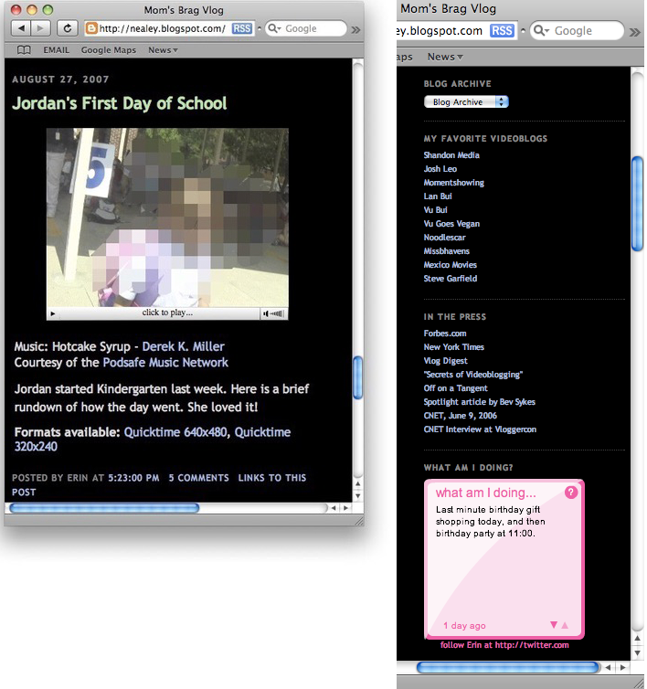

Figure 5: *Mum's Brag vlog* by Erin Nealy. Sidebar with blogroll.

Videoblogs generally featured short videos, each one usually between 1-5
minutes in duration, which could be viewed, commented on and downloaded
by users over the internet. The ability to download videos from
videoblogs was an important technical requirement. This was because the
de-coupling of the video from the videoblog was a necessity for
syndication, which formed the basis for dissemination of videoblogs at
the time. It also stood in direct contrast to other, proprietary video
platforms such as Vimeo, Veoh and YouTube, which prevented the user from
downloading content.[^05chapter4_6] The content of videoblogs varied greatly, from
personal diaries to news programs, sci-fi shows and more artistic
videos. The videoblog tended to have the author’s posts in reverse
chronological order, with the newest at the top (figure 5). This aided
the user with finding the latest blog post or video and helped to drive
user ‘traffic’ to the content and gave a sense of newness to the blog.

I want to spend a little time exploring further some of the technical
affordances, specifications and protocols that served to stabilise the
videoblog form. At a time of fervent development of technologies around
video and moving images, particularly in relation to codecs (used for
video compression), it is hard to remember just how confusing and
fragmented video in the web was during this time. Not only were there
competing standards, codecs, encoders and formats, but there were also a
multitude of different players, plug-ins and applications that
introduced their own idiosyncrasies as shown in the last chapter. For
example, the flash (.flv) format was written for desktops and was very
frustrating to use (most videobloggers at this time avoided it) and was
highly processor intensive – a reason that Steve Jobs banished it from
the iPod and iPhone. Taken together, these technologies slowly combined
to create what Kittler called a technical a priori, that is the
establishment of a common set of technical standards which serve as
foundations on which action and cultural practice might take place.[^05chapter4_7]
Bernard Geoghegan argues that a ‘technological a priori defines the
scope and logic of distinct cultural formations and epistemes’.[^05chapter4_8] In
this case, standards grew out of a number of cultural techniques that
were shared amongst the members of the videoblogging community. As
Adrian Miles, videoblogger, early community member and academic of
hypertext, narrative and technical systems, explained, ‘in terms of
codecs and picking up an earlier question about standards. I use
\[QuickTime\] for everything because I do interactive work and it is the
best architecture... The codec isn’t great but it… means any mpeg4
compliant client can view it, anywhere.’[^05chapter4_9] In many cases these
technical standards were defaults in video software or the common codec
or format used in industry, e.g. QuickTime was the default codec in
iMovie. But in a similar fashion to discussions over open source
software, videobloggers would question the use of closed codecs or
software platforms.[^05chapter4_10] For example, as one of the videobloggers, Jay
Dedman argued;

> I know a big question is simply: why should I care about open codecs?
> Aren’t codecs free now? Flash and QuickTime are monetarily free for
> the most part. It’s difficult to find arguments for this now. The
> concern is when either/both these codecs become totally dominant...and
> web video is the new TV for lack of a better word. We need an open
> codec to either challenge the status quo...or be a solid
> alternative.[^05chapter4_11]

At the time, there were many incompatible video standards, and rapid
updates, alongside the paucity of bandwidth on the internet, which
combined to render much video unwatchable or difficult to view. It is no
surprise then that the videoblogging community began to slowly coalesce
around a series of informal standards in relation to their work. These
standards created certain digital arti
facts embedded in the videos which
also created a distinctive digital video aesthetic. This aesthetic
featured high-compression and therefore pixelisation, low frame rates
and often muffled or distorted sound. Miles argued that most of the
presets within video-editing software packages ‘treat things like
‘dialup’ as a compression setting so that video will stream in real time
at that data rate, so it has to compress very hard to achieve this. But
you’re not trying to real time stream, you’re progressive streaming… If
they want it, they will wait.’[^05chapter4_12] By progressive streaming, Miles is
referring to the two major ways in which video is encoded, either as
progressive, that is the image is downloaded completely as an image,
rather like a photograph, before displaying the frame, or interlaced,
where alternating horizontal lines of video are displayed. In the second
case, the illusion of a higher resolution is made because the flipping
between frames (one is the horizontal lines 1, 3, 5, 7 and so on, and
then the other 2, 4, 6, 8, etc.), however the image does appear to jump
and move around if our eyes catch the interlacing taking place. In the
case of progressive video (and the reason why video is marked with a ‘p’
as in 480p, 720p, 1080p) the image is sharper and realistic, whereas in
interlaced (where video is marked 480i, 720i, 1080i) the image is sent
at half resolution on alternate frames. Clearly then, interlaced video
will download much faster than progressive, but with markedly lower
quality, and this would be *in addition* to the digital artifacts made
into the video by the video compression codecs. It is therefore
interesting that videobloggers believed they were maximizing video
quality in preference to the problems they associated with real-time
streaming. When downloaded, they argued it would be of higher quality
and more enjoyable to watch as a visual medium, which is ironic when we
now look back on these videos and observe their comparatively low video
quality and the various video digital artifacts that were common in
these early video codecs.

Discussions around standards were very common in the videoblogging
community. For example, the size of the window for the video, that is,
the number of pixels in the x and y plane that made up the image, was
widely discussed. This determined the size of the video but also the
complexity of the video content and hence the amount of time it would
take for the editor software (e.g. CPU processor time) to export a video
that could be distributed via blogs and online more generally. The
compromise between video size and quality was a perennial issue in
relation to videoblogging and defined, in many cases, the aesthetic of
the videoblog. The ‘typical’ videoblog was distributed with a resolution
of 320x240 pixels, which is essentially half the size of the visible
portion of a standard television signal in North America, otherwise
referred to as NTSC. These videos tended to display at 15 frames per
second. In fact 640x480 is the standard definition, 4:3 aspect ratio
NTSC video, so by halving the pixels the videoblogger halves the data
needing to be compressed and sent. The 480 lines is standard definition
(SD) video and anything above 480 horizontal lines (usually 720 or 1080
for consumer videos, camcorders or cameras) is high definition (HD)
video. Settling on 320x240 pixels for the size of the video file, was a
standard format that emerged out of these compromising technical
affordances (size of file, speed of processing, ease of distribution)
and cultural preferences (video aesthetic, length of video, complexity
of material). Agreeing on a standard preference also became a marker of
membership of the videoblogging sub-groups and became a relatively
standard format for distributing videoblogs.

It is amazing how fast video has developed such that we might talk about
the softwarization of digital video. There has been a disappearance of
the ‘prosumer’ video camera and its replacement with the digital video
(though of course, the digital camera and the digital mobile phone
remain pieces of hardware). This predates the launch of the iPhone in
2007 and other video-capable smartphones that have since become the de
facto device(s) for capturing everyday video. Indeed, videobloggers had
a keen interest in small, portable digital video cameras that could
create video quickly and transfer it to a computer with ease.

At the time of my interviews, only one of my informants shot videos on a
‘professional’ camera (Roxanne Darling) and only two recorded video on a
mobile phone, using the Nokia N95 (Steve Garfield and Rupert Howe), with
three others (Andreas Hagustrup Pedersen, Sam Reinsew and David Howell)
explaining that they combined mobile phone with a hand-held camera.
Casey McKinnon, who aimed to build a career from her videoblog sci-fi
show, Galacticast, shot video on a HD digital camera. A small group shot
on ‘digital cameras’ (Loiez Deniel, Juan Falla, Jen Proctor, Gromik
Nicholas and Raymond M. Kristiansen) and the rest referred to their
recording equipment as ‘hand-held’ (Richard BF, Richard Hall, Mary
Matthews, Markus Sandy, Erin Nealy, Daniel Liss, Cheryl Colan, Bekah
Havens, Erik Nelson, Paris Marashi, Zadi Diaz), either a ‘small, fits in
handbag’ (Brittany Shoot) or the most popular camera among the
videobloggers at the time, the Sanyo Xacti digital video camera (Ryanne
Hodson, Gena Hackett, Jen Gouvea, Enric Teller).

The Sanyo Xacti digital video camera actually became iconic within the
videoblogging community. This was because in so many ways it was *not*
different to traditional video cameras. The Xacti was designed to
‘function like a tiny camcorder, with a flip-out LCD view screen and a
camcorder-style ergonomic design \[which made\] shooting video from
different angles and getting yourself into the shot much easier.’[^05chapter4_13]
The camera was L-shaped, with the body resting nicely in your hand
(pistol grip) and the screen and viewfinder folding open to one side,
making it easy to watch footage while shooting, while also making sure
you were in frame at all times. This made the classic videoblogging shot
extremely easy to achieve, and was perhaps one of the reasons for its
success within the videoblogging community. The classic videoblogging
shot was filming yourself using your right arm stretched out in front of
you, and pointing the camera at yourself, the kind of image that has
become immortalised in the notion of the ‘selfie’ today. The Xacti
allowed you to flip the viewfinder towards oneself, which meant it was
easy to film. Importantly, the Xacti was one of the first video cameras
to move away from physical media. The camera relied on digital storage,
and did not use videotape or discs, storing video on a flash memory
card, making it easy to transfer to a computer.

Some videobloggers used the built in webcam in their laptops to record
videos, although none of my informants did this. The webcam is often
conceptualized in terms of voyeurism and exhibitionism, and as Tina
LaPorta’s work shows, ‘while the home represents a private space and the
Web a public site, webcams become a window or an invitation to look, to
gaze upon everydayness of the inhabitants.’[^05chapter4_14] Jimroglou’s feminist
critique of JenniCam argues that it was ‘not only the woman in front of
the camera, but it is the woman behind it too. \[She\] is both viewer
and viewee: she occupies the hybrid position of both object and subject;
she is composer and is composed’ thus offering a ‘fruitful as a tool of
feminist transformation’.[^05chapter4_15] In contrast, videobloggers tended to
prefer to use hand-held video cameras and they also shied away from the
‘webcam’ association of web cameras on laptops.

There were links made by videobloggers in my interviews between the
relative mobility working a laptop affords and the production of video
on-the-go, something many videobloggers reported as being important to
them (Susan Pitman, Juan Falla, Jay Dedman, Erin Nealy, Rupert Howe, Jen
Gouvea). There was also a tension between the cultural idea of Mac users
as more ‘creative’ than PC users, and although the majority of the
videobloggers used a Mac, there are clear examples of those producing
not only ‘regular’ videoblogs, but videoblogs considered ‘artistic’ (for
example, Adam Quirk), using Windows. Out of the 34 videobloggers I
interviewed, three quarters used a Mac, and three videobloggers combined
a Mac and a Windows machine (Cheryl Colan, Markus Sandy, Richard BF).
Five videobloggers relied solely on the Windows operating system
(Raymond M Kristiansen, Gromik Nicholas, Adam Quirk, Gena Hackett, Susan
Pitman). Amongst the Mac users, 22 videobloggers used laptops, and the
rest relied upon desktops, whereas two Windows users used laptops, and
the others used a combination of laptops and desktops. It is interesting
to note that FireAnt was only ever released for the Mac, despite
promises of making it available for Windows, and that the links between
the Mac and videoblogging were reinforced by the use of QuickTime.

Ironically, this technical specificity wasn’t really remarked upon by
the videobloggers, beyond a comment by Casey about the need to switch
from one to another for professional reasons; ‘for the first year and a
half, we used a PC,’ she told me. ‘However, due to the demands of our
new HD camera we are currently making a switch over to Mac in order to
use Final Cut Pro out of the box. Adobe Premiere Pro doesn’t have the HD
quality we need’. Software such as Apple iMovie (used by Rupert Howe,
Cheryl Colan, Ryanne Hodson, Markus Sandy, Jay Dedman, Adam Quirk, Erin
Nealey, Steve Garfield) was one of the most popular software for editing
video within the videoblogging community, despite being the more
‘simple’ compared to Final Cut Pro (used by Daniel Liss, David Howell,
Richard BF, Casey McKinnon, Jen Gouvea), Windows Movie Maker or Premiere
(Enric Teller), which required more advanced technical skills. iMovie
allowed the user to record video files directly from either the webcam
or an attached camera (like the Xacti) or import video files. It used a
simple editing layout (figure 6), with the captured footage on the right
side of the screen, each video file resting in a window of its own. The
bottom panel showed a timeline of the footage the user was editing
together, and the video would playback in a large window to the left.
The editing field also contained two audio-tracks, for added music or
voice-overs. In essence, it was very much the ideal video-editing
software for the everyday life aesthetic that was widely reproduced in
the videoblogging community.

Figure 6:
Screenshot of iMovie HD (version 5, January 2005)

In iMovie, below the captured or imported files the videoblogger had
easy access to photos or music stored on the laptop, as well as access
to effects, title cards and the export to DVD button. This simplified
framework for presenting data made producing the videoblog simple and
many videobloggers found it a more creative approach to working.

There was a suspicion in the videoblog community, however, that despite
being both accessible and intuitive, iMovie was inferior software
compared to professional software Final Cut Pro; as Daniel Liss told me,
‘once—I could even tell you which video—I was away at my parent’s
\[without\] a computer and I used iMovie on my mom’s laptop. And it was
a scarring experience. Yuck’. There was also a sense that iMovie was
less serious, and thus more playful perhaps than it’s more professional
counterparts; ‘I edit with iMovie’ Cheryl Colan told me, ‘whose effects
are terribly cheesy. I frequently abuse transitions and wipes because I
think they are campy and funny. What’s not to love about a transition
that’s an ever-widening heart shape? Or a barn door? I’m a big fan of
iMovie’s shooting star effect because it’s absolutely ridiculous. I
can’t figure out it’s real purpose.’ This dichotomy between amateur and
professional, serious and frivolous constantly played out in the
videoblogging community discourse and practice.

Videobloggers often described their computers. They were extremely
passionate about their systems, and it seemed to have replaced the
television as the central technology in the living room. This was new
and surprising in 2005, and anticipated many of the subsequent changes
in media consumption that we see today. More importantly, the
videobloggers’ focus on their computers was an early example of
computational visual media –videobloggers quickly moved to digital video
cameras, with no physical, analogue tapes. Videoblogging was a truly
digital practice, with the content captured, edited, produced,
disseminated and consumed entirely on a digital platform. The computer
occupied a similar position in the videobloggers’ homes, as the
television traditionally held. ‘It’s the “centre of attention” of the
living room,’ Juan Falla told me, ‘we not only use the computer to edit
or connect to the internet, but we use it to listen to music and watch
DVDs. So we use it for everything. Every time I arrive home, I turn it
on and put music on.’ Further, they explained, ‘the TV is in our room.
We watch A LOT of TV. I’d say minimum 3 hours a day. But, if we have
friends, we do everything in the living room WITH the computer, not only
listening to music but watching videoblogs or videos from YouTube, etc.’
In other words, the computer and the content found on the internet is
increasingly, for Falla, competing with ‘traditional television’ for the
attention of the viewer. Videobloggers were in some sense early adopters
of digital cultural practices that have become very dominant today.
Their practices signalled the merging of television and the computer
that has later manifested itself in the form of ‘streaming’ boxes like
the Apple TV and Fire TV.

The videobloggers often described their computers as more important than
their cameras. They highlighted the computer within their living space,
calling it a ‘centrepiece of the room’ (Steve Garfield) or ‘pretty
prominent. You see my computer set-up as soon as you enter my home’
(Zadi Diaz). Describing their work space, Ryanne Hodson also explained
that ‘we spend most of our time in that room. It’s also connected to the
kitchen, there is no wall separating it, so we eat and work on our
computers, it’s quite nice’. The computer had replaced the television as
the centrepiece of the videoblogger’s living space. This is reminiscent
of Ballard’s prediction from 1984, that one day

> Everybody will be doing it, everybody will be living inside a TV
> studio. That’s what the domestic home aspires to these days; the home
> is going to be a TV studio. We’re all going to be starring in our own
> sit-coms, and they’ll be strange sit-coms, too, like the inside of our
> heads. That’s going to come, I’m absolutely sure of that, and it’ll
> really shake up everything...[^05chapter4_16]

The videobloggers very much lived the coming world of online video in
their everyday practices – even if the tools were still relatively
primitive by todays standards.

Figure 7: Number of emails posted to the
videoblogging email list (June 2004 – July 2016). Screenshot taken from Yahoo.

I now want to turn my attention to the textual practices of the
videobloggers and how they used various forms of writing systems, such
as email, to build, develop and strengthen the videoblogging community.
In the period between 2004 and 2007, the videoblogging community went
from a small group of enthusiasts to a vibrant community of users. The
group met online on each other blogs and videos but also through the
Yahoo group Email list. The Yahoo group was the heart and soul of the
videoblogging community. New members were always greeted by at least a
few members, and encouraged to share links to their blogs, RSS feeds and
personal information. To begin with, the email list recruited mainly
through word of mouth and friends of friends. It was established on June
1st 2004 and is still going today, although now with much less activity.
As of the end of November 2017, there are 2750 members still signed up
to the list, and almost 80k messages in total have been posted to the
list.[^05chapter4_17] The most active period on the list was between December of
2004 and August 2007, which saw the list receiving &gt;1000 posts per
month, impressive by email group standards. The high point was in June
2005 when the email group received the highest number of posts (2974
posts). If volume of posts can be seen as an indicator of ‘community
participation’, this period was probably the most active (figure 7). In
more recent years the list has seen months go by with only 3 or 4 posts,
quantitatively demonstrating the way in which the videoblogging
community had changed and slowly declined.[^05chapter4_18]

The email list occupied a crucial position in relation to videoblogging
and the videoblogging community. It functioned as the initial meeting
point for the videobloggers, a digital *agora* in which the community
gathered (albeit asynchronously), and it acted as the main communication
channel between the early members. On the list, the videobloggers would
discuss their equipment, cameras, codecs and working practices as well
as their engagement with a selection of third-party applications, such
as FireAnt and Feedburner. It was a crucial part of a videoblogging
platform – at least in as much as the rest of the videoblogging
technology was relatively underdeveloped and dispersed. Indeed, the
email list was very stable. The list was very much the public hub of the
videoblogging community, rather like a café, lobby or meeting place;
where ideas were exchanged, expertise sought and shared, problems
discussed and arguments debated. As Steve Watkins explained ‘the
videoblogging group is about far more than the technologies necessary to
videoblog.’ It was also a place for people to form friendships and
discuss ‘incompatible ideas about what videoblogging will be to them,
ideas that clash with some fundamental beliefs about what videoblogging
is to the established/vocal crowd.’[^05chapter4_19]

The list also served as a community memory, as a repository of
knowledge, and as an archive of problems and solutions which was useful
for new members. The group members helped each other out, and there was
a sense of excitement about what people would come up with next;

> There were the technical people that were solving problems and then
> there were guys like me that were more about just trying to have fun
> and get people to think of ways of making video that they had never
> thought of before. When Michael \[Verdi\] and Ryanne \[Hodson\] would
> come up with these settings, they would then tell everyone how to do
> it and it would solve everyone’s problem. Then everyone’s quality
> automatically would just go up overnight. That was the cool thing
> about the group.[^05chapter4_20]

The list was a public email group, with an open, accessible archive of
every post written since 2004. As is standard with most Yahoo groups,
the software allows functionality in additional to email. This included
a public calendar, though this was not enabled by the moderators, a
polling system, used a number of times between 2005 and 2007, a links
section, also quite heavily used, and members had access to a
database-area. In the database-area, the videoblogging group had four
sub-groups; i. *Videoblogging directory*, a list of every videoblog in
the vlogopshere catalogued at the time (95 entries); ii. *Giving back* a
smaller sub-set (six entries) where some videobloggers have offered
services to other videobloggers,[^05chapter4_21]; iii. *Birthdays*, a list of
member’s birthdays (12 entries); and iv. *Location,* contact list (10
entries), containing information such as email address for user, what
platform she uses, software usage, country, state, videoblog or company
name and phone numbers.

The information posted in the database area is a useful indicator of the
role the email list played in the early days of videoblogging. Although
only a few entries were made between 2004 and 2005, at first the
database was used to collect and organise information about the
fledgling community. But this was soon superseded by the more narrative
content of email exchanges via the mailing list and the database
activity never became the norm among the later members of the community.
It is interesting to note that, as Enric Teller pointed out, ‘most
people define videoblogging as having control over the production and
distribution of their rich media work’, and this led to a paradoxical
distrust of public web resources that the videobloggers do not directly
control individually. This emphasis on control translated into control
of personal and potentially sensitive information, like birthdays and
geographical location, and although many videobloggers displayed this
information quite prominently on their own videoblogs, they hesitated to
enter it into a public/ corporate system like a Yahoo group.

The first messages on the mailing list give a snapshot of a community in
very early development. For example, the second post to the list
immediately mapped out the technical challenges faced by the
videobloggers and the poster articulated some of the technical issues
facing anyone wanting to post video on the internet in 2004. I quote in
full as I think it gives a good flavour of the very early discussions;

> i\. Technically, the process takes too long (capture, import, optimize,
> write some HTML, post); ii. Existing servers don’t allow much bandwidth
> and storage space. You’ll either get screwed because too many people
> watch your posts, or you have to erase your archive video because you’re
> out of space; iii. What is the language of videoblogging? Is it little
> movies? Or moments from your life?[^05chapter4_22]

Topics such as these were a constant theme in the conversations about
the practice of videoblogging. As previously discussed, the technologies
available to non-professional media creators at the time were limited,
under-developed and expensive and the opportunities that were seen to be
opening up in relation to the rise of Web 2.0 technologies gave the
videobloggers a sense of being part of an exciting change in media.

As with any new medium, discussions on the list were fervent around the
definitions and practices of videoblogging. Was it web video? Was it
television on the internet? Was it a new form of documentary, a new form
of art, or was it a political tool for taking on the media industry?
Depending on where one fell on those issues, how did that influence how
one videoblogged? Should one draw on televisual aesthetics? On cinema?
Or – as some argued – was videoblogging more like Astruc’s notion of
writing using video, and what did that mean for the look, the feel and
the sound of the videoblog? These discussions had a sense of urgency
with some videobloggers arguing that ‘the first successful movies – i.e.
the first moving pictures accepted as motion pictures – were not
applications of a medium that was defined by their giving significance
to specific possibilities. Only the art itself can discover its
possibilities, and the discovery of a new possibility is the discovery
of a new medium.’[^05chapter4_23] This initial burst of excitement around a new
medium was important for inspiring the community and giving a sense of
transformation and possibility that is crucial to any social movement.

As well as using email, videobloggers voiced their opinions in the
videoblogs themselves, thus spawning a new genre of videoblogs – what
one could call meta-videoblogs, or videoblogs about videoblogging. This
was exemplified in 2005, when Michael Verdi, an active member of the
group and co-founder of Freevlog, posted his seminal and hugely
influencial; video *Vlog Anarchy*. Filmed in his home, Verdi presents
what can only be described as a manifesto against manifestos, a call for
the community to stop trying to define what videoblogging is. In the
raw, unedited piece, Verdi laments the tendency among the early adopters
to ‘lock the medium down’ and through definitions and discussions limit
its potential. Instead, he calls for the community to ‘play with it’, to
let it ‘breathe and live and grow’. The video became notorious within
the community, and was referenced two years later in Rupert Howe’s entry
for the Vlog Deathmatch challenge, one of many community events
organized by the Videoblogging community. This took the form of karaoke
which was then voted on to determine the best video.[^05chapter4_24]

Although the majority of early videoblogs fell into what I categorised
as ‘personal’ video, Rocketboom was one videoblog that was distinctive
and new. Andrew Michael Baron founded Rocketboom in October 2004, and
until it closed down in November 2013, produced short videos that
parodied traditional newscasts through a technology-oriented comedy
show. Rocketboom was originally hosted by Amanda Congdon (from October
2004 – July 2006), though over the years it had a number of presenters,
including Joanne Colan, Mememolly and Keghan Hurst. Over the course of
2004, Rocketboom became very popular, to the extent of being featured
during Steve Jobs’ iPod presentation for Apple in October 2005. By
December, Rocketboom claimed that it cost about \$20 to produce an
episode, yet they were able to reach an audience the same size as shows
such as ‘Crossfire’ on CNN, a remarkable achievement. In September 2005,
Business Week covered the faux news show in a magazine feature that the
Internet was becoming more videocentric. Many of the members of the
videoblogging community, including Zadi Diaz, Richard Hall and Steve
Garfield, provided ‘raw footage’ for Rocketboom but also worked to draw
attention – and viewers – to their own sites. Rocketboom was therefore
one of the first videoblogs to ‘break out’ and find popularity beyond
the videoblogging community, even being featured on American TV drama
CSI in February 2006.

A key technology in the technical constellation around videoblogging
that helped simplified video distribution, was Feedburner. It was
founded in 2003 by Dick Costolo (later, CEO of Twitter 2010-2015), Eric
Lunt, Steve Olechowski and Matt Shobe, and launched in 2004. The
importance of Feedburner lies in taking a website address and generating
an RSS feed for the user. [^05chapter4_25] At the time, RSS (really simple
syndication) was the main technology for ‘pulling’ data from the web,
particularly blogs, into a computer. Feedburner was the first company to
make this process a user-friendly experience, and provided the members
of the videoblogging community with the ability to generate an RSS feed
from their videoblog, which could be picked up by content platforms such
as FireAnt or iTunes. Feedburner became hugely important in the
distribution of videoblogs, and a number of my informants relied heavily
on their ‘feeds’ for distributing their videos, but also for watching
other videoblogs. The importance of RSS feeds and Feedburner in
particular to the videoblogger could perhaps be summarised by this email
exchange from September 2005, after a new videoblogger announced her
arrival in the vlogosphere.[^05chapter4_26] Within 15 minutes of posting, there was
a reply; ‘I went to your site, but I couldn’t find your RSS feed in
order to subscribe to your videoblog’.[^05chapter4_27] Feedburner therefore became
a necessary link in the distribution chain of videoblogs, and in some
senses it was *the* mechanism for linking content between the
videobloggers and their audience. In consequence, Feedburner was
acquired by Google in 2007, for a reported \$100 million. However, with
the rise in real time streams like Twitter, RSS became less important to
most websites, who moved to push notifications instead. By buying a
competitor to YouTube, Google ensured that there was no alternative to
the streaming video platform. On May 26th 2011, Google deprecated the
Feedburner API, and in October 2012 it shut it down, reflecting a not
unfamiliar story of big corporations using their buying power to shape
the technical systems for their own benefit.

One of the main consumer oriented technologies that was designed by
developers and that was closely linked with the videoblogging community
was an RSS video player called FireAnt. The first beta was released in
2005.[^05chapter4_28] FireAnt was a desktop application that subscribed to RSS
feeds and allowed the user to play videos on the desktop. As one
videoblogger explained, ‘the point of using an in-computer aggregator
program like FireAnt would be the added benefit to the user that ‘new
video (and other) posts are automatically downloaded’.[^05chapter4_29] This
automatic downloading of new episodes made following videoblogs such
simpler. It also created a helpful abstraction from the inherent
complexity and messiness of web-links and surfing between blogs. Users
would be able to identify new videos and keeping up with episodes would
be much less of a chore.

These kinds of user interfaces are interesting in a number of respects.
Of course, by simplifying the technical process for the user they can
massively expand the audience beyond the technically competent user.
However, the act of abstracting away the underlying blogs in some sense
breaks an important link between the personality of the videoblogger and
their videos, removing the surrounded context the blog provided on the
webpage. But it also breaks a link with the comment culture that was
manifest in the blog-form, and took the form of personal comments and
criticism under each video post. FireAnt therefore represented a shift,
barely perceptible to the videobloggers of the time, from a web-based
medium to a video-centric media form. Of course, the temptation with a
video-centric metaphor was to look to television and film to inform the
design patterns and unsurprisingly, the notion of a ‘channel’ became an
important new way of presenting videoblogs. This too changes the way the
user interacts and thinks about videoblogs – from discrete stories or
moments to an unceasing stream of content, and where the user can flick
the channel at the onset of boredom.

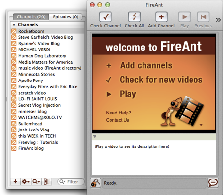

Figure 8: FireAnt RSS videoplayer with pre-selected channels

FireAnt came with twenty pre-selected video ‘channels’ (figure 8),
including the popular Rocketboom, but the user could subscribe and
unsubscribe to as many other channels as she wanted. The pre-selected
channels made some of the videoblogs very popular, and featured
videobloggers who were very active in the community. I asked Jay Dedman,
one of the developers of FireAnt, about the pre-selected channels, and
he told me that;

> The feeds we chose for FireAnt were at first all the ones that
> existed! Difficult to imagine. We would add feeds as people made
> them…Then as there were more and more RSS feeds, we kind of just chose
> a set of feeds that had a mix of content so a new person could get a
> sense of the excitement we all felt. It certainly wasn’t scientific or
> well-planned. In those days, we were kind of flying by the seat of our
> pants.

In its early development, as the platform was still under construction,
it was marked by uncertainty and tentative development. There was a
trial and error exploration in both the technical and social aspects of
videoblogging but also a touch of naivety about turning videoblogs into
television, however inadvertently.

Some of the featured videobloggers (like Jay Dedman and Ryanne Hodson)
had also been part of developing FireAnt, and were early beta testers.
In fact, many of the announcements about updates to the FireAnt
software, were made by non-programmers or members of the community. In
return, these videobloggers made frequent videos promoting FireAnt, so
in a sense there was a kind of gift economy within the community at this
point. By gift economy I refer to the way in which services like these
were performed without expectation of pay or reward. The early adopters
would also be defensive and protective about the FireAnt software,
feeling it was part of the community.[^05chapter4_30]

The functionality of FireAnt was described by one of the founders,
Joshua Kinberg, in an email in July 2005. He explained that FireAnt
allowed the user to

‘subscribe to any RSS 2.0 feed, with Bit Torrent built in.’[^05chapter4_31] It
could playback most media formats, and sync media to iPods or Sony
Playstations. FireAnt allowed you to organise your content with tags,
had built in Yahoo video search and its ‘integrated directory of
videoblogs \[was\] constantly improving and expanding’. It further
allowed the user to ‘preview anything before downloading, or schedule
automatic download and notifications of new content’. While reflecting
on this period in videoblogging practice ten years later, one
videoblogger said that the ‘community was largely fuelled and glued
together by our excitement about the newness of it all. It wasn’t about
the content. We were video hackers’.[^05chapter4_32] The development of software
like FireAnt added to the sense that videoblogging was a growing and
important new medium.

In October 2005, Apple announced that they would start distributing
video ‘podcasts’ in their iTunes store. This new distribution network
would be available to anyone, amateurs and professionals. This opened up
distribution via the internet and further simplified the process.
Content creators no longer had to learn about RSS syndication or the
technical specifications of particular codecs in order to distribute
their work. Of course, Apple was keen to embrace online video throughout
its networks, codecs and technology platform, and thus cement their
control of the ‘media hub’ they controlled with iTunes. It is also
important to note that little commercial video or film was available at
the time due to licensing issues by the film and television industry who
were terrified of a Napster-like collapse of their industry. This helped
fuel consumption of videoblogs and related video resources. Apple
created an iTunes-ready format and provided all the technical means
necessary for distribution through their ‘music’ store. It was also a
way for Apple to experiment with video and film delivery and
distribution systems without waiting for the film and television
industry to give them permission to do so. For example, early video did
not make use of Digital Rights Management (DRM), which simplified their
technical systems. This was noted within the videoblogging community,
particularly by Dedman, who noted that ‘now that iTunes etc is making
videoblogging/podcasting popular... new people are coming in who don’t
really care of what came before them. And that’s their right. So those
of us who have been around, we know who we are. Isn’t it cool it’s
getting so out of control? It’s really happening.’[^05chapter4_33] With hindsight
we can see that rather than getting out of control these moves by Google
and Apple were in reality meant to reduce the ‘out of control’ anarchy
of video and podcasting by effectively monopolising the distribution
networks.

As Michael Verdi, Ryanne Hodson and Jay Dedman later reflected in a
special issue of the web series *The Web Ahead*,

> When the Apple store opened in New York, down on Prince Street, we
> were doing these events down there where they were asking us or we
> asked them if we could come and talk about videoblogging. And they
> were like, “Yeah, sure, no problem.” So we would try and explain what
> we were doing to people and we would have a whole crowd of people off
> the street, they all had their Macs, everyone seemed interested and
> excited but it was so complicated trying to explain to them how to do
> this… Film it on your camera, import it into iMovie or Final Cut, you
> have to edit it, you have to export it in this certain way, you have
> to take a screenshot and you have to embed that, you have to link
> this, you have to hand code this RSS feed. I mean, it was just so
> crazy. That’s when Ryanne and Michael made a site called
> [Freevlog](http://www.freevlog.org/). And that really I think was the
> point where videoblogging started really spreading fast.[^05chapter4_34]

At the time, RSS 2.0 was seen as the future of media distribution on the
web. Tags allowed the categorisation of content into different
taxonomies of media, as well as the increased usability of the archive.
Kinberg emphasised that FireAnt could play any media format – and this
was clearly in competition with YouTube, which was criticized for taking
whatever format the user uploaded and converting it to Flash, a format
shunned by the videobloggers due to its perceived low-quality and being
a closed format. This distinguished FireAnt from iTunes, which had
specific Apple requirements for the format that could be uploaded.
FireAnt was very much a product of and for the videoblogging community.
Any changes to functionality or features were completed in dialogue with
the community. The updates were regular and the developers wanted
testers. They encouraged the users to push the software to its limits,
as they would say ‘bang on it. Try to break it. We want your feedback.’
The co-dependent relationship between FireAnt and the videoblogging
community can be seen further in an email from Kinberg in June 2005,
‘many of you have helped us test FireAnt and we thank all of you for
your help, advice, and suggestions.’ [^05chapter4_35] Kinberg positioned the
videoblogger creator as a crucial actor in the development of FireAnt,
calling them ‘the power under the hood’, who have ‘energy and passion’.
FireAnt, he claimed ‘listen’ to’and ‘carefully consider’ all the
videobloggers’ ‘help, advice and suggestions’. FireAnt assisted the
videobloggers in getting their videos out there, but the videoblogger
reciprocated by promoting FireAnt on their videoblogs and by being
unpaid beta testers.

Interestingly, despite its popularity, few people (Erik Nelson, Erin
Nealey, Richard BF, Ryanne Hodson) specifically mentioned using FireAnt
in their interviews; ‘I have like almost 200 feeds in my FireAnt and I’m
so behind’, Hodson told me. When asked how he watched videoblogs,
Richard BF told me ‘on my computer, through FireAnt. I need to be able
to comment right then’. Of course it is possible (and likely) that more
videobloggers actively used FireAnt, yet it is interesting that even at
this point, there wasn’t a very vocal support for it.[^05chapter4_36] In fact, when
Apple released Version 4.9 of iTunes in June 2005, some videobloggers
opted for using this as their main video aggregator (Andreas Haugstrup
Pedersen, Richard Hall). Another reason for this might also be the
release of the 5th generation Apple iPod in 2005, which allowed mobile
video playback. Amongst my informants, six (Roxanne Darling, Raymond M.
Kristiansen, Gromik Nicholas, Cheryl Colan, Jennifer Proctor, Markus
Sandy) reported watching videoblogs on their iPods.[^05chapter4_37] The
videobloggers were very much ahead of the curve in their use of
technologies and the shaping of their cultural artifacts to it.

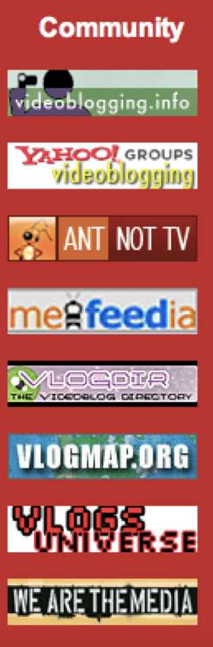

Figure 9: Badges promoting community sites from freevlog.org

An important website was Freevlog.org, which was created by two
videobloggers, Michael Verdi and Ryanne Hodson, in 2005. This site was
intended to be a resource for videobloggers, and it hosted tutorials on
video-editing, compression, how to take a screenshot, uploading and
hosting. Freevlog was one of the main sites around which the community
gathered in these early days of videoblogging and provided many services
to the community. At the time, small rectangular badges could often be
seen on the sidebar of a videoblog, promoting sites they approved of,
such as Blip.tv, Ourmedia.org and FireAnt, and the videobloggers would
also have their own badges and display the badges of their ‘friends’
(figure 9).

These badges were automated and could easily be generated on the
Freevlog site. They came in two different styles and sizes, and could be
generated using quite simple computer code. Freevlog actually embedded
these snippets of code in the sidebar of their front page, so anyone
could grab it and put in on their videoblog.[^05chapter4_38] Anyone with basic
understanding of HTML would be able to take this code, change the
content of the &lt;href&gt; (hypertext reference, or web-link) tag to
their own webpage, upload a small gif to their website and change the
&lt;img src&gt; (image source) tag to their own image link, and thus
create their own badges. The videos on Freevlog almost exclusively
featured Verdi and Hodson (themselves prominent members of the
videoblogging community) and became an important resource for new
videobloggers. Freevlog can be seen as a kind of community magazine
(zine), similar to those used and developed by previous communities of
practice; such as the Raindance corporation’s publication, *Radical
Software,* with its ties to the Guerrilla TV movement, and the Whole
Earth Catalogue, with its links with the web community The Well.[^05chapter4_39]

Freevlog would also post weekly tutorials about videoblogging and its
practices. For example, Hodson would walk the viewer through how to set
up an RSS feed with Feedburner, how to chose the right codec or
compression settings before exporting videos or making a screen capture.
The site presented videoblogging in ‘8 easy steps’ – talking the new
videoblogger through the entire process. The site was even translated
into five other languages (Spanish, Portugese, Japanese, Dutch and
Italian), with translation freely provided by members of the videoblog
community.

I also want to briefly mention the grass root media directory Mefeedia,
which launched in January 2005 with 617 videoblogs listed. This was
another important site for aggregating information about videoblogging.
By January 2007, Mefeedia.com listed 20,913 vlogs, showing that amateur,
independent videoblogs (i.e. not vlogs on YouTube) were still gaining in
popularity. The site was used by the videoblogging community as a place
to look for specific content, and acted as a hub for hashtag campaigns
like videoblogging week (\#vbweek08, \#vbweek09 etc) and videoblogging
month (\#vlomo), but as the site grew and their business model turned
more and more towards advertising and pop up ads and banners, the
community began to drift away. Michael Sullivan, who helped name the
site back in 2005, wrote to the email list in April 2009 saying that;

> I cannot use Mefeedia until at least pop-under ads are deactivated.
> There was a time that even promoting a site here with gentle
> advertising would be an issue. Mefeedia has gone way overboard. I
> understand you need to capitalize on all your traffic. But it sure
> makes it difficult to tolerate. Sorry. You know I've been a fan and
> always interested in a site that I named and I've helped out in some
> ways, but I have some web browsing standards to uphold.[^05chapter4_40]

Today, Mefeedia is an internet media-feed company, aggregating feeds
from sites such as Vimeo, Hulu and Vevo, as well as acting as an
umbrella company for a range of internet companies. However, instead of
being a grassroots site used by amateur video makers, today it is
infested with malware – described elsewhere as a ‘browser hijacker’ –
another indication of corporations monopolising distribution and the
user experience, and not necessarily for the better.

Video hosting became an integral part of the extended videoblogging
platform. Initially, the videobloggers hosted their own content on their
own sites – leading to a range of problems, for example, Howe’s mention
in the New York Times as discussed earlier in the book. To work around
these problems, the community worked closely with a number of sites and
developers to solve them. Among them, OurMedia.org, founded by J.D.
Lasica and Marc Canter in 2005 acted as a front-end for Archive.org,
where videos were hosted. Similarly, on June 16th 2004, Adrian Miles
offered the members of the group 1 GB of free hosting on his basement
server (in Australia) to ‘kickstart’ videoblogging, but even this would
have been vastly insufficient at this point. Amongst my informants,
Paris Manrashi, Brittany Shoot, Bekah Havens, Andreas Haugstrup Pedersen
and Ryanne Hodson indicated that they hosted their videos on blip.tv.
Dailymotion, Videobomb and Videosift were sites mentioned by Loiez
Deniel, a French videoblogger who used a number of sites based in
Europe. Steve Garfield also uploaded videos to Vimeo. Adam Quirk pointed
out that he, like many others, were uploading their videos to a ‘large
number of video-sharing sites’ in order to reach wider audiences.
Ultimately, however, the battle over video hosting came down to two key
players; Blip.tv and YouTube.

I have already introduced YouTube, but Blip.tv was founded in 2005 and
worked hard to convince videobloggers to stop paying for their own video
hosting and move to the service. After his experience with the *New York
Times*, Rupert Howe ‘found people using Blip for free, and that solved
my billing/bandwidth issue.’ Blip.tv was founded by Mike Hudack, Dina
Kaplan, Justin Day, Jared Klett, and Charles Hope. The founders were all
members of the videoblogging email list and the site was announced there
in May 2005 with a short message from Hope, ‘here’s blip.tv, a beta site
that features vlog hosting and aggregation of external RSS feeds. Please
take a look and kick it around!’[^05chapter4_41] Immediately, and amusingly, there
were responses from the community raising technical concerns; ‘I’m kinda
confused as to what it’s doing other than aggregating videos and
sticking them on the main page. It appears to pull from certain feeds,
but I don’t see any place even after logging in to submit a feed URL.
You can submit individual videos it appears’.[^05chapter4_42] Hope replied within
minutes, showing just how small these early networks were, ‘it is
confusing, I’m sorry. You can add stuff with the “Add content” link in
your user info, on the right side. It has just been made more
prominent’. Through these kinds of exchanges, the community directly
influenced design decisions on the blip.tv website. This demonstrates
how the *socio-cultural* level (community) could strongly influence the
*technical-social* (network) in the early phases of development of a new
platform. It also shows how the knowledge and expertise of the videoblog
community could be harvested to create digital media products.

Due to its engagement with the videoblog community, Blip.tv became a
huge success, but ultimately their business model moved towards
advertising – a move strongly condemned by the videoblogging community.
After a number of difficult years, Blip.tv rebranded as Blip – an
aggregation site featuring paid semi-professional content by new media
companies. As a result, the community largely abandoned the site. Blip
continued to host many of the early videobloggers videos for years, so
for a while these archives remained relatively safe. The latest entry
for any of my informants on Blip was in November 2011. In November 2013,
however, Blip – recently acquired by Maker Studios – wrote to the
members of the videoblogging community and told them they would no
longer be hosting their videos. The new owners were looking for content
of ‘high quality’ and most of the videoblogging content didn’t fit this
definition. They gave the users thirty days to download and back up any
content they might want to keep before Blip deleted it, a startling turn
around for a company that had worked hard in its early days to make
connections with the videoblogging community.

But from the start, Blip was very secretive about its business
decisions. They soon stopped engaging in community conversations on the
email list. Dedman told me;

> Blip had a similar experience \[to FireAnt\]. I don’t think any of
> this is public, but I know the original founders had a huge fight last
> year. Their shares were all diluted after their last round of funding
> and they lost control of the company. I think only one of the original
> guys still works at Blip. I assume the current owners are trying to
> mainstream it in order to sell it.

Despite trying to sell the site, Blip eventually closed in August 2015.
Another part of the videoblogging platform was therefore removed from
the internet and along with it any remaining archives it contained.

The videoblogging community had a complex and at times contradictory
relationship with YouTube. The community had an intense dislike of
YouTube, mentioning the media giant as little as possible in
discussions. One of the most interesting aspect of the YouTube debate is
how wrong the videobloggers were about the future of the site. One would
have thought that the launch of YouTube would have been celebrated in
the videoblogging community. Here was a site that finally answered so
many of the community’s problems. It was easy to use, it was free to
use, it seemingly solved some of the technical problems of aggregation
and distribution that the videobloggers had been struggling with – if
not all of them. However, instead of being conceived of as a solution,
YouTube was quickly conceptualised as the enemy.

When YouTube launched in May 2006, one of the three founders, Steve
Chen, posted a personal message to the email list. ‘\[We\] just launched
a new video blogging service at www.YouTube.com,’ he wrote

> Many of the same questions being asked here, we had also asked
> ourselves as this is still a nascent area for technology. Given the
> state of the technologies that video blogging depends on is still in
> developing stages, we had to answer the questions within these
> limitations… currently, we feel that bandwidth and storage is not the
> problem. The biggest obstacle is getting people to learn how to take
> videos and getting them onto the site.[^05chapter4_43]

Interestingly, Chen’s original email didn’t get much attention. Perhaps
because it was buried in a thread arguing about definitions of
videoblogging, or because at this time many new sites offering easy
video hosting solutions were launching. The email from Chen had only a
few responses and, as had become increasingly common within the
community at that time, they were mostly about technical issues. The
initial reaction from the community concerned formats, and particularly
YouTube’s decision to convert video submissions to a flash video file, a
proprietary web format owned by Adobe.[^05chapter4_44]

The reactions ranged from a disappointed ‘everyone is doing Flash...’ to
the more dismissive; ‘Flash gives me hives’. Flash was a mediocre
format, providing an inferior image quality. As Cubitt points out, ‘like
VHS, and so many other victors of previous format wars, they are only
good-enough’. YouTube’s decision to use interlaced streaming meant that
the videobloggers – who valued quality above anything else – were
unimpressed. For the average user, however, who just wanted to watch the
latest viral video, YouTube was ideal. In an episode of the podcast *The
Web Ahead* from 2014, Jen Simmons, Ryanne Hodson and Michael Verdi
reflected on the beginning of YouTube and particularly how and why it
became such a success;

> When YouTube started… they did everything we didn’t want to them to
> do, sort of. \[Laughter\] But it all turned out. In the end, it was
> actually... sometimes I think, “Man, they just saw way further than we
> did.” They had things like... the problem we were trying to solve with
> the RSS feeds and the downloading the videos, like Jay said,
> overnight. One of the things that YouTube did at the beginning was,
> they were like, “We’re going to make sure that the videos play
> automatically right away no matter what.” So the “no matter what”
> meant it had the crappiest quality in the world. It was like, a huge
> step back in quality and that was one reason why we didn’t ever want
> to use it at first. Because it just made your videos look like crap…
> All of a sudden, there were all these people who had never even
> thought to watch a video on the internet. Like, why would you even try
> to do that? They now had a reason to see video on the internet and
> they were like, “Oh, I need, whatever, a Flash player. I need a
> QuickTime plugin. I need a whatever plugin I need to see this
> stuff”.[^05chapter4_45]

One of the technical limitations experienced by the videobloggers early
on, was that producing videoblogs took a long time. With YouTube, this
problem was streamlined. The fact that non-YouTube videoblogging took a
long time and therefore produced a higher quality aesthetic than videos
uploaded to YouTube,[^05chapter4_46] became one of the defining factors for the
videobloggers when attempting to delineate themselves from the rapidly
growing community of Youtubers. The videos posted to YouTube were
considered to be of a lower standard than the videos produced by the
videobloggers. For example, when I first signed up to the email list (in
August 2005, six months after the launch of YouTube), I received plenty
of encouragement from other videobloggers, but also quite clear warnings
about using YouTube (which was where I had initially posted my videos,
for the same reasons as ‘everyone else’: it was really easy). One of my
first replies said: ‘congrats on the videoblog. I suggest you check
YouTube’s terms of service. They’re pretty oppressive. I would suggest
Ourmedia and or Blip.TV. They respect the creative commons[^05chapter4_47] (or
copyright) you assign to your work.’[^05chapter4_48] The videobloggers had a strong
sense of in-group/out-group, with the individual videoblogger encouraged
to follow community norms and values, which they manifested through this
set of technical norms and practices.

Other videobloggers did see the potential of YouTube for reaching a
wider audience; ‘video can often receive mass attention if it becomes
viral and contagious. Thousands or even millions of people will
participate in spreading worthy video clips and try to create video
clips that can garner such awesome attention on the Internet’.[^05chapter4_49] The
language and opinions varied, from seeing what YouTube offered the
videobloggers in terms of getting their work out to a much wider
audience, to a scepticism about control of content. There was also a
strong awareness of the economic possibilities in terms of the potential
for advertisers to profit from ‘the millions of workers who sit in front
of computers all day’. A later email referred to ‘some of the nutty
Youtubers who… were talking of getting several million viewers for their
videos. It’s nuts’, as Jay Dedman wrote in 2007.

The concerns about YouTube within the videoblogging community in 2005
were mainly related to technical issues, such as quality of videos,
formats and codecs. But there were also concerns about ownership and
branding, as well as being able to retrieve content back out of YouTube
after uploading it. Despite being lauded as one of the most successful
web 2.0 start ups, Uricchio argues that, ‘while YouTube’s economic model
is indeed predicated on participation, it fails the ‘2.0 test’ since
users may only upload — and not download — its videos’.[^05chapter4_50] The ability
to download videos might not seem like a deal breaker for the average
user, but within the videoblogging community this was an important
issue, especially for those wanting to use FireAnt. This also raised
questions of ownership, with Michael Verdi stating that ‘I don’t get
what people like about \[YouTube\] with their crazy terms of use where
you basically give your work away to them’. The discourse surrounding
YouTube is telling, their service is ‘crappy’, they ‘brand’ your videos
with ‘their’ logo, they ‘lock’ your content down, their terms of service
are ‘crazy’ and ‘you’ end up giving ‘them’ your work for free. However,
the response from Brad Webb perhaps clarifies why YouTube – despite
these concerns within the videoblogging community – became as successful
as it did. As Webb argued, ‘it works, works fast, and users are
generally willing to sacrifice quality and freedom for ‘just working’...
They also remove the “what version of plugin XYZ am I running”
headache’.[^05chapter4_51]

In trying to explain why YouTube appears so easy to use, Verdi and Webb
use a discourse of ‘us’ versus ‘them’. They display an assumed
superiority about the videoblogger’s technical understanding and
aesthetic sensibility, in contrast to the Youtuber, or the ‘average
user’, who would be ‘willing to sacrifice quality and freedom’, for a
user experience that ‘just works’. The videoblogger is positioned as
up-to-date with technical developments– they ‘actually follow these
things and care’ – and so the apparent problem of rapid changes in
codecs and format ‘isn’t an issue’ for them. Here we can see the
construction of a discourse that places YouTube on one hand and the
videobloggers on the other in terms of different cultural practices
distinctive to each. YouTube’s focus on content that attracts audiences,
with video that is low quality (in technical as well as cultural terms),
in order to attract audiences, advertisers and corporate sponsorships,
whereas the ‘craft’ of the videoblogging community lay in being able to
negotiate a complex technical constellation and produce a distinctive,
creative aesthetic.

YouTube was now positioned as the *other* against which the
videobloggers defined themselves and their practice. A distinction was
drawn between control and freedom, with the videobloggers keen to
protect and maximise the autonomy that they had outside of the YouTube
platform. Videobloggers tended to host their videos on sites such as
archive.org, ourmedia.org and blip.tv, or even pay for their own hosting
and domains. In general, these issues related to self-hosting were
accepted as part and parcel of retaining ownership of their content.
This individualistic and sometimes libertarian-leaning attitude formed
an important part of the subject position of the videoblogger and the
articulation through which their cultural practice was often expressed.
Pierre Bourdieu in his work on the sociology of photography, argues that
this type of relationship is ‘a mediate relationship, because it always
includes the reference to the relationship that the members of the other
social classes \[in this case, YouTube\] have to photography \[in this
case, videoblogging\]’. Bourdieu argues
that one class of photographers’ relationship to photography is a
different relationship, for instance, than that of the *petit
bourgeois*. Whereas the peasant ‘senses the particularity of his
condition’, Bourdieu argues, the *petit bourgeois* ‘seek to ennoble
themselves culturally by attempting to ennoble photography’. He further argues that the *petit bourgeois*, ‘find
within the disciplines of the sect that body of technical and aesthetic
rules of which they deprived themselves when they rejected as vulgar the
rules that govern popular practice’.[^05chapter4_52] Thus,
the rejection by the videobloggers of the low technical and aesthetic
standards associated with posting videos to YouTube becomes part of the
very definition of the high technical and aesthetic quality that make
videoblogging somehow *better*, or more ‘noble’. It also cemented
YouTube as videoblogging’s other.

As with most creative communities, the videobloggers organised a number
of events over the years. These aimed to develop the community
activities, but also to raise the public profile of videoblogging. For
example, in June 2005, the videoblogging community arranged and hosted
the first Vloggercon conference.[^05chapter4_53] The two-day event was held in New
York and included speakers such as email list co-founder Peter van
Dijck, Rocketboom-founder Andrew Michael Baron, J.D. Lasica and a number
of the core videoblogging community members.[^05chapter4_54] On a panel called
‘Tools’, a group of developers were presenting their various apps to an
audience of videobloggers. Josh Kinberg presented FireAnt, which was
already a darling of the videoblogging community, Graham Stanley
presented the idea hosting/distribution platform *V blog central* and
Daniell Krawczyk outlined the premise behind *Digital Bicycle*, a
service that compressed videoblogs into a video format with high-enough
resolution to be (re)playable through broadcast television.[^05chapter4_55]

The videoblogging community also organised *Pixelodeon* in June 2007,
the first independent video festival for internet film, held over a
weekend at the American Film Institute in Los Angeles. The event
combined speakers and presentations, workshops and social gatherings
with screenings of videoblogs, all curated by members of the
videoblogging community. The Vloggies were the videoblogging community’s
award show, which was first held in San Francisco in 2006. PodTech
produced the event, but it was the brainchild of Irina Slutsky and many
of the videobloggers were both nominated and won awards at the event
(including Casey McKinnon, Roxanne Darling and Ryanne Hodson).[^05chapter4_56]

In 2008, the activity on the videoblogging email list started to wane,
and by early 2010 the list was receiving fewer than 100 emails per
month. By late 2014 the list was receiving less than 100 emails per year
(total of 45 emails were sent to the list in 2013). On June 1st 2014 the
list’s ten year anniversary was marked with a sudden burst of activity.
‘Happy anniversary!’ Richard Hall wrote, ‘this Yahoo group and my video
blogging experience was (is) a highlight of my life’. ‘It was wonderful
to enjoy that brief period of collective excitement,’ Rupert Howe wrote,
‘I would like it if I could find a similar group of video hackers,
experimenting with the new technology that’s available to us now’.
‘Remember my life in five second increments?’ Susan Pitman reflected.
Mostly, the comments reflected how far online video has travelled since
2004; ‘online video is EASY now. What’s video (and tech) going to be
like in 10 more years? Yikes!’ and how the videoblogging experience had
impacted their lives; ‘I went on to use my videoblogging skills in
several jobs, and have managed to keep most of my archive together on my
YouTube channel,’ said one videoblogger.

The anniversary was also an opportunity for reflecting on what happened
to the community and how and why it dispersed. One member stated that;

> It’s interesting as a group of people with the shared common goals of
> posting video on the Internet in an easy way and in some cases, not
> all, wanting to monetize that content. We were a very active group.
> Once uploading video became pretty effortless our activity as a
> community became less. Coupling that with Twitter and Facebook making
> it even easier to find and share information about web video the group
> all but stopped.[^05chapter4_57]

I privately emailed Jay Dedman and asked him about the missing details
in the history of FireAnt. He told me that what had started as a ‘fun
project… just a RSS reader for video… Cool for our community but not a
big deal’,[^05chapter4_58] had grown and reached its tipping point, when one of the
founders suggested bringing in some ‘business guys he knew. It was
indeed heady times. YouTube was just bought for \$1 billion.’ It is
interesting that Dedman, a key member of the videoblogging community,
someone who had quite an idealistic view of videoblogging, told me he
‘never quite understood what happened’ with FireAnt. When the project
failed to raise money, it became apparent that FireAnt was in financial
trouble. Perhaps the different attitudes was part of the problem, but it
didn’t seem to Jay as if anything was happening to further the appeal of
FireAnt. ‘Again, I didn’t think we’d get rich, but I didn’t have a
better plan. Ryanne \[Hodson\] and I were busy putting on Vloggercon SF,
*Pixelodeon* in LA, and having fun in the community. My main job in
FireAnt was working with users and helping improve features. I went to
only a few meetings with \[Venture Capitalists\]’.

Dedman told me that ‘while it was happening it was very confusing’.
After some time, the co-founders worked together to make the project
sellable and pay off debts. Dedman had helped Josh \[Kinberg\] find a
buyer for the technology they built, and ‘after the sale, we paid off
all debts they had incurred. We never did find out exactly how it all
was spent.’ Despite the failure of FireAnt, Dedman remains reflexive of
his own part in the project. ‘If I had to do it all over’, he told me
over email ‘I would have open sourced the project. Have fun until it
wasn’t fun anymore. I was guilty of falling for the dreams of making it
big. Ha ha. Good lesson to learn’.[^05chapter4_59]

Here, I think it might be useful to think of FireAnt as ‘dead’ media, or
what Hertz and Parikka call ‘zombie’ media[^05chapter4_60] – ‘the forgotten,
out-of-use, obsolete and judged dysfunctional technologies’ that help us
‘understand better the nature of media cultural development’. In other
words, FireAnt, though no longer in active use, and perhaps never as
widely enjoyed as its developers would have hoped, serves as a ‘living
dead of media history’. Hertz and Parikka point out how zombie media is
never truly dead, but creeps back up in later instantiations of
technologies, and thus is ‘resurrected to new uses, contexts and
adaptations’.[^05chapter4_61] Significantly, FireAnt had much of the functionality
that was later adopted by other video sharing sites, such as YouTube
(for example, the ability to comment on videos directly in the player).
Yet, it’s biggest problem was that by automatically downloading every
video in a user’s RSS feed, the user ended up downloading such a large
amount of data that it became unmanageable, both in terms of storage
space on the user’s hard drive and in terms of being able to watch large
quantities of media (e.g. Ryanne Hodson having almost 200 feeds in
FireAnt meant she always felt ‘behind’). This issue of storage was
continually a problem, and being a pre Web 2.0 technology, FireAnt and
other videoblogging technologies never quite managed to resolve this
until YouTube essentially abolished the question of video bandwidth and
storage of video. But by then it was too late for the videoblogging
community, and so video moved onto a different pathway.

The extended videoblogging platform – as fragmented and unstable as it
was – presents a cultural and technical hybrid. The community worked
hard to make the platform a reality and displayed a strong sense of
loyalty towards the apps and app developers that had been supporting
them. Although their rejection of YouTube was tragic in hindsight –
after all Youtubers went on to find fame and fortune whereas the
videobloggers are mostly forgotten today – their position contributed to
a strong sense of community. The platform imaginary of the videoblogging
community remained true to its ideals even when the technology was
clearly moving in the opposite direction. It also had certain
consequences for the development of a videoblog aesthetic, which I
discuss in the next chapter.

[^05chapter4_2]: Langlois et al, ‘Mapping Commercial Web 2.0 Worlds: Towards a New
    Critical Ontogenesis’.

[^05chapter4_3]: Langlois et al, ‘Mapping Commercial Web 2.0 Worlds: Towards a New
    Critical Ontogenesis’.

[^05chapter4_4]: Henry Jenkins, ‘What happened before YouTube?’, in Burgess, J. and
    Green, J. (Eds)
    *YouTube*. Digital Media and Society Series, Cambridge: Polity,
    2009, p. 109-110.

[^05chapter4_5]: Possibly this was because Wordpress was open source, whereas
    Blogger was a proprietary piece of software. Blogger was the first
    truly mainstream blogging software, allowing anyone to create and
    maintain a blog without needing any prior technical knowledge of web
    design, programming or coding Infinitely customizable, Blogger grew
    exponentially after being purchased by Google in 2003.

[^05chapter4_6]: In the case of Veoh, it was founded by Dmitry Shapiro in September
    2005, Veoh combined user-generated content with professionally
    produced network content from among others CBS, ABC and ESPN. Veoh
    transcoded user-generated content into Flash and was not considered
    a good option within the videoblogging community. Veoh filed for
    bankruptcy in February 2010, before being acquired by Israeli
    start-up company Qlipso in April 2010. I discuss Vimeo in more
    detail later in the chapter. There are technical solutions to this
    today of course, sites such as Tubesock and KeepVid are some
    examples of clients that allow you to circumvent this. Tubesock
    (http://stinkbot.com) and Keepvid (https://keepvid.com) were both
    designed to download and convert content from YouTube or other
    flash-based video sites into other formats. They were especially
    popular with people who liked to view their video content on devices
    such as the video iPod. These sites are still active today.

[^05chapter4_7]: A condition of possibility for knowledge in the Foucauldian sense.
    See Jussi Parikka, ‘Friedrich Kittler - a media anthropology without
    the Man?’ (2011) http://www.media-anthropology.net/
    file/parikka\_kittler.pdf.

[^05chapter4_8]: Bernard D. Geoghegan, ‘After Kittler: On the Cultural Techniques
    of Recent German
    Media Theory’, *Theory, Culture & Society*, 30. 6 (2013) pp. 66-82.

[^05chapter4_9]: Adrian Miles, Email to Videoblogging list, 18 June 2004,
    https://groups.yahoo.com/neo/groups/videoblogging/conversations/messages/44.

[^05chapter4_10]: There are a number of free software or open source video codecs
    today, but perhaps the Ogg Theora is the one most well known (it is
    mentioned 213 times on the videoblogging email list). It was made
    available as an alpha in 2002 but was still in beta until 22
    September 2007. At the time Ogg Theora was not well supported and
    consequently little used.

[^05chapter4_11]: Jay Dedman, Email to Videoblogging list, 27 January 2009,
    https://groups.yahoo.com/neo/groups/videoblogging/conversations/topics/73905.

[^05chapter4_12]: Adrian Miles, Email to Videoblogging list, 22 July 2004,
    https://groups.yahoo.com/neo/groups/videoblogging/conversations/messages/38
    7.

[^05chapter4_13]: Hodson and Verdi, *Secrets of Videoblogging*, p, 53.

[^05chapter4_14]: Margot Lovejoy, *Digital Currents; Art in the Electronic Age,*
    London: Routledge, 2004, p. 264.

[^05chapter4_15]: Krissi M. Jimroglou, ‘A Camera with a view JenniCAM: visual
    representation, and cyborg subjectivity’, *Information,
    Communication & Society*, 2. 4 (1999), pp. 439 - 453.

[^05chapter4_16]: James Graham Ballard, ‘Interview with JGB by Andrea Juno and
    Vale’, *RE/Search,* no. 8/9, 1984.

[^05chapter4_17]: As of November 2017, there were 79627 messages posted to the
    group, the last one posted 13^th^ of July 2016.

[^05chapter4_18]: Table retrieved 16 October 2017 from
    http://tech.groups.yahoo.com/group/videoblogging/.

[^05chapter4_19]: Steve Watkins, Email to Videoblogging list, 15 July 2005,
    https://groups.yahoo.com/neo/groups/videoblogging/conversations/messages/16
    975.

[^05chapter4_20]: *The Web Ahead*, ‘Videoblogging with Jay Dedman, Ryanne Hodson
    and Michael Verdi’ \[transcript\], accessed 16 September 2014 from
    http://5by5.tv/webahead/76.

[^05chapter4_21]: For example, as one member posted; ‘I will happily whistle,
    record and email an mp3 tune for anyone on this list (kindly
    indicate ‘mood’ or public domain tune, and length)’, see
    https://groups.yahoo.com/neo/groups/videoblogging/database/4/edit.

[^05chapter4_22]: Jay Dedman, Email to Videoblogging list, 1 June 2004,
    https://groups.yahoo.com/neo/groups/videoblogging/conversations/messages/2.

[^05chapter4_23]: Stanley Cavell, *The world viewed: Reflections on the ontology of
    film*. London: Harvard University Press, 1979, p. 32.

[^05chapter4_24]: Vlog Deathmatch (http://vlogdeathmatch.blogspot.co.uk) Howe’s
    entry *Anarchy in the UK* was built shot, edited and uploaded on his
    Nokia N96, as he travelled around London (showing sites such as
    Parliament, Big Ben, Downing Street and the London underground, all
    while miming into his phone. With its stripped back production
    values and low quality sound and image, paid homage to Verdi’s
    argument that videoblogging “can be as punk rock as we want it to
    be”.

[^05chapter4_25]: RSS (Really Simple Syndication) has a long history, with early
    iterations seen in the 1990s. RSS 2.0 which is referred to here, was
    developed by Dave Winer and released in September 2002.

[^05chapter4_26]: Just like the ‘blogosphere’ became a collective term used when
    talking about the network of people who write and read blogs, the
    vlogosphere became a term for the collective consideration of anyone
    involved in the practice of videoblogging, be it producing or simple
    consuming the videoblogs.

[^05chapter4_27]: Joshua Kinberg, Email to Videoblogging List 12 July 2005,
    https://groups.yahoo.com/neo/groups/videoblogging/conversations/messages/16
    402.

[^05chapter4_28]: FireAnt, gets its name from a recursive joke often found in
    computer science and programming circles. FireAnt actually stands
    for Fire Ant’s Not TV (this is similar to the recursive slogan for
    GNU: ‘GNU’s Not Unix’).

[^05chapter4_29]: Jan McLaughlin, Email to Videoblogging list, 21 August 2005,
    https://groups.yahoo.com/neo/groups/videoblogging/conversations/messages/20
    517.

[^05chapter4_30]: Adam Quirk, Email to Videoblogging list, 15 June 2015,
    https://groups.yahoo.com/neo/groups/videoblogging/conversations/messages/14
    050.

[^05chapter4_31]: Bit Torrent is a communication protocol used for sharing content
    across peer-to-peer networks. See http://www.bittorrent.com.

[^05chapter4_32]: Rupert Howe, Email to Videoblogging List 30 May 2014,
    https://groups.yahoo.com/neo/groups/videoblogging/conversations/messages/79
    558.

[^05chapter4_33]: Jay Dedman, Email to Videoblogging list, 16 December 2005,
    accessed 18 July 2014 from email digest.

[^05chapter4_34]: The Web Ahead.

[^05chapter4_35]: Joshua Kinberg, Email to Videoblogging list 12 July 2005,
    https://groups.yahoo.com/neo/groups/videoblogging/conversations/messages/16
    402.

[^05chapter4_36]: Fire Ant never made it past its 4th Beta update, but the software
    is still available for download. In a pertinent moment of nostalgia,
    perhaps, it still comes with the same twenty preselected channels of
    Videobloggers, although the links sadly no longer work.

[^05chapter4_37]: The video iPod was a rather odd hybrid device when it launched,
    not being very suitable for video or film watching, as it had a 4:3
    aspect ratio. Of course, with hindsight we see that Apple used this
    as a means to develop video capacities which were later to emerge in
    the iPod Touch and the iPhone.

[^05chapter4_38]: The code was quite simple:

    &lt;!-- BEGIN FREEVLOG BADGE --&gt;

    &lt;a
    href=‘/web/20051126023358/http://www.freevlog.org/’title=‘Create A
    Videoblog For Free’target=\_blank&gt;&lt;img
    src=‘/web/20051126023358im\_/http://www.archive.org/download/FreevlogBadge80X15/freevlog\_badge\_80x15.gif’title=‘Create
    A Videoblog For Free’&gt;&lt;/a&gt;

    &lt;! -- END FREEVLOG BADGE --&gt; (Freevlog 2005).

[^05chapter4_39]: Fred Turner, *From Counterculture to Cyberculture: Stewart Brand,
    the Whole Earth Network, and the Rise of Digital Utopianism.*

[^05chapter4_40]: Michael Sullivan, Email to Videoblogging list, 8 April 2009,
    https://groups.yahoo.com/neo/groups/videoblogging/conversations/messages/74645
    (formatting in original).

[^05chapter4_41]: Charles Hope, Email to Videoblogging list 10 May 2005,
    https://groups.yahoo.com/neo/groups/videoblogging/conversations/messages/10
    817.

[^05chapter4_42]: Clint Sharp, Email to Videoblogging list, 10 May 2005,
    https://groups.yahoo.com/neo/groups/videoblogging/conversations/messages/10
    816.

[^05chapter4_43]: Steve Chen, Email to Videoblogging list, 3 May 2005,
    https://groups.yahoo.com/neo/groups/videoblogging/conversations/messages/10362.

[^05chapter4_44]: Sean Cubitt, *The Cinema Effect*, Cambridge, Mass.: MIT Press,
    2004.

[^05chapter4_45]: *The Web Ahead*, transcript.

[^05chapter4_46]: Other hosting sites, such as Veoh and Dailymotion would soon
    feature within this discourse too.

[^05chapter4_47]: Although this book does not go into the details surrounding the
    creative commons licenses in much detail, it might be worth
    mentioning that these licenses, in particular the
    ‘Attribution-ShareAlike (CC BY-SA)’ and the
    ‘Attribution-NonCommercial-ShareAlike (CC BY-NC-SA)’ licenses were
    used by a number of the videobloggers.

[^05chapter4_48]: Personal correspondence with Michael Verdi, August 2005.

[^05chapter4_49]: Michael Sullivan, Email to Videoblogging list, 8 November 2005,
    https://groups.yahoo.com/neo/groups/videoblogging/conversations/messages/26
    271.

[^05chapter4_50]: William Uricchio, ‘The Future of a Medium Once Known as
    Television,’ p. 25.

[^05chapter4_51]: Brad Webb, email to Videoblogging email list, 8 November 2005,
    https://groups.yahoo.com/neo/groups/videoblogging/conversations/messages/26280.

[^05chapter4_52]: Pierre Bourdieu, 'Towards a Sociology of Photography,' p. 132.

[^05chapter4_53]: http://vloggercon.com.

[^05chapter4_54]: For a full list of speakers, see
    http://web.archive.org/web/20060615065257/http://www.vloggercon.com/?page\_id=10.

[^05chapter4_55]: Ryanne Hodson and S. Van Every, *Tools*. Video from Vloggercon
    2005,
    https://archive.org/details/VloggerCon05SessionsTOOLStoolsvloggercon05mov.
    Another speaker on the panel was a young engineer from a small
    start-up called Vimeo. Jacob Lodwick explained how, in 2003, a
    friend had suggested that he start making weekly video updates,
    which he did. However, as he didn’t enjoy talking to the camera, so
    he started making creative videos and staying behind the camera,
    editing the footage into short films. Lodwick developed a program
    that allowed him to automate the editing process. By adding metadata
    such as dates, location and tags, Lodwick automatically edited clips
    together, in sequence, with added background music. The videos could
    be spliced together by date (e.g. play all videos from the past
    month), location (play all videos from New York) or tag (play all
    videos tagged with ‘girlfriend’) – creating an automatically
    generated, continuous algorithmically generated database narrative
    in video form. The early iteration of Vimeo presented by Lodwick in
    2005 never made it out of beta. The company he chose to develop
    instead has become a successful video platform. Although Lodwick is
    no longer working for the company (he now runs Elepath, a company
    developing iPhone apps), Vimeo is now one of the largest video
    platforms with over 60 million registered users and viewers as of
    November 2017.

[^05chapter4_56]: There was a big contention in the community in 2007 over
    trademark rights to the ‘Vloggies’ brand, when PodTech claimed
    ownership over it and subsequently fired Irina Slutsky. Whether the
    Vloggies should ‘belong to the community’ or be owned by a company
    were hotly discussed on the videoblogging list (see the full
    discussion thread at
    https://groups.yahoo.com/neo/groups/videoblogging/conversations/topics/62872).

[^05chapter4_57]: T. Street, Email to Videoblogging list, 30 May 2014,
    https://groups.yahoo.com/neo/groups/videoblogging/conversations/messages/79
    563.

[^05chapter4_58]: Personal email correspondence.

[^05chapter4_59]: Personal email correspondence.

[^05chapter4_60]: Garnet Hertz and Jussi Parikka, ‘Five Principles of Zombie
    Media’, *Defunct/Refunct*, (2012)

    http://ruared.ie/Documents/defunct\_refunct\_catalogue\_web.pdf


[^05chapter4_61]: Garnet Hertz and Jussi Parikka, ‘Zombie Media: Circuit Bending
    Media Archaeology into an Art Method’, *Leonardo*, 45.5 (2012), pp.
    424–430.

# 5. Videoblogging as aesthetic form

In this chapter I want to shift registers from the sociotechnical to the
aesthetic. Here I want to explore the experimentation and associated
discourses the videobloggers developed. Videoblogging stood in a complex
relationship to notions of quality, beauty, design and aesthetics more
generally. They were fully aware of the limited affordances of video,
and particularly the digital video form meant certain compromises in
terms of technical image quality and aesthetic. Clearly they could not
begin to approach either professional television or cinematic levels of
quality, but equally they looked with some disdain towards the low
quality, stuttering, blocky video of the flash video format, most
notably used by YouTube. Under the circumstances it was inevitable that
the videoblogger community through their discussions and video-work
would begin to theorise their video-practice and thereby develop a
justificatory language and new aesthetic practice in relation to these
challenges. By signposting links to radical film (Vertov, Astruc etc.)
but also to theorizations of media (particularly McLuhan) they opened a
space within which they created a sense of meaning in relation to their
work. This was pragmatically combined with experiments with video
practice, and with the affordances of what they saw as a new medium. But
videobloggers were always first and foremost makers of video –
demonstrating their ideas on the visual, the medium, narrative, form and
content through their videoblogs. It was never simply about the
audience, products, commercialization or clicks. This aspect of
videoblogging, their sense of distinction, and their commitment to
experimentation through practice are key markers of the videoblog
community at this time.

When the videoblogging community first started making online videos
there was no template for how to do it. Both technically and
aesthetically, the media form was very much open to experimentation, and
there were intense debates on the email list and in their videos about
what – if any – shape it should take and which direction it ought to be
developed. Over time, as the technical problems were ironed out,
solutions were found to things like distribution and consumption of
videoblogs, mainly through RSS clients such as Feedburner and media
players like FireAnt. Technologies began to improve and issues around
storage and bandwidth became easier to manage. Gradually, the aesthetics
developed into what I describe as a digital vernacular, a particular
style of video now strongly associated with web or internet video, in
terms of the size, length, cinematography, tone and editing. Today,
YouTube videos generally have a certain ‘look’ – an aspect ratio of
16:9, playing a video with a resolution of 360p, 480p, 720p or 1080p,
but this has changed over time. Initially, YouTube videos were displayed
at a resolution of 320×240, and in March 2008 this was increased
to 480×360 pixels. In November 2008, YouTube introduced 720p HD support.
The default length for videos uploaded to YouTube was initially set at
10 minutes, although this was increased to 15 minutes in July 2010 and
this could be further increased by uploading from a verified
account.[^06chapter5_1] The production values of YouTube videos are lower than
videos produced for television, utilising handheld cameras and regularly
feature intimate scenes (as opposed to sweeping landscape or shots) with
interiors and people’s faces.[^06chapter5_2] When put together, these elements form
a kind of ‘YouTube vernacular’ – a language through which a YouTube
video can easily be recognised, as opposed to a sitcom, a reality
television show or a documentary.

Videoblogging also developed its own video aesthetic, a distinct style
found in the vast majority of these early internet videos, and still
reflected in much first person user-generated content found online
today. This aesthetic developed over time, through discussion and
arguments, experimentation and failure. Some of the elements were the
result of technical limitations discussed in the previous chapter;
others again were methods to get *around* technical constraints such as
simple scenes and jump cuts. Videoblogs were influenced by other styles
and traditions and owed a great debt to filmmakers and documentary
makers of the past, such as Dziga Vertov, Alexandre Astruc and the
Guerrilla TV movement. Some also quite consciously drew on television
tropes to experiment with intimacy and familiarity using close-ups and
fast moving camera shots.

In this chapter, through an analysis of 30 videos from the videoblog
community, I explore some of the general elements that make up this
videoblogging aesthetic, from title cards to common video shots which
make a repeated appearance in videoblogs, such as faces and hands. I
also analyse in depth the work of three particular videobloggers who
represent different points on the videoblogging spectrum. Their work is
at once very different and distinctive, yet, as my analysis shows, the
resulting aesthetic has something in common with the majority of
videoblogs. By highlighting these commonalities, I hope to draw out and
further explore the videoblogging aesthetic and connect the development
of this videomaking approach to wider issues of technical affordance and
aesthetic experimentation.

I also undertake a close formal analysis of six exemplar videos from
these three videoblogs (approximately thirty minutes of video work). I
seek to trace what the videobloggers did and how they did it. This will
follow a ‘traditional’ film analysis approach, highlighting the use of
techniques such as close-ups, point of view and establishing shots, use
of sound (diegetic, ambient etc.), edits and credits. I combine this
with a medium-specific analysis, specifically drawing attention to the
way in which these formal elements of film production, theory and
analysis are re-framed within the particular practice of videoblogs. For
instance, a long-take in a movie screened at a cinema is different to a
one-take in a video screened in a web browser. By undertaking a formal
analysis I can highlight distinctive elements found within the videos,
in other words, the ways in which the videobloggers experimented with
the medium, or pushed at the boundaries of digital online video. I also
supplement this with interview data and discussions in the videoblogging
community. The aim here is to see how the discourses of early adoption,
experimentation and creative practices are reflected in the videos
themselves.

I specifically seek to draw together what the videobloggers do and what
the videobloggers say they do, to explore the visual aesthetic.
Videoblogging is a context dependent, self-referential cultural form, in
which the videoblogger is at once aware of herself as an early adopter
of a new public media, and at the same time speaking directly to a
particular, identified group of people, perceived to be part of an
invested network. Through a detailed formal analysis connected to the
way in which these issues are framed and discussed, I highlight the
distinctive elements of the videoblog.

The videoblog aesthetic grew directly out of the practices developed in
the community of videobloggers. Through their work, the members of the
videoblogging community experimented with different styles and genres,
and playfully explored a Do-It-Yourself (DIY) or ‘good enough’
aesthetic.[^06chapter5_3] The community shared ideas and methods, from sound and
external microphones to editing, which created what I call the videoblog
vernacular.

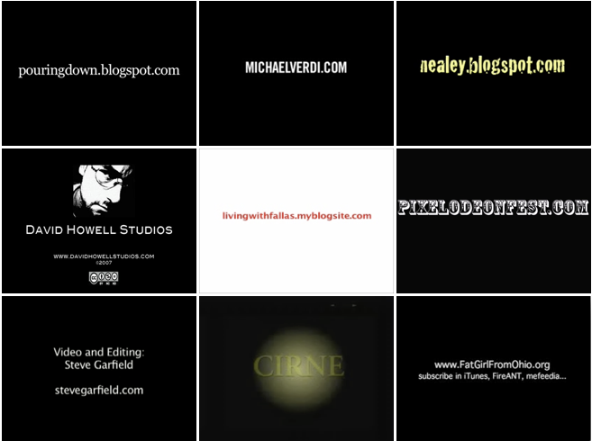

Figure 10: Typical credits showing use of URL as branding, note
similarity of form

To start, we might take as an example the title card that most
videobloggers used at the end of their videos (figure 10). This would
often display the URL on the last few frames of the videos; this was
usually done using white type on a black background. The typeface might
vary, but as can be seen from a few screenshots below, the result are
remarkably similar in form and presentation. The title card grew out of
a number of different needs. Firstly, the videobloggers had a strong
sense of ownership of their work, and marking it with a name and a URL
was a way of signing the work off, perhaps like signing a painting.
Secondly, the title card allowed the video to be separated from the
videoblog on which it was hosted. Which meant that if the viewer were
watching using FireAnt, Mefeedia or iTunes, in a long stream of other
videos, they would still be able to identify who the creator was.
Thirdly, the title card acted as a signifier that this was a
*videoblog*, not just an internet video. It signalled that the producer
was part of a community of practitioners following certain technical and
aesthetic conventions.

What is striking is the way in which the form of the title card and how
it was located within the timeline of the video soon became
conventionalised. Through various iterations and experimentations the
use of this method of marking videos enabled at least some sense of
social status, as members of a distinct community around videoblogging,
to be recognised and shared. These social signifiers are important for
identification and help maintain a sense of community, or at least some
shared practices around which social structures begin to cohere. But
just as important is the way in which these practices begin to
crystallize a shared sense of an aesthetic appropriate to the form of
videoblogging.

The videoblogging vernacular is reflected in a set of stylistic and
formal tropes, including narrative decisions and technical equipment,
all contributing to the creation of a particular visual result. This
shares certain commonalities with what Newman calls a DIY aesthetic, a
rather loose concept which he defines as referring to ‘a visual or sound
style, the modest-means quality summed up by the punk myth that all it
takes to start a band is three guitar chords… But DIY can also mean
media made using the new tools, themselves the products of professional
creators, that allow anyone to set up a blog or a Web photo album.’[^06chapter5_4]

The videoblogging vernacular not only refers to how a videoblog *looks*,
but also to the wider practices associated with amateur and
semi-professional production, which includes a ‘shift in taste from an
assumption of professionalism as the norm and standard of quality to a
position that amateurism has equal or even greater value’.[^06chapter5_5] Making do
with whatever equipment was available has a long tradition in amateur
and semi-professional film and video production, as Patricia Zimmerman
showed in her work on amateur film in America’s recent past.[^06chapter5_6] As
such, it is not ‘new’. For example, in the 1970s, the term DIY aesthetic
was used to describe the video-works of Guerrilla Television. However,
the particular constellation of technologies available to these
videobloggers was unique. So in contrast, Guerrilla Television had
access to portable equipment and editing tools, but access to
distribution remained one of their main problems. Whereas Miles argues,
networked distribution is where videoblogging is unique in the history
of film and video and the videobloggers were aware of this in the way in
which they produced the format, but also distributed it.[^06chapter5_7]

The videos selected for this formal analysis were recommended by the
videobloggers themselves as key examples of their work. Due to the time
that has elapsed since the interviews took place, however, some of these
videos, for a variety of reasons, are no longer accessible. As
mentioned, Blip.tv – where most of the videos were hosted – deleted old
videoblogs in October 2013.[^06chapter5_8] Other videos were hosted on a
videoblogger’s personal server, many of whom are no longer making these
files available online. Some have chosen to delete old videos, or have
migrated to new web domains and neglected to move the videos to the new
site. One videoblogger, Raymond M. Kristiansen, told me his website (he
migrated to a Wordpress blog in 2007) got infested with malware, and he
can no longer access any of his own videos. At the time I conducted my
interviews, I downloaded all the videos that were recommended to me.[^06chapter5_9]
Some are encoded in old obsolete codec formats, and will no longer play,
a frustrating aspect of technical media. Those videos uploaded to the
Internet Archive have survived technical upgrades and changes best. It
is interesting that so few of the videos survive, considering the
community consistently emphasised the desire to use videoblogging as a
way of archiving and aiding memory for the future. As Susan Pitman put
it, ‘I am documenting this for my kids to watch when they’re older’.

I chose two videos from each of the three different videobloggers for
the close reading from the categories I identified as personal
videoblogging, everyday life videoblogging and artistic videoblogging.
This was a combined total of 33:47 minutes of video footage. The first
set was two videos by Ryanne Hodson, one of the most prolific
videobloggers at the time and an early adopter of the practice. Hodson
made very personal videos on her blog Ryanedit.blogspot.com, often
filming herself as she was getting out of bed, or as she was travelling,
hanging out with friends or just videos of her expressing her ideas –
often reflections on videoblogging. Hodson worked through a variety of
cameras, from a digital camera with a video function, through to the
Sanyo Xacti. Hodson’s style was deceptively simple, using iMovie to edit
her work. Her videos were always more about what she had to say, than
how they looked. She was an active and generous member of the
videoblogging community whose contributions included the resource site
Freevlog, being instrumental in setting up *Have Money Will Vlog*, an
early community fundraising site, and volunteering at Apple stores
teaching people how to videoblog.

The second set of videoblogs was from Daniel Liss’ site Pouringdown.
Liss’ videos were explorations of the medium of videoblogging through a
singular aesthetic that made his work instantly recognisable. Liss was
not the most active member of the videoblogging community, and would
rarely engage in long discussions on the email list. He did, however,
follow the debates closely and often reacted to people through his
video-work, as can be seen in the video *Theory:Practice*, explored
below. Liss never filmed himself or his family directly, although they
often featured in his work indirectly. He relied heavily on voice-overs
and narration and would experiment with styles, and effects such as
blurring images, long, lingering shots with minimal movement and
editing, but also more rapid cuts and jarring edits that really brought
attention to the aesthetic possibilities of the medium. Finally, the
third set of videos was gathered from Juan Falla’s videoblog, *Viviendo
Con Falla*, following Falla and his wife through their everyday lives as
they settle in to their new lives in Los Angeles, having recently
relocated from Colombia. Falla’s videos were playful explorations of the
cultural differences between Colombia and the USA, and he usually spoke
both English and Spanish in his films. Falla was an aspiring filmmaker,
and he often drew on established tropes and styles in his work, caring
deeply about the editing process and the finished product.

The videobloggers are quite adept at using established cinematic styles
and tropes. There is a diverse mix of styles to be found used in their
work. As the practice developed, some videobloggers invested in more
professional microphones, but the majority recorded diegetic, ambient
sound through the internal microphone of the cameras they used, so
generally, the sound in videoblogging was fairly low quality, but its
rawness added to the vernacular aesthetic. Some voice-overs were
recorded in post-production, resulting in ‘better’ sound quality, yet
neither Daniel Liss or Hodson had these kinds of resources available.
Lighting was usually limited to the natural or artificial light that was
available where and when the videoblogger was shooting, which meant
faces were often ‘badly’ lit –all of which sharpened the aesthetic of
the end product. This aesthetic was increasingly deliberate, as
‘according to its own rhetoric, the new participatory online culture
needs none of the fancy apparatus of the mainstream media to create
something honest and worthwhile, something that communicates citizen to
citizen in an authentic and personal mode of expression. It is better
off as amateur media than it would be with the means available to
professionals’.[^06chapter5_10] Certainly, this was seen in videobloggers’ work
that would rejoice in its alternative and counter-mainstream aesthetic.

Birgit Richard argues that online video, and YouTube in particular,
perpetuates an ‘ideology of authenticity’ linked to the poor-quality
recording tools and subsequent poor resolution images produced. This
aesthetic, together with the small windows displaying videos ‘conspire
to create “a look of everyday life”’ and far from being a ‘substitution
or… an exchange for classic media art’, YouTube videos are a
‘supplement, a marginal but important fresh addition and revitalisation
of art’, with YouTube bringing to light previously invisible practices.
Steyerl likewise conceptualises this in her notion of ‘poor images’ – or
copies in motion – images that travel through culture at an accelerating
speed, and lose quality at every iteration, be it through compression,
remixing or travelling through low quality digital connections. ‘The
poor image is no longer about the real thing’ she argues, ‘instead, it
is about its own real conditions of existence: about swarm circulation,
digital dispersion, fractured and flexible temporalities. It is about
defiance and appropriation just as it is about conformism and
exploitation. In short: it is about reality.’[^06chapter5_11] As Richard argues,
through YouTube, ‘the thus far invisible common creative practices –a
lot of them may have existed before – are becoming more visible and open
up the possibility of emerging new art forms’.[^06chapter5_12] In contrast, Michael
Renov derides this ‘lure of authenticity’ associated with documentary
filmmaking, achieved through a ‘cunning appropriation of particular
tactics or stylistic traits (the use of ‘witnesses’; the low-tech look,
shaky camera; grainy, out-of-focus images)’, pointing out how some
non-fiction also ‘displays a number of ‘fictive elements’ – instances of
style, structure, and expositional strategy that draw on pre-existent
(fictional) constructs or schemata to establish meanings and effects for
audiences’.[^06chapter5_13]

In relation to the videoblogs I examined, but also more informally in
the wider videoblog community, there was a constant push and pull
between a form of grassroots ‘authenticity’ and a desire for
professionalism. Indeed, this would sometimes be observed in a desire
for professional ascription, or that some form of recognition was or
should be made towards their work. This resulted in a creative tension
within the videoblog community as this dual identity, part
pre-professional, part authentic artist, would be manifest in various
ways in their videos. In fact, I would go further and suggest that the
videobloggers identity was in some sense imbricated between two orders
of identity. That this tension was never fully worked out into a new
synthesis reflects on the shortness of the community’s existence, but
also in a challenge to their identity which came from an unexpected
direction – YouTube. As YouTube’s strength and online presence became
increasingly hegemonic, the fledgling videoblog community, which was
very poorly funded in relation to YouTube, struggled. Nonetheless, we
should remember that the aesthetic of videoblogs was largely settled
*before* YouTube emerged, and certainly before its full power was
realised. So if we look at formal aspects of the videos themselves, such
as editing style and technique, a number of recognisable practices
emerged early on.

The editing in videoblogs, for example, tended to be circumscribed. For
instance, one long-take bracketed each end by a title card and credits,
as seen in *Excited* and *V-Blog Conversations*, or feature a number of
quick edits, with cuts as short as 1-2 seconds long, for instance
*Theory:Practice* and *Greetings*. Videobloggers might chose to approach
one video in one way and one in another. For example, ‘one video can be
really simple,’ Juan Falla told me, ‘not a lot of editing, but then the
next one can be heavy-edited and music... in some videos I feel more
like being creative’. Further, the decision about whether a video had a
lot of editing might not be planned from the beginning of the shoot. For
example, after a weekend visiting Sundance, Falla knew he wanted to make
a video about his experiences. It wasn’t until he began editing he
realised what the video would end up looking like, ‘editing it,’ he told
me, ‘I realized that I could tell a story having 10 frame shots only.
And it would all be a crescendo for the last shot.’

For me, this comment really highlights how videoblogging differs from
conventional film-making practices. This open-ended approach of what we
might call elements of ‘found-shooting’ – that is on the fly video taken
in the moment, as life unfolds. I have never come across a videoblogger
story-boarding a video, for example, at most they might map out a very
rough structure. Richard BF liked to experiment with lots of different
styles. One week he would do a ‘slow motion piece, one in B&W… one
upside down, I did one with my camera gaffed to my motorcycle, I did
various character voice overdubs, I faked a few “personal” videoblogs,
short ones, long ones, art pieces with effects etc.’ This playfulness
allowed great freedom and personal risk-taking, which was crucial to the
way videoblogging was articulated and practiced. This experimentation
was not limited to aesthetic choices, but included the technical
specifications as well. For example, Hodson told me ‘you would play with
a number and you go, ‘Ok, oh, Q value. What if I put a 60 in here? Let’s
see what happens. Ok, that didn’t work. Let’s try 70. Let’s see what
happens.’ Until you got something that worked.’ Videoblogging gave her a
sense of creative freedom, not just to experiment but to ‘post whatever
I feel like. It’s my outlet.’ Jennifer Proctor told me ‘I use my site to
experiment with new techniques or ways of seeing or storytelling… it’s a
space that isn’t open to me anywhere else.  It’s kind of a judgment-free
zone for me, where I can make work that finds an audience (albeit a
small one) but is totally experimental and not necessarily polished. 
It’s a space where I can express myself and connect with others, however
imperfectly, and I love that.  It’s very liberating.’ This creativity
and space of experimentation also enabled different kinds of gender
representation to play out. Without the stifling weight of ‘traditional’
formats, and a sense of openness towards what a videblog could be, both
in terms of form and content, meant that, particularly for the women
videobloggers, there was no ‘wrong way’ to articulate their experiences,
affect or arguments. Of course, previous media forms can and did
influence the work produced, for example, film, television and video,
but there was seldom an attempt to close down experimentation because it
didn’t conform to a ‘norm’ established in or through any prior media.

Most informants told me they spent more time on editing than on
shooting, this aspect of the practice was important to them. For a
videoblogger, editing was highly valued and formed an important part of
how they identified the ‘craft’ of videoblogging. They felt a strong
sense of ownership over their content, and in this respect, editing, the
shaping of the image, the creation of narrative and affect, was central.
The ‘power’ to create something unique, to manipulate images and sound
to create new stories, clearly held a certain appeal; ‘in editing, it’s
only me and nobody else. I love this. I love how from different shots, I
end up with something people never imagined,’ Juan told me. This
emphasis on the importance of the editing process is perhaps best
summarised by Richard Hall, who told me that ‘editing is like meditation
– I’m in a different world,’ often spending 4-5 hours editing a video,
which ended up being no more than 3-4 minutes long. Falla, equally,
highlighted the importance of editing to the videoblogger, saying ‘I
like to edit a lot. So I take my time. The fastest edit I ever did was
like 4 hours. But in other more complicated videos I have spent probably
6 hours per day for 5 days. But that’s because I love editing.’
Similarly, Charlene Rule told me ‘I find shooting to be the most
difficult, but again, once I force myself to start, then I’m excited to
start editing.’

For Bordwell, the framing of an image shows the ‘conscious processes of
the film-maker’ and he argues that ‘whatever its shape, the frame makes
the image finite. The film image is bounded, limited. From an implicitly
continuous world, the frame selects a sleeve to show us, leaving the
rest of the space off-screen.’[^06chapter5_14] In contrast, there is a notable
absence of particular standard cinematic tropes such as the establishing
shot in videoblogging. An establishing shot is intended to give the
viewer a full overview of a scene before the action kicks off,
establishing boundaries of action and meaning. In some ways, it is one
of the main tools used by a director to frame a scene, both symbolically
and materially.[^06chapter5_15] These alternative and unconventional practices
within videoblogging more generally – even for those self-categorising
as makers of documentaries – is significant. Movie director Joe
Swanberg, who has adopted many ‘internet video’ elements in his work,
and makes movies that operate similarly to some videobloggers
(shoe-string budgets, digital cameras, heavily influenced by YouTube and
web video), argues the reason he almost never uses the establishing shot
is because ‘I don’t want you to know where people are because it’s not
important… I like working extremely close because it’s all about that
moment. When I photograph a body part – a hand or foot – this is what I
care about. The little things – tiny details separated from their
circumstances.’[^06chapter5_16] This wider mainstreaming of the aesthetic practices
of videobloggers is something that emerged later but nonetheless showed
the creative potentials of these communities.[^06chapter5_17]

In videoblogging, consequently, there was a move away from the
establishing shot and instead the focus on ‘tiny details’ such as
close-ups of objects; coffee machines (as in Erin Nealey’s *Mornings*),
hands (Charlene Rule’s *Mod,* Daniel Liss’ *Prototyping*), and faces
(Ryanne Hodson’s *V-blog Conversations*, Daniel Liss’ *Requiem* and
Charlene Rule’s *Bump*). Mary Matthews told me that when filming others
she focuses on the ‘face, eyes, hands. The parts of them that are truly
them’. She never elaborated on why these particular parts were ‘truly
them’ but it echoes the notion of partial objects and *faciality* from
Deleuze and Guattari. As they argue, the face can be read as a language
and ‘the close-up in film treats the face primarily as a landscape; that
is the definition of film, black hole and white wall, screen and
camera’.[^06chapter5_18] As such, the face gains an elevated position within film
theory and acts as a ‘veritable megaphone’. Raymond told me,

> I film myself, mostly… the face, the talking. The conversation… face,
> head… I don’t really see my body as the key of this either. The only
> reason why I show my body is that it is the carrier of my face, and
> even though I show my face a LOT less than I used to, I still see the
> face as being important for the kind of communication I want in my
> videos.

The emphasis on the face was repeated by a number videobloggers. It can
also be found across YouTube,[^06chapter5_19] where numerous videoblogs show
footage of people talking, singing, arguing and laughing into the
camera.[^06chapter5_20]

This idea that the face plays a vital part in communication is
interestingly developed in film theory. For example, Christian argues
that ‘pushing the camera against the face forces the viewer to
contemplate the character’s interiority and story expressed through the
screen; it defines the film as a mediated, intimate space first, and
eventually as a space where something ‘real’ is possibly but improbably
achievable’.[^06chapter5_21] Swedish auteur, Ingmar Bergman famously explored the
subtleties of the face through his uncomfortably close shots of Ingrid
Bergman and Bibi Anderson’s faces in *Persona.* In a more recent
example, Pablo Larrain’s intimate portrayal of Jaqueline Kennedy in the
movie *Jackie*, features similar relentless focus on Natalie Portman’s
face and hands. This mediation of some kind of ‘real’ is also central to
the videoblogging aesthetic, and also to their discourse. Of course,
this claim to the real, or to realism, is itself problematic, and even
those videobloggers who ‘love it’, are still reflexive about that fact
that what you see is mediated, or somehow manipulated.

There are also technical reasons why the face dominated the
videoblogging aesthetic. For example, Juan Falla moved between technical
and symbolic reasonings for focusing on the face in videoblogs, thus
performing a kind of medium analysis of his own work. He began by giving
a symbolic reasoning for his ‘directorial choices’ telling me that he
focuses mainly ‘on the face. That’s how people watching the video
‘connect’ with it. Because as a viewer we feel compelled and we can
understand and accept (or deny) a person’s reaction. And the best way is
either by an action of the person, like in a movie; or by the person’s
face.’ Falla then moves on to discussing how the medium of videoblogging
(though he is really discussing QuickTime here) lends itself to a facial
close-up ‘in order to connect’ with other people. ‘We have to understand
that videoblogs are 320 x 240, or in our case 480x 280, and *that* is a
small screen, so the closer we are to someone’s face, the better we can
understand and connect with her/him.’ Here we can see how the
materiality of videoblogging has a structuring influence on the visual
it produces, reminiscent of Marshall McLuhan’s ideas about close-ups as
specific to the medium of television. Falla also points to other
material affordances of videoblogging, positioning the practice within a
wider cultural frame. He told me that,

> I primarily show the face… because I only have the microphone of the
> camera, so the closer I am to the person talking, the better sound I
> get. Another thing is that I love the typical videoblog shot. The one
> where you shoot yourself holding the camera with your own hand. I
> think part of the magic of videoblogs is this particular shot. I mean,
> we have medium shots in CNN or BBC News, right? We also have all these
> incredible shots in the movies where the camera even flies around in a
> spectacular shot. In videoblogs, we have the camera in ‘a person’s
> face’, and this is way more personal.

The face in videoblogs has grown to represent a kind of realism, or
truth, and some kind of personal connection. However, it is not
necessarily the face itself as captured by the videoblogger that
suggests an unmediated or authentic record of the event but the fact
that the recording exists at an arm’s length. Indeed, if we imagine a
person holding up their mobile phone in front of them to take a ‘selfie’
or a snapshot, this makes more sense.

Some videobloggers, made a conscious decision never to show their own
faces in their videoblogs. Mica Scalin told me that in her work, ‘faces
are often secondary because they almost distract too much or allow
people to make too quick judgements’. Brittany Shoot told me she didn’t
‘want to talk to my camera anymore, and I also am not really convinced
that’s effective.  In the sense of putting myself into the video in
heart, yes, they are personal.  But do I show my face as much, talk
about my life, how I feel?  No.  I let people draw assumptions from
whatever I make’. Shoot talked at length about how she ‘used to show
emotion when I talked to the camera, but it backfired when I got too
angry on film’, and this effected her relationship with the
videoblogging community. Equally, Daniel Liss never showed his face in
his videos. Liss and Shoot’s positions echoes Patricia Lange’s notion of
a ‘privately public’ videoblogger. [^06chapter5_22] Lange argues that despite
having a group of followers/subscribers/fans/friends, some
videobloggers, particularly those she calls ‘privately public’
videobloggers, are fiercely protective of their friends and family. For
Shoot, her honesty on film left her vulnerable to personal attacks –
perhaps not surprising to anyone following the debates surrounding
Gamergate and more recent ‘hashtag events’ like \#metoo and \#notokay –
detailing the kinds of abuse, sexual and otherwise, women experience,
especially on digital media. In Liss’ case, his daughter, who featured
quite heavily in his videos, was only ever referred to as ‘Mookie’ and
her face is never fully shown in his work. Liss himself only ever
revealed snippets about his own identity in his videos, beyond the fact
he is male and lives in New York. Hiding became a way of squaring the
contradiction of living a private life in a public medium. I think this
dichotomy between the ‘real’ represented by an ‘arms-length’ selfie
video, and the desire by some videobloggers to withhold their faces is
interesting in thinking about what a videoblog is. We might term these
different approaches ‘selfie-real’ versus ‘talking-real’ to bring out
the different ways in which the documentary-mode, which was often
gestured towards through the aesthetic and practice, was presented. This
idea of the face as real as opposed to the voice as real (as in the
voice-over) is offered to explore and highlight different ways of
thinking about what the practice of videoblogging brought forward or
foregrounded in its practice. Nonetheless, the ‘selfie-real’ certainly
emphasised a stronger dimension, or representation, of the personal.

Now I want to change register to consider close readings of a number of
videoblogs, starting with what I term ‘personal videoblogs’. The aim
here is to give a stronger sense of the way in which different
videobloggers might work in a specific mode whilst nonetheless
conforming to the general principles of the videoblogging aesthetic. In
this case, a personal mode was reflected in the content of the
videoblog, but also in specific moments in the form of the videos. This
section will explore Ryanne Hodson’s videoblog. Hodson started
videoblogging in November 2004 and was one of the most active
videobloggers in the core community. She had been working as a video
editor at WGBH, a virtual channel part of a PBS television station in
Boston when she started feeling disillusioned with the constrains under
which she worked. She saw videoblogging as a medium that would allow
ordinary people to transform themselves from media consumers to media
producers. She self-defined as a ‘personal videoblogger’ documenting her
everyday life, and had a number of ‘talking head’ videos in which she
mostly speaks to the camera from her room in her apartment in New York.
She was heavily involved in promoting videoblogging, including
co-writing a book on videoblogging, speaking at conferences, organising
workshops and running freevlog.org.[^06chapter5_23] Hodson had a natural way of
being on camera. She was at ease with both herself and her audience,
creating a sense of intimacy with the viewer as she invited them into
her life. Her enthusiasm for videoblogging was also palpable in her
work. For instance, she would sometimes turn the camera on upon waking
up in the morning, giving a long, rambling monologue about a subject she
was passionate about with sleepy eyes and messy hair. This made her
videos compelling. What she had to ‘say’ was the focus of her posts, and
she was never short of an opinion, controversial or otherwise. One of
her first videos, *Excited* (00:50 min, 240x180) was the first video in
which Hodson turned the camera on herself. Her previous work had
featured her mother and time-lapse videos from Boston. After turning the
camera on her own face, manifesting what I am calling ‘selfie-realism,’
we might say Hodson found her ‘thing’ and she also found her audience.

In *Excited*, Hodson started creating her particular style of
videoblogging, which she develops further in *V-Blog Conversation*
(03:32 min, 160x120). The videos use the selfie-realism videoblogging
head shot, the talking head, which Hodson also highlighted as one of her
most used devices. ‘\[I film\] the face mostly, talking head, talking at
ya!’ In *Excited*, her face fills almost the entire screen (figure 11),
which is framed slightly off centre and slightly blurred. She is often
poorly lit, in fact, it looks as if her face is being lit by the light
emanating from her computer or laptop, which means she either filmed
this video using the recording video function in iMovie, on a webcam or
on a digital camera with video function perched on the desk in front of
her. Later, Hodson would go on to use the new Xacti camera for most of
her videos, but until the Xacti was launched (in January 2006), she
relied on one of these three methods of filming. With the move to the
Xacti, the quality of the image improved dramatically, but her style
remained similar. Hodson’s first mention of the Xacti is in 2006 (on the
videoblogging list, where she posted a review). Like many videobloggers,
using the video function on a digital camera was their preferred method
of capturing film, and Hodson soon moved to use this technique.

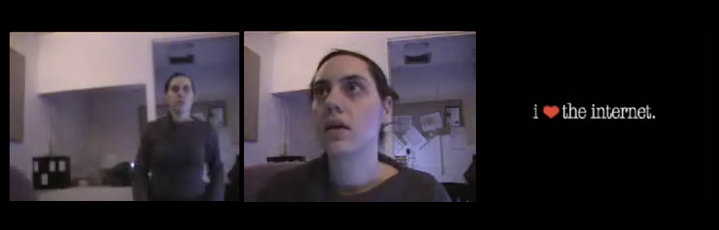

Figure 11: *Excited* (Hodson, 2004)

In *V-Blog Conversations*, it is clear that she is holding the camera in
her hand. The shot isn’t nearly as steady as in *Excited*, and it moves
around as she does. In their book, Hodson and Verdi call this the
‘classic ‘talking to the camera’ videoblogger shot’. Dedman and Paul
also refer to as the ‘classic videoblogger shot’[^06chapter5_24] and Will Luers
describes it as ‘the most pervasive vlogging camera position… the
arm-extended, camera-turned-on-oneself method of address’.[^06chapter5_25] I prefer
the term ‘selfie-realism’ which more strongly brings out the
connotations of the real and the personal that this technique
foregrounds. At one point in her video, Hodson also pans it around the
room to show where she lives. Again, the lighting is poor, this time her
face is half-lit by what looks like a light source off-screen to the
left, which means half of her face is hidden in shadows for most of the
duration of the video.

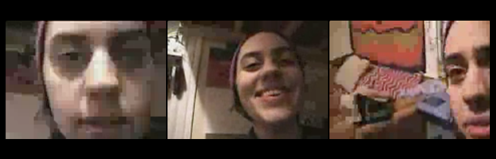

Figure 12: *V-blog Conversation* (Hodson, 2004)

Hodson’s face fills the screen in a close-up and only towards the end,
when she is showing the viewer her room, does the camera pan away from
her face (figure 12). The framing of her face echoes the way our faces
are framed in Skype chats or other kinds of instant video-communication.
In other words, the look of the videoblog is reflected in its content,
and Hodson is chatting, literally, to whoever wants to listen. As she
says in the video,

> Hello… hello videobloggers. Um, I… just watched Jay’s video of him
> sitting with like a purple curtain behind him, talking, um, and
> saying, wait, why shouldn’t I just type this, it’s a blog, so
> \[laughs\] I was inspired to just sit in front of my camera and talk
> about videoblogging, because, um, I am so excited about it.[^06chapter5_26]

She goes on to describe some of the things she loves about
videoblogging, which are linked to the kinds of intimate relationships
the medium is facilitating with a new audience,

> On the Internet, you just make it. And you post it. And people laugh.
> In California. \[smiles\] And they write you and they say ‘oh my god,
> I laughed so hard when I saw that’ \[laughs with entire face\] It’s so
> great! It’s just the best thing…. you know, the internet, it’s a five
> minute thing I want to do, ok I’m gonna do it and people can watch it
> and I feel great, oh my god, that’s the best thing in the world. So,
> it’s 3 am, right now, and I just played poker all night, and I
> couldn’t get to sleep, cos I just saw Jay’s video and I was like I’m
> totally going to get my camera and talk to people.[^06chapter5_27]

Both *Excited* and *V-Blog Conversations* are notable for being filmed
in one take, they have no cuts or edits in the main body of the video,
which is a common trait in this particular type of videoblog; the
personal, confessional, diary-style videoblog. This is for two reasons.
Firstly, from a purely technical perspective, having long single-take
video makes the production process much quicker and easier; the
videoblogger simply adds a title card at the beginning and credits at
the end, before compressing and uploading. Secondly, it creates a sense
of intimacy and realism. By showing herself in one take, Hodson gives
the viewer the impression that she is ‘able to put \[herself\] out there
and be so vulnerable with people’ – rather than present an edited
version of herself. This echoes André Bazin’s notion that ‘cinema is
objectivity in time’.[^06chapter5_28] Bazin argued for the ‘use of long, continuous
shots in order to preserve spatial and temporal continuity’ and believed
that ‘editing serves to falsify reality by breaking up space and
time’.[^06chapter5_29] Bazin also argued that the screen is ‘putting us ‘in the
presence of’ the actor. It does so,’ he claimed, ‘in the same way as a
mirror – one must agree that the mirror relays the presence of the
person reflected in it – but it is a mirror with a delayed reflection,
the tin foil of which retains the image’.[^06chapter5_30] Similarly, in an online
setting, these kinds of long, or one-take videos are part of creating an
air of authenticity surrounding the videoblogger. Her success is related
to her ability to communicate her sincerity to her viewers. As
Vanderbeeken points out, ‘what is special about web video documents is
that their credibility depends on the viewer’s willingness to accept
their authenticity, as there is no guarantee that they are not staged or
manipulated’[^06chapter5_31]. Clearly, the selfie-real forms of video are as open
to manipulation as other mediated forms. But nonetheless, it still seems
to contain a kind of aura of realism.

Interestingly, when Hodson started working with Jay Dedman on the
project *Ryan is Hungry*, a funded web series about sustainable living
and ecological farming, their videos were much ‘snappier’ – featuring
sharp edits, professional-looking logos and following much more
traditional documentary-style tropes (interviews, commentary,
narrative). The personal videoblog, then, was, for Hodson at least, a
personal space in which she could narrate stories from her own life and
share experiences with her other vlogger friends, ‘this has been the
greatest gift of videoblogging. Having people say ‘me too!’ Isn’t that
what we’re all looking for? I think so’. She also filmed inside her own
bedroom, inviting the viewer into her private sphere, even giving the
viewer a tour of her personal space highlighting the sense of intimacy.

In her work, Hodson also explores the idea of videoblogging as a new
platform for expression and free speech, a medium in which videobloggers
express themselves – ‘I am so excited about videoblogging. Because I can
say whatever I want and the FCC can’t do BLEEP’. This freedom of
expression, both artistic and political, was very important to her;
‘it’s like complete freedom, I post whatever I feel like. It’s like an
open diary to the world.’ At the time, Hodson was working in television,
and was frustrated with how making content was laborious, expensive and
censored. In her interview she said her videoblog is ‘something really
different than TV’. However, it is very clear from her video that Hodson
is also censoring herself, choosing to bleep out not only her swear
words, but even the surname of George W. Bush, whom she clearly
dislikes,

> Hodson: Hmm. *Looks away from camera as if she is thinking what to say
> next. Faces camera* BLEEP you, George W BLEEP BLEEP BLEEP BLEEP
> \[mouths ‘Bush, you fucking asshole’\]. You BLEEP \[mouths
> ‘suck’\].[^06chapter5_32]

In other words, there is a tension in Hodson’s video between the
perceived potential for artistic and political freedom, and the
self-censorship of bleeping out ‘bad words’ as if she is on a public
network channel. This could be seen in contrast to her video *V-Blog
Conversation*, in which she speaks much more frankly to a much more
specific audience, even referring to other videobloggers by name. She
mentions particular videobloggers in other videos too, an example of how
the videoboggers were creating a sense of community; referencing each
other’s work, commenting and engaging one another in conversations
across videos and across videoblogs. *V-Blog Conversation* was only
posted a month after *Excited*, but the tone and style had changed quite
dramatically. In *Excited*, Hodson was creating a fairly stylised piece
– the tone, tempo and combination of words, image and music work
together to form a polished piece. In *V-Blog Conversation*, however,
she is notably more relaxed and you get a sense that she is talking
directly at a specific audience. I believe this is a testament to how
quickly the community was forming at the time as Hodson had shifted from
addressing a generic (and unknown) audience to speaking directly to a
network of people she knew (probably by name) and felt part of, from
small imagined audience to a small but intensive real community. These
videos have roughly the same amount of comments (10 comments on *V-Blog
Conversation* versus 9 comments for *Excited*), but as Hodson starts to
learn not just that people *are* watching, but *who* are watching, her
tone changes, and her style becomes more conversational and less of a
performance.

Stylistically, *Excited* feels entirely self-contained; it has a clear
narrative arc, and, although it shares a theme with many of Hodson’s
other videos (the theme being videoblogging itself), it can be seen as a
stand-alone video that can be viewed in isolation and still make sense.
*V-Blog Conversation*, on the other hand, lacks the visual clues of a
narrative arc, there’s no title card, no credits, and, although she
starts with ‘hello’ and ends on ‘goodnight’, there is no real narrative
progression. *Excited* is clearly scripted, whereas *V-Blog
Conversation* feels like a complete improvisation, she saw a video
online she really liked, she was inspired to join the conversation and
she just started talking. The transcript reveals a kind of
stream-of-consciousness in which Ryanne is seemingly just talking to
herself or the audience, about whatever pops into her mind at any given
moment. In this sense, despite looking quite similar*,* the two videos
are in fact quite different. They also show that for a lot of
videobloggers at this time, videoblogging was very much about
experimenting, not just technically, but in terms of genre, style,
technique and ‘finding a voice’.

In contrast to personal videoblogs, I now want to turn to look at what I
am calling artistic videoblogging. These videoblogs, I loosely group due
to their focus on aesthetic practice in terms of both form and content,
I am particularly interested in the way in which the videoblog is
treated as a medium of expression, but not in the sense of the
selfie-realism I referred to earlier. In contrast, here the explorations
tend to be in terms of representational tropes, visual effects, montage
and collage and it is interesting to look at the work of Daniel Liss,
whose artistic practice and video work creates a critical case study of
the artistic videoblog.

Daniel Liss lived in New York with his wife and daughter when he
discovered videoblogging. Whilst home with his new-born child, and as an
outlet for his creative impulses, videoblogging became a way to explore
the city around him. Liss self-defined his practice as ‘experimental
personal film(?)making’ \[sic\]. When asked if his videos had any kind
of narrative, he was quite clear that he does not create ‘any linear
stories. But visual stories. Textural stories. Tone poems’. His work
explores a number of potentialities for videoblogging; *Theory:
Practice* explores the much-debated question of what videblogging *is*,
whereas *World Maps* is a video playing with the idea of videoblogging
as a medium for exploring concepts and ideas. The videos can be seen as
a reflection of Liss’ own practice, as well as a commentary on
videoblogging more generally.

*Theory: Practice* is a visual polemic, just short of 4 minutes long, in
which Daniel Liss presents his contribution to the community debate
around what a videoblog. For him, the video is an attempt to distance
himself from those in the community who had a tendency to lock down any
debate around definitions, demarcate and control a specific definition
of videoblogging that everyone should adhere to. As he told me, looking
back;

> I remember being (disproportionately?) incensed by a segment of the
> dialogue happening \[on the videoblogging email list\]. Specifically
> this: I felt that we were like a bloodthirsty horde marauding happily
> across the plains (what were we bloodthirsty for? maybe every
> perceived revolution is bloodthirsty?) and then suddenly some in our
> group: maybe some stragglers, or self-appointed generals even, were
> saying Guys Guys, you’re not marauding right! That’s not proper
> marauding! THIS is proper marauding. There were suddenly rules about
> which chunk of online video was eligible, and which wasn’t. And I was
> riled up. And that specific video, *theory : practice*, was certainly
> a response to that.

*Theory: Practice* (3:54 min, 400x300) is a tone poem on the
relationship between the city, art and practice. The video features
footage from New York; an apartment block filmed through the window of a
car and, later, the botanical gardens, interspersed with close-ups of
objects that drive the story; scraps of paper, a mechanical pen, a
baby’s hand, and views of objects through windows (figure 13). Liss’
voice-over is used in conjunction with the images. *World Maps* (03:38
min, 400x300) is a reflection on the capriciousness of memory and is
structured much in the same way, hand-held footage of a baby exploring
maps, books and other travel memorabilia set to Liss’ self-composed
music and voice. Here, however, the narrative is more linear than in
*Theory: Practice* – as the video progresses, the objects become more
and more scattered, and the baby is more and more intimate with them,
putting them in her mouth, touching, feeling. The voice-over in *World
Maps* follows a narrative path, whereas in contrast, the footage and
narrative in *Theory: Practice* is cut in a non-linear way.

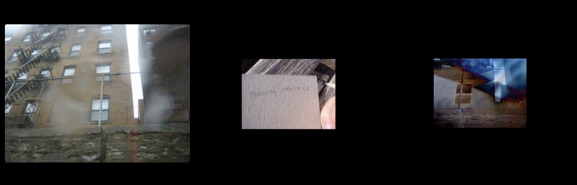

Figure 13: *Theory:
Practice* (Liss, 2004)

In contrast to Ryanne’s videos, Liss never makes talking-head
videos,[^06chapter5_33] something he discusses in *Theory: Practice*, saying he
doesn’t ‘point the camera at myself and explain’ what is going on in his
videos. ‘It’s probably shyness but I think it’s something more than
that. I don’t see the world that way and I don’t tend to listen that
well when information approaches head on.’

Instead of selfie-realism, Liss uses the point-of-view shot as his main
form of expression. Always looking out at the world from his eye level
and almost always hand-held, the camera, which ‘roams freely’, acts like
an extension of his eye, seeing the world as he sees it. Like Dziga
Vertov’s *kino-eye*, or Alexandre Astruc’s idea of the *camera stylo*,
Liss writes his story through images, matching words and images, cuts
and words, visual movement with rhetorical movement. In *World Maps*
this is evident, as the camera pans around at floor level, panning
around the baby, as she is experiencing the map, zooming in and out to
focus on her hands, then feet, and finally a full shot of her as she is
sitting on the map (see figure 14).

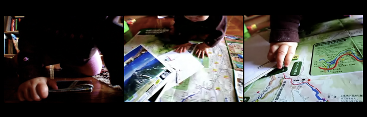

Figure 14: *World Maps* (Liss, 2004)

By situating the camera in the middle of the action, the viewer feels
part of the story as it unfolds. Like hand-held camera footage from a
concert or a demonstration, where the camera travels between bodies, the
present-ness of Liss’ camera connects the viewer to the world he’s
creating. The effect is twofold. Firstly, as the camera is situated
literally in the action, the viewer feels quite close to it. Secondly,
the hand-held camera is close to the floor and not able to capture a
perfect image at all times, and so the quality of the image is variable,
in and out of focus. This acts as a reflection on the limitations of
memory – as the baby is discovering memorabilia from past travels, Liss
is also remembering them, but poorly, as a faint (blurred) memory.

In *Theory: Practice,* similar blurred images and ‘half-captured’ scenes
– objects seen through car windows obscured by rain drops – contributes
to Liss’ theory of videoblogging, an art form which he argues isn’t
*supposed* to be perfect. Campanelli calls these artifacts ‘disturbed
aesthetic experiences’ and presents the hypotheses that ‘the use of
digital tools in relation to cinema, and the consequent lowering of
product quality, are not necessarily a consequence of the small budgets
of young independent directors. Rather… we are in the midst of a new
aesthetic positioning – one which, as usual, is picked up by the
antennae of artists before becoming obvious to all… these are all
conscious aesthetic choices, which have nothing to do with finances
available to the production’. [^06chapter5_34]

This can be seen as a deliberate stylistic choice, as much as a result
of the constraints on the videoblogger due to equipment and bandwidth,
especially in the case of *Theory: Practice*. As well as bringing the
viewer closer to the action, creating a sense of intimacy, Liss is
making the point that this is videoblogging as he sees it, because this
is how he sees the world; ‘I am showing you a part of my world and
telling you a little something about it…. This is my world. This is how
I see it, how I think it’*.* As Newman argues, ‘rare is the videoblog
that has anything resembling the look or sound of a local news program
or network sitcom. Just as punk is opposed to the polish of pop, Web
video is opposed to the gloss and sheen of Hollywood entertainment. That
sense of opposition is the spirit and ethos of DIY production whether in
music, publishing, or audio-visual media. As Frank describes it,
videoblogging is ‘a cheap and fast alternative to making media — that
looks cheap and fast’.[^06chapter5_35]

Throughout his work, Liss plays with form and narrative. He skips back
and forth in time, for example, a sheet of paper is initially shown with
writing, scribbles all over it, and later in the video the same sheet of
paper is shown blank. Sometimes he displays the same image repeatedly.
For example, the image of the New York building is shown twice before he
uses it a third time with an inverted image of a hand layered over it.
He manipulates the image by using double exposure on the images of the
hand and the building, to highlight the mediated nature of videoblogs,
pointing out that even when someone simply shoots-and-posts their videos
are still mediated. ‘To pretend that’s something unmediated in itself is
I think a little naïve’, he explains. He also manipulates the sound,
bringing in music at dramatic moments in the narrative, to create
emotional effect often in conjunction with sharp cuts or swift camera
movement.

Like Ryanne Hodson, Liss speaks directly to the viewer, although his
style is very different. Whereas Hodson is talking to the viewer,
sitting down in front of and facing the camera and speaking into it in a
conversational tone, Liss’ interactions are more subtle. Here, I am not
thinking of the way he communicates through sound and image, rather by
the way in which he occasionally comments ‘I vlog it for you’ or ‘I
wanted to bring you something’ and, at the end of *World Maps*; ‘I never
thought of the possibility of someone else going through it, not the
baby leafing backwards through her dads adventures. And not you.’ I
asked Liss about his particular use of ‘you’ in his videos. He replied,
‘if I had to speculate – and really why do you make the choices you make
artistically? – I’d say that there is/was a somewhat heartening
immediacy to it all, an inexorable feeling of conversation, a presumed
someone looking back at you. And maybe at the best of times an intimacy
to the proceedings. And so you address it directly’. This notion of an
‘imagined community’ of others to whom one speaks is a fascinating
aspect of the videoblogging form. Even in notionally subjectless,
perhaps aesthetic oriented work, there remains the perceived or imagined
other to whom one addresses the work. Not as an audience, but rather as
a colleague, an equal, a member of one’s community.

Looking through his archives, I noted that initially, Liss’ videos were
cut with sound, image and text only, very little narration, but that at
some point he started talking directly to the viewer. I asked him why
this was. ‘I remember being somewhat dismayed by this at points,’ he
told me ‘people responded much more... if I spoke in my videos. Like,
they weren’t my favourites but they were relative crowd pleasers (where
crowd equals something like 30 visitors)’. In other words, Liss started
adding more voice-over narrations because his viewers seemed to respond.
The feedback from the community – the recognition from the invested
network perhaps – was important to the videobloggers, even to someone
focussing on or trying to create a different aesthetic.

Pettman argues that in the age of digital sound, ‘the subject is
increasingly vulnerable to being lost in an aural version of Fredric
Jameson’s Bonaventure Hotel. The cues for recognizing individuality via
the ear become something other than the timbre of the voice: the melody,
the beat, or a catch phrase, for instance’.[^06chapter5_36] Liss’ voice certainly
contains some of these qualities. Contrary to the visuality of his
videos (‘images are *out there*, on the screen, and framed by it’, the
sonic - and particularly his voice – ‘does not appear to stand before us
but rather to come to us or at us’.[^06chapter5_37] His narration is melodic and
rhythmic, clearly scripted, and yet, because it is repeated over the
narrative arc of his entire body of work, becomes synonymous with the
videoblog itself. I would probably not recognise Liss if I walked past
him on the street, but I would have no trouble picking his voice out.
His voice is part of what makes his videoblogs unique, which emphasises
that videoblogs are not just visual objects, but aural too in a very
important aspect.

Newman argues that videoblogging ‘might usefully be considered as
self-taught art, a term art historians use to refer to artworks by
individuals “who have no academic artistic training and little
connection to the mainstream traditions of Western art history.”’ The
self-taught artist is someone who lacks the skills considered the
standard within a particular art world and ‘connotes an absence of rules
for the artist to follow, a lack of familiarity with ‘proper’ ways of
solving certain aesthetic problems.’[^06chapter5_38] So although he had no formal
training, Liss was clearly familiar with both cinematic rules and how to
apply them to develop his work and increase viewership. For example, at
the end of *Theory: Practice*, Liss uses denouement to conclude his
polemical defence of his right to videoblog expression. A denouement is
defined as either the final scenes after the dramatic climax of a story,
where the author/film maker ties up all the lose ends or the brief
period of calm at the end of a film where a state of equilibrium
returns. As the music gets louder, the video cuts back to the park
scene, and zooms in on the piece of cardboard, now shown to be filled
with tiny scribbles. ‘While the baby was out,’ he narrates, as if to
summarize, ‘I filled first the cardboard and now this wrapper with these
scribbles, it’s all in here.’ Then,

> \[*Cut to park bench, with (white) wrapper and cardboard, both filled
> with writing*\] Voice-over: But let me show you one last thing, and I
> feel a lot better already doing this. \[*Camera pans to baby, who is
> smiling*, *Cut to image of spring flowers peeking up through the
> grass*\] Voice-over: Here in the garden, there’s the first sign of the
> spring thaw. \[*Cut to black screen*\]*.*[^06chapter5_39]

By returning to the park scene, where his theorizing about videoblogging
began, Liss captures a glimpse of the baby, now awake, who is smiling,
reminding us that ‘naptime’ is when Liss gets most of his videoblogging
done. Showing us the ‘first sign of spring’, Liss shows the viewer his
life, symbolic both of the aesthetic aspect of his videoblogging
practice, and a reminder that videoblogging can be a crystallisation of
a collection of scattered moments.

With the last videos, I want to spend some time exploring the notion of
what I call everyday life videoblogging. In contrast to the previous
forms of videoblogs, in this section I want to examine videoblogs that
celebrate and document the everyday, the commonplace and the quotidian.
This form of videoblog tends towards the documentary, toward the
exploration with the camera as the ‘eye’ and in the recording of the
quiet and transient moments of life as lived experience. Again, I
attempt to explore this type of videoblog through a set of exemplar
videos, which I subject to a close reading.

The spectacle of the everyday and the intimate view of private life has
always been of interest to the film and television industries, ‘what is
different about videoblogs (or vlogs) is the spectacle of the
un-commodified everyday’.[^06chapter5_40] Although there are examples of videoblogs
attempting to monetise their practice, there is something new about
videoblogging in that it exists within a social context that is not
explicitly consumerist. Luers recognises that although the technologies
available to the videobloggers (be it ‘RSS feeds, video compression
codecs, and tagging systems’) can be seen as technical extension of
advertising strategies, aimed at allowing the videblogger maximum
exposure and reach of her videoblogs, ‘rather than compete for attention
in the marketplace, most vloggers look to their peers for feedback and
conversation. For perhaps the first time, we have a somewhat organized
public arena for a cinema without show business’. It might be argued
that people videoblog to make their life cinematic prompting the
question of why dramatic conflict is a necessary filter for
understanding the stories we occupy in our everyday? Further, he asks
what we are missing in our private lives that can be rediscovered and
shared with others through the medium of video. For Luers, it is the
idea of living cinematically that lies at the heart of videoblogging, a
need to aestheticise the everyday through the process of framing,
editing and (re)-presenting the personal. Digital production tools and
online distribution systems make us into a kind of global citizen with
new forms of visual vocabulary and grammar. But as an example of a
nascent global cinema culture, videoblogging has been part of
rediscovering a collective value in the local and the personal. Not the
bland universals offered by the entertainment industries, but the depth
and texture of everyday experience. But unlike personal videoblogs, here
what I am calling everyday life videoblogs eschew the single take shot
dominated by selfie-realism, and instead use cuts and other techniques
to change the experience of watching dramatically.

To explore these ideas I look at the videoblogs of Juan Falla and his
wife Ximena, who made videoblogs because they wanted to stay in touch
with friends and family. [^06chapter5_41] Falla described his videoblog as a
reality show of their life in Los Angeles. Originally from Colombia,
Falla told me they ‘wanted to show \[their\] families how \[their\] life
is \[in LA\]… So we began shooting our selves doing normal things like,
going to the grocery store, going to the beach, in our apartment
cooking, if we made a trip we would shoot it, etc.’ Stylistically,
Falla’s videos draw on televisual aesthetics, rooted in the visual style
of situation comedy. Mainly featuring himself and Ximena, Falla’s videos
are on average between 4 and 5 minutes long, and have relatively high
production values especially when seen in comparison to some of the
earlier videoblogging videos (like Ryanne Hodson). Falla told me he
‘want\[ed\] each video to feel ‘real’. Just as ‘real life’ is. This
meant he made a deliberate choice to, for instance, not use any effects
on the image, filters etc., and keep transitions to a minimum; ‘from the
moment we decided to make our videoblog, we decided that we wanted each
video to be entertaining, to have a beginning, middle and end. So we
edit and add music to each video. This way, it’s exciting, and not
boring’. Falla attempted to edit and add music to make it more
‘enjoyable’. He told me ‘nobody wants to see “boring moments”, not even
our own family (not even me!), so I edit out those boring moments…
instead of having a half hour video, we have a 3 or 5 minute “really
nice video”’. Here, it would seem that Falla’s decision to make
videoblogs of a certain length, which other videobloggers argued were
made for technical reasons, such as restrictions on bandwidth, were in
fact made for deliberate, stylistic, reasons.[^06chapter5_42] Later, he elaborated
on this, telling me that ‘between you and me, I prefer the short video,
instead of a long one. Our attention span is getting shorter every year,
we want things to happen fast. So having short videos, things begin and
end in a blink of an eye.’ In essence, the everyday life videoblog, in
trying to conform to the 4-5 minute videoblog norm, reconstitutes life
as a series of sharp cuts and highlights. Life remediated and reedited,
but life nonetheless.

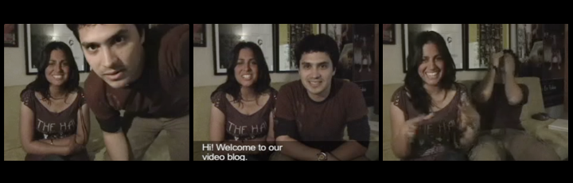

Figure 15: *Greetings* (Falla, 2005)

*Greetings* (4:07 min, 384x288), is Falla’s first video, and acts as an
introduction to the couple’s videoblog practice. The video has only a
short fade-in from black, and is shot with Juan and Ximena both directly
facing the camera. Throughout the video, the Fallas are sitting next to
each other on a sofa with the camera resting either on a table or on a
tripod about a meter in front of them. They speak either directly to the
camera or to each other. As the image fades in from black, Falla is seen
moving away from the camera to the sofa behind him, in other words,
showing the viewer that he has just turned the camera on (figure 15).
This is a technique often used in documentaries and films to show that
the protagonist is filming herself on a small, usually hand held device.
It is often followed by a monologue directed at the camera, the moving
image’s version of the selfie, but here not the selfie-realism
represented by the extended arm. It is a visual representation of the
way the camera doesn’t simply observe events, but becomes an active
participant in the film.

*Greetings* features a quick succession of short cuts, all edited
together. Usually, cuts and edits are made in a video to remove content,
but what is interesting here, is that what is usually discarded has been
left in. Apart from the sequence between 02:47 and 03:58 in which Juan
and Ximena introduce their videoblog (in both English and Spanish), the
video is basically a collection of out-takes, showing Ximena and Juan
joking and laughing as they repeatedly forget what they are supposed to
say (‘where is the SCRIPT!’), speak over each other, feel silly on
camera (‘That sounded so bad!!!’ ‘Why is it that people get nervous when
they’re in front of a camera’), or one of them starts talking about
something unrelated (‘We don’t have any fights… or sex’). These
out-but-in-takes are reminiscent of gag-reels from television or films,
where actors are shown breaking character, or what is called corpsing or
breaking, through fits of giggles. Gag-reels are often presented to the
viewer to create a human connection between the performer and the
audience, showing that even the successful actor is ‘only human’ and
makes errors just like the rest of us. However, this material is rarely
or never left in the original footage, but instead assigned to the
external gag-reel. In some videoblogs, this material is often brought to
the forefront and instead of being cut, it is shown to the viewer. This
is often done to assure the audience that what they are seeing is the
full story, a gesture towards authenticity and seeing behind the
curtain, perhaps in some sense, breaking the fourth wall of video as a
mediated form.[^06chapter5_43]

In a similar way Daniel Liss and Ryanne Hodson both discussed
videoblogging within the videoblog itself, Falla and Ximena at one point
digress into the same topic,

> Ximena: This is so stupid. Stop the camera! \[*laughing*.\] *Cut*
> Falla: That’s what a videoblog is \[*points to himself*\] We don’t
> have to act. We don’t have to be another person Ximena**:** ok ok
> \[*She starts counting down (in Spanish) to another take.*\] Cinco,
> Quatro, tres, dos, uno, action. *Cut* Ximena: I need a script. This
> doesn’t work without one. \[*Both laugh*\] *Cut*.[^06chapter5_44]

It is interesting how videoblogging becomes the subject of the videoblog
itself. However, where Hodson projects excitement at the ‘new’ medium
she is about to start exploring, and Liss is vehemently opposed to being
put in a pre-defined box, Falla – who came to videoblogging slightly
later – seems to have accepted some kind of idea of what a videoblog is
or should be. Falla described his videoblog as a ‘reality show’ and
looking at the various stylistic and editing decisions he repeatedly
made, as well as the structure and narrative of the videos produced,
this description is revealing. His videos of himself and his wife on
various trips, events and domestic settings might fall into the category
of everyday life videoblogging, yet as both *Greetings* and *Sancocho*
show, Falla’s editing practice echoes those of reality TV shows in terms
of cuts, focus and narrative development. Here, perhaps, is the key to
understanding Juan and Ximena’s practice – they were influenced greatly
by what they loved, television, stating ‘we watch a lot of TV. I’d say
minimum 3 hours a day’.

‘What I like about videoblogs’ Falla told me ‘is that they are done by
‘normal people’. He also liked the non-commercial aspect of
videoblogging at the time, explaining,

> If I want to see a good mystery story, I might go to the movies or
> watch a TV show; but both these mediums don’t deliver the raw footage
> that a videoblog does. When you have a housewife, or an architect, or
> a truck driver (people who don’t work in the TV or Movie business)
> telling you how they see life, the things they do, there’s something
> there that commercial TV and the Movies can’t give us… Both TV and the
> Movies are a business which needs to give profits; instead videoblogs
> are done by people who just want to express themselves. They’re doing
> it because they like to, because they want to. They are not doing it
> for the money. So this makes all the difference.

*Sancocho* (5:52 min, 480x270), another of their videoblogs, features
Juan and Ximena in their kitchen, making Sancocho, a Colombian dish. It
was first uploaded on 15th September 2006, so we can see that in the
year after uploading *Greetings* (4:07min, 320x240), Falla was already
improving their production values and experimenting with the quality of
their videos. In *Sancocho*, Falla films using a combination of the PoV
shot (‘everything we show is based on our point of view’) and the
talking head shot. Here, he holds the camera stretched out and slightly
up above himself, in order to capture not just his face but his wife in
the background. At some point he also places the camera on the kitchen
counter, which allows him to help with the preparation, whilst carrying
on recording. The result is a slightly odd image, sometimes cutting off
the top of his head, whilst at other times, they lean down towards the
camera to chat (figure 16).

Figure 16: *Sancocho* (Falla, 2005)

Videoblogs are sometimes criticised for their poor quality, and if one
downloads any of the videos today, what will stand out is not just the
poor compressions, but the limited lighting, sound, editing and the
mundanity of the subject matter. However, as Lange argues in relation to
her work on YouTube, what people often fail to understand about
videoblogging, is that the quality of the videos is not necessarily the
deciding factor in terms of how these videos affect the social networks
they interact with.[^06chapter5_45] For Lange, the videos have value because the
creation and circulation of video endorses social relationships between
those who create and those who watch the videos. Regular and frequent
interaction between video bloggers and viewers is a core component of
this participation. The social network on YouTube is created, not merely
through profile pages, linkages and so forth, but through the videos
produced and the interaction between users watching, commenting on and
sharing videos. I argue the same can be said for the videoblogging
community at an earlier period in digital media history.

The videobloggers understanding of cinematic tropes shows how they
utilise them to create their stories. Through their work, they employ
cinematic elements to drive narrative, draw the viewer in and try to
keep their attention right through to the end credits. But videoblogging
is a medium-specific practice, which utilizes and experiments with its
own technical restrictions, in order to push the boundaries of what (at
the time) was possible to achieve within the online production of moving
images. In October 2006, Will Luers, videoblogger, artist and frequent
poster on the videoblogging email list made the following observation
about the videoblog aesthetic as a reticular aesthetic,

> The other day I screened, that is projected on a screen, a little bit
> of pouringdown and 29fragiledays. I expected that, as art students,
> they would see creative possibilities. Not so. There was more of an
> appreciative shrug. What’s the point? One student asked. Then it hit
> me. These were shown completely out of context. There is the context
> of the vlogger’s serialized posts, the ongoing layering of ideas, the
> sense of a living person picking up the camera or finding images
> elsewhere. The excitement, the suspense, of what they will come up
> with next. There is also, of course, the text introducing the post and
> the comments etc. But here is the other part that is so intangible.
> The context of seeing the work along with other vloggers. To see
> Duncan \[Speakman\]’s work next to Daniel \[Liss\]’s and Jay
> \[Dedman\]’s and \[Michael\] Verdi’s etc. This is the context of the
> network and it is very different from a screening of shorts at a
> festival, where each work is made and presented without awareness of
> the other work. The social part is central to the activity.[^06chapter5_46]

In contrast, Newman sees the videoblogs as an ‘interstitial form’ of
media, due to the fact that it ‘fills gaps between other
activities’.[^06chapter5_47] He argues that by design, web video is only meant to
fill the gaps in the daily schedule of the viewer. In other words, the
fact it is rarely more than 3 minutes long, with no necessary links to
other videos, users or narratives, indicates that the videoblog is only
meant to be viewed in gaps in the viewers’ daily schedule. Where Newman
sees Web video as an ‘in-between’, I argue that actually the
videoblogging community was always very much an invested network. The
participants actively sought out other videoblogs to watch, creating
meaning for its members through the very shared context in which it
existed, the collective experiences of making and watching videoblogs
together. Not in the same place, or at the same time, but rather in the
same network.[^06chapter5_48]

This is a cultural-technical community of videoblogging – the
videobloggers and the videos, the blogs, the emerging platforms,
networked together through links that are both material (http, blip,
archive.org) and symbolic (friendships, work relationships, shared
aesthetics). Adrian Miles’ argues that videoblogs differ from
(text-based) blogs in that their content (the videos) are not tied to
the blog itself, but can float free from it. In 2000, he argued that
‘currently you can place the video content of your videoblog onto DVD
and project it in a gallery or cinema, and it is for all intents and
purposes the same content as appears in the videoblog’.[^06chapter5_49] Further, he
argues that once video (or audio) have been published online (regardless
of the efforts to produce it) it becomes a ‘closed and whole object that
is deaf to the network that it ostensibly participates within’. I
disagree. For me, the videoblog can only truly be understood
contextually, within its specificity as a digital and networked cultural
object. The videoblog itself, within the community, forms an invested
network and a community of interest around a shared set off practices,
norms and aesthetics that are historically specific.

In the next chapter I want to develop some of these ideas by thinking
about the more cross-cutting issues around the practice of
videoblogging. In particular, I want to develop a theoretical response
to some of the questions I have explored in this and previous chapters,
and start to look at what the videobloggers do.

[^06chapter5_1]: Formats and resolutions vary across platforms and applications;
    for instance, Instagram recommends uploading mp4 files using H.264
    CODEC and AAC audio at a 3500 kbps bitrate and keeping the file size
    under 50MB. Snapchat recommends a max size of 32MB using mp4 or .mov
    files at a bitrate of 192 kbps minimum.

[^06chapter5_2]: I am here referring to user-generated content, not professionally
    produced or sourced videos such as movie trailers, music videos and
    clips from TV and film. These videos would obviously fit into a
    different category of video.

[^06chapter5_3]: Cubitt, *The Cinema Effect*. See also Caroline Bassett, ‘Is this
    not a Screen’, in Marsha Kinder and Tara McPherson, (Eds)
    *Transmedia Frictions: The Digital, the Arts, and the Humanities*,
    Berkley and Los Angeles: University of California Press, 2014;
    Robert Capps, ‘ The Good Enough Revolution: When Cheap and Simple Is
    Just Fine’, *Wired*, 2009, from
    http://archive.wired.com/gadgets/miscellaneous/magazine/17-
    09/ff\_goodenough?currentPage=all.

[^06chapter5_4]: Newman, ‘Ze Frank and the poetics of Web video’.

[^06chapter5_5]: Newman, ‘Ze Frank and the poetics of Web video’.

[^06chapter5_6]: Zimmerman, Reel Families: A social history of Amateur Film.

[^06chapter5_7]: Adrian Miles, ‘A Vision for Genuine Rich Media Blogging’, in Aksel
    Bruns and Joanne Jacobs (eds), *The Uses of Blogs,* New York: Peter
    Lang, 2006.

[^06chapter5_8]: Compumavengal, Email to Videoblogging list, 10 October 2013,
   https://groups.yahoo.com/neo/groups/videoblogging/conversations/topics/79534.

[^06chapter5_9]: Some videos, especially those in a flash format, couldn’t be
    downloaded at the time, thus, some videoblogs were never archived.

[^06chapter5_10]: Newman, ‘Ze Frank and the poetics of Web video’, see also Vito
    Campanelli, ‘The DivX Experience’, in Geert Lovink and Sabine
    Niederer (Eds) *Video Vortex Reader. Responses to YouTube*,
    Amsterdam: Institute for Networked Cultures, 2011, p. 55-56.

[^06chapter5_11]: Hito Steyerl, ‘In Defence of Poor images’, *e-flux journal,*
    10.11 (2009).

[^06chapter5_12]: Richard, ‘Media Masters and Grassroots Art 2.0 on YouTube’ p.
    150.

[^06chapter5_13]: Renov, *The Subject of Documentary*, p. 22.

[^06chapter5_14]: David Bordwell and Kristin Thompson *Film art: an introduction*,
    New York: McGraw- Hill, 2007, p. 197.

[^06chapter5_15]: Bordwell and Thompson further argue that ‘whatever its shape, the
    frame makes the image finite. The film image is bounded, limited.
    From an implicitly continuous world, the frame selects a sleeve to
    show us, leaving the rest of the space off-screen. If the camera
    leaves an object or person and moves elsewhere, we assume that the
    object or person is still there, outside the frame’ (p. 187).

[^06chapter5_16]: Aymar Jean Christian, ‘Joe Swanberg, Intimacy, and the Digital
    Aesthetic’, *Cinema Journal,* 50. 4, Summer, (2011) pp. 123.

[^06chapter5_17]: Scotish comedian Brian Limond, who is behind the popular *Limmy’s
    Show* on BBC Scotland, adapted similar elements in his work. The
    show featues many of the aesthetics, structures, and technical
    choices and limitations seen in the work of the videoblogging
    community. It is worth noting that Limond started his carreer
    posting videos to Vine and YouTube, and returned to YouTube once his
    show was cancelled. Interestingly, his half hour special from 2018,
    *Limmy’s Homemade Show*, was made self-made, using only
    ‘videoblogging’ tools and technology.

[^06chapter5_18]: Gilles Deleuze and Felix Guattari, *A Thousand Plateaus*, London:
    Continuum, 2004, p. 191.

[^06chapter5_19]: For an interesting critique of this, see Adam’s *video is fun of
    this computer website!* which is edited to show various images of
    his face, from a medium-shot of him walking in the park, to close up
    of his drooling mouth. The video carries the caption ‘I am big fan
    of Youtbue and Love to make vidoe of me walking in park and my
    face.
The Youtube is for all fun and people to me’ (spelling
    mistakes in the original text, added as a deliberate critique of
    content on YouTube).

[^06chapter5_20]: The Tumblr-based art project Webcam Tears features YouTube videos
    of people crying is another example.

[^06chapter5_21]: Christian ‘Joe Swanberg, Intimacy, and the Digital Aesthetic’, p.
    123.

[^06chapter5_22]: Patricia Lange, ‘Publicly Private and Privately Public: Social
    Networking on YouTube’, *Journal of Computer-Mediated
    Communication,* 13, (2008): p. 372.

[^06chapter5_23]: Ryanne Hodson and Michael Verdi, *Secrets of Videoblogging*,
    Berkeley: PeachPit Press, 2006.

[^06chapter5_24]: Jay Dedman and Joshua Paul, *Videoblogging*, Indianapolis: Wiley
    Publishing, 2006, p. 46.

[^06chapter5_25]: Will Luers, ‘Cinema Without Show Business: a Poetics of
    Vlogging’, *Post Identity* 5.1 (2007).

[^06chapter5_26]: *V-blog conversation*, transcript.

[^06chapter5_27]: *V-blog conversation*, transcript.

[^06chapter5_28]: André Bazin, ‘The Ontology of the Photographic Image’, in *What
    is cinema?* Vol 1, Berkley and Los Angeles: University of California
    Press, 1967.

[^06chapter5_29]: Richard Brody, *Everything is Cinema. The Working Life of
    Jean-Luc Godard*, London: Faber and Faber, 2008, p. 14.

[^06chapter5_30]: Bazin, ‘The Ontology of the Photographic Image’ p. 409.

[^06chapter5_31]: Robrecht Vanderbeeken, ‘Web Video and the Screen as a Mediator
    and Generator of Reality’, in Geert Lovink and Rachel Somers Miles,
    (Eds) *Video Vortex Reader II: Moving Images Beyond YouTube*,
    Amsterdam: Institute for Networked Cultures, 2011, p. 40.

[^06chapter5_32]: *Excited*, transcript.

[^06chapter5_33]: Not once in his entire archive could I find a video of him
    pointing the camera at himself. Additionally, when footage emerged
    from the videoblogging film festival *Pixelodeon*, he either shied
    away from being filmed, or requested that his face be blurred out.
    Amusingly, within the community, a cut out photo of the American
    Actor Yul Brynner was often pasted over Liss’ face in photos as a
    joke.

[^06chapter5_34]: Campanelli**, ‘**The DivX Experience’, p. 52.

[^06chapter5_35]: Newman, ‘Ze Frank and the poetics of Web video’. ‘Frank’ here
    refers to American comedian and ‘videoblogging pioneer’ Ze Frank,
    who ran a videoblog *The Show with* *Ze Frank* every day for a year,
    between March 2006 and March 2007. Frank is a professional comedian
    who was not a member of the videoblogging community. Consequently,
    he does not feature heavily as part of this book.

[^06chapter5_36]: Dominic Pettman, ‘Pavlov’s Podcast: The Acousmatic Voice in the
    Age of MP3s’, in Rey Chow and James Steintrager (Eds) *Differences.
    A Journal of Feminist Cultural Studies,* 22. 2&3 (2011).

[^06chapter5_37]: Ray Chow and James A. Steintrager, ‘In Pursuit of the Object of
    Sound’ *Differences. A Journal of Feminist Cultural Studies,* 2.2/3
    (2011), p. 2.

[^06chapter5_38]: Newman, ‘Ze Frank and the poetics of Web video’ p. 142.

[^06chapter5_39]: *Theory: Practice*, transcript.

[^06chapter5_40]: Luers, ‘Cinema Without Show Business: a Poetics of Vlogging’.

[^06chapter5_41]: Although Falla and Ximena made their videos together, Falla was
    the main videoblogger who did most of the shooting and editing. It
    was also him I interviewed, so unless indicated otherwise, it is his
    voice that is heard here.

[^06chapter5_42]: Newman,‘ Ze Frank and the poetics of Web video’.

[^06chapter5_43]: Newman, ‘Ze Frank and the poetics of Web video’. This style was
    adapted by Amanga Congdon, anchor of the internet news videoblog
    Rocketboom (2004 – 2006), but it was also used by Ze Frank and
    others (like Juan and Ximena) for comic effect.

[^06chapter5_44]: *Greetings*, transcript.

[^06chapter5_45]: Lange, ‘Publicly Private and Privately Public: Social Networking
    on YouTube’, p. 368.

[^06chapter5_46]: Will Luers, Email to Vlog Theory List, 4 Octover 2006,

    https://groups.yahoo.com/neo/groups/vlogtheory/conversations/messages/840

[^06chapter5_47]: Newman, ‘Ze Frank and the poetics of Web video’.

[^06chapter5_48]: Newman’s point is well observed in relateion to recent videos on
    Instagram, however, where videos are often accompanied by subtitles,
    making it possible to watch them with the audio turned off. This
    indicates that the videos are being watched (or specifically
    designed to be viewed) in (social) situations where silence is
    required or desired, in other words, in between other activities,
    for example at work or whilst on public transport.

[^06chapter5_49]: Miles, ‘A Vision for Genuine Rich Media Blogging’.

# 6. Doing Videoblogging

> This is why good videoblogs are so personal, because superficially
> they look like they’re about a subject, but in reality, they’re about
> the videoblogger (Richard BF).

Crucial to the question of what people *do* with media, is what people
*say* they do with media, and what it means to them. De Certeau famously
theorized the practice of everyday life, exploring the relation between
the spatial and signifying practices that make up our everyday
experience of the world.[^07chapter6_1] His notion of the practice of everyday life
strongly influenced theories of media consumption, particularly the way
it ‘reaches beyond individual experience and action towards the
(transcendental) ground of everyday practice and includes a defence of
‘ordinary’ language’.[^07chapter6_2]

In this chapter, I want to use some of de Certeau’s insights to engage
with videoblogging as a media practice. I seek to explore the embodied
practices the videobloggers perform routinely. The focus on media as
practice has intensified in scholarly writing in recent years[^07chapter6_3] but
here I am also drawing particular attention to Nick Couldry’s notion of
media as practice[^07chapter6_4] as a starting point for thinking about what
videobloggers do with media. The emphasis on practice in the study of
media does not start with Couldry, nor is it unique to the study of
media, but I think Couldry’s work is very helpful for thinking through
the way in which videobloggers’ practices were organised and actualised.

I also draw on Roger Silverstone’s notion of the ‘double articulation’
of media in my analysis of videoblogging as a technical-cultural hybrid,
with a specific aesthetic vernacular. By taking into account the
material social practice and cultural content of the media, as well as
its technological conditions and visual output, we can think about
cultural production as a ‘field of embodied, materially interwoven
practices centrally organized around shared practical
understandings’.[^07chapter6_5] 

Couldry argues that a theory of media as practice is concerned with
analysing two publicly observable processes, namely practices and
discourse.[^07chapter6_6] Here, practices are understood as routine activities that
are unconscious and ‘un-thought’ in character, as opposed to consciously
chosen actions.[^07chapter6_7] Discourse is understood not only as the things
people say, but the system of meanings that makes it possible for them
to say anything in the first place. Se we can examine *videoblogging as
practice* as un-thought in character and how the practice of
videoblogging is part of the everyday life of the videoblogger. By
observing their practices, and by listening to how they articulate their
practices, we are able to gain a more complete picture of videoblogging.
In her exploration of amateur home-movies in the bourgeois family,
Patricia Zimmermann discusses the complicated relationship between
discourse and practice. She argues ‘the complexities of the relationship
between discourse, which often presents itself as even, uninterrupted,
and organized, and practice, which is much more unruly, and
contradictory, erupt when we consider the myriad of relations between
amateur-film discourse and actual amateur filmmaking. While these
theoretical issues are tempting to analyse, their empirical answer is
bound by the availability of amateur film’.[^07chapter6_8] Equally, this
investigation into the practice of videoblogging is bound by the amount
of material available to me.

I am interested in the following questions; what types of things do the
videobloggers do in relation to videoblogging, and what types of things
do the videobloggers say in relation to their practice? We can look at
the activities of the videobloggers, and how they use videoblogs in and
around their everyday activities, for example how they shape space and
time. It is also crucial to analyse the content of the videoblogs.

There is a tension here, between the ‘un-thought’ in relation to
everyday life practices – which in some sense is centred around the
achievement of the everyday in itself – and the way I use ‘un-thought’
to refer to the videobloggers creative practices. There is also a
question related to how one gets at individuals’ un-thought practices –
if they are un-thought they are also possibly not self-reflexive – and
when asked to describe them, they are by definition no longer
un-thought. But by undertaking a long period of participant observation
I was able to draw on both what the individuals were saying they did and
my own experience of doing it, thus gaining a richer understanding of
the practices of videoblogging. I do not claim that this process of
reflexivity lies only within the expert domain of academia, rather I
argue that videobloggers themselves are also continuously reflecting on
their own practice. Indeed, observing the high volume of posts on the
Vlog Theory email lists, one can see discussions and reflections on
videoblogging were regular occurrences at a high level of theoretical
and technical fluency.

The perspective of practice helps us understand how media are embedded
in the interlocking fabric of social and cultural life. It allows us to
get an understanding of how media practices are ‘differentially ordered
for those with ready access to media resources… and for those
without’.[^07chapter6_9] In other words, doing things with media isn’t ‘one thing’
to ‘all people’: it is a different thing depending on the context in
which you do them. So, for instance, although Jenkin’s concept of
participatory culture acts as an anchoring term for a variety of
activities and practices performed by individuals across the world,
participatory culture isn’t one thing to everyone. Participatory culture
is a diverse practice, with a variety of practices that inform and
illuminate it, be it blogging, videoblogging, tagging content on Flickr,
Instagram or Tumblr, or actively or occasionally contributing to the
constantly evolving content of Wikipedia. Further, participatory culture
also provides a structure under which people can create discourses for
understanding and articulating what they do. The subject position of the
videoblogger, is discursively constructed through the email list, and
more concretely asserted as an identity and a set of practices in the
interviews. Videobloggers use space and place in their practice, and
attempt to mediate these notions. Questions of time and temporality are
crucial in relation to understanding videoblogging by exploring how
ritual and habit are both lived and mediated by videoblogs.

As previously discussed, my analysis involved a formal coding of the
videos submitted, as well as a discursive analysis of the interviews.
Despite many self-defining as artistic or experimental
film/video-makers, in terms of a more formal theory of aesthetics, most
fit in a category of autobiographical, or personal video-making.[^07chapter6_10]
This resonates with the idea of videoblogging as a personal practice,
drawing on influences such as home-movies and scrapbooking,[^07chapter6_11] which
also use creative and artistic tropes. Few, if any, videobloggers have
any institutional support or links with the traditional art world,
galleries or such like. However, later there was a move towards
film-inspired screenings and short-film festivals, such as *Pixelodeon*
(2007) in Los Angeles and award-type events, like the Vloggies
(2007).[^07chapter6_12]

As previously discussed, one of the main distinctions between someone
posting videos to YouTube and a videoblogger in the sense that is used
in this book, is that the videoblogger maintains her own (video)blog,
usually individually designed, with custom blog-rolls (or vlog-rolls),
archives and about pages, where they might post videos between three
times a week to once a month. Compared to the relative ease with which
people adopted blogging in the early 2000s, videoblogging required quite
a high level of technical competence and knowledge. In contrast, someone
who posts videos on YouTube, will often define him/herself as a Youtuber
or ‘Tuber. Amongst the videobloggers I interviewed, they generally felt
they were part of a videoblogging community. Indeed, all were
subscribers to the videoblogging email list around which the community
was mainly situated. The videoblogging list was also followed by a
number of people who were not formally videobloggers, but who would
occasionally post to the list. In contrast, Youtubers have much less of
a sense of community and shared practice, being dispersed, but also more
hierarchically structured with celebrity Youtubers at the top – often
earning millions in sponsorships – and amateur Youtubers at the
bottom.[^07chapter6_13] Nonetheless, there has been a shift in vocabulary with some
Youtubers beginning to prefer the term ‘videoblogger’ to define
themselves. For the original self-defined videobloggers, the
videoblogging identity was an important aspect of their self-definition
and constitutive of their practice and community, something that perhaps
Youtubers don't share even today.

Videoblogging is both a private practice, carried out, mostly from
within the confines of the home, and at the same time a public practice,
both in terms of the availability of the videoblog to the internet as a
whole and as a practice existing within a public community of users.
Here we might consider the way in which videoblogging was creating
practices around what we might call intimate technologies, long before
the arrival of smartphones that capture life through phone cameras. It
is also interesting to think about the way in which they also functioned
as ‘domesticated’ technologies, in the sense of Roger Silverstone, which
is that they are brought into the home and make an important
contribution to the everyday life of the users of technology. But also
in contrast to Silverstone’s conceptualisation, they are able to reverse
the valence – not only bringing the outside world into the home, but
also taking the inside of the home outside into the world. Although the
sharable nature of videoblogging and sharing practices often took place
within a self-referential community of interest, rather than shared as a
public or wider community public practice, the majority of my informants
emphasized the way in which videoblogging was a personal, quotidian
practice, a way to narrativise their lives and archive experiences for
the future.[^07chapter6_14] There were of course other, different discussions going
on in the community at the time, about copyright, remix culture and the
relationship between amateur and professionally produced content. In the
videos themselves, however, the representation of the everyday and the
much-celebrated intimacy between videobloggers helped forge deep
emotional bonds and friendships reinforced by the intimate form of the
videoblog. Some videoblggers even formed strong real-world relationships
and one couple who met through videoblogging actually married.

Many of my informants would say their videoblog could be considered an
art project or a personal diary. From the very beginning, the
videoblogging community showed clear resistance against creating a
unified definition of what videoblogging was or should be. I think it is
helpful to think about videoblogging starting as an *empty
signifier* which helped enroll video and film makers into a shared set
of practices and which slowly began to coalesce around practices,
technologies and aesthetics. There were no unambiguous *types* emerging
at the end of my interviews, and instead it was more fruitful to look
focus on *how* they described their practices, as well as examining the
videos themselves.

From a total of thirty-three informants, fourteen described their
practice as ‘art’ (Sam Reinsew, Mica Scalin, David Howell, Adam Quirk,
Brittany Shoot, Andreas Haugstrup Pedersen, Daniel Liss, Jay Dedman, Jen
Proctor, Markus Sandy, Loiez Deniel, Charlene Rule, Paris Marashi, Bekah
Havens) or artistic (Charlene Rule) videos (see figure 17). Brittany
Shoot called it ‘arty junk’. Paris Marashi told me ‘I consider my vlog a
studio space or workshop, I use the blog mechanism to help me apply some
order to the ideas that come tumbling from my head’. Daniel Liss called
his practice ‘experimental personal film(?)making’ \[original
formatting\] and Jennifer Proctor told me she makes ‘short experimental
nonfiction videos… about everyday life that attempt to shift the
ordinary into something novel or to make the unnoticed bigger or more
profound’. Rule said her work was ‘generally more artistic and it
contains pieces that are from my daily life and pieces of little art
ideas or sketches’. Mica Scalin, Jen Gouvea and Gromik Nicholas
identified as making documentaries. Erik Nelson and Enric Teller both
called their videoblogs ‘short films for the internet’ whereas Cheryl
Colan preferred ‘short personal documentaries’.
 

| Videoblogger   | Self-defined type |
| :-----------------------------|:----------------------------| 
|   Zadi Diaz, Steve Garfield, Raymond M. Kristiansen, Brittany Shoot, Bekah Havens, Cheryl Cole, Gena Hackett, Juan Falla, Richard Hall, Susan Pitman, Ryanne Hodson, Rupert Howe, Richard BF, Mary Matthews, Adam Quirk   |Personal |
|    Sam Reinsew, Mica Scalin, David Howell, Adam Quirk, Brittany Shoot, Andreas Haugstrup Pedersen, Daniel Liss, Jay Dedman, Jennifer Proctor, Markus Sandy, Loiez Deniel, Charlene Rule, Paris Marashi, Bekah Havens   | Art  |   
|  Andreas Haugstrup Pedersen,, Erin Nealey, Jay Dedman, Jen Gouvea, Juan Falla, Mary Matthews, Richard BF, Charlene Rule, Gena Hackett, Paris Marashi  |   Everyday life   | 
| Mica Scalin, Jen Gouvea, Gromik Nicholas |   Documentary   | 
| Erik Nelson, Enric Teller, Juan Falla |   Internet TV   | 
| Adam Quirk, Casey McKinnon |  Comedy    |    

Figure 17: Videobloggers’ self-definitions

Among the videobloggers, ten told me their videoblogs were about their
‘daily’ or ‘everyday life’, Marashi told me her videos were ‘everyday
moments that make up your life, that can give a western audience some
perspective into Iranian life’. Haugstup Pedersen told me his videoblogs
were ‘video snapshots on my daily life’. Interestingly, the term most
commonly used by the informants to describe their videoblogs, was
‘personal’. Sixteen videobloggers said their videos fell into this
category, meaning, as Bekah Havens told me, they ‘fit under the giant
umbrella of personal videoblogging’. Havens further added that she saw
‘each video… like a little arts & crafts project that I get attached to,
because they are usually personal in terms of subject matter’.

To illustrate what was meant by ‘personal’, Susan Pittman added her
videoblog acted as a ‘diary’ or as Mary Matthews put it, as ‘intimate,
personal experiences of my life, my work, my relationships, my spirit,
all captured in moments’. Erin Nealey likened the practice of
videoblogging to ‘home videos’ with the added element of being ‘edited
and a little more polished and hopefully more pleasant to watch. These
are moments from our family life and I like to think of them as a video
scrapbook of our memories and times together.’ As seems clear, there was
quite a lot of overlap between these categories, with fewer defining
themselves within just one type. Further, it seems that many of these
descriptions, although consistent, could easily be grouped together –
where describing a videoblog as ‘personal’ might just be another way of
saying that their videoblogs were stories from their ‘everyday life’.
Equally, terms such as ‘home movies’ and ‘scrapbooking’ have been shown
by others to be terms used quite frequently when describing social and
personal activities online. As Hof explains, ‘scrapbooking exemplifies
how an everyday cultural practice can magnetize and mobilize people
through a community of practice’.[^07chapter6_15] Indeed, the majority of the
videobloggers fell within the category of producing ‘personal’
videoblogs, in other words, *not* producing content for wider public
circulation as such, ‘artistic’ and ‘everyday life’ were the second
largest groups.[^07chapter6_16]

Even those, like Jennifer Proctor, who initially told me their videos
were not ‘personal,’ and that their videos ‘don’t often feature people
at all’ and instead featured ‘objects or shapes or landscapes or
movement’, admitted that even these videos were on some level personal
to them. ‘Sure, almost all of them, on some level,’ she elaborated.
‘It’s all an on-going process of watching, incorporating, chewing up,
spitting back out’. Haugstrup Pedersen further problematized the
category of personal media by stating that his videos ‘are personal
because they are all me (created by me, dealing with my life) but they
are not personal because they don’t deal with personal matters’.

Nonetheless, many of the videobloggers defined their practice as falling
into the category of a kind of personal media: ‘these are windows into
my life,’ Kristiansen told me ‘small windows into a mood I might be in,
or it may be the result of me playing around with the computer’.
Kristiansen explained that he usually was the protagonist of his
videosblogs. Adam Quirk told me the ‘12" nude plastic doll’ that
features in his videoblogs, was in fact ‘my thinly veiled doppelganger’.
A few users expanded on this idea of themselves as protagonists in their
own videoblogs, for instance, Cheryl Colan told me that she saw herself
as the protagonist of her videos. ‘Why me? Well, because I’m making
videos about my life, so I’m the natural choice. If I switch to someone
else, it would be because I want to highlight them or am making a
tribute to them. Or because I want to try to see/show the world through
someone else’s eyes.’ Similarly, Juan Falla told me he and his wife were
the protagonists of their show, *Viviendo con Falla* (Living with the
Fallas), ‘Everything we show is based on our point of view,’ he told me.
‘Although, I have to say that we don’t touch political or religious
themes. Our videos are of ‘normal moments of life’. And we are the
protagonist because we want to show our families (and friends) the
things we do here in Los Angeles.’

Richard BF conceptualised videoblogging as a genre in itself, and
attempted to outline this for me, arguing that he considered
‘videoblogging a genre, so I guess they fit themself. I would describe
what I do as “I carry my video camera with me wherever I go, and if I
see something interesting, I’ll shoot it and put it on the web. It’s
like what people do with a camera phone, but I also talk into the
camera. It’s like a video diary, but the whole world can see it”.’ Other
videobloggers were less interested in any kind of definition, as Markus
Sandy wrote, ‘I don’t have an interest in defining videoblogging. I
don’t want to define it. It’s like writing’. Indeed, Erik Nelson
explained he ‘intentionally attempts to avoid getting pinned into
something that is easily describable’ and Kristiansen told me he tried
to ‘avoid the boxes, putting my work into this or that narrative
tradition’. This resistance to being ‘put in a box’ was echoed by Markus
Sandy, who told me that ‘the quest to define videoblogging has been
going on since it started and it’s the videos themselves that define it,
not people, not critics, academics or anyone else. Just the videos. And
even then, people still want to describe it, box it, corner it and catch
some of it, maybe. I don’t know. Is this how it was for the early days
of television? I think we are still discovering what television can do
and be.’ Sometimes they would describe their narrative practices in ways
that could be said to *automate* their identities. This raised questions
of how their life stories are archived, edited, and reassembled in forms
‘influenced and constrained by the architecture of the system, by users
who may in the end narrate or refuse the tale’.[^07chapter6_17] Videoblogging as a
media form constantly engaged with archival practices – it should be
noted that informants were extremely cognizant of the problems of
digital storage and backup and the dangers of losing their archival
material.

We might consider why people take photographs. They do so for a number
of reasons, including ‘to construct personal and group memory; in order
to create and maintain social relationships; and for the purposes of
self-expression and self-presentation’.[^07chapter6_18] Indeed, the idea of
‘self-expression’ and ‘self-presentation’ is reflected in videoblogging
practice and demonstrated by Cheryl Colan, who explained her motivations
for videoblogging. ‘Videoblogs,’ she told me, ‘are a means of productive
self-reflection. A way for me to live an examined life and have
something to show for it. And a way to re-story my life… It’s a valuable
record too.’ Here, then, Colan actively uses her videoblog to ‘live an
examined life’, to reflect on her actions and learn something from her
experiences. This notion is deeply philosophical in construction and is
reminiscent of Socrates, who thought ‘the unexamined life is not worth
living’.[^07chapter6_19] Colan also gestured towards memory as a technical effect
of media, arguing that her videoblog gives her ‘something to show for
it’; a ‘valuable record’ of her lived experiences.

It has been argued that one of the motivating forces behind amateur
photography has been the desire to create a record of one’s own life.
Drawing on Bourdieu, Gye argues that ‘the *desire* to photograph is not
a given—it is socially constructed and culturally specific’ and that
‘the rise in its popularity can be directly attributable to the
emergence of a correlation in the public imagination between
photographic practice and private memorialization’.[^07chapter6_20] Bourdieu, too,
argued that as ‘a private technique, photography manufactures private
images of private life . . . Apart from a tiny minority of aesthetes,
photographers see the recording of family life as the primary function
of photography’.[^07chapter6_21] This is echoed from the videobloggers such as Erin
Nealey who said comments that her videoblog explores ‘moments from our
family life and I like to think of them as a video scrapbook of our
memories and times together. This will be something I’m sure I will
cherish in years to come (and hopefully my children will too!)”.

Dedman also conceived of videoblogging as a way of archiving life, but
he argued that it also provides a sense of narrative connections and
meaning to what would otherwise be random and disconnected moments. He
told me ‘my videos are really just an exploration of moments I live
through. You know, most of life could be said to be very mundane, while
it could also be said that every moment is full of meaning’.
Videoblogging was Dedman’s way of noticing moments of meaning,
remembering them and sharing them with others. Like many of the artistic
videobloggers, Jan McLoughlin, a freelance sound designer with a
particular interest in audio (she submitted her interview to me as an
audio file rather than as text), used more creative language in her
description of what a videoblog is, saying, ‘videoblogging is anything I
want it to be’ and ‘it’s making something of beauty and sharing it with
the world’.

Similarly, Falla said he was creating a ‘visual archive of my life’,
taking a camera with him everywhere ‘because I like to keep track of my
life on video. I want to be able to ‘see’ my life how it was, and not
only have a memory of the moment’. Colan also described a similar
experience. ‘I would say that the videos are short, personal
documentaries that I use to share my life experiences,’ she told me,
‘together they make a longer documentary of the journey of my life, from
the silly or mundane to more profound experiences’.

Some videobloggers argued that videoblogging was actually a sub-genre of
blogging, and utilised quite technical language to describe it. For
instance, Richard Hall, a university professor of Information Science
and Technology at an American University, gave a rather technical
definition. ‘It’s like a web page,’ he said, ‘but it’s a log where
people have a linear list of posts. A video blog is a variation on that
where you have a linear list of videos and they are usually associated
with some text and a traditional thing with video blogs is that they
have syndication so that you can use an RSS reader so you can use RSS
with enclosures.’ Enric Teller equally defined his practice in quite
technical terms. A videoblog, he told me, is basically ‘video in a blog
format with entries in reverse chronological order that can be
syndicated for distribution. The creation and distribution of the
videoblog is personally controlled by the videoblogger(s) without
approval required from any media gatekeeper.’ Control over content, both
the production process and the distribution across media platforms, was
clearly as important to Teller as the content of the videos or how they
were displayed in the blogs, as he explained, ‘most people define
videoblogging as having control over the production and distribution of
their rich media work. Having no gatekeepers for making and distributing
vlogs. This is not explicitly defined, but through their actions of
talking about the process of making vlogs on their own, where it gets
distributed to, how to control and get information on syndication
(distribution), concern and action on unauthorized distribution by
others.’[^07chapter6_22] This definition of videoblogging as ‘control over
production and distribution’ and ‘having no gatekeepers’ was clearly
influenced by strands running through the open-source and free culture
movement. Many articles from the same time on sites such as Techcrunch,
Digg and Gawker were very influential on the videoblogging community,
and a lot of discourses written at this time were influenced by the work
of Lawrence Lessig, on copyright, code and law, and Tim O’Reilly on Web
2.0.[^07chapter6_23]

In contemporary society, we tend to think of user-generated media as
being produced ‘on-the-go’. New technologies such as smartphones and
software platforms such as Snapchat and Instagram make mobile media
engagement through video easy and quick. It is important to remember
that the practices we now take for granted were once slow meticulous,
negotiated and invented processes that took considerable time to
produce. These practices – now at the tip of our fingers – required a
different kind of labour and commitment. The technical equipment and
necessary bandwidth meant that most videobloggers produced their work at
home, using quite crude technologies compared to the software available
post-Instagram or post-Snapchat.

We might therefore describe the videoblogging practice as an early
instance of *everywhere computing*. The ubiquitousness of mobile
computing which today allows us to interact with each other anywhere and
any time, via our devices, was quite avant-garde when the videobloggers
were experimenting with mobile devices such as the Nokia N95 (which
looked like the Sanyo Xacti, but provided a lower technical standard,
made up for by having access to the internet). Yet, there were many
videobloggers who still preferred to work from within the home, and
whose videos reflect the domestic use of desktop computers and keyboards
and mouse video-editing. Silverstone emphasised the important and
contradictory nature of the home in relation to media. At once a secure
space, the home also acts as a protection against the world outside;
‘the home, as the shell around the body \[…\] and as the walls around
the family, articulates this defensiveness even as it offers security.
The domestic space is thus forged dialectically, as a
contradiction’.[^07chapter6_24] With this in mind, and remembering both that
Silverstone would have envisaged the media as entering into the home, as
opposed to being projected from the home, and Couldry’s notion of
‘un-thought’ practice, the *videoblogger at home* is an interesting way
to explore the videoblogger’s relationship to the ‘domestic’, in
Silverstone’s terms.

Of the 33 videobloggers I interviewed, 17 said they recorded their
videos either at home or a variant of the home, ‘home office’ (Zadi
Diaz, Markus Sandy), ‘home studio’ (David Howell), ‘home/ on location’
(Enric Teller, Jennifer Proctor) or the more general ‘home/out’ (Mica
Scalin, Raymond M. Kristansen). When it came to editing the videos, the
overwhelming majority (all but one) revealed they worked from home. When
asked to expand, they told me they edited (and uploaded) their
videoblogs at home, usually from the bedroom, or a space characterised
as a ‘studio’ or ‘home office’. An example of this was illustrated by
Haugstrup Pedersen, a 25 year old student from Denmark, who, when
describing to me ‘where his main work computer was located in relation
to the rest of the room it was in,’[^07chapter6_25] gave me the following, detailed
description, ‘It’s on my work desk. The desk itself is filled with
various papers and trinkets. When working I’m staring into the wall, but
one of two windows in the room are on the immediate right. Directly
behind me is my bed and to the right after the window my bookcase is
sitting (I need to buy a new one, this one is overflowing – I even
placed a smaller bookcase on top of the actual bookcase). To the left of
the desk I have my tv and behind that the kitchen area begins. Behind me
and to the left I have a small table with some chairs. Usually the table
has either more papers or laundry sitting on it.’

What struck me immediately about his description was how the space he
uses for working had invaded (or was invaded by) domesticity, most
notably his laundry and his bed. Further questions revealed that ‘I do
everything from my apartment’ and that ‘everything is jumbled together
on the same desk and the same computer’. The fact that Haugstrup
Pedersen (at the time of the interview) was a student and working
freelance perhaps explains this feeling of living in one room from where
everything necessarily needs to be done, but he was not the only
videoblogger describing this to me. Adam, a self-employed 28 year old
from New York, stated that ‘my bedroom doubles as my office’, and
Brittany Shoot, 24 from Boston, explained; ‘my desk is in my room, which
sort of doubles as my office at home’. Jennifer Proctor, a 33 year old
professor of arts, told me she, too, works from ‘a converted bedroom’.
Amongst those videobloggers who self-identified as ‘artistic’, the
demarcation of a space to videoblog was more prominent than amongst
those who self- identified as making ‘personal’ videoblogs. David stated
he works from a ‘modified attic space’ and Erik Nelson, a 31-year-old
American based in the Netherlands, divulged ‘I have the entire attic
space to myself, along with the washer and dryer.’

The lack of a separate space within the home from where they recorded or
edited the videoblog was a very prominent outcome of the interviews.
Facilitated by laptops and small, portable equipment, those who didn’t
indicate that they had a dedicated ‘office-space’ or ‘studio-space’ in
which they worked, told me that one of their reasons for videoblogging
was that it was something they could do ‘anywhere’. For instance, Colan
said she videoblogged ‘in the house, classroom, office, car, restaurant,
grocery store, wilderness – everywhere!’ Dedman revealed he produces
videos ‘wherever I am. I have a camera right in my pocket’. He also told
me he ‘record\[s\] everywhere.. and then edit on my laptop. Usually at
home, but could be anywhere’. Similarly, when asked where his computer
was located in the house, Daniel Liss described how ‘it roams freely’.
Shoot stated that ‘sometimes I bring my computer – a laptop – into the
living room and do work out there.’ She indicated she worked mainly from
her bedroom, so explained that ‘mostly, especially for editing, which
requires external hard drives, I’m in my room’. In other words, it was
the technical requirements of an external hard drive, not as mobile as a
laptop, which caused Shoot to work mainly in one space.

Female videobloggers described the importance of being ‘comfortable’
whilst videoblogging. This was illustrated by Pitman, who described how
videoblogging, ‘forms part of my every day life, because when I get home
from work, I recline back in my lazy boy chair, and there’s my laptop
waiting for me beside the chair.’ Similarly, Colan stated that she had
‘strategic power strips located around the house - in the dining room
and near the comfy LazyBoy chair’ which allowed her to ‘move to where
I’m comfortable’.

Charlene Rule, a 37 year old film editor living in New York, revealed
how she usually edits videos on the kitchen table. ‘If I’m at the
kitchen table, I’m facing a wall with two windows on either side,’ she
told me. ‘Fridge to my right (it’s a very tiny kitchen). Stove behind
me. The living room is also behind me’. From her own description, Rule
was working in a domestic space, surrounded by everyday things, like the
fridge and the stove. Rule’s video, *Dear Tesla* (1:08, 320x240)
illustrates this domestic space mediated through her videoblog. The
video shows her sitting in her kitchen eating spaghetti, talking, with
her face reflected in her toaster. This mediation of household objects
and domestic space is also the theme of some of her other videos, for
instance *Quarterplus* (0:51, 320x240), which features her attempts to
kill a cockroach that had hidden in a cupboard (figure 18).

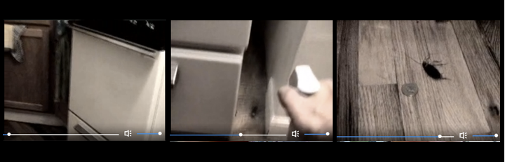

Figure 18: *Quarterplus* (Rule, 2005)

Rule’s extensive use of lighting and sound effects contributes to an
attempt to defamiliarise her home – much like the space she has created
on her videoblog, a space where ‘the boundaries are crossed between what
is real and what is not…’ She elaborated,‘I am able to jump into playful
ways of looking at my own reality and that is what seems to be a given
in terms of the vernacular for the audience’. Nonetheless, even at this
moment, as the home becomes uncanny, it remains central to the form and
content of the videoblog.

As this example shows, the home has a dual significance to the
videoblogger. It is both the space from where she videoblogs, but is
also often represented in the videos, for example, Erin Nealey’s video
*Mornings* (3:05, 320x240), which is a fast-paced video montage of her
morning ritual – making coffee and breakfast for her kids – in which
short sharp edits are cut together to create a vibrant montage of the
everyday rituals of life. In *Mornings*, the video creates ‘the intimate
space of the home at once the site for mundane transactions and a
constituent part of this other vaster space which might have both
psychical and mythical dimensions’.[^07chapter6_26] Nealey’s video is cut to the
diegetic sounds of getting ready in the morning, with the coffee grinder
providing the acoustic rhythm and cups and spoons providing the beat.

Similarly, Hodson told me her videoblog was ‘a document of my life. Me,
observing the world and translating it. It’s like complete freedom.’
This sense of freedom is reflected in a number of her videos, ‘this is
like the reason I vlog. I’ve showed myself crying, laughing, ranting,
thinking, anything. I just want to relate to other people, not feel like
I’m alone and crazy’. Howe also reflected on this aspect of
videoblogging, telling me how amazed he was when he first found the
videoblogging community. The videos were like nothing he had ever seen
before, a mix of ‘intimate and mundane parts of their lives. Stuff you
still didn’t see anywhere... Back then it was extraordinary to see
someone making a video about taking their child to the park and talking
to you about it… For me, the more mundane it was, the more excited I was
by the newness of it.’

As one of the most outspoken of the videobloggers, Dedman mused that ‘if
done well, something is really shared in these moments. The visual
artform is just so rich. The fact that videoblogs are archived also
allows me to go and watch a person’s past creations and life’. The idea
of sharing the spaces of their lives, of creating archives and
repositories of memory, of narrativising their lives and being able to
draw on the videos at a later time, was clearly important to the
videobloggers. ‘I think most of my videos are simply sharing moments
rather than telling a story,’ Erin Nealey told me. Jen Gouvea described
videoblogging as ‘my way of sharing of myself personally and processing
my experiences’. ‘I would describe my videos as moments,’ was how Mary
Matthews put it, ‘intimate, personal experiences of my life, my work, my
relationships, my spirit, all captured in moments’. Paris Marashi, who
made videos about Iran and being an Iranian in America, revealed to me
that ‘sharing’ was one of her main goals through videoblogging.
‘Initially, it was about cultural expression and sharing’ she
elaborated. However, as she got deeper into the community, she found
that videoblogging spoke to her on a more personal level; ‘through this
experience of videoblogging,’ she said ‘I have been learning about how
it can facilitate my own personal self-expression. Sharing my cultural
identity with others, so that others can identify with it, I began to
experiment with emotion and feeling.’

Many videobloggers saw videoblogging as a way of sharing stories and
personal experiences, as well as their, perhaps unrealistic, notion that
the videos they produced in 2004 would remain as an archive for future
generations. Dedman speculated, ‘imagine what it’ll be like in 50 years
when people’s lives are all in video in different ways! It’ll be gold to
our ancestors.’ Ironically, writing in 2018, due to technical changes,
shuttered web sites and general link breaking, only a handful of
Dedman’s videos are still available on the internet, and only to those
who know where to look. The unstable nature of the technologies that
made up the original techno-social foundation of the practice, as well
as unexpected things, such as hosting companies changing owners, or
changing terms of service etc., caused the videoblogging community to
slowly fracture. When videoblogging fell out of favour with hosting
sites such as Blip in November 2013, a company ironically started by
videobloggers and which used to be intimately linked with the community,
a large set of archival videoblogs was mostly deleted.

I now want to turn to briefly think about how time and temporality are
manifested in the practices of the videobloggers I interviewed, but also
consider how this is demonstrated in their rituals, habits and
repetitions. To Silverstone, the ‘veritable dailiness’ of everyday life,
the routinized practices that make up the fabric of the everyday, exists
through a sense of order and ritual.[^07chapter6_27] Couldry also describes media
practices, understood as ‘routine activities’ as opposed to ‘consciously
chosen actions’.[^07chapter6_28] How we make sense of these quotidian practices,
Silverstone argues, is through ‘an order manifested in our various
traditions, rituals, routines and taken for granted activities – in
which we, paradoxically, invest so much energy, effort and so many
cognitive and emotional resources.’[^07chapter6_29] I want to note how these are
mediated through the videoblogs, both consciously and unconsciously.
Videoblogging was a practice that required technical expertise and was
very time consuming. Thus, I wanted to explore the amount of time, in
general, the videoblogger spent videoblogging; was it a daily
occurrence, weekly, monthly? Did they videoblog all day, for a couple of
hours or five minutes? How long would it take to produce an entry on a
videoblog, how often would the videoblogger produce content, what time
of day (or night) would she work? Many videobloggers talked about
sharing stories and developing visual archives for the future, thus I
was interested in the idea of videoblogs as repositories of memory,
working archives of lived experiences and how the videobloggers
articulated this both discursively and in their work.

Having to *make* time for videoblogging was highlighted by a number of
respondents. To illustrate, Gromik Nicholas told me it would take him on
average ‘1 day or more’ to record a video, ‘a day to edit and up to half
a day to upload’. Erik Nelson said he spent 1-2 hours recording, up to
20 hours editing and 30 minutes to an hour uploading a videoblog. Zadi
Diaz revealed her videos took her, on average, 1-2 hours to record, 6-8
hours to edit and 2 hours to upload. There were, of course, those who
spent ‘3 minutes’ recording, and only ‘15 minutes’ editing (Steve
Garfield) or ‘a few minutes’ shooting (Markus Sandy) but ‘anything up to
an hour’ to edit (Richard BF), but the majority of respondents reported
spending at least an hour recording, editing and uploading videos to
their videoblogs.

Mary Matthews told me that, ‘vlogging is routine… though \[it\] does
fall behind if other work gets busy, but I video blog every day – be it
shooting, editing, writing. I look forward to it. I am always thinking
about it’. Mica Scalin’s answer was an ambiguous ‘whenever,’ but when
asked to elaborate, she revealed that, ‘artmaking is a daily process for
me. I have always made myself do something every day. I started working
with digital video and vlogging simultaneously so it was about making a
process that was simple and something that could be incorporated into
daily life. When it feels like a chore I take a break. I have taken
periodic breaks to work on specific projects.’ Mica’s answer represented
a more general attitude to videoblogging – that it shouldn’t be a chore.
For Jennifer Proctor, the incorporation of videoblogging into her
everyday life was part of her routine, but for others, like Susan
Pitman, a mother of two, videoblogging could be a guilty pleasure as
well; ‘sometimes (guilty) I have to make myself wait until after the
kids go to bed, so I can spend some time with them instead of editing
videos when we could be playing together’. Erin Nealey, 33 year old
mother, expressed a similar mix of guilt and pleasure when she described
her perfect night in. ‘I absolutely LOVE to edit video that I have
captured,’ she said. ‘There have been times where I’ve let that overtake
my day, but since I have two children I am trying to be careful about
that \[…\] there is nothing better than the feeling of the kids sleeping
peacefully in their beds, me at my desk with a coffee in hand and
working on my latest project.’

Many of the respondents highlighted that one of the main obstacles to
videoblogging was that the process took a long time. In general, the
editing was by far the most laborious part of the creation of
videoblogs, with recording mostly completed in around an hour and
uploading generally completed within 15 minutes. With upload times being
fairly slow, creating shorter videos (no more than 5 minutes in length
and compressed to as small a file as possible made a lot of sense
technically). Jennifer Proctor told me she makes videos, ‘really
randomly. I have no schedule. I usually take 1-6 months recording
moments, and then actually sit down and put them together. I really see
it like making a photography book.’ Similarly, when I pressed on whether
taking more time over videos allows for greater reflection, she
answered, ‘oh yeah.... I got to let things sit. Usually I’ll record a
moment and know its good. You just know. But I have no idea how to use
it. I have to collect these good moments over time...and then let them
fall into place. Allowing time to pass between recording moments and
publishing moments allows me to understand why I happen to record it at
the time. To be clear, there are no answers here. Time just helps me see
how ‘cool’ life can be. That’s all recording a moment is. Trying to make
the mundane...special.’

Amongst those self-identifying as ‘artistic’ videobloggers, there was a
clear trend towards working at night. ‘I reserve the hours 9:00PM-3:00AM
for video work, after the kids are put down for the night,’ Erik
revealed. Adam was convinced his ‘best work happens between the hours of
9pm and 4am.’ Equally, Loiez Deniel, who defines videoblogging as a form
of poetry, said he works ‘during the night generally.’ For some, like
Richard BF, working at night wasn’t a necessity, i.e. to work around
children, work or other commitments, but merely out of choice. ‘\[I
work\] all over the place,’ he told me. ‘Sometimes I’ll edit straight
after shooting, which could be any time of the day or night. I guess
generally it’s at night, but that’s just because I like to work at
night, not because I’m busy during the day’. These were also the
participants who were most likely to tell me they worked from a ‘studio’
(Adam Quirk and Jennifer Proctor, see above) – most notably from a
converted attic space (David Howell and Erik Nelson, again, see above).
This recalls images of the romantic artist and, interestingly, these
were the participants whose explanations of their videoblogging
practices were also quite ambiguous. By this, I mean that they were more
likely to talk about their videos in ‘artistic’ terms. Interestingly,
media theorists Kember and Zylinska argue that in the age of the
digital, with the distributed networks of users and potential
collaboration across time and space, the creative subject is now
collaborative rather than individualistic, yet she is still ‘driven by
the very same desires, motivations, and fantasies that had shaped the
Romantic creative: those of artistic freedom, self-worth, and individual
fulfilment’.[^07chapter6_30] So a comparison between the answers of Erin Nealey,
who mainly videoblogged about her family and children, and David Howell,
who self-identified as an artist, is interesting. Nealey usually
allocated ‘10-30 minutes’ recording her videos, whereas Howell told me
he spent ‘as long as is required’ to complete the process of capturing
video. Additionally, Nealey told me she used ‘anywhere from 6-12 hours’
to edit a video, whereas Howell would work ‘until it is finished’.
Lastly, when explaining the length of an individual video, Nealey
articulated a clear and rational reasoning for the length of her videos
(her videos range from 3 to 5 minutes). ‘I just feel like people don’t
have the attention span to watch anything much longer than that sitting
at their computers,’ she stated. ‘Every now and then, I’ll throw a
longer video in there that maybe I didn’t create specifically for the
videoblog. But generally if I’m creating something that is especially
for my site, I will try and keep it under 5 mins.’ In comparison,
although his videos tended to be within a certain range, (mostly between
1 and 5 minutes) Howell couldn’t (or wouldn’t) give me a reason, ‘no
rhyme or reason to the length. I am currently trying to make them
shorter than 1 minute and tell a longer more complex story. It doesn’t
always work out that way though. My videos generally dictate to me how
long they wish to be’. He did add, however, that the pleasure he
experienced in relation to videoblogging was linked to spending hours
alone creating something, a bit like a craftsman at work; ‘I fit it in
when I have time to sit locked away for an extended time. I very much
look forward to making them and wish I could do it all the time’.

This difference in terms of gender and the time and space available are
reflective of external pressures such as family or domestic labour, so
for Nealey, consideration for kids, family and the everyday demands of
being a mother came first. Nealey’s notions of videoblogging are shaped
by these external (or rather, domestic) demands on her time. She knows
exactly how long she has to videoblog, and exactly when she can take the
time to do so, which are determined by the extent of the domestic labour
that shapes her videoblogging practice.

A few of the ‘everyday life videobloggers’ have had periods of reduced
videoblogging and even complete withdrawal from the ‘vlogosphere’.
Raymond M. Kristiansen, who whilst the interview was taking place was on
a self-imposed hiatus from videoblogging, showed signs of burn-out when
he talked to me; ‘in the beginning of “my videoblogging career” I
structured my days around producing videos, watching videos, interacting
with other videobloggers. I would wake up, and watch videos before
eating breakfast. I might make a movie after breakfast. I might spend an
evening after work talking with other videobloggers on AIM or Skype.
Especially between October 05 and June 06 I spent a LOT of time…
videoblogging’. Others showed a pragmatic approach to videoblogging.
Jennifer Proctor maintains her own personal site where she posts ‘short
experimental non-fiction videos’. She worked full time as a professor at
a university in America and tried to ‘fit my videos in when I can.’ Her
attitude, similar to Mica Scalin’s, is that videoblogging is an organic
process and that she usually does it ‘when the video calls for it,
rather than forcing myself to do a video… But I do put some pressure on
myself to keep producing.  If it’s been a while since I’ve posted
anything, then I more actively seek stuff to shoot, or find stuff to
edit, or try to come up with something interesting to post.  It’s
something that’s always on my mind, in the back of my head, but I really
just fit the process in where I can, like another piece of my weekly
life puzzle.’

In relation to whether she had to *make* time for videoblogging, she
stated categorically ‘I would say no – it’s simply on-going, like
another part of life.  It’s just another thing I do during the week,
like going for a walk or making a nice dinner’. Proctor was drawn to the
contingency of videoblogging, and described how it allowed her to react
to events in her life in a more spontaneous way. As a professor of film
studies, videoblogging presented an alternative approach to creating
moving images that she found ‘liberating’. She told me ‘I think part of
the great power in videoblogging is related to its spontaneity, to its
now-ness, and to its capturing of those beautiful, fleeting life moments
that we all experience but rarely have an opportunity to document. So
for me, those random events are often the more uncanny or moving or
interesting, the being-there-at-the-right-time kind of moments, that
don’t as often occur when you capture life in more of a planned or
scripted way.’

Videobloggers have a number of different motivations for videoblogging,
from Richard BF’s ‘there’s something exciting about the immediacy and
global audience that makes it fairly unique as a hobby’, to the
self-fulfilment Juan Falla felt from being a content producer with an
audience; ‘it’s great to be with the camera shooting stuff. I feel like
a movie director doing short films’. Kristiansen told me, ‘I felt as if
my head was about to explode every few hours, when I realized just how
much \[videoblogging\] could change everything... To me, videoblogging…
was the missing link. It was what would allow people from regions like
sub-Saharan Africa to communicate with the world... Videoblogging, if
done with a low-key approach to it, could really change how we
communicate.’

Hall, a university professor of information science and technology and
‘early adopter’ of videoblogging, told me he prefers videoblogging to
his ‘real’ work. With some irony (he is an academic) he told me that
‘... many more people have watched my most popular videos, than have
read my most prestigious journal publication’. Hall described
videoblogging ‘like meditation – I’m in a different world \[…\] several
hours goes by and it feels like I just started and my concentration is
such that little sounds and stuff really bug me if they get my attention
... very much a feeling of “flow”’. It also became clear that the
practice of videoblogging was conceptualised and experienced by the
videobloggers as inherently *social*. For some, it also became a way of
meeting people, like Quirk, who told me that ‘when I found videoblogging
I realized that I could have conversations with these other people
online and experience some kind of socializing without having to resort
to going to bars and meeting strangers face to face.’

So, videoblogging is an everyday media practice, defined in many ways by
where and when the videoblogger was able to produce her work. In this
chapter I have explored some of the social dimensions related to
videoblogging and how it created a means for the videoblogger to mediate
her life, whilst creating a personal archive of lived experiences. For
the majority of the videobloggers interviewed for this project,
videoblogging engendered an intense personal relation with mediated time
and space, one in which social relations were explored and engaged with,
where ideas were exchanged and life experiences were shared.
Videoblogging practice, mediated through the channels of communication
available to and utilized by the videobloggers, shaped the contours of a
community of users forming what I have been calling an invested network.
By invested network I point toward the notion of a self-referential
community of interest around a shared object of focus, in this case the
videoblog and related technologies, email lists and video artifacts. I
now turn to the final chapter in the book to bring many of these strands
together.

[^07chapter6_1]: Manuel De Certeau, *The Practice of Everyday Life: Living and
    cooking,* (Trans. Steven Rendall), Berkeley and Los Angeles:
    University of California Press, 1984, p. 105.

[^07chapter6_2]: Helga Wild, ‘Practice and the Theory of Practice. Rereading
    Certeau’s “Practice of Everyday Life”’, *Journal of Business
    Anthropology*, Spring (2012) p. 3.

[^07chapter6_3]: John Postill and Birgit Bräuchler, ‘Introduction: Theorising Media
    and Practice.’ In John Postill and Birgit Bräuchler (eds)
    *Theorising Media and Practice*, New York: Berghahn Books, 2010, p.
    1-32.

[^07chapter6_4]: Nick Couldry, ‘Theorising Media as Practice’, *Social Semiotics,*
    14.2 (2004).

[^07chapter6_5]: Elisenda Ardèvol, Antoni Roig, Gemma San Cornelio, Ruth Pagès, and
    Pau Alsina. ‘Playful Practices: Theorising ‘New Media’ Cultural
    Production.’ In Birgit Bräuchler and John Postill (Eds) *Theorising
    Media and Practice*, New York: Berghahn Books, 2010, p. 259-80.

[^07chapter6_6]: Here he draws on the work of Ann Swindler.

[^07chapter6_7]: Couldry, ‘Theorising Media as Practice’, p. 121.

[^07chapter6_8]: Zimmermann, *Reel Families*, p. xiv.

[^07chapter6_9]: Couldry, ‘Theorising Media as Practice’, p. 129.

[^07chapter6_10]: The use of quotation marks here is not meant ironically, or as a
    comment on informants self definition, but rather to signal that the
    text is drawn from the interviews and email corpus.

[^07chapter6_11]: Karina Hof, ‘Something you can actually pick up: Scrapbooking as
    a form and forum of cultural citizenship’, E*uropean Journal of
    Cultural Studies*, 9. 3 (2006); p. 364.

[^07chapter6_12]: The uncertain register of videoblogs was a constant source of
    debate within the videoblogging community during its early phase.
    Whether the videoblog was a documentary, reportage, short-film,
    artwork or as Richard BF put it, a genre in itself, was never really
    decided upon until YouTube created its own notion of a ‘YouTube
    video’ which is now a commonplace form. However, at the time this
    was far from settled.

[^07chapter6_13]: Instead, one can perhaps talk of YouTube communities, dispersed
    groups centered around interests or subject areas, in contrast to
    the videoblogging community which was centered around videoblogging
    itself.

[^07chapter6_14]: Roger Silverstone, *Media and Morality: On the Rise of the
    Mediapolis,* Cambridge: Polity Press, 2006, p. 91.

[^07chapter6_15]: Karina Hof, ‘Something you can actually pick up: Scrapbooking as
    a form and forum of cultural citizenship’, p. 364.

[^07chapter6_16]: One notable counter-example was Casey McKinnon, who told me she
    produces a ‘sci-fi comedy show’ aimed at earning her and her partner
    a living.

[^07chapter6_17]: Bassett, *The Arc and the Machine*, p.110.

[^07chapter6_18]: Lisa Gye, ‘Picture This: the Impact of Mobile Camera Phones on
    Personal Photographic Practices’, *Continuum: Journal of Media &
    Cultural Studies*, 21.2 (2007): pp. 280.

[^07chapter6_19]: Plato, *Plato in Twelve Volumes*, Vol. 1 (Trans. Harold North
    Fowler; Introduction by W.R.M. Lamb), Cambridge, MA: Harvard
    University Press, 1966, 5-6.

[^07chapter6_20]: Gye, ‘Picture This: the Impact of Mobile Camera Phones on
    Personal Photographic Practices’, p. 280, itallics in original.

[^07chapter6_21]: Pierre Bourdieu, ‘Towards a Sociology of Photography’, *Visual
    Anthropology Review*, 7.1, Spring, (\[1965\] 1991): pp. 130.

[^07chapter6_22]: Enric Teller, Email to Videoblogging list, 7 July 2006,
    https://groups.yahoo.com/neo/groups/videoblogging/conversations/messages/44493.

[^07chapter6_23]: O’Reilly, ‘What is Web 2.0. Design Patterns and Business Models
    for the Next Generation of Software’.

[^07chapter6_24]: Caroline Bassett, ‘Of distance and closeness: the work of Roger
    Silverstone’, *New Media & Society,* 9.1 (2007): pp. 45.

[^07chapter6_25]: The detailed description asked for in the interview was an
    attempt to bridge the gap created in the shift from a ‘standard’ to
    a virtual ethnography. I didn’t want to ask the participants to send
    me photos of their home, as this may have seemed intrusive, which is
    why I asked them to describe it instead. However, two of the
    informants did in fact send me photographs, whereas two others
    referred me to photos on their Flickr accounts in which their
    offices were depicted.

[^07chapter6_26]: Bassett, ‘ Of distance and closeness: the work of Roger
    Silverstone’ p. 45.

[^07chapter6_27]: Silverstone, *Television and Everyday Life*, p. 3.

[^07chapter6_28]: Couldry, ‘Theorising Media as Practice’, p. 121.

[^07chapter6_29]: Silverstone, *Television and Everyday Life*, p. 1.

[^07chapter6_30]: Sarah Kember and Joanna Zylinska, *Life After New Media,*
    Cambridge, MA: MIT Press, 2012, p. 175.

# 7. The Ends of Videoblogging

> That’s what’s cool about video on a blog. Francis Ford Coppola, his
> quote that one day the next Hollywood masterpiece would be made by a
> 10 year old girl with her dad’s video camera, right? I think we all
> know \[laughs\] that she’s a videoblogger.[^08chapter7_1]

Understanding the close entanglement of culture and technology in this
area of digital media production in the early 2000s – most notably in
the self-definition and development of a community based around video
objects and technologies – has been crucial in the development of this
book. Through an ethnographically-informed approach to cultural history,
which maintains an interest in materials as well as discourses, the book
has explored the practices and technologies of videoblogging, a new form
of cultural-technical hybrid that emerged in our increasingly digital
age. The book traced the discourses and technological infrastructures
that were developed simultaneously within and around the community of
videobloggers that created the important pre-conditions for the video
artifacts they produced and their associated practices.

This research has focussed on the ends of the videoblog as described,
practiced and lived by the videoblogger cohort who made up my sample.
Whilst individual interviewees may have personal ends and goals for
their own videoblog, there are also the collective ends of the videoblog
community, which should not be ignored. The ends have included notions
of sharing, of collectivity, and of a lived community mediated through a
new, innovative and mediated internet experience. Sharing their ideas
freely, their thoughts, their practices, experiences and hence their
culture, they created something extraordinary for too short a period of
time. But we are in danger of forgetting these achievements altogether,
in a situation whereby their archives are incomplete if not absent.

The fragility of digital artifacts, and the status of the videoblog as a
historically located object, has had a number of implications for this
book, both methodological and epistemological. It became apparent,
particularly as the book evolved from a contemporary critique to an
historical project, that as digital material objects, videoblogs are
subject to the same conditions of temporality as other non-digital
objects – over time, if not archived, catalogued and cared for, they can
become difficult to locate and impossible to play-back and watch. As
explored above, the identity of the videoblogger was closely tied to a
videoblogging platform, fuelled by a desire to capture the personal and
create visual archives of their everyday life. However, as there is
currently no central functioning archive of early videoblogs, the
videoblogger memory is in some sense under threat, especially its
memories and archives as a community. Methodologically, this meant that
creating a representative corpus was difficult for me, and in many
instances I have had to rely on the kindness of the videobloggers to
share their personal copies with me. Changing technical standards have
also meant that even where video files could be located, they would not
necessarily play. All digital media systems might be archival in nature,
but although they act as organisers of different kinds of data, be it
personal, scientific, social or cultural, the kinds of data that help us
constitute the self through time and space, no digital system – however
well-designed – is guaranteed to last forever. As Parikka argues, the
archive might be a central concept for digital culture, but what are the
consequences when the archive is missing or broken, as it so often
is.[^08chapter7_2] In terms of this book it is critical that greater efforts are
made to store the videobloggers’ ‘archiving of the self’ through an
institutional repository for online video culture. All digital media
systems may be archiving systems or memory banks, but although they
store information for a time, they don't necessarily do it well or
reliably. We might add to that that the *collectivity* of the
videoblogging comments should also be persevered by archiving and
without media storage they are lost to history. The archiving of digital
video does present particular challenges in terms of technical storage
but also copyright issues, distribution and access.

The emergence of the videoblog as a short-form digital film is strongly
tied to the technical constraints under which it was developed. It is
also linked to a set of perceived socio-technical assumptions about how
much data could successfully be uploaded to the internet, how fast the
video would download from the internet, how much content a perceived
possible audience would want to watch and so on. It also develops, in
its early stages, as a strong sense of the need to adhere to a kind of
videoblogging standard; a set of practices that, within the
videoblogging community, were defined as *videoblogging*. As such, the
videos I explored tended to follow certain stylistic and technical
norms, developed within a core community of users, and subsequently
adopted by the wider community. The media-form aesthetic sustained
itself, with the community acting as both guide and regulator of its
standards, informing users if they were ‘doing it wrong’ but also acting
as a technical and social support system, through which expertise was
shared, experiences publically debated, and feedback given. The
community also sustained its radical edge through constant debate and
contestation, which meant that, despite its concern with a
‘videoblogging vernacular’, it never quite settled for a fixed
definition of what videoblogging was, and thus remained open to ideas
and new possibilities. This openness, what I also refer to as its
contingency, would ultimately lead to the gradual decline in the
community activities, as the members moved on to newer networks, new
technologies and different platforms.

The early communities of practice and related cultural forms that
crystallised around digital video on the internet between 2004-2009,
moved from a nascent and developing technical-cultural assemblage to a
videoblogging platform. This emerged as a specific instance of the
short-form digital film around which a community of users emerged who
through contestation and debate were able to sustain a shared
conceptualisation of video-work. The videobloggers’ sophisticated
understanding of their own practice, combined with the awareness of
wider cultural norms and aesthetic influences and specific technical
expertise, created the conditions of possibility for videoblogging as
practice. Although the central work of this book has been to present a
cultural history and ethnographic analysis of the early developments of
‘online’ video, and to begin to trace the history of videoblogging
before YouTube and the rise of social media, the key argument of this
book is that early internet video cultures are a forgotten but important
aspect of the rise of video online. As such, the book examined the
interaction between the technical conditions of possibility and the
everyday practices undertaken by videobloggers, understanding the
emerging videoblogging platform through both Langlois et al’s
platform-based research and through Couldry’s theory of media as
practice. This framework contributed to my analysis of the videobloggers
practice, together with the aim of exploring what can be called a
videoblogging aesthetic – which I also call the short-form digital
film*.* This is a cultural form that, as I have shown throughout the
book, is ‘sharable’ in Silverstone’s terms, but also is ‘shared’, or has
the potential to be so. It points towards a public culture that
increasingly uses video as part of its aesthetic repertoire, whilst also
– and also increasingly – integrating it, so this history helps inform
the vernacular of a digital everyday life. We might think about this
change in the status of video (and film), as it moves away from its
complex, difficult and technical beginnings towards a more ‘democratic’
everyday medium. This reflects a videofication of culture – particularly
in relation to the way in which personal memory is increasingly held in
video form, especially short-form versions between 6 seconds and 3
minutes. We are living in an increasingly videoed and video-centric age.

Throughout the book, I have argued for the importance of an historically
informed approach to studying digital culture. Following the nascent
writings on media archaeology, the book subscribes to the view that
‘dead-ends’ and ‘failed’ media forms are perhaps more useful and
revealing about the shape of our contemporary media landscape than the
more obvious historical narratives often assigned to events
retrospectively. The materialist influence on this book is informed by
the field of media archaeology, which itself draws on the writings of
the German Media School, and provides a key part of the theoretical
foundation to the original ethnographic research I have undertaken, and
has allowed me to frame the critical engagement I have made with the
material technologies and practices of videoblogging.

Despite being involved in what became a ‘failed’ project,[^08chapter7_3] the
videoblogging community developed and in some cases remediated some of
the key aesthetic and technical practices that were taken up by
subsequent online video users. For example, the visual effect created by
using the tip of your finger in the now extinct video application Vine,
for instance, is remarkably similar to the editing styles used by many
early videobloggers. Although some videoblogs may appear to confirm
claims that videoblogging merely reproduced televisual aesthetics, in
contrast, by combining an historical contextualisation with an analysis
of the videobloggers’ self-definitions of their practice with a close
visual analysis of their videos, I argue that videoblogging draws on a
much wider range of influences, and which contributed to a new and
distinctive form of video creativity. In relation to this, it has been
instructive that the informants in this study constantly demonstrated
their reflexivity in relation to their videoblogging practices and in
the multiple forms in which it was deployed.

Videoblogs are an invested network, and their cultural value is best
appreciated within the context of the videoblog and a videoblogging
community. Therefore it is time for the establishment of a videoblogging
archive aimed at cataloguing and preserving these disorganised and
dispersed objects - and it is crucial that they are archived, with
appropriate means for preservation and possible future playback. I argue
that it is important to build and maintain this archive with
consultation with the former members of the videoblogging community, in
order to acknowledge what has been established here; that the videos are
far more than simply video files. They are crystallisations of the
embodied practices, technical and aesthetic experimentations and
personal narratives of a closely-knit community of interest.

It is ironic to note that, despite their investment in community, and
the fact it was sustained in part by demands of investing in/sharing
technological expertise, the videoblogging community was constantly
looking for ways to make the practice of videoblogging more widespread,
accessible and ‘easier’ in terms of technical expertise, seen for
example in the excitement and passion within the community at the
emergence of Web 2.0. This promised many solutions to technical issues
that the videoblogging community struggled with in its early days. The
ease of use, the seamless integration of video publishing and
consumption, as well as the potentials for hosting and distribution,
really resonated with the members of the community – despite their
antagonistic attitude towards YouTube.

In the end, the very technologies that were meant to assist and improve
the practice of videoblogging, and I would argue in many ways fulfilled
that, also signalled the end of the early-adopter community and the
beginning of a ‘new generation’ of online video. By removing the
technical obstacles that had fostered such intense communication and
discussions on the list, the community saw itself grow larger in actual
numbers, but arguably smaller in terms of personal communication and
sharing. Many users who had been very active in the beginning, faded
away, or moved to new social networks and video services. A sense
remained, however, that these new services lacked something that the
original videoblogging community had provided, ‘I have tried Vine a
little bit,’ Dedman told me in 2013 ‘its cool. I love how simple
videoblogging has gotten.’ Hence we can see that, with the ease of at
first YouTube, and later, video applications such as Vine, Snapchat and
Instagram, which allows professional looking video-editing at the tip of
your fingers, the need for a specialised community space in which to
discuss the technical, social and aesthetic intricacies of laboured and
time-consuming video-production, was made less compelling for
videobloggers and other interested parties. In other words, technical
communities were very much a reflection, not just of shared values and
practices, but also of a shared sense of esprit de corps towards a
difficult and challenging environment.

The videoblogging community was formed not just with a concern for
making these short-form digital films, although these remained
important, but also the technical *a priori* and the complexities and
contestations that crystallised around it, where they were able to
develop and strengthen the community and its self-identity. The
cultural-technical hybrid that I am gesturing towards here is unique in
that it demanded its members to be both culturally *and* technically
proficient as well as keen to control and manage both its cultural
production *and* the means of production themselves. However, this
remained a fragile network based around a generally non-commercial
sharing orientation drawn from open-source software and principles from
open culture, and thus remained susceptible to co-option by corporate
capital and funded alternatives like YouTube.

The videobloggers’ early digital works have been presented here as
original case studies of material digital culture on the internet.
Traces of the practices, technologies and aesthetics of videoblogging
have since been drawn on and amplified in network culture, mainstream
media, and contemporary media and cultural production. I argue that the
discourses and technological infrastructures that were developed both
within and around the community of videobloggers created important
pre-conditions for the video artifacts they produced. Early online video
did not start with the launch of YouTube, but rather the practices and
technologies were already being debated, experimented with and utilised
since the early 2000s. In 2004, videoblogging as it is conceptualised
here, started to take shape. The constellation of technologies that were
made available around this time, the stability of QuickTime in this
period played a part here, as did the rise of open-source software, the
web platform, Blogger (which was bought by Google in 2003). Blip.tv and
OurMedia were also important, and the Sanyo Xacti digital camera, which
was launched in 2005, was widely loved for its functionality and
aesthetic. We might also link the openness of media to its reusability,
particularly in terms of a lack of strong proprietary platform
control.[^08chapter7_4]

This book has sought to fill a gap in previous studies of online video
that generally didn’t engage with videoblogs and their materiality. This
book is thus somewhat distanced from previous, screenic studies of
videoblogging, which also tended to avoid issues of materiality. My
concern has been with an approach to videoblogging which analyses it
through not only the screen image but also through the embodied
practices of the videobloggers, and its medium-specific
cultural-technical practices. Treating the videoblogs as material
digital objects meant analysing their content but also their technical a
priori. In this respect it is interesting that the videoblogging
platform, or the technical systems enabling videoblogging as practice
experienced a period of relative calm in the years between 2004 and
2009, which is when the community was at its most active. The calm came
about partly because during this period Apple slowed releases of
QuickTime while concentrating on moving between microprocessor
platforms. At this time other components of the videoblogging platform
also fell into place, and for a while a constellation of compatible
technologies co-existed in digital harmony, allowing the media form to
develop. Some technical stability may in fact have been a key condition
of possibility in the emergence of the videoblogging community, allowing
it to focus on developing practices and processes, and to negotiate
technical complexity, rather than expending its energy constantly
learning about and updating video codecs. Technical effects of the
media, such as the one outlined above, intervene in interesting ways as
a cultural formation develops. Silverstone’s notion of the ‘double
articulation’ of media, which argues that ‘through its double
articulation, the medium does become the message, though that message is
not pre-given by the technology. It is worked and reworked within the
social circumstances under which it is both produced and received’ is
very apt for describing this process.[^08chapter7_5]

Throughout this book I have attempted to remain reflexive of the
videoblog as an historically located cultural practice. In relation to
questions of materiality, here I would like to return to the issue of
the importance of archives and the lack of institutional repositories in
relation to some aspects of popular culture in digital contexts. Indeed,
it is impossible to quantify just how much digital culture has already
been lost. For example, Geocities was very nearly destroyed as an
archive, and the British Library only started archiving the UK portion
of the internet in 2013. As a comparison, the Norwegian
*Nasjonalbiblioteket* started archiving the Norwegian web as early as
2006.

In this book, I have presented a cartography of the cultural/technical
structures, created and maintained by the videoblogging community and I
like to think we can see the outlines of the trajectories of future
media and cultural production. Indeed, this is demonstrated by the kinds
of networked cultural-technical hybrids I have highlighted. In this work
I have been keen to draw attention to the tendency within digital and
new media cultures to *forget*. The desire to embrace new technologies,
as seen with the increasing focus on YouTube developing in conjunction
with tools and technologies that allow for the adoption of
videoblog-like practices, sometimes means that earlier iterations are
side-lined or dismissed as irrelevant or out-dated. I argue that in
order to maintain critical understandings of the media practices and
theories we observe around us today, it is essential to remember the
media practices of the past, especially those that – even only 10 years
after – may on the surface seem out-dated, or even irrelevant. I agree
with Parikka who argues that researchers need to ‘look at media… in
terms of their long-term relations that radically steps out of the
short-term use value that is promoted in capitalist media
industries’.[^08chapter7_6]

Public discourse around the new media landscape is arguably not so
utopian today as in the 2000s (although Morozov shows that this
utopianism is still operative in some sense in the technical industries
of Silicon Valley).[^08chapter7_7] YouTube is big business now, with a class of
YouTube ‘stars’ making a living off either highly polished brands or the
reviews/commentary of games and gameplay such as Twitch.tv. Although
YouTube takes a large cut, content creators are perhaps not making as
much money as the media has reported.[^08chapter7_8] Today, it is rare to watch a
video on YouTube without first having to sit through (or skip) an ad,
and a large proportion of content consumed online is now corporate
content, television programmes, music videos or news. The millennials
may be watching more digital video than TV, but the question should be
not just what are they watching, but also how are they creating and
changing this new video age? One of the interesting aspects of writing
about early internet culture today, is to look back on the discourses of
optimism and excitement that prevailed in the early days of the
videoblogging community, with a perhaps more nuanced and critical take
on how events transpired. The early videoblogging community was excited
about video, about community and about the possibility of making media,
sharing it with the world and being part of the ‘new media’ landscape.
This excitement was reflected in the debates on the list, which could be
heated and antagonistic, but also caring and supportive. Jen Simmons, an
early videoblogger, summarised videoblogging; ‘One of the things that…
felt so fresh and weird and new 10 years ago is that, you know, I would
watch that video, it’s, whatever, 5 minutes. I spent 5 minutes of my
life watching something that didn’t matter… That was not a hit NBC
television show in a primetime slot on Thursday night. It was not
designed to get 40 million people to watch it. It was, like, you were
going to show it to your 4 friends. Today, in 2014, it’s like, ‘So what?
Duh.’ But back then, that felt so radical and weird… It did mean
something. It was a kind of conversation on a small level that was
intimate, that mattered.’[^08chapter7_9] Instead of being a one-way communication
from creator to consumer, videoblogging was arguably about creating
conversations among members of a community.[^08chapter7_10]  This gestures towards
something new and interesting about digital culture.[^08chapter7_11]

Companies such as Google and Facebook are hoovering up content, scraping
data and storing infinite amount of information about all of us on their
servers. As the events surrounding Edward Snowden have made painfully
clear, even our own governments are monitoring and collecting data on an
unprecedented scale. This, it goes without saying, includes video and
audio – which has created a new terrain for thinking about the growth of
vernacular video and its growing penetration of everyday life,
facilitated by the distribution through social media platforms like
Facebook and Twitter. I leave the implications of this new and dangerous
potential for monitoring and surveillance to others as it lies outside
the scope of my book. Nonetheless, I think I have demonstrated the
importance of understanding new forms of digital video practices in both
private and public contexts. It also points toward new ways of reading
and writing culture, and the dissemination of ideas and arguments in
*public* through new forms of digital media.[^08chapter7_12]

The complexity of studying new cultural practices entangled with new
media technologies requires a new constellation of methods and
approaches. This book has redoubled my feeling that it is crucial that
at important junctures in digital culture we take the time to study even
the most ephemeral of cultural practices, and also to seek to archive
them in a responsible way that enables future historians and cultural
theorists to use them. There is little doubt that as media merge in new
forms through the pressure of digitalisation and the growth in the power
and versatility of digital technology, rethinking method will be an
on-going process. As Burgess and Green argue, rather than explaining
amateur video as ‘video about nothing’ or celebrity without talent, it
might be more helpful to situate the practice in the much longer history
of ‘vernacular creativity – the wide range of everyday practices (from
scrapbooking to family photography to the storytelling that forms part
of a casual chat) practiced outside the cultural value system of either
high culture or commercial creative practice’.[^08chapter7_13] The practices
associated with videoblogging, serve as an important example of how
amateur and semi-professional video artists were working, creating and
distributing video across the internet in the mid-2000s. Unfortunately,
most of these videoblogging archives are currently residing ‘offline’ on
individual hard drives and in a variety of unstable video hosting sites.
They hold narratives and memories of friends, family, lived experiences,
and of a community that helped introduce a large number of people to
posting video on the internet. As such, it is strange that videoblogging
has remained little explored in relation to internet history. But as a
cultural form, some aspects of videoblogging lives on, in some sense
remediated through a constellation of new technologies and adapted
practices, from YouTube to Instagram, Snapchat and Facebook, perhaps as
a form of reconstituted dead or zombie media.[^08chapter7_14]

Videoblogging is a cultural practice that, although somewhat changed in
relation to the form that was prevalent in 2004-2007, is arguably now
expanding, as mobile phones and other technical devices incorporate new
video cameras, software and technologies that enable the sharing and
storing of moving image materials. Many of the commonplace practices we
see on YouTube, Instagram, Snapchat and other video sites were first
developed for a digital environment by the early community of
videobloggers. As such, the rich cultural history of videoblogging
explored here has tried to do justice to the contradictions and
complexities of a living, evolving and above all creative community of
technologists, artists, video-makers and designers in light of these
later developments.

I believe the videoblogging community raises important questions about
the trajectories and failures of what was once called ‘new media’. The
videoblog has silently contributed toward the growing penetration of
digital video as a vernacular medium, but also a medium that
increasingly documents the present in a form that captures a ‘rough
draft of history’. This is a partial history to be sure, but one that is
mediated by new techniques of storing the moving image, and new and
remediated narrative structures and aesthetics. In many ways videoblogs
are an answer to the call for a democratized form of vernacular media
but crucially they also suture the film of yesterday with the film of
tomorrow. This is a reticular medium that can be sharable and shared,
private and public, individual and collective. In some senses, then,
videoblogging is not so much the film of tomorrow, envisaged by Francois
Truffaut in 1957, but rather the film of today.

[^08chapter7_1]: *Vlog Anarchy*, transcript.

[^08chapter7_2]: Parikka, *What is Media Archaeology?* p. 160.

[^08chapter7_3]: Huhtamo and Parikka, ‘Media Archaeology: Approaches, Applications,
    and Implications.’

[^08chapter7_4]: Parikka, What is Media Archaeology?, p. 149.

[^08chapter7_5]: Silverstone, *Television and Everyday Life*, p. 83.

[^08chapter7_6]: Parikka, *What is Media Archaeology?,* p. 147.

[^08chapter7_7]: Morozov, ‘The Meme Hustler’.

[^08chapter7_8]: J. Edwards, ‘Yes, You Can Make Six Figures As A YouTube Star...
    And Still End Up Poor’, 2014, http://www.businessinsider.com/how-
    much-money-youtube-stars-actually-make-2014-2.

[^08chapter7_9]: The Web Ahead, ‘Videoblogging with Jay Dedman, Ryanne Hodson and
    Michael Verdi.’

[^08chapter7_10]: Hodson and Verdi, *Secrets of Videoblogging*, p. 189.

[^08chapter7_11]: See for instance Christian Fuchs, ‘Against Henry Jenkins. Remarks
    on Henry Jenkins’ ICA Talk “Spreadable Media”’ 30 May 2011,
    http://fuchs.uti.at/570/.

[^08chapter7_12]: The issue of public culture and the way in which videoblogging
    and practices of video reading and writing can contribute to it lie
    beyond the scope of this thesis, but remain suggestive of new means
    for politics to reconnect with younger citizens who increasingly
    connect to public life through *video* in the first instance through
    platforms like YouTube, Facebook, Vine and Vimeo.

[^08chapter7_13]: Burgess and Green, *YouTube*, p. 25.

[^08chapter7_14]: Hertz and Parikka, ‘Zombie Media: Circuit Bending Media
    Archaeology into an Art Method.’

# Tables and Figures

Figure 1: Welcome (Miles, 2000)  
Figure 2: Should I Stay or Should I Go (Howe, 2005) 
Figure 3: A Schematic overview of the videoblog platform, 2005. 
Figure 4: Typical videoblog post 
Figure 5: Mum’s Brag vlog by Erin Nealy. Sidebar with blogroll. 
Figure 6: Screenshot of iMovie HD (version 5, January 2005)  
Figure 7: Number of emails posted to the videoblogging email list (June 2004 – July 2016). Screenshot taken from Yahoo. 
Figure 8: FireAnt RSS videoplayer with pre-selected channels  
Figure 9: Badges promoting community sites from freevlog.org 	Figure 10: Typical credits showing use of URL as branding, note similarity of form	  
Figure 11: Excited (Hodson, 2004)  
Figure 12: V-blog Conversation (Hodson, 2004) 
Figure 13: Theory: Practice (Liss, 2004) 
Figure 14: World Maps (Liss, 2004) 
Figure 15: Greetings (Falla, 2005) 
Figure 16: Sancocho (Falla, 2005) 
Figure 17: Videobloggers’ self-definitions 
Figure 18: Quarterplus (Rule, 2005)

# Bibliography

Abbate, Janet. *Inventing the Internet*, Cambridge, MA: MIT press, 2000.

­­­­­\_\_\_\_\_\_. *Recoding gender: Women's changing participation in
computing*. MIT Press, 2012.

Agre, Phil. ‘Toward a critical technical practice: Lessons learned in
trying to reform AI’, *Bridging the Great Divide: Social Science,
Technical Systems, and Cooperative Work, Mahwah, NJ: Erlbaum* (1997).

Austin, Thomas. ‘“...to leave the confinements of his humanness”:
Authorial voice, death and constructions of nature in Werner Herzog's'
Grizzly Man’. In Thomas Austin and Wilma de Jong, (eds.) *Rethinking
documentary: new perspectives, new practices*. Open University Press,
Maidenhead, 2008: pp. 51-66.

Bazin, André. *What is cinema?*. Vol. 2. Univ of California Press, 2004.

Anderson, Benedict. *Imagined communities: Reflections on the origin and
spread of nationalism*. London: Verso Books, 2006.

Apple. Thoughts on Flash, 2010,
http://www.apple.com/hotnews/thoughts-on-flash/.

Astruc, Alexander. ‘The Birth of a New Avant-Garde: La Caméra-Stylo’, in
Timothy Corrigan (ed) *Film and Literature: An Introduction and Reader*,
NJ: Prentice-Hall, 1999 (1948).

Ardèvol, Elisenda, Roig, Antoni, San Cornelio, Gemma, Pagès, Ruth, and
Alsina, Pau. ‘Playful Practices: Theorising ‘New Media’ Cultural
Production.’ In Birgit Bräuchler and John Postill (eds) *Theorising
Media and Practice*, New York: Berghahn Books, 2010.

Bakardjieva, Maria and Feenberg, Andrew. ‘Involving the Virtual Subject:
Conceptual, Methodological and Ethical Dimensions’, *Journal of Ethics
and Information Technology*, 2.4 (2004): pp. 233-240.

Ballard, James G. ‘Interview with JGB by Andrea Juno and Vale’,
*RE/Search,* no. 8/9, 1984.

Barbrook, Richard and Cameron, Andy. ‘The Californian Ideology’, 1996, http://www.hrc.wmin.ac.uk/theory-californianideology-main.html.

Barlow, John P. ‘A Cyberspace Independence Declaration’, 1996, http://w2.eff.org/Censorship/Internet\_censorship\_bills/barlow\_0296.declaration.

Barlow, Melinda M.. ‘Feminism 101: The New York Women’s Video Festival,
1972–1980’, *Camera Obscura*, 18.3 (2003): p. 2-39.

Bassett, Caroline. ‘Of distance and closeness: the work of Roger
Silverstone’, *New Media & Society,* 9.1 (2007).

\_\_\_\_\_. *The Ark and the Machine: Narrative and New Media*,
Manchester University Press, 2007.

\_\_\_\_\_. ‘Is this not a Screen’, in Marsha Kinder and Tara McPherson,
(eds) *Transmedia Frictions: The Digital, the Arts, and the Humanities*,
Berkley and Los Angeles: University of California Press, 2014.

Bassett, Caroline, Hartmann, Maren and O’Riordan, Kathleen. ‘After
convergence: what connects?’, *The Fiberculture Journal*, 2008,
http://thirteen.fibreculturejournal.org.

Bazin, André. ‘The Ontology of the Photographic Image’, in *What is
cinema?* Vol 1, Berkley and Los Angeles: University of California Press,
1967.

BBC Press office. ‘BBC enters strategic relationship with Adobe to
enhance BBC iPlayer and bbc.co.uk’, *BBC Press Office*, 2007,
http://www.bbc.co.uk/pressoffice/pressreleases/stories/2007/10\_october/16/adobe.shtml.

Benkler, Yochai. *The Wealth of Networks: How Social Production
Transforms* *Markets and Freedom*, London: Yale, 2006.

Berners-Lee, Tim. ‘The World Wide Web: A very short personal history’,
1998, http://www.w3.org/People/Berners-Lee/ShortHistory.html.

Berry, David M. *Copy, Rip, Burn: The Politics of Copyleft and Open
Source,* London: Pluto Press, 2008.

\_\_\_\_\_. *The Philosophy of Software: Code and Mediation in the
Digital Age*, London: Palgrave, 2011.

\_\_\_\_\_. *Understanding Digital Humanities*, London: Palgrave
Macmillan, 2012.

Blom, Ina. ‘The Autobiography of Video: Outline for a Revisionist
Account of Early Video Art’, *Critical Inquiry*, 39. 2 (2013): pp.
276-295.

Blood, Rebecca. ‘Weblogs: A History and Perspective’, *Rebecca’s
Pocket*, 7 September 2000,
www.rebeccablood.net/essays/weblog\_history.html.

Bogost, Ian. *Alien Phenomenology, or What It’s Like to Be a Thing*,
Minneapolis: University of Minnesota Press, 2012.

Bordwell, David and Thompson, Kristin. *Film art: an introduction*, New
York: McGraw- Hill, 2007.

Bourdieu, Pierre. ‘Towards a Sociology of Photography’, *Visual
Anthropology Review*, 7.1, Spring, (\[1965\] 1991).

boyd, danah. ‘A Blogger’s Blog: Exploring the Definition of a Medium’,
*Reconstruction*, 6. 4 (2006).

Boyle, Deidre. ‘Subject to Change’, *Art Journal*, (1985): p. 229-230,
http://www.experimentaltvcenter.org/sites/default/files/history/pdf/boylesubjectt
ochange\_182.pdf.

Brody, Richard. *Everything is Cinema. The Working Life of Jean-Luc
Godard*, London: Faber and Faber, 2008.

Brügger, Niels. ‘Web history and social media’, in *The SAGE Handbook of
Social Media*, Jean Burgess, Alice Marwick and Thomas Poell (eds) London
: Sage Publications, Incorporated, 2018, pp. 196-212.

Bucher, Taina. ‘Want to be on the top? Algorithmic power and the threat
of invisibility on Facebook’, *New Media & Society,* 14. 7 (2012): pp.
1164- 1180.

Burgess, Jean. ‘Re-mediating Vernacular Creativity: Digital
Storytelling’, Paper Presented at *First Person: International Digital
Storytelling Conference*, Australian Centre for the Moving Image,
Melbourne, Australia, February 2006, 15 June 2014, from
http://eprints.qut.edu.au/3776/1/3376.pdf.

\_\_\_\_\_. *Vernacular Creativity and New Media,* PhD Diss. Creative
Industries Faculty, University of Technology, Queensland, 2007.

Burgess, Jean and Green, Joshua. *YouTube*, Digital Media and Society
Series, London: Polity, 2009.

Campanelli, Vito. ‘The DivX Experience’, in Geert Lovink and Sabine
Niederer (eds) *Video Vortex Reader. Responses to YouTube*, Amsterdam:
Institute for Networked Cultures, 2011, p. 55-56.

Campbell-Kelly, Martin and Garcia-Swartz, Daniel D.. ‘The history of the
internet: the missing narratives’. *Journal of Information Technology*,
28.1 (2013): p. 18-33.

Capps, Robert. ‘ The Good Enough Revolution: When Cheap and Simple Is
Just Fine’, *Wired*, 2009, from
http://archive.wired.com/gadgets/miscellaneous/magazine/17-09/ff\_goodenough?currentPage=all.

Carr, Nicholas. *The shallows: What the Internet is doing to our
brains*. WW Norton & Company, 2011.

Castells, Manuel. *The Information Age. Vol. I: The Rise Of The Network
Society*, Oxford/Cambridge: Blackwell, 1996.

\_\_\_\_\_. *The Information Age. Vol. II: The Power Of Identity,*
Oxford/Cambridge: Blackwell, 2000.

\_\_\_\_\_. *The Internet Galaxy*, Oxford/Cambridge: Blackwell, 2001.

Cavell, Stanley. *The world viewed: Reflections on the ontology of
film*. London: Harvard University Press, 1979.

Chanan, Michael. ‘Tales of a Video Blogger’, *Reframe*, 2012,
http://reframe.sussex.ac.uk/activistmedia/2013/03/free-e-book-tales-of-a-video-
blogger-by-michael-chanan/.

Chapman, Sara. ‘Guerrilla Television in the Digital Age’, *Journal of
Film and Video*, 64.1-2 (2012).

Chen, Steve. Email to Videoblogging list, 3 May 2005,
https://groups.yahoo.com/neo/groups/videoblogging/conversations/messages/10362.

Chow, Ray and Steintrager, James A. ‘In Pursuit of the Object of Sound’
*Differences. A Journal of Feminist Cultural Studies,* 2.2/3 (2011): pp.
1-9.

Christian, Aymar J. ‘Joe Swanberg, Intimacy, and the Digital Aesthetic’,
*Cinema Journal,* 50. 4, Summer, (2011).

Cerf, Vinton G., Leiner, Barry M., Clark, David D., Kahn, Robert
E., Kleinrock, Leonard, Lynch, Daniel C., Postel, Jon, Roberts, Larry
G., and Wolff, Stephen. ‘A Brief History of the Internet’,
*InternetSociety.org*,
https://www.internetsociety.org/internet/history-internet/brief-history-internet/.

Collingwood, Robin G. *The Idea of History*, Oxford: Oxford University
Press, 1961.

Compumavengal. Email to Videoblogging list, 10 October 2013, https://groups.yahoo.com/neo/groups/videoblogging/conversations/topics/79534.

Coppola, Francis F. *Hearts of Darkness: A Filmmaker’s Apocalypse, Fax*
Barh, George Hickenlooper and Eleanor Coppola (Dir) USA: Paramount,
1991.

Corrigan, Timothy , *The Essay Film: From Montaigne, After Marker*, New
York: Oxford University Press, 2011. 

Couldry, Nick. ‘Theorising Media as Practice’, *Social Semiotics,* 14. 2
(2004): pp. 117-128.

\_\_\_\_\_. *Media, society, world: Social theory and digital media
practice*. London: Polity, 2012.

Cubitt, Sean. ‘Codecs and Capability’, in Geert Lovink and Sabine
Niederer (eds) *Video Vortex Reader. Responses to YouTube*, Amsterdam:
Institute for Networked Cultures, 2008.

\_\_\_\_\_. *The Cinema Effect*, Cambridge, Mass.: MIT Press, 2004.

Dawson, Jonathan. ‘Dziga Vertov’, *Senses of Cinema,* issue 23 (2003).

De Certeau, Manuel. *The Practice of Everyday Life: Living and cooking,*
(Trans. Steven Rendall), Berkeley and Los Angeles: University of
California Press, 1984.

Dedman, Jay. Email to Videoblogging list, 1 June 2004, https://groups.yahoo.com/neo/groups/videoblogging/conversations/messages/2.

\_\_\_\_\_. Email to Videoblogging list, 16 Decenber 2005, accessed 18
July 2014 from email digest.

\_\_\_\_\_. Email to Videoblogging list, 27 January 2009, https://groups.yahoo.com/neo/groups/videoblogging/conversations/topics/73905.

Dedman, Jay and Paul, Joshua. *Videoblogging*, Indianapolis: Wiley
Publishing, 2006.

Deleuze, Gilles and Guattari, Felix. *A Thousand Plateaus*, London:
Continuum, 2004.

The Economist. ‘New Tube’, *The Economist*, May 3-9 (2014).

Edwards, Jim. ‘Yes, You Can Make Six Figures As A YouTube Star... And
Still End Up Poor’, 2014, http://www.businessinsider.com/how-
much-money-youtube-stars-actually-make-2014-2.

Elsaesser, Thomas. ‘Early Film History and Multi-Media: An Archaeology
of Possible Futures?’ in Wendy H. K. Chun and Thomas Keenan, (eds) *New
media, old media: a history and theory reader*, London: Routledge, 2006.

Feldman, Seth. ‘Vertov after Manovich’, *Canadian Journal of Film
Studies*, 16.1, (2007); pp. 39-50.

Fox, Broderick. ‘Rethinking the Amateur, Acts of Media Production in the
Digital Age’, *Spectator*, 24:1 (2004): pp. 5-16.

Franklin, Ursula. *The Real World of Technology,* Ontario: Anansi, 1990.

Fuchs, Christian. ‘Against Henry Jenkins. Remarks on Henry Jenkins’ ICA
Talk “Spreadable Media”’ 30 May 2011, http://fuchs.uti.at/570/.

Fuller, Matthew. *Software Studies: A Lexicon*, Cambridge: MIT Press:
2008.

Galloway, Alexander R.. *Protocol: How Control Exists After
Decentralization*; MIT Press, 2004.

Gansing, Kristoffer, Bazzichelli, Tatiana, Lillemose, Jacob and
Schwierin, Marcel. BWPWAP CURATIORIAL STATEMENT, *Transmediale 2013*,
Amsterdam, http://www.transmediale.de/content/bwpwap-curatiorial-
statement.

Garcia, David. ‘(Un)Real-Time Media: ‘Got Live if you Want It’’, in
Geert Lovink and Sabine Niederer, (eds) *Video Vortex Reader: Responses
to YouTube*, Amsterdam: The Institute for Network Cultures, 2008.

Garcia, David and Lovink, Geert. The ABC of Tactical Media, *Nettime*,
1997, http://www.nettime.org/Lists-Archives/nettime-l-9705/msg00096.html.

Garfield, Steve. *Year of the Videoblog*, 2004,
https://web.archive.org/web/20041231011613/http://homepage.mac.com/st
evegarfield/videoblog/year\_of.html.

Geoghegan, Bernard D. ‘After Kittler: On the Cultural Techniques of
Recent German Media Theory’, *Theory, Culture & Society*, 30. 6 (2013):
pp. 66-82.

Gillette, Felix. ‘Hollywood's Big-Money YouTube Hit Factory’, Blooberg
Businessweek, accessed 08 September 2014 from
http://www.businessweek.com/articles/2014-08-28/youtube-hollywoods-hit-factory-for-teen-entertainment.

Goode, Luke. ‘Social news, citizen journalism and democracy’, *New Media
& Society,* 11.8 (2009): pp. 1287-1305.

Grossman, Lev. ‘You — Yes, You — Are TIME’s Person of the Year, *Time
Magazine’*, 2006
http://content.time.com/time/magazine/article/0,9171,1570810,00.html.

Gunning, Tom. ‘Systematizing the Electric Message’, in Charlie Keil and
Shelley Stamp (eds) *American Cinema’s Transitional Era: Audiences,
Institutions, Practices,* Berkeley: University of California Press,
2004.

Gerlitz, Carolin and Helmond, Anne. ‘The Like economy: Social buttons
and the data-intensive web’, *New Media & Society*, 15. 8 (2013): pp.
1348-1365.

Gye, Lisa. ‘Picture This: the Impact of Mobile Camera Phones on Personal
Photographic Practices’, *Continuum: Journal of Media & Cultural
Studies*, 21. 2 (2007).

Hall, Laura E. ‘What Happens When Digital Cities Are Abandoned?’, *The
Atlantic*, 2014, http://www.theatlantic.com/technology/archive/2014/07/what-happens-when-digital-cities-are-abandoned/373941/.

Hardt, Michael and Negri, Antonio. *Multitude*, London: Hamish Hamilton,
2005.

Harraway, Donna. ‘A cyborg manifesto: Science, technology, and
socialist-feminism in the late 20th century.’ *The international
handbook of virtual learning environments* (2006).

Hayles, N. Katherine. ‘Print is flat, code is deep: The importance of
media-specific analysis’, *Poetics Today*, 25.1 (2004): pp. 67-90.

Heffernan, Virginia. ‘Uploading the Avant-Garde’, *The New York Times*,
3 September 2009, http://www.nytimes.com/2009/09/06/magazine/06FOB-medium- t.html?\_r=0.

Herring, Susan C., Scheidt, Lois Ann, Bonus, Sabrina and Wright, Elijah.
‘Bridging the Gap: A Genre Analysis of Weblogs’, *System Sciences*,
2004.

Hondros, John. *Ecologies of Internet Video: Beyond YouTube*. New York:
Routledge, 2018.

Hertz, Garnet and Parikka, Jussi. ‘Five Principles of Zombie Media’,
*Defunct/Refunct*, (2012)
http://ruared.ie/Documents/defunct\_refunct\_catalogue\_web.pdf.


\_\_\_\_\_. ‘Zombie Media: Circuit Bending Media Archaeology into an Art
Method’, *Leonardo*, 45.5 (2012): pp. 424–430.

Grant, Catherine. ‘The audiovisual essay as performative
research’, NECSUS: European Journal of Media Studies, Autumn 2016,
http://www.necsus-ejms.org/the-audiovisual-essay-as-performative-research/

Hicks, Jeremy. *Dziga Vertov: defining documentary film*, London: IB
Tauris, 2006.

Hoby, Hermione and Lamont, Tom. ‘How YouTube made superstars out of
everyday people’, The Guardian, 11 April 2010,
http://www.theguardian.com/technology/2010/apr/11/youtube-web-video-stars.

Hodson, Ryanne and Verdi, Michael. *Secrets of Videoblogging*, Berkeley:
PeachPit Press, 2006.

Hodson, Ryanne and Van Every, S. *Tools*. Video from Vloggercon 2005, https://archive.org/details/VloggerCon05SessionsTOOLStoolsvloggercon05mov.

Hof, Karina. ‘Something you can actually pick up: Scrapbooking as a form
and forum of cultural citizenship’, E*uropean Journal of Cultural
Studies*, 9. 3 (2006); pp. 363-384.

Hope, Charles. Email to Videoblogging list 10 May 2005, https://groups.yahoo.com/neo/groups/videoblogging/conversations/messages/10817.

Howe, Rupert. Email to Videoblogging List 30 May 2014, https://groups.yahoo.com/neo/groups/videoblogging/conversations/messages/79558.

Huhtamo, Erkki. ‘From Kaleidoscomaniac to Cybernerd. Towards an
Archeology of the Media’ 19 June 2014, 1997, from
http://www.stanford.edu/class/history34q/readings/MediaArchaeology/HuhtamoArchaeologyOfMedia.html.

Huhtamo, Erkki and Parikka, Jussi. *Media Archaeology: Approaches,
Applications, and Impliations*, London: University of California Press,
2011.

Jenkins, Henry. *Convergence Culture. Where Old and New Media Collide*,
New York: New York University Press, 2006.

\_\_\_\_\_. ‘What happened before YouTube?’, in Jean Burgess and Joshua
Green (eds) *YouTube. Digital Media and Society Series,* Cambridge:
Polity, 2009.

Jimroglou, Krissi M. ‘A Camera with a view JenniCAM: visual
representation, and cyborg subjectivity’, *Information, Communication &
Society*, 2. 4 (1999): pp. 439 – 453.

Juhasz, Alexandra. ‘Learning from YouTube \[Video Book\].’ *MIT Press
(BK)* (2011).

Kattelle, Alan. ‘A Brief History of Amateur Film Gauges and Related
Equipment, 1899-2001’, 17 July 2014, http://oldfilm.org/content/brief-history-
amateur-film-gauges-and-related-equipment-1899-2001.

Keen, Andrew. *The Cult of the Amateur: How blogs, MySpace, YouTube, and
the rest of today's user-generated media are destroying our economy, our
culture, and our values*, Random House, 2007.

Kember, Sarah and Zylinska, Joanna. *Life After New Media,* Cambridge,
MA: MIT Press, 2012.

Kinberg, Joshua, Email to Yahoo Email List, 12 July 2005,
https://groups.yahoo.com/neo/groups/videoblogging/conversations/messages/16
402.

Kinder, Marsha. ‘The Conceptual Power of On-Line Video: 5 Easy Piece’,
in Geert Lovink and Sabine Niederer, (eds) *Video Vortex Reader:
Responses to YouTube*, Amsterdam: The Institute for Network Cultures,
2008.

Kirschenbaum, Matthew. ‘Extreme Inscription: The Grammatology of the
Hard Drive’, *Text Technology,* 13. 2 (2004): pp. 91-125.

Siegfried Kracauer, *Theory of film: The redemption of physical
reality*. Princeton University Press, 1960.

Lange, Patricia. ‘The Vulnerable Video Blogger: Promoting Social Change
through Intimacy’, *The Scholar and Feminist Online*, 5. 2 (2007)
www.barnard.edu/sfonline, 2007.

\_\_\_\_\_. ‘(Mis)Conceptions about YouTube’, in Geert Lovink and Sabine
Niederer (eds) *Video Vortex Reader. Responses to YouTube*, Amsterdam:
Institute for Networked Cultures, 2008.

\_\_\_\_\_. ‘Publicly Private and Privately Public: Social Networking on
YouTube’, *Journal of Computer-Mediated Communication,* 13, (2008): pp.
361-380.

Langlois, Ganaele, McKelvey, Fenwick, Elmer, Greg, and Werbin, Kenneth.
‘Mapping Commercial Web 2.0 Worlds: Towards a New Critical Ontogenesis’.
*Fibreculture* 14 (2009): p. 1-14.

Lanier, Jaron. ‘DIGITAL MAOISM: The Hazards of the New Online
Collectivism’, *Edge*, 2006,
http://edge.org/conversation/digital-maoism-
the-hazards-of-the-new-online-collectivism.

Lessig, Lawrence. *Free Culture*, London: Penguin Press, 2003.

Lialina, Olia. ‘A Vernacular Web, The Indigenous and The Barbarians’,
talk at the Decade of Web Design Conference in Amsterdam, January 2005,
http://art.teleportacia.org/observation/vernacular/.

Livingstone, Sonia. ‘Media literacy and the challenge of new information
and communication technologies’*. Communication Review*, 7.3-14 (2004):
p. 3-14.

Lovejoy, Margot. *Digital Currents; Art in the Electronic Age,* London:
Routledge, 2004.

Lovink, Geert. ‘Tactical Media, the Second Decade’, 2005,
http://geertlovink.org/texts/tactical-media-the-second-decade/.

\_\_\_\_\_. ‘The Art of Watching Databases’, in Geert Lovink and Sabine
Niederer (eds) *Video Vortex Reader. Responses to YouTube*, Amsterdam:
Institute for Networked Cultures, 2008.

\_\_\_\_\_. ‘Engage in Destiny Design: Online Video beyond Hypergrowth’,
in Geert Lovink and Rachel Somers Miles (eds) *Video Vortex Reader II:
Moving Images Beyond YouTube*, Amsterdam: Institute for Networked
Cultures, 2011.

\_\_\_\_\_. ‘Engage in Destiny Design: Online Video beyond Hypergrowth’,
in Geert Lovink and Racheal Somers Miles, (Eds) *Video Vortex Reader II:
Moving Images Beyond YouTube*, Amsterdam: Institute for Networked
Cultures, 2011.

\_\_\_\_\_. ‘What Is the Social in Social Media?’, *E-flux,* accessed 19
March 2013 from
http://www.e-flux.com/journal/what-is-the-social-in-social-media/
(December 2012).

Luers, Will. Email to Vlog Theory List, 4 Octover 2006,
https://groups.yahoo.com/neo/groups/vlogtheory/conversations/messages/840.

\_\_\_\_\_. ‘Cinema Without Show Business: a Poetics of Vlogging’, *Post
Identity* 5.1 (2007).

Manovich, Lev. *The Language of New Media*, London: MIT Press, 2001.

\_\_\_\_\_. *Software Takes Command*, London: Bloomsbury Academic, 2013

\_\_\_\_\_. ‘Visualizing Vertov’, *Russian Journal of Communication,* 5.
1, (2013) pp. 44-55.

Marker, Chris. ‘Marker Direct’, *Film Comment,* 39.3 (2003).

Matthews, Nicole. ‘Confessions to a new public: Video Nation Shorts’,
*Media Culture & Society,* 29. 3 (2007): pp. 435-448

McLaughlin, Jan. Email to Videoblogging list, 21 August 2005,

https://groups.yahoo.com/neo/groups/videoblogging/conversations/messages/20
517

\_\_\_\_\_. Email to Videoblogging list, 15 June 2015,

https://groups.yahoo.com/neo/groups/videoblogging/conversations/messages/14
072

McLuhan, Marshall. *Understandig media. The Extensions of Man.* New
York: Routledge, 1964.

Merrin, William. ‘Still fighting “the Beast”: Guerrilla television and
the limits of YouTube.’ *Cultural Politics,* 8.1 (2012): p 97-119.

Metz, Christian. *Film Language: A Semiotics of the Cinema,* University
Of Chicago Press, 1990.

Mitchem, Matthew. ‘Video Social: Complex Parasitical Media’, in Geert
Lovink and Sabine Niederer (eds) *Video Vortex Reader. Responses to
YouTube*, Amsterdam: Institute for Networked Cultures, 2008.

Miles, Adrian. *Vogma, a Manifesto*,
http://hypertext.rmit.edu.au/vog/manifesto/, 2000

\_\_\_\_\_. Email to Videoblogging list, 18 June 2004,
https://groups.yahoo.com/neo/groups/videoblogging/conversations/messages/44

\_\_\_\_\_. Email to Videoblogging list, 22 July 2004,

https://groups.yahoo.com/neo/groups/videoblogging/conversations/messages/38
7

\_\_\_\_\_. Email to Videoblogging list, 26 May 2005,

https://groups.yahoo.com/neo/groups/videoblogging/conversations/messages/12
165 

\_\_\_\_\_. ‘A Vision for Genuine Rich Media Blogging’, in Aksel Bruns
and Joanne Jacobs (eds), *The Uses of Blogs,* New York: Peter Lang,
2006.

\_\_\_\_\_. ‘Softvideography: Digital Video as Postliterate Practice’,
in Byron Hawk, David M. Rieder and Ollie Oviedo (eds) *Small Tech: The
Culture of Digital Tools,* Minneapolis: University of Minnesota Press,
2008.

\_\_\_\_\_. ‘Vine and Light (a poetics of the sublime ordinary)’, 29
Janary 2013 from
http://vogmae.net.au/vlog/2013/01/vine-and-lightt-a-poetics-
of-the-sublime-ordinary/

Moglen, Eben. ‘The DotCommunist Manifesto: How Culture Became Property
and What We’re Going to Do About It’, 2001,
http://moglen.law.columbia.edu

Morozov, Evgeny. The Meme Hustler, *The Baffler,* 2013,
http://www.thebaffler.com/salvos/the-meme-hustler

Morrison, Aimee H. ‘An impossible future: John Perry Barlow’s
“Declaration of the Independence of Cyberspace”’, *New Media & Society*,
11.1-2, (2009): p. 53-71.

Morse, Margaret. ‘Virtually Female: Body and Code’, in Jennifer Terry
and Melodie Calvert (eds) *Processed Lives; Gender and Technology in
Everyday Life*, London: Routledge, 1997

Nagle, Angela. *Kill all normies: Online culture wars from 4chan and
Tumblr to Trump and the alt-right*. John Hunt Publishing, 2017.

Naughton, John. *A Brief History of the Future*, London: Phoenix Press,
1999.

Neale, Steve. *Cinema and Technology: Image, Sound, Colour*, London:
Macmillan Education, 1985.

Negroponte, Nicholas. *Being Digital*, New York: Vintage, 1996.

Nelson, Ted. Branching presentational systems-Hypermedia, *Dream
Machines*, 1974.

Newman, Michael Z. ‘Ze Frank and the poetics of Web video’, *First
Monday,* 13.5. 2008

Nicholson, Heather N. ‘In amateur hands: framing time and space in
home-movies’, *History Workshop Journal*, 43 (1997): p. 198-213.

Noble, Safiya U. *Algorithms of Oppression: How search engines reinforce
racism*. NYU Press, 2018.

O’Reilly, Tim. ‘What is Web 2.0. Design Patterns and Business Models for
the Next Generation of Software’, 2005, from
http://oreilly.com/web2/archive/what-is-web-20.html

Pasternack, Alex. ‘The Other Shooter: The Saddest and Most Expensive 26
Seconds of Amateur Film Ever Made’, *Motherboard*, 15 July 2014,
http://motherboard.vice.com/en\_uk/blog/the-other-shooter-the-saddest-and-
most-expensive-26-seconds-of-amateur-film-ever-made.

Parikka, Jussi. *What is Media Archaeology?* Cambridge: Polity, 2012.

\_\_\_\_\_. ‘Friedrich Kittler - a media anthropology without the Man?’
(2011),

http://www.media-anthropology.net/ file/parikka\_kittler.pdf.

Pariser, Eli. *The filter bubble: What the Internet is hiding from you*.
Penguin UK, 2011.

Pettman, Dominic. ‘Pavlov’s Podcast: The Acousmatic Voice in the Age of
MP3s’, in Rey Chow and James Steintrager (Eds) *Differences. A Journal
of Feminist Cultural Studies,* 22. 2&3 (2011).

Plato. *Plato in Twelve Volumes*, Vol. 1 (Trans. Harold North Fowler;
Introduction by W.R.M. Lamb), Cambridge, MA: Harvard University Press,
1966.

Poe, Marshall T. *A History of Communications: Media and Society from
the Evolution of Speech to the Internet*, Cambridge: Cambridge
University Press, 2011

Postill, John and Bräuchler, Birgit. ‘Introduction: Theorising Media and
Practice.’ In John Postill and Birgit Bräuchler (eds) *Theorising Media
and Practice*, New York: Berghahn Books, 2010.

Quirk, Adam. Email to Videoblogging list, 15 June 2015,

https://groups.yahoo.com/neo/groups/videoblogging/conversations/messages/14
050

Rascaroli, Laura. 'The essay film: Problems, definitions, textual
commitments.' *Framework: The Journal of Cinema and Media* 49, 2 (2008):
p. 24-47.

Raymond, Eric S. *The Cathedral & the Bazaar*, Beijing: O’Reilly Media,
2001

Renov, Michael. *The Subject of Documentary*, London: University of
Minneapolis Press, 2004.

Rheingold, Howard. *The virtual community: Homesteading on the
electronic frontier*. Harvard: MIT press, 2000

Richard, Brigit. ‘Media Masters and Grassroots Art 2.0 on YouTube’, in
Geert Lovink and Sabine Niederer, (eds) *Video Vortex Reader: Responses
to YouTube*, Amsterdam: The Institute for Network Cultures, 2008.

Rieder, Bernard. ‘Studying Facebook via data extraction: the Netvizz
application’, in *Proceedings of the 5th Annual ACM Web Science
Conference,* (2013): pp. 346-355).

Rodowick, David N. *The virtual life of film*, Cambridge, MA: Harvard
University Press, 2007.

Scalin, Mica. Email list, 2004,
https://groups.yahoo.com/neo/groups/videoblogging/conversations/topics/3

Scholz, Trebor. The Participatory Turn in Social Life Online, 2007,
http://www.slideshare.net/trebor/the-participatory-turn

Shamberg, Michael. *Guerilla Television,* New York, NY: Holt, Rinehart
and Winston, 1971.

Sharp, Clint. Email to Videoblogging list, 10 May 2005,

https://groups.yahoo.com/neo/groups/videoblogging/conversations/messages/10
816

\_\_\_\_\_. Email to videoblogging list, 14 July 2005,
https://groups.yahoo.com/neo/groups/videoblogging/conversations/messag
es/16789

Sherman, Tom. ‘The Nine Lives of Video Art: Technological evolution, the
repeated near-death of video art, and the life force of vernacular
video...’ Lecture held during the conference 'Video Vortex - Responses
to YouTube', Amsterdam, 18 January 2008.

Silverstone, Roger. *Television and Everyday Life,* London: Routledge,
1994.

\_\_\_\_\_. *Why Study The Media?,* London: Sage, 1999.

\_\_\_\_\_. *Media and Morality: On the Rise of the Mediapolis,*
Cambridge: Polity Press, 2006.

Snickars, Pelle and Vonderau, Patrick. *The YouTube Reader*, Stockholm:
Mediehistorisk arkiv, 2009.

Stark, Trevor. ‘Cinema in the Hands of the People’: Chris Marker, the
Medvedkin Group, and the Potential of Militant Film, *October Magazine*,
139 (2010): p. 117-150.

Sterne, Jonathan. *MP3: The meaning of a format*. Duke University Press,
2012.

Sterne, Jonathan, Morris, Jeremy, Baker, Michael Brendan, and Moscote,
Ariana. ‘The Politics of Podcasting’, *Fibreculture*, issue 13 (2008).

Steyerl, Hito. ‘In Defence of Poor images’, *e-flux journal,* 10.11
(2009).

Street, T. Email to Videoblogging list, 30 May 2014,
https://groups.yahoo.com/neo/groups/videoblogging/conversations/messages/79
563

Sullivan, Michael. Email to Videoblogging list, 8 November 2005,
https://groups.yahoo.com/neo/groups/videoblogging/conversations/messages/26
271

\_\_\_\_\_. Email to Videoblogging list, 8 April 2009,
https://groups.yahoo.com/neo/groups/videoblogging/conversations/messages/74645.

Taylor, Astra. *The people's platform: Taking back power and culture in
the digital age*. Metropolitan books, 2014.

Teller, Enric. Email to Videoblogging list, 7 July 2006,
https://groups.yahoo.com/neo/groups/videoblogging/conversations/messages/44493

Terranova, Tiziana. ‘Free Labour: Producing Culture in the Digital
Economy’, *Social Text,* 18. 2 (2000): 33–58

Treske, Andreas. *The Inner Lives of Video Spheres*, Amsterdam:
Institute for Network Cultures, 2013

Turkle, Sherry. *Life On the Screen*: *Identity in the Age of the
Internet*, London: Simon & Schuster, 1995.

\_\_\_\_\_. *Alone together: Why we expect more from technology and less
from each other*. Hachette UK, 2017.

Turner, Fred. *From counterculture to cyberculture: Stewart Brand, the
Whole Earth Network, and the rise of digital utopianism*. University of
Chicago Press, 2010.

Uricchio, William. ‘The Future of a Medium Once Known as Television’, in
Pelle Snickars and Patrick Vanderau (eds) *The YouTube Reader*,
Mediehistorisk arkiv, 2009

Vanderbeeken, Robrecht. Web Video and the Screen as a Mediator and
Generator of Reality, in Geert Lovink and Rachel Somers Miles (eds)
*Video Vortex Reader II: Moving Images Beyond YouTube*, Amsterdam:
Institute for Networked Cultures, 2011.

van Dijck, José. ‘Users like you? Theorizing agency in user-generated
content’, *Media, Culture & Society,* 31.1 (2009): pp. 41-58.

\_\_\_\_\_. ‘Television 2.0: YouTube and the emergence of
homecasting.’ *Creativity, Ownership and Collaboration in the Digital
Age, Cambridge, Massachusetts Institute of Technology* (2007): p. 27-29.

Verhoeff, Nanna. *Mobile screens: The visual regime of navigation,*
Amsterdam University Press, 2012.

Wardrip-Fruin, Noah and Montfort, Nick. *The NewMediaReader*, Cambridge,
MA: MIT Press, 2003.

Watkins, Steve. Email to Videoblogging list, 15 July 2005,
https://groups.yahoo.com/neo/groups/videoblogging/conversations/messages/16
975

\_\_\_\_\_. Email to Videoblogging list, 6 December 2006,
https://groups.yahoo.com/neo/groups/videoblogging/conversations/messages/53080

The Web Ahead. ‘Videoblogging with Jay Dedman, Ryanne Hodson and Michael
Verdi’ \[transcript\], accessed 16 September 2014 from
http://5by5.tv/webahead/76

Wild, Helga. ‘Practice and the Theory of Practice. Rereading Certeau’s
“Practice of Everyday Life”’, *Journal of Business Anthropology*, Spring
(2012)

Willett, Rebekah. ‘Always on: Camera Phones, Video Production and
Identity’, in David Buckingham
and Rebekah Willett (eds) *Video
cultures,* London: Palgrave McMillan, 2009.

Williams, Raymond. *Television: technology and cultural form*, London:
Routledge, 1990 (1974)

Zimmerman, Patricia. *Reel Families: A social history of Amateur Film*,
Indiana University Press, 1995

# Film/Videography

Baron, Andrew. *Rocketboom*, Episode 2, 2004,
http://cdn.rocketboom.com/video/rb\_04\_oct\_28.mov

Coppola, Francis Ford. *Hearts of Darkness: A Filmmaker’s Apocalypse,*
Barh, F., Hickenlooper, G. and Coppola, E., (Dir) USA: Paramount, 1991.

Falla, Juan. *Greetings*, 19 August 2005,
http://viviendoconfallas.blogspot.co.uk/2005/08/vlog-01-our-first-vlog-nuestro-primer.html

\_\_\_\_. *Sancocho*, 15 Septebmer 2006
http://viviendoconfallas.blogspot.co.uk/2006/09/vlog-47-e33-sancocho.html

Garfield, Steve. *Year of the Videoblog*, 1 January 2004,
https://web.archive.org/web/20041231011613/http://homepage.mac.com/stevegarfield/videoblog/year\_of.html

Hodson, Ryanne. *Excited*, 1 December 2004,
http://www.archive.org/download/excitedmov/excited.mov

\_\_\_\_. *V-blog conversations*, 4 December 2004,
http://www.archive.org/download/V-blogConversation\_494/conversation3001.mov

Hodson, Ryanne, and Van Every, S.. *Tools*. Video from Vloggercon, 7
February 2005,
https://archive.org/details/VloggerCon05SessionsTOOLStoolsvloggercon05mov

Howe, Rupert. *London Bombings – should I stay or should I go*, 2006,
http://www.mommaradio.com/fatgirlinohio/2007/03/re-vlog-london-bombings-should-i-stay.html

\_\_\_\_\_. *Anarchy in the UK,* 2007,
http://twittervlog.tv/2007/05/15/my-music-video-for-vlog-deathmatch/

Liss, Daniel. *Pouringdown: Seven Maps*, 30 June 2006,
http://pouringdown.tv/sevenmaps/

\_\_\_\_\_. *Theory: Practice*, 3 February 2006,
http://pouringdown.tv/?p=21

\_\_\_\_\_. *World Maps*, 8 March 2006, http://pouringdown.tv/?p=28

Lumière, Auguste and Lumière, Louis. *L'Arrivée d'un train en gare de La
Ciotat,*1895, Société Lumière.

Marker, Chris. *A bientot j’espere*, United States of America: Iskra
Societe pour le Lancement des Oeuvres Nouvelles (SLON), 1968.

Miles, Adrian. *Welcome*, 6 December 2000,
http://hypertext.rmit.edu.au/vog/vog\_archive/000082.html

Nealy, Erin. *Mornings*, 2006,
https://www.youtube.com/watch?v=db4TaJ1xExE&list=PLXembWNMLs6BMZxSETpnhvILAre4uOEKl&index=24

\_\_\_\_\_. *Mom’s Brag Vlog,* accessed 5 December 2017 from
http://nealey.blogspot.co.uk

Quirk, Adam. *video is fun of this computer website!*, 6 September 2006,
https://www.youtube.com/watch?v=2DvHIxV2oQ0

Rule, Charlene, *Dear Tesla*, 17 January 2007,
http://www.scratchvideo.tv/videos/january-17th-2012

\_\_\_\_. *Quarterplus*, 13 April 2012,
http://www.scratchvideo.tv/videos/quarter-plus

Verdi, Michael. *Vlog Anarchy*, 19 May 2005,
http://archive.org/details/MichaelVerdiVlogAnarchy

